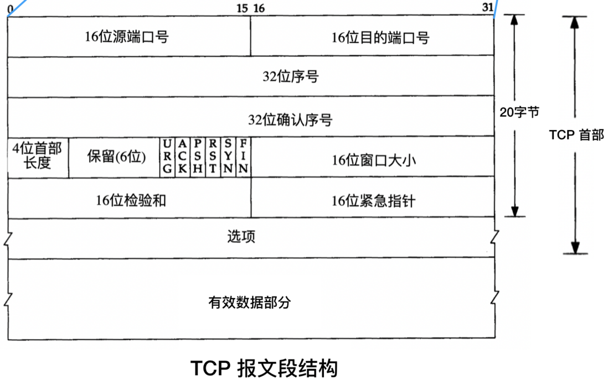
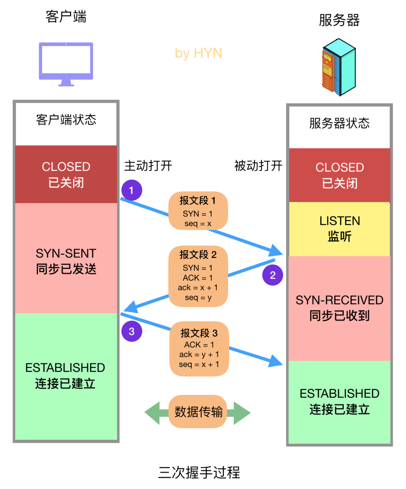
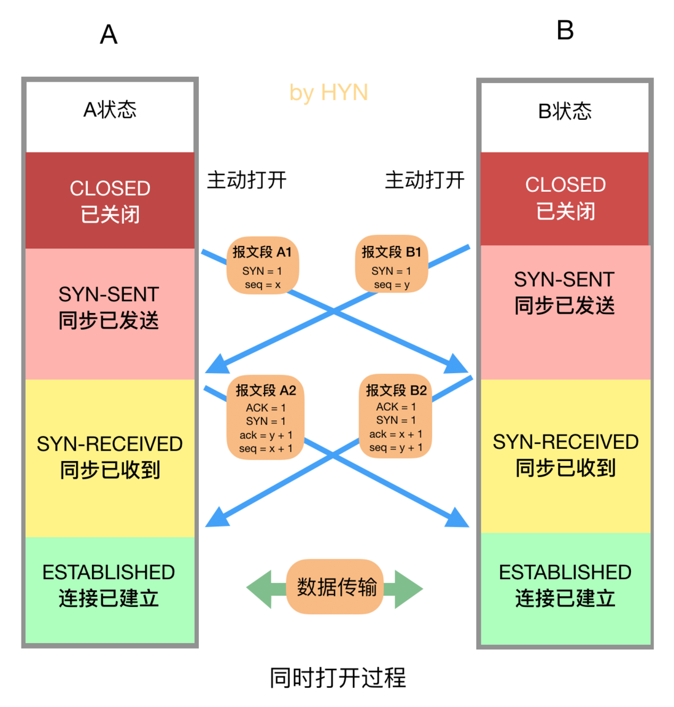
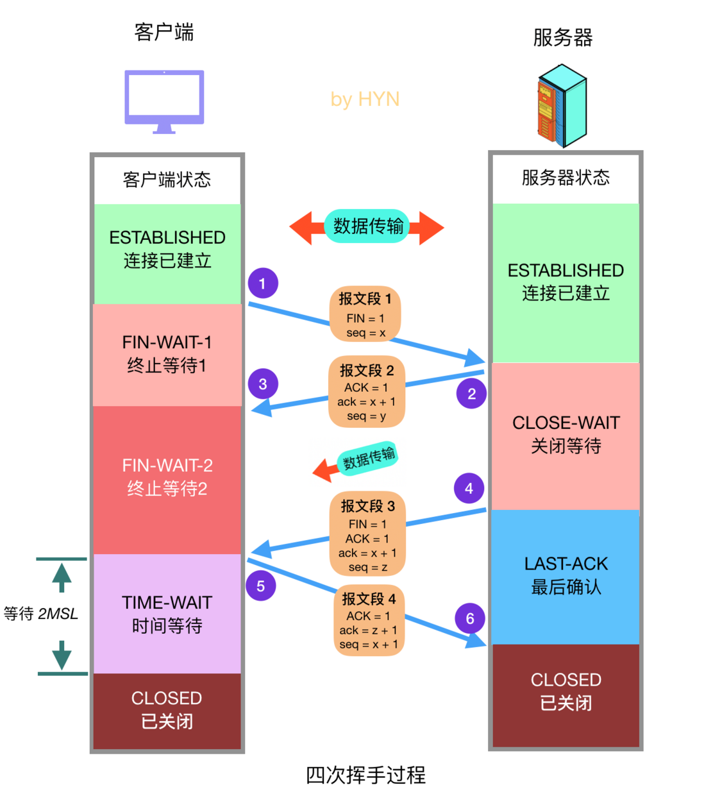
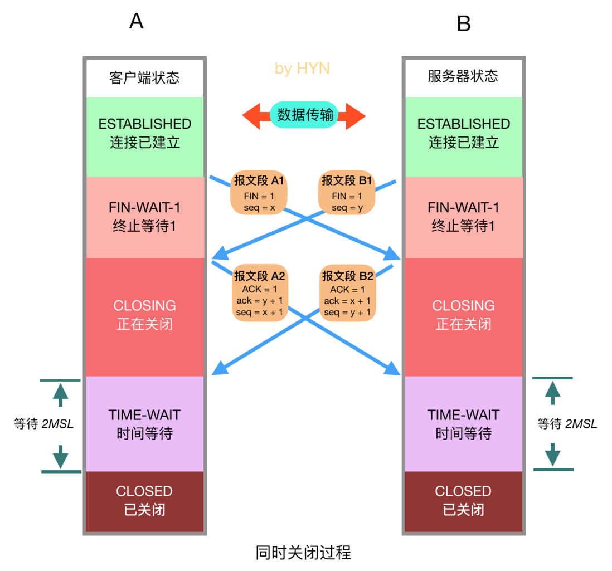

本文主要介绍了TCP协议中的连接建立（三次握手）与连接终止（四次挥手）的过程。通过具体的步骤说明，展示了TCP如何确保在网络环境中可靠地传输数据。此外，文档还介绍了TCP报文段的结构，包括端口号、序号、确认序号等字段的作用，并探讨了SYN洪泛攻击及SYN Cookies防御技术。

## TCP 报文段简介

在介绍三次握手和四次挥手之前，先来简单认识一下 TCP 报文段的结构

​​

TCP 首部包含以下内容，请留意其中的控制位，在三次握手和四次挥手过程中会频繁出现：

* 端口号 (Source Port and Destination Port)：每个 TCP 报文段都包含源端和目的端的端口号，用于寻找发送端和接收端应用进程。这两个值加上 IP 首部中的源端 IP 地址和目的端 IP 地址就可以确定一个唯一的 TCP 连接。
* 序号 (Sequence Number)：这个字段的主要作用是用于将失序的数据重新排列。TCP 会隐式地对字节流中的每个字节进行编号，而 TCP 报文段的序号被设置为其数据部分的第一个字节的编号。序号是 32 bit 的无符号数，取值范围是 0 到 232 - 1。
* 确认序号 (Acknowledgment Number)：接收方在接受到数据后，会回复确认报文，其中包含确认序号，作用就是告诉发送方自己接收到了哪些数据，下一次数据从哪里开始发，因此，确认序号应当是上次已成功收到数据字节序号加 1。只有 ACK 标志为 1 时确认序号字段才有效。
* 首部长度 (Header Length)：首部中的选项部分的长度是可变的，因此首部的长度也是可变的，所以需要这个字段来明确表示首部的长度，这个字段占 4 bit，4 位的二进制数最大可以表示 15，而首部长度是以 4 个字节为一个单位的，因此首部最大长度是 15 * 4 = 60 字节。
* 保留字段 (Reserved)：占 6 位，未来可能有具体用途，目前默认值为 0.
* 控制位 (Control Bits)：在三次握手和四次挥手中会经常看到 SYN、ACK 和 FIN 的身影，一共有 6 个标志位，它们表示的意义如下：

  * URG (Urgent Bit)：值为 1 时，紧急指针生效
  * ACK (Acknowledgment Bit)：值为 1 时，确认序号生效
  * PSH (Push Bit)：接收方应尽快将这个报文段交给应用层
  * RST (Reset Bit)：发送端遇到问题，想要重建连接
  * SYN (Synchronize Bit)：同步序号，用于发起一个连接
  * FIN (Finish Bit)：发送端要求关闭连接
* 窗口大小 (Window)： TCP 的流量控制由连接的每一端通过声明的窗口大小来提供。窗口大小为字节数，起始于确认序号字段指明的值，这个值是接收端正期望接收的字节。窗口大小是一个 16 bit 字段，单位是字节， 因而窗口大小最大为 65535 字节。
* 检验和 (Checksum)：功能类似于数字签名，用于验证数据完整性，也就是确保数据未被修改。检验和覆盖了整个 TCP 报文段，包括 TCP 首部和 TCP 数据，发送端根据特定算法对整个报文段计算出一个检验和，接收端会进行计算并验证。
* 紧急指针 (Urgent Pointer)：当 URG 控制位值为 1 时，此字段生效，紧急指针是一个正的偏移量，和序号字段中的值相加表示紧急数据最后一个字节的序号。 TCP 的紧急方式是发送端向另一端发送紧急数据的一种方式。
* 选项 (Options)：这一部分是可选字段，也就是非必须字段，最常见的可选字段是 “最长报文大小 (MSS，Maximum Segment Size)”。
* 有效数据部分 (Data)：这部分也不是必须的，比如在建立和关闭 TCP 连接的阶段，双方交换的报文段就只包含 TCP 首部。

## TCP 的连接控制

### 建立连接

#### 三次握手

这个问题简直太经典了，如果你在面试中只被问到了一个关于 TCP 的问题，那大概率就是关于三次握手的问题。TCP 的重要特性之一就是面向连接，连接双方在发送数据之前必须经历握手的阶段，那具体的过程是怎样的呢？先来看图，大家最好可以动手简单画画这个图，当然还有后文四次挥手的图，帮助加深记忆。

​​

三次握手过程

如图所示，双方之间的三个蓝色箭头就表示了三次握手过程中所发生的数据交换：

1. 第一次握手：客户端向服务器发送报文段 1，其中的 SYN 标志位 (前文已经介绍过各种标志位的作用) 的值为 1，表示这是一个用于请求发起连接的报文段，其中的序号字段 (Sequence Number，图中简写为 seq) 被设置为初始序号 x (Initial Sequence Number，ISN)，TCP 连接双方均可随机选择初始序号。发送完报文段 1 之后，客户端进入 SYN-SENT 状态，等待服务器的确认。
2. 第二次握手：服务器在收到客户端的连接请求后，向客户端发送报文段 2 作为应答，其中 ACK 标志位设置为 1，表示对客户端做出应答，其确认序号字段 (Acknowledgment Number，图中简写为小写 ack) 生效，该字段值为 x + 1，也就是从客户端收到的报文段的序号加一，代表服务器期望下次收到客户端的数据的序号。此外，报文段 2 的 SYN 标志位也设置为 1，代表这同时也是一个用于发起连接的报文段，序号 seq 设置为服务器初始序号 y。发送完报文段 2 后，服务器进入 SYN-RECEIVED 状态。
3. 第三次握手：客户端在收到报文段 2 后，向服务器发送报文段 3，其 ACK 标志位为 1，代表对服务器做出应答，确认序号字段 ack 为 y + 1，序号字段 seq 为 x + 1。此报文段发送完毕后，双方都进入 ESTABLISHED 状态，表示连接已建立。

**常见面试题 1：**  TCP 建立连接为什么要三次握手而不是两次？

答：网上大多数资料对这个问题的回答只有简单的一句：防止已过期的连接请求报文突然又传送到服务器，因而产生错误，这既不够全面也不够具体。下面给出比较详细而全面的回答：

1. 防止已过期的连接请求报文突然又传送到服务器，因而产生错误

    在双方两次握手即可建立连接的情况下，假设客户端发送 A 报文段请求建立连接，由于网络原因造成 A 暂时无法到达服务器，服务器接收不到请求报文段就不会返回确认报文段，客户端在长时间得不到应答的情况下重新发送请求报文段 B，这次 B 顺利到达服务器，服务器随即返回确认报文并进入 ESTABLISHED 状态，客户端在收到 确认报文后也进入 ESTABLISHED 状态，双方建立连接并传输数据，之后正常断开连接。此时姗姗来迟的 A 报文段才到达服务器，服务器随即返回确认报文并进入 ESTABLISHED 状态，但是已经进入 CLOSED 状态的客户端无法再接受确认报文段，更无法进入 ESTABLISHED 状态，这将导致服务器长时间单方面等待，造成资源浪费。
2. 三次握手才能让双方均确认自己和对方的发送和接收能力都正常

    第一次握手：客户端只是发送处请求报文段，什么都无法确认，而服务器可以确认自己的接收能力和对方的发送能力正常；

    第二次握手：客户端可以确认自己发送能力和接收能力正常，对方发送能力和接收能力正常；

    第三次握手：服务器可以确认自己发送能力和接收能力正常，对方发送能力和接收能力正常；

    可见三次握手才能让双方都确认自己和对方的发送和接收能力全部正常，这样就可以愉快地进行通信了。
3. 告知对方自己的初始序号值，并确认收到对方的初始序号值

    TCP 实现了可靠的数据传输，原因之一就是 TCP 报文段中维护了序号字段和确认序号字段，也就是图中的 seq 和 ack，通过这两个字段双方都可以知道在自己发出的数据中，哪些是已经被对方确认接收的。这两个字段的值会在初始序号值得基础递增，如果是两次握手，只有发起方的初始序号可以得到确认，而另一方的初始序号则得不到确认。

**常见面试题 2：**  TCP 建立连接为什么要三次握手而不是四次？

答：相比上个问题而言，这个问题就简单多了。因为三次握手已经可以确认双方的发送接收能力正常，双方都知道彼此已经准备好，而且也可以完成对双方初始序号值得确认，也就无需再第四次握手了。

**常见面试题 3：**  有一种网络攻击是利用了 TCP 建立连接机制的漏洞，你了解吗？这个问题怎么解决？

答：在三次握手过程中，服务器在收到了客户端的 SYN 报文段后，会分配并初始化连接变量和缓存，并向客户端发送 SYN + ACK 报文段，这相当于是打开了一个 “半开连接 (half-open connection)”，会消耗服务器资源。如果客户端正常返回了 ACK 报文段，那么双方可以正常建立连接，否则，服务器在等待一分钟后会终止这个“半开连接” 并回收资源。这样的机制为 SYN 洪泛攻击 (SYN flood attack)提供了机会，这是一种经典的 DoS 攻击 (Denial of Service，拒绝服务攻击)，所谓的拒绝服务攻击就是通过进行攻击，使受害主机或网络不能提供良好的服务，从而间接达到攻击的目的。在 SYN 洪泛攻击中，攻击者发送大量的 SYN 报文段到服务器请求建立连接，但是却不进行第三次握手，这会导致服务器打开大量的半开连接，消耗大量的资源，最终无法进行正常的服务。

解决方法：SYN Cookies，现在大多数主流操作系统都有这种防御系统。SYN Cookies 是对 TCP 服务器端的三次握手做一些修改，专门用来防范 SYN 洪泛攻击的一种手段。它的原理是，在服务器接收到 SYN 报文段并返回 SYN + ACK 报文段时，不再打开一个半开连接，也不分配资源，而是根据这个 SYN 报文段的重要信息 (包括源和目的 IP 地址，端口号可一个秘密数)，利用特定散列函数计算出一个 cookie 值。这个 cookie 作为将要返回的 SYN + ACK 报文段的初始序列号 (ISN)。当客户端返回一个 ACK 报文段时，服务器根据首部字段信息计算 cookie，与返回的确认序号(初始序列号 + 1) 进行对比，如果相同，则是一个正常连接，然后分配资源并建立连接，否则拒绝建立连接。

#### 同时打开

这是 TCP 建立连接的特殊情况，有时会出现两台机器同时执行主动打开的情况，不过概率非常小，这种情况大家仅作了解即可。在这种情况下就无所谓发送方和接收方了，双放都可以称为客户端和服务器，同时打开的过程如下：

​​

同时打开的过程

如图所示，双方在同一时刻发送 SYN 报文段，并进入 SYN-SENT 状态，在收到 SYN 后，状态变为 SYN-RECEIVED，同时它们都再发送一个 SYN + ACK 的报文段，状态都变为 ESTABLISHED，连接成功建立。在此过程中双方一共交换了 4 个报文段，比三次握手多一个。

### 关闭连接

#### 四次挥手

建立一个连接需要三次握手，而终止一个连接要经过 4 次握手。这由 TCP 的半关闭 (half-close) 造成的。既然一个 TCP 连接是全双工 (即数据在两个方向上能同时传递)， 因此每个方向必须单独地进行关闭。这原则就是当一方完成它的数据发送任务后就能发送一个 FIN 来终止这个方向连接。当一端收到一个 FIN，它必须通知应用层另一端已经终止了数据传送。理论上客户端和服务器都可以发起主动关闭，但是更多的情况下是客户端主动发起。

​​

四次挥手过程

四次挥手详细过程如下：

1. 客户端发送关闭连接的报文段，FIN 标志位 1，请求关闭连接，并停止发送数据。序号字段 seq = x (等于之前发送的所有数据的最后一个字节的序号加一)，然后客户端会进入 FIN-WAIT-1 状态，等待来自服务器的确认报文。
2. 服务器收到 FIN 报文后，发回确认报文，ACK = 1， ack = x + 1，并带上自己的序号 seq = y，然后服务器就进入 CLOSE-WAIT 状态。服务器还会通知上层的应用程序对方已经释放连接，此时 TCP 处于半关闭状态，也就是说客户端已经没有数据要发送了，但是服务器还可以发送数据，客户端也还能够接收。
3. 客户端收到服务器的 ACK 报文段后随即进入 FIN-WAIT-2 状态，此时还能收到来自服务器的数据，直到收到 FIN 报文段。
4. 服务器发送完所有数据后，会向客户端发送 FIN 报文段，各字段值如图所示，随后服务器进入 LAST-ACK 状态，等待来自客户端的确认报文段。
5. 客户端收到来自服务器的 FIN 报文段后，向服务器发送 ACK 报文，随后进入 TIME-WAIT 状态，等待 2MSL(2 * Maximum Segment Lifetime，两倍的报文段最大存活时间) ，这是任何报文段在被丢弃前能在网络中存在的最长时间，常用值有 30 秒、1 分钟和 2 分钟。如无特殊情况，客户端会进入 CLOSED 状态。
6. 服务器在接收到客户端的 ACK 报文后会随即进入 CLOSED 状态，由于没有等待时间，一般而言，服务器比客户端更早进入 CLOSED 状态。

**常见面试题 1：**  为什么 TCP 关闭连接为什么要四次而不是三次？

答：服务器在收到客户端的 FIN 报文段后，可能还有一些数据要传输，所以不能马上关闭连接，但是会做出应答，返回 ACK 报文段，接下来可能会继续发送数据，在数据发送完后，服务器会向客户单发送 FIN 报文，表示数据已经发送完毕，请求关闭连接，然后客户端再做出应答，因此一共需要四次挥手。

**常见面试题 2：**  客户端为什么需要在 TIME-WAIT 状态等待 2MSL 时间才能进入 CLOSED 状态？

答：按照常理，在网络正常的情况下，四个报文段发送完后，双方就可以关闭连接进入 CLOSED 状态了，但是网络并不总是可靠的，如果客户端发送的 ACK 报文段丢失，服务器在接收不到 ACK 的情况下会一直重发 FIN 报文段，这显然不是我们想要的。因此客户端为了确保服务器收到了 ACK，会设置一个定时器，并在 TIME-WAIT 状态等待 2MSL 的时间，如果在此期间又收到了来自服务器的 FIN 报文段，那么客户端会重新设置计时器并再次等待 2MSL 的时间，如果在这段时间内没有收到来自服务器的 FIN 报文，那就说明服务器已经成功收到了 ACK 报文，此时客户端就可以进入 CLOSED 状态了。

#### 同时关闭

之前在介绍 TCP 建立连接的时候会有一种特殊情况，那就是同时打开，与之对应地， TCP 关闭时也会有一种特殊情况，那就是同时关闭，这种情况仅作了解即可，流程图如下：

​​

同时关闭过程

这种情况下，双方应用层同时发出关闭命令，这将导致双方各发送一个 FIN，两端均从 ESTABLISHED 变为 FIN_WAIT_1，两个 FIN 经过网络传送后分别到达另一端。收到 FIN 后，状态由 FIN_WAIT_1 变迁到 CLOSING，并发送最后的 ACK，当收到最后的 ACK 时，为确保对方也收到 ACK，状态变化为 TIME_WAIT，并等待 2MSL 时间，如果一切正常，随后会进入 CLOSED 状态。

## 备注

> 原文地址 [https://segmentfault.com/a/1190000022410446](https://segmentfault.com/a/1190000022410446)

‍
