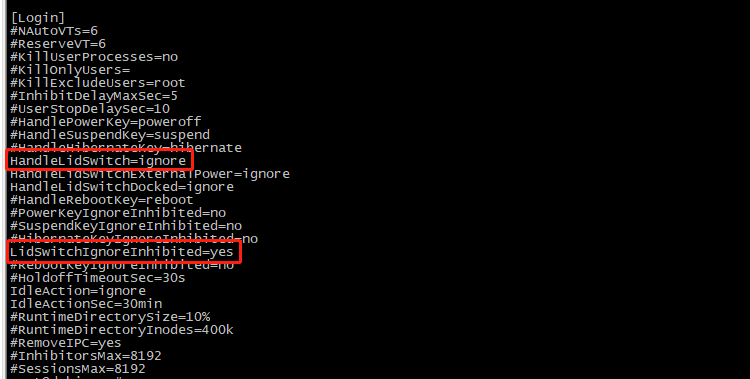

## 禁止自动休眠

1、查看休眠状态

```
systemctl status sleep.target

```

​​2、设置禁止休眠

```
systemctl mask sleep.target suspend.target hibernate.target hybrid-sleep.target

```

​​3、再查看

```
systemctl status sleep.target

```

​​不会再出现自动休眠状态

## 关闭屏幕

Debian 系统可以通过使用「xset」命令来关闭屏幕。

你可以在终端输入「`xset dpms force off`​」来关闭屏幕，并且再输入「`xset dpms force on`​」来重新打开屏幕。

## 合盖不休眠

修改 `/etc/systemd/login.conf`​ 配置文件

​​
