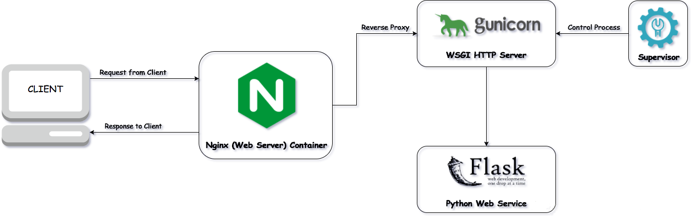

在网站开发完成后，需要在服务器上线部署，而在这个过程中，需要借助一系列工具，以下借助flask服务演示部署上线的一系列步骤。



## 五者之间的关系

> 客户端 (`client`)

浏览器或者app。

> web服务器 (如`nginx`)

Web服务器是指驻留于因特网上某种类型计算机的程序。

当Web浏览器（客户端）连到服务器上并请求文件时，服务器将处理该请求并将文件发送到该浏览器上，附带的信息会告诉浏览器如何查看该文件（即文件类型）。服务器使用HTTP（超文本传输协议）进行信息交流，这就是人们常把它们称为HTTP服务器的原因。

**严格意义上Web服务器只负责处理HTTP协议，用于处理静态页面的内容;而动态内容需要通过WSGI接口交给应用服务器去处理。** 
Web服务器包括**Nginx**，**Apache**，**IIS**等。而优秀的web服务器在接收http请求时，还可以做**负载均衡**和**反向代理**等工作。

> WSGI容器 (如`Gunicorn`)

常见的WSGI容器有`Gunicorn`，`uWSGI`等。web框架和web服务器之间需要通信，这时候需要设计一套双方都遵守的接口。

**PEP3333指出，WSGI(Web Server Gateway Interface)是WEB服务器和web框架或web应用之间建立的一种简单通用的接口规范。有了wsgi这份接口规范，在web开发的过程中，能更加自由的选择服务器端和框架；在服务器端和框架的开发过程能够分离开来，不用过多的考虑双方具体的实现，使得服务器端和框架开发者能够专心自己领域的开发工作。而WSGI容器就是根据这套接口写出来的。**

WSGI容器的作用就是根据web服务器传递而来的参数构建一个让WSGI应用成功执行的环境，例如request，而且还得把WSGI应用上处理好的结果返回给web服务器。此外**WSGI容器也叫应用服务器**。
注： 一般应用服务器都集成了web服务器，主要是为了调试方便，出于性能和稳定性考虑，并不能在生产环境中使用。

> web框架 (如`Django`)

作用主要是方便我们开发 web应用程序，HTTP请求的动态数据就是由 web框架层来提供的。常见的 web框架有*Flask*，*Django*，*Tornado*等，而Tornado不光是一个web框架，还实现了WSGI容器的功能。单纯的flask 自带的web服务器做下测试，会看到压力大的时候出现socket的问题，因为他是单进程单线程的。使用gunicorn来启动，响应速度和能力提升显著。

> 守护进程 (如`Supervisor`)

`Supervisor`是一个用 Python 写的进程管理工具，可以很方便的用来启动、重启、关闭进程（不仅仅是 Python 进程）。

除了对单个进程的控制，还可以同时启动、关闭多个进程，比如很不幸的服务器出问题导致所有应用程序都被杀死，此时可以用 supervisor 同时启动所有应用程序而不是一个一个地敲命令启动。

## Gunicorn详解

### Gunicorn是什么

> Gunicorn（绿色独角兽）是一个用于UNIX的Python WSGI HTTP服务器。它是一个前叉工作者模型，从Ruby的Unicorn项目移植而来。 Gunicorn服务器与许多Web框架广泛兼容，轻松服务器资源并且速度相当快。

#### 功能

- 支持 WSGI，web2py，Django 和 Paster
- 自动化工作流程管理
- 简单的 Python 配置
- 多个工人配置
- 各种服务器挂钩，可扩展性
- 兼容 Python 2.6+和 Python 3.2+

Gunicorn 是一个 unix 上被广泛使用的高性能的 Python WSGI UNIX HTTP Server。和大多数的 web 框架兼容，并具有实现简单，轻量级，高性能等特点。

Gunicorn 服务器作为 wsgi app 的容器，能够与各种 Web 框架兼容（flask，django 等）,得益于 gevent 等技术，使用 Gunicorn 能够在基本不改变 wsgi app 代码的前提下，大幅度提高 wsgi app 的性能。

#### 服务模型(Server Model)

Gunicorn 是基于 pre-fork 模型的。也就意味着有一个中心管理进程( master process )用来管理 worker 进程集合。Master 从不知道任何关于客户端的信息。所有的请求和响应处理都是由 worker 进程来处理的。

#### Master(管理者)

主程序是一个简单的循环,监听各种信号以及相应的响应进程。master 管理着正在运行的 worker 集合,通过监听各种信号比如 TTIN, TTOU, and CHLD. TTIN and TTOU 响应的增加和减少 worker 的数目。CHLD 信号表明一个子进程已经结束了,在这种情况下 master 会自动的重启失败的 worker。

#### worker

woker 有很多种，包括：ggevent、geventlet、gtornado 等等。

这里主要分析 ggevent。每个 ggevent worker 启动的时候会启动多个 server 对象：worker 首先为每个 listener 创建一个 server 对象（注：为什么是一组 listener,因为 gunicorn 可以绑定一组地址,每个地址对于一个 listener），每个 server 对象都有运行在一个单独的 gevent pool 对象中。真正等待链接和处理链接的操作是在 server 对象中进行的。

### Gunicorn安装

```bash
pip install gunicorn
```

### Gunicorn使用

#### 命令运行

使用gunicorn监听请求，运行以下命令

```bash
gunicorn -w 2 -b 0.0.0.0:8000 test.application
```

`-w`:指定fork的worker进程数
`-b`:指定绑定的端口
`test`:模块名,python文件名
`application`:变量名,python文件中可调用的wsgi接口名称

#### 脚本运行

创建shell脚本，修改 运行权限，然后 `sudo ./bin/django_start.sh`启动服务即可。

```bash
#!/bin/bash

NAME="djangoblog" # Name of the application
DJANGODIR=/root/DjangoBlog # Django project directory
SOCKFILE=/root/DjangoBlog/run/gunicorn.sock # we will communicte using this unix socket
USER=root # the user to run as
GROUP=admin # the group to run as
NUM_WORKERS=3 # how many worker processes should Gunicorn spawn

cd $DJANGODIR
DJANGO_SETTINGS_MODULE=DjangoBlog.settings # which settings file should Django use
DJANGO_WSGI_MODULE=DjangoBlog.wsgi # WSGI module name

echo "Starting $NAME as `whoami`"

# Activate the virtual environment
export WORKON_HOME=$HOME/.virtualenvs
export VIRTUALENVWRAPPER_PYTHON=/usr/bin/python3
source /usr/local/bin/virtualenvwrapper.sh
workon djangoblog

export DJANGO_SETTINGS_MODULE=$DJANGO_SETTINGS_MODULE

# Create the run directory if it doesn't exist
RUNDIR=$(dirname $ SOCKFILE)
test -d $RUNDIR || mkdir -p $RUNDIR

# Start your Django Unicorn
# Programs meant to be run under supervisor should not daemonize themselves (do not use --daemon)
exec /root/.virtualenvs/djangoblog/bin/gunicorn ${DJANGO_WSGI_MODULE}:application \
--name $NAME \
--workers $NUM_WORKERS \
--user=$USER --group=$GROUP \
--log-level=debug \
--log-file=-
```

## Supervisor详解

### Supervisor是什么

Supervisor在百度百科上给的定义是超级用户，监管员。Supervisor是一个进程管理工具，当进程中断的时候Supervisor能自动重新启动它。可以运行在各种类unix的机器上，supervisor就是用Python开发的一套通用的进程管理程序，能将一个普通的命令行进程变为后台daemon，并监控进程状态，异常退出时能自动重启。

supervisor主要包含以下四个部分：

> `supervisord`

这个是supervisor服务的主要管理器，负责管理我们配置的子进程，包括重启崩溃或异常退出的子进程，同时也响应来自客户端的请求。

> `supervisorctl`

supervisord服务的客户端命令行, 可以用来执行 stop、start、restart 等命令，来对这些子进程进行管理。

> `Web Server`

和supervisorctl功能娉美。这个是通过web界面查看和控制进程状态。

> `XML-RPC Interface`

服务于web UI的同一个HTTP服务器提供一个XML-RPC接口，可以用来询问和控制管理程序及其运行的程序

### Supervisor安装

supervisor可以运行在大多数类UNIX系统，但是不能运行在任何windows系统，Supervisor运行在python3版本3.4或更高版本以及python2版本2.7上工作。

```bash
pip install supervisor
```

### Supervisor使用

#### 配置文件

- 确定一个目录，生成基本的配置文件

```bash
echo_supervisord_conf > /etc/supervisord.conf
```

- 创建子目录，存放子进程的配置文件

```bash
mkdir -p /etc/supervisord.d/
```

- 修改主配置文件，指明子进程配置文件的路径

```bash
# vi /etc/supervisord.conf

# 在文件最后，打开 include项
[include]
files = /etc/supervisord.d/*.conf
```

- 创建子进程配置文件，启动上一步的 django服务

```bash
# vi /etc/supervisor/supervisord.d/djangoblog.conf

[program:djangoblog]
command=/root/DjangoBlog/bin/django_start.sh  # 执行上一步的脚本，启动服务
user=root  # 启动用户身份
autostart=true
autorestart=true

redirect_stderr = true
stdout_logfile = /var/log/djangoblog.log
stderr_logfile=/var/log/djangoblog.err
```

#### 启动命令

```bash
# supervisord服务
supervisord -c /etc/supervisord.conf  # 启动服务
supervisorctl -c /etc/supervisord.conf  shutdown # 关闭服务
supervisorctl  -c /etc/supervisord.conf  reload  # 重启服务

# supervisor子进程
supervisorctl -c /etc/supervisord.conf # 进入交互环境，可以管理子进程
djangoblog                       RUNNING   pid 45163, uptime 0:00:09  
supervisor> update # 更新配置后必须执行更新命令才生效
supervisor> start xxxx  # 启动某个supervisor进程
supervisor> restart xxxx # 重启某个supervisor进程
supervisor> start all # 开启所有服务
supervisor> stop xxxx  # 停止某个supervisor进程
supervisor> stop all # 停止所有服务
supervisor> status # 查看状态
supervisor> exit  # 退出交互环境
```

## Nginx代理

```lua
server {
    listen       80;
    listen       [::]:80;
    server_name  _;
    root         /root/DjangoBlog/;

    location /static/ {
        alias /root/DjangoBlog/collectedstatic/;
        expires max;
        access_log        off;
        log_not_found     off;
    }
    location /media {
        # 静态文件配置
        alias /root/DjangoBlog/uploads/;
        expires max;
    }
    location ~ \.py$ {
        return 403;
    }

    location / {
        proxy_set_header X-Real-IP $remote_addr;
        proxy_set_header X-Forwarded-For $proxy_add_x_forwarded_for;
        proxy_set_header Host $http_host;
        proxy_set_header X-NginX-Proxy true;
        proxy_redirect off;
        if (!-f $request_filename) {
            proxy_pass http://127.0.0.1:8000;
            break;
        }
     }

     # Load configuration files for the default server block.
     include /etc/nginx/default.d/*.conf;
}
```
