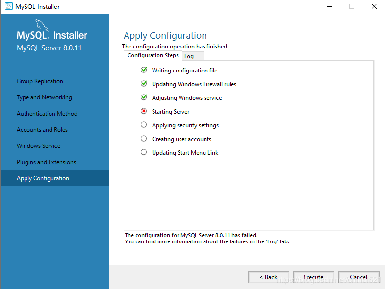
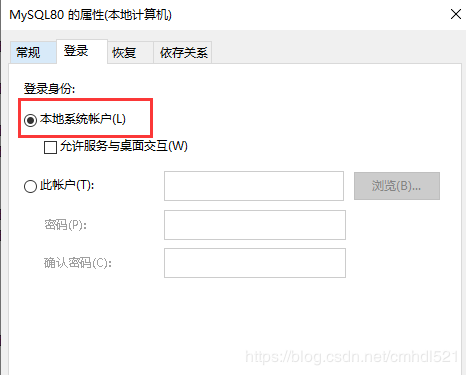

简单对MySQL安装过程中的常见错误进行总结、归纳。

## Linux

### 1819 Mysql密码等级问题

#### 问题描述

在修改MySQL密码时，因密码过于简单（如：123456），不符合MySQL密码规范，会触发一个报错信息：

```shell
ERROR 1819 (HY000): Your password does not satisfy the current policy requirements
```

#### 解决方案

MySQL 8.0 调整密码验证规则：

```sql
mysql> set global validate_password.policy=0;      # 调整密码复杂性策略，0 LOW 1 MEDIUM 2 STRONG
mysql> set global validate_password.length=1;      # 设置密码复杂性要求密码最低长度为1
mysql> select @@validate_password.policy;          # 查看密码复杂性策略
```

MySQL 5.7

```sql
mysql> set global validate_password_policy=0;       # 关闭密码复杂性策略
mysql> set global validate_password_length=1;      # 设置密码复杂性要求密码最低长度为1
mysql> select @@validate_password_policy;          # 查看密码复杂性策略
```

### 1698 只能root用户登录Mysql

#### 问题描述

如果mysql安装时，没有提示输入密码，则会随机分配密码，直接mysql -u root -p则无法登录，报错：

```shell
ERROR 1698 (28000): Access denied for user 'root'@'localhost'
```

#### 解决方案

用管理员权限进入数据库

```shell
 sudo mysql -uroot -p
```

修改加密方式和密码

```sql
 alter user 'username'@'host' identified with mysql_native_password BY 'password';
```

刷新

```sql
 flush privileges;
```

最后重启终端，就可通过 `mysql -u root -p` 免sudo登录mysql啦！

## Windows系统

### 1042服务启动异常

#### 问题描述

mysql已经发展到了8.0阶段，但是很多人在下载了安装了mysql8.0后，在快接近完成的阶段下出现了异常：

```bash
error 1042：Unable to connect to any of the specified MySQL hosts
```

上述异常直接导致mysql无法正常Finish，如图所示：



#### 解决方案

windows端使用`Win+R` --> 运行 `"services.msc"` --> 打开service服务管理器，找到刚才安装mysql的服务名称

右键 --> 属性 --> 登录，更改成"本地系统账户" --> 确定



回到安装程序，在次点击Execute，会发现已经可以成功到Finish界面

### 1045用户密码错误

#### 问题描述

在数据库安装之后，使用`mysql -uroot -p`链接数据库时，出现以下异常:

```bash
1045    Access denied for user 'root'@'localhost' (using password:YES)
```

这个意思是说：用户“root”@本地主机的访问被拒绝

那为什么会出现这种错误呢？

答案是这样：这种问题的本质是用户密码出现错误。

#### 解决方案

打开命令窗口cmd，停止MySQL服务，输入命令：

```bash
 net stop mysql
```

开启跳过密码验证登录的MySQL服务,输入命令

```bash
 mysqld --console --skip-grant-tables --shared-memory
```

再打开一个新的cmd，无密码登录MySQL，输入登录命令

```bash
 mysql -u root -p
```

重置用户名对应的密码，命令如下：

```sql
 use mysql;

 update user set authentication_string='' where user='root'; --修改密码为空

 flush privileges; --刷新权限
```

退出mysql

关闭以`--console --skip-grant-tables --shared-memory` 启动的MySQL服务，

打开命令框，启动MySQL服务。输入

```bash
 net start mysql
```

再次登录无密码登录：

```bash
 mysql -u root -p
```

正确修改root密码

```sql
alter user 'root'@'host' identified with mysql_native_password BY 'mysql';

flush privileges;
```

退出，再次成功登录，到此，重置密码结束。

### Mysql数据库初始化

当Mysql数据库链接失败， 跳过用户名验证也失败， 需要先删除 安装目录下的`data`文件夹, 然后重新初始化,生成初始化密码

以管理员的身份打开cmd窗口跳转路径到`X:\xxx\mysql-8.0.11-winx64\bin`

```bash
mysqld --initialize-insecure --user=mysql --console # 生成空密码 
mysqld --initialize --user=mysql --console # 生成随机密码
# console 参数的作用就是输出信息到终端
```

按照上面的流程，就可以跳过用户名验证，重新设置mysql密码

### 解压版MySQL安装

按照上面的流程，初始化数据库，最后会在MySQL根路径下生成`data`文件夹

注册、移除服务

```shell
mysqld install #注册服务,默认服务名是mysql
# mysqld install mysql2 #注册服务,默认服务名是mysql
mysqld remove #移除服务
```

启动、停止服务

```
net start mysql # 启动服务
net stop mysql # 停止服务
```

登录mysql，修改账号密码

```shell
mysql -user root -p # 回车即可，默认无密码
```

```sql
# 修改root用户的密码为mysql
alter user 'root'@'localhost' identified with mysql_native_password BY 'mysql';
`````
