> 我们不生产知识，我们只是互联网的搬运工

## HTTP到HTTPS的演化

HTTP 由于是明文传输，所以安全上存在以下三个风险：

* 窃听风险，比如通信链路上可以获取通信内容，用户号容易没。
* 篡改风险，比如强制植入垃圾广告，视觉污染，用户眼容易瞎。
* 冒充风险，比如冒充淘宝网站，用户钱容易没。

### 窃听风险

假设 A 想通过互联网向 B 发送消息。数据要经过互联网上各种各样的网络和设备才能到达 B 那里。

​

数据可能会被第三者恶意窃听。

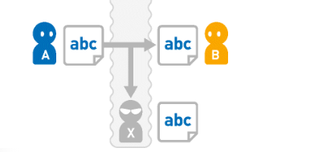

因此，我们需要给想要保密的数据加密。加密后的数据被称为“密文”。

把密文发送给 B。

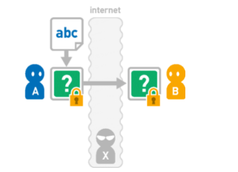

B 收到密文后，需要解除加密才能得到原本的数据。

​

像这样对数据进行加密，就不用担心会被人窃听了。

#### 共享秘钥加密

A 使用密钥加密数据。

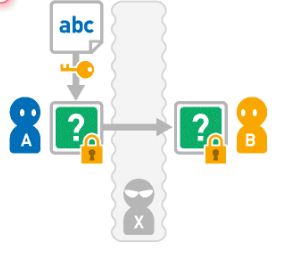

A 将密文发送给 B。​

B 收到密文后，使用相同的密钥对其进行解密。这样，B 就取得了原本的数据。只要是加密好的数据，就算被第三者恶意窃听也无须担心。

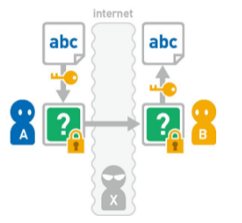​

> 实现共享密钥加密的算法有AES、DES等，其中 AES 的应用最为广泛。

互联网两端的A 和 B 无法直接沟通，B 不知道加密时使用的是什么密钥。

A 需要通过某种手段将密钥交给 B。和密文一样，A 又在互联网上向 B 发送了密钥。

B 使用收到的密钥对密文进行解密。

但是，该密钥也有可能会被 X 窃听。这样一来，X 也可以使用密钥对密文进行解密了。

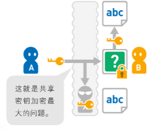​

> 为了解决这个问题，就需要使用公开秘钥加密(非对称秘钥加密)

#### 公开秘钥加密

A 准备通过互联网向 B 发送数据

​

首先，需要由接收方 B 来生成公开密钥和私有密钥，然后把公开密钥发送给 A。

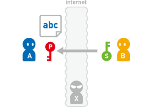​

A 使用 B 发来的公开密钥加密数据。

A 将密文发送给 B，B 再使用私有密钥对密文进行解密。这样，B 就得到了原本的数据。

公开密钥和密文都是通过互联网传输的，因此可能会被 X 窃听。

但是，使用公开密钥无法解密密文，因此 X 也无法得到原本的数据。

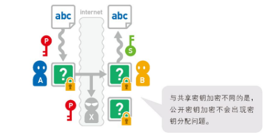

> 实现公开密钥加密的算法使用最为广泛的是 RSA 算法。RSA 算法由其开发者 Rivest、Shamir、Adleman 的首字母命名而来，三人在 2002 年获得了图灵奖。

当然，世上没有十全十美的事情，非对称加密算法的加密和解密都比较耗时，所以这种方法不适用于持续发送零碎数据的情况。要想解决这个问题，就要用到“混合加密”。

#### 混合加密

> HTTPS 采用的是对称加密和非对称加密结合的「混合加密」方式：

* 在通信建立前采用非对称加密的方式交换「会话秘钥」，后续就不再使用非对称加密。
* 在通信过程中全部使用对称加密的「会话秘钥」的方式加密明文数据。

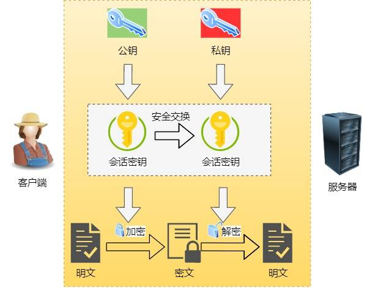​

* 对称加密只使用一个密钥，运算速度快，密钥必须保密，无法做到安全的密钥交换。
* 非对称加密使用两个密钥：公钥和私钥，公钥可以任意分发而私钥保密，解决了密钥交换问题但速度慢。

### 篡改风险

假设 A 发送给 B 的密文在通信过程中被 X 恶意篡改了，而 B 收到密文后没有意识到这个问题。

B 对被篡改的密文进行解密，得到消息 xyz。

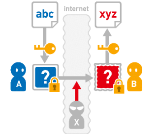​

B 以为 A 订购的是编号为 xyz 的商品，于是将错误的商品发送给了 A。

#### 摘要算法

接下来，A使用摘要算法（哈希函数）对内容计算得到哈希值(MAC)，也就是内容的「指纹」。此处生成的是 7f05。这个哈希值是唯一的，且无法通过哈希值推导出内容。

​

A 将 MAC（7f05）和密文发送给 B。

和 A 一样，B 也需要使用密文和密钥来生成 MAC。经过对比，B 可以确认自己计算出来的 7f05 和 A 发来的 7f05 一致。

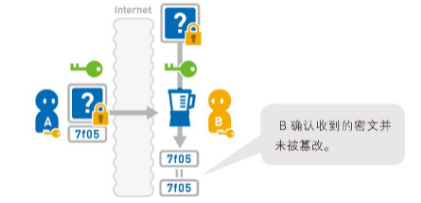​

假设在 A 向 B 发送密文和 MAC 时，X 对密文进行了篡改。

B 使用该密文计算 MAC，得到的值是 b85c，发现和收到的 MAC 不一致。

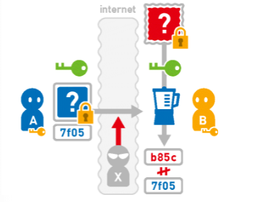​

由此，B 意识到密文或者 MAC，甚至两者都可能遭到了篡改。于是 B 废弃了收到的密文和 MAC，向 A 提出再次发送的请求。

#### 数字签名

X 会不会为了让密文的篡改变得合理，而对 MAC 也进行篡改呢？也就是说怎么能保证这个MAC一定是A发出的，而不是被X篡改的。

这就引入了另一个名词：数字签名

> A自己的私钥是独有的，A用自己的私钥对消息内容计算一个「签名」，将「签名」和消息内容一起发送出去，接受者 B可以使用A的公钥验证这个签名是否正确，这就叫「验签」。

回到最开始的问题：只要A对MAC使用私钥加密，X 没有A 的私钥，因此即便他可以篡改 MAC，只要 B 使用A的公钥进场验签时就会出错，就能确认通信过程中发生了篡改。

当然，这么做还可以解决另一个问题，防止A事后否认，类似合同的个人签名。

> 小结

非对称加密算法来解决，共有两个密钥：

* 一个是公钥，这个是可以公开给所有人的；
* 一个是私钥，这个必须由本人管理，不可泄露。

这两个密钥可以双向加解密的，比如可以用公钥加密内容，然后用私钥解密，也可以用私钥加密内容，公钥解密内容。

流程的不同，意味着目的也不相同：

* 公钥加密，私钥解密。这个目的是为了保证内容传输的安全，因为被公钥加密的内容，其他人是无法解密的，只有持有私钥的人，才能解密出实际的内容；
* 私钥加密，公钥解密。这个目的是为了保证消息不会被冒充，因为私钥是不可泄露的，如果公钥能正常解密出私钥加密的内容，就能证明这个消息是来源于持有私钥身份的人发送的。

所以非对称加密的用途主要在于通过「私钥加密，公钥解密」的方式，来确认消息的身份，我们常说的数字签名算法，就是用的是这种方式，不过私钥加密内容不是内容本身，而是对内容的哈希值加密。

### 冒充风险

上面的一切看起来非常完美啦，但是真的如此吗？

一切的基础都建立在B拿到的公钥真的是A的公钥，反之亦然。

什么意思呢？

因为A的公钥是通过网络传输到B手中的，在传输过程中，公钥是明文传输的，X完全可以将自己的公钥当做A的传输给B。

也就是发送公钥这一步没有做到：

* 防篡改
* 防冒充

防篡改怎么和防冒充怎么实现的呢？

我们前面讲了，就是靠数字签名！ 但是数字签名需要接受者持有发送者公钥，才能进行验签。

而我们现在处理的是分发公钥这一步，所以.......死锁了。这像是先有鸡还是先有蛋的问题

那怎么办呢，为了解决这个问题，就引入了「数字证书」，什么叫数字证书呢？

只要你理解了前面的数字签名，就能理解这里的数字证书，因为我把数字证书叫做「公钥的数字签名」。

为什么呢？我们引入数字证书的目的是为了保证公钥不被篡改，即使被篡改了也能识别出来。

而防篡改的方法就是数字签名，但是这个签名不能我们自己做，原因说过了，因为我们的公钥还没分发出去，别人无法验证。

所以只能找可信的第三方来帮我们签名，即证书颁布机构（CA），CA 会将：证书的颁布机构、有效期、公钥、持有者(subject)等信息用 CA 的私钥进行签名。

并且将签名结果和这些信息放在一起，这就叫做「数字证书」。

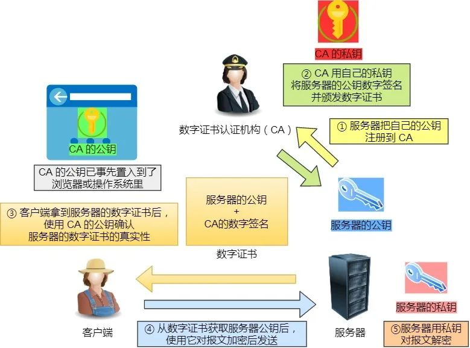​

通过数字证书的方式保证服务器公钥的身份，解决冒充的风险。​

## HTTPS 一定安全可靠吗？

客户端通过浏览器向服务端发起 HTTPS 请求时，被「假基站」转发到了一个「中间人服务器」，于是客户端是和「中间人服务器」完成了 TLS 握手，然后这个「中间人服务器」再与真正的服务端完成 TLS 握手。

​

具体过程如下：

* 客户端向服务端发起 HTTPS 建立连接请求时，然后被「假基站」转发到了一个「中间人服务器」，接着中间人向服务端发起 HTTPS 建立连接请求，此时客户端与中间人进行 TLS 握手，中间人与服务端进行 TLS 握手；
* 在客户端与中间人进行 TLS 握手过程中，中间人会发送自己的公钥证书给客户端，客户端验证证书的真伪，然后从证书拿到公钥，并生成一个随机数，用公钥加密随机数发送给中间人，中间人使用私钥解密，得到随机数，此时双方都有随机数，然后通过算法生成对称加密密钥（A），后续客户端与中间人通信就用这个对称加密密钥来加密数据了。
* 在中间人与服务端进行 TLS 握手过程中，服务端会发送从 CA 机构签发的公钥证书给中间人，从证书拿到公钥，并生成一个随机数，用公钥加密随机数发送给服务端，服务端使用私钥解密，得到随机数，此时双方都有随机数，然后通过算法生成对称加密密钥（B），后续中间人与服务端通信就用这个对称加密密钥来加密数据了。
* 后续的通信过程中，中间人用对称加密密钥（A）解密客户端的 HTTPS 请求的数据，然后用对称加密密钥（B）加密 HTTPS 请求后，转发给服务端，接着服务端发送 HTTPS 响应数据给中间人，中间人用对称加密密钥（B）解密 HTTPS 响应数据，然后再用对称加密密钥（A）加密后，转发给客户端。

从客户端的角度看，其实并不知道网络中存在中间人服务器这个角色。那么中间人就可以解开浏览器发起的 HTTPS 请求里的数据，也可以解开服务端响应给浏览器的 HTTPS 响应数据。相当于，中间人能够 “偷看” 浏览器与服务端之间的 HTTPS 请求和响应的数据。

但是要发生这种场景是有前提的，前提是用户点击接受了中间人服务器的证书。

中间人服务器与客户端在 TLS 握手过程中，实际上发送了自己伪造的证书给浏览器，而这个伪造的证书是能被浏览器（客户端）识别出是非法的，于是就会提醒用户该证书存在问题。

​

如果用户执意点击「继续浏览此网站」，相当于用户接受了中间人伪造的证书，那么后续整个 HTTPS 通信都能被中间人监听了。

所以，这其实并不能说 HTTPS 不够安全，毕竟浏览器都已经提示证书有问题了，如果用户坚决要访问，那不能怪 HTTPS ，得怪自己手贱。

另外，如果你的电脑中毒了，被恶意导入了中间人的根证书，那么在验证中间人的证书的时候，由于你操作系统信任了中间人的根证书，那么等同于中间人的证书是合法的，这种情况下，浏览器是不会弹出证书存在问题的风险提醒的。

这其实也不关 HTTPS 的事情，是你电脑中毒了才导致 HTTPS 数据被中间人劫持的。

所以，HTTPS 协议本身到目前为止还是没有任何漏洞的，即使你成功进行中间人攻击，本质上是利用了客户端的漏洞（用户点击继续访问或者被恶意导入伪造的根证书），并不是 HTTPS 不够安全。

> 为什么抓包工具能截取 HTTPS 数据？

很多抓包工具 之所以可以明文看到 HTTPS 数据，工作原理与中间人一致的。

对于 HTTPS 连接来说，中间人要满足以下两点，才能实现真正的明文代理:

1. 中间人，作为客户端与真实服务端建立连接这一步不会有问题，因为服务端不会校验客户端的身份；
2. 中间人，作为服务端与真实客户端建立连接，这里会有客户端信任服务端的问题，也就是服务端必须有对应域名的私钥；

中间人要拿到私钥只能通过如下方式：

1. 去网站服务端拿到私钥；
2. 去CA处拿域名签发私钥；
3. 自己签发证书，且要被浏览器信任；

不用解释，抓包工具只能使用第三种方式取得中间人的身份。

使用抓包工具进行 HTTPS 抓包的时候，需要在客户端安装 Fiddler 的根证书，这里实际上起认证中心（CA）的作用。

抓包工具能够抓包的关键是客户端会往系统受信任的根证书列表中导入抓包工具生成的证书，而这个证书会被浏览器信任，也就是抓包工具给自己创建了一个认证中心 CA，客户端拿着中间人签发的证书去中间人自己的 CA 去认证，当然认为这个证书是有效的。

> 如何避免被中间人抓取数据？

我们要保证自己电脑的安全，不要被病毒乘虚而入，而且也不要点击任何证书非法的网站，这样 HTTPS 数据就不会被中间人截取到了。

当然，我们还可以通过 HTTPS 双向认证来避免这种问题。

一般我们的 HTTPS 是单向认证，客户端只会验证了服务端的身份，但是服务端并不会验证客户端的身份。

​

如果用了双向认证方式，不仅客户端会验证服务端的身份，而且服务端也会验证客户端的身份。服务端一旦验证到请求自己的客户端为不可信任的，服务端就拒绝继续通信，客户端如果发现服务端为不可信任的，那么也中止通信。

‍
