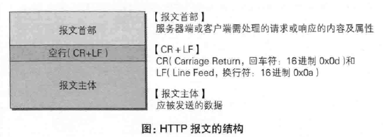
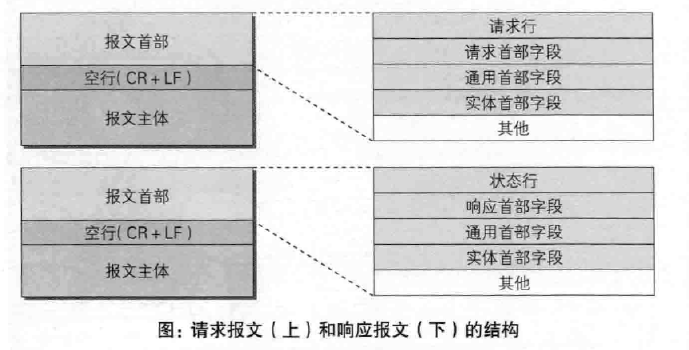
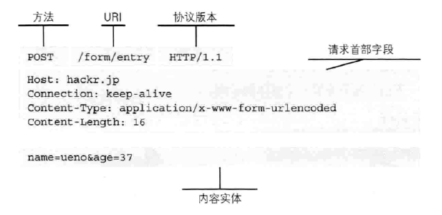
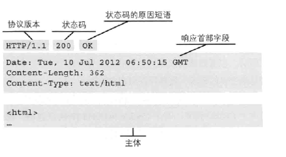
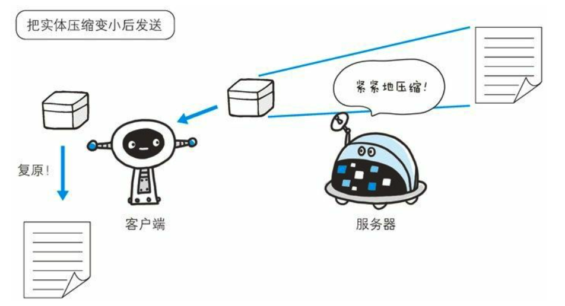
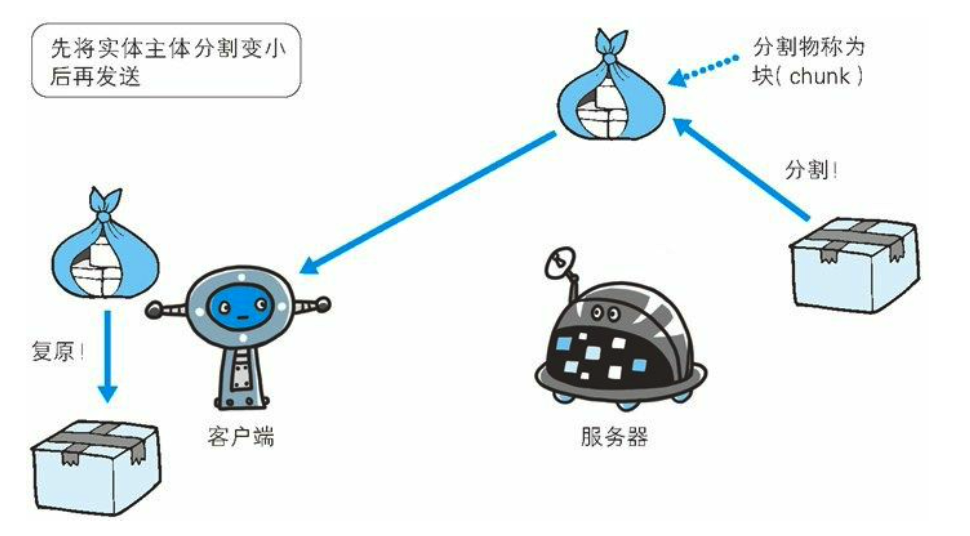
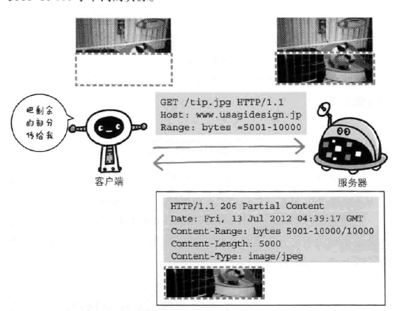
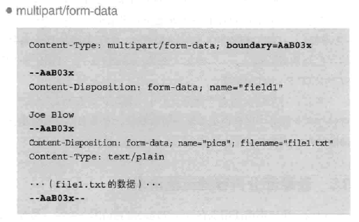
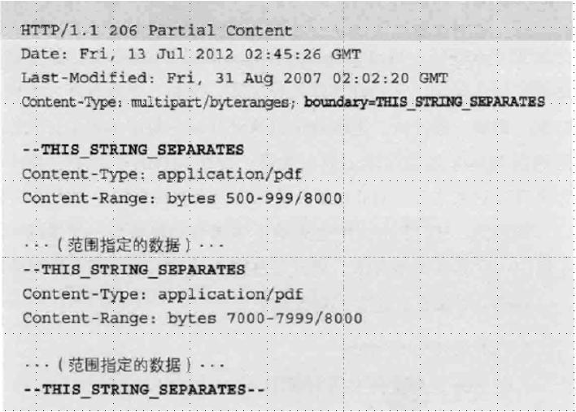

---

title: HTTP消息结构  
category: [Introduce]  
tag: [http, request, response]  
abbrlink: 6bdf4513  
date: 2022-01-22 14:03:09  
updated: 2023-03-02 14:24:57

---

## HTTP 报文

HTTP是基于客户端/服务端（C/S）的架构模型，通过一个可靠的链接来交换信息，是一个无状态的请求/响应协议。

一个HTTP"客户端"是一个应用程序（Web浏览器或其他任何客户端），通过连接到服务器达到向服务器发送一个或多个HTTP的请求的目的。

一个HTTP"服务器"同样也是一个应用程序（通常是一个Web服务，如Apache Web服务器或IIS服务器等），通过接收客户端的请求并向客户端发送HTTP响应数据。

HTTP使用统一资源标识符（Uniform Resource Identifiers, URI）来传输数据和建立连接。

用于 HTTP 协议交互的信息被称为 **HTTP 报文**。

请求端(客户端)的 HTTP 报文叫做请求报文，响应端(服务器端)的叫做响应报文。

HTTP 报文大致可分为报文首部和报文主体两块。两者由最初出现的 空行(`CR+LF`)来划分。通常，并不一定要有报文主体。

## 请求报文及响应报文的结构

我们来看一下请求报文和响应报文的结构。

### 客户端请求消息

客户端发送一个HTTP请求到服务器的请求消息包括以下格式：请求行（request line）、**可选的**请求头部（header）、空行和请求数据四个部分组成，下图给出了请求报文的一般格式。

### 服务器响应消息

HTTP响应也由四个部分组成，分别是：状态行、消息报头、空行和响应正文。

## 编码提升传输速率

HTTP 在传输数据时可以按照数据原貌直接传输，但也可以在传输过 程中通过编码提升传输速率。通过在传输时编码，能有效地处理大量 的访问请求。但是，编码的操作需要计算机来完成，因此会消耗更多 的 CPU 等资源。

### 报文主体和实体主体的差异

报文(**message**)是 HTTP 通信中的基本单位，由 8 位组字节流(octet sequence， 其中 octet 为 8 个比特)组成，通过 HTTP 通信传输。

实体(**entity**) 作为请求或响应的有效载荷数据(补充项)被传输，其内容由实

体首部和实体主体组成。
HTTP 报文的主体用于传输请求或响应的实体主体。

通常，报文主体等于实体主体。只有当传输中进行编码操作时，实体
主体的内容发生变化，才导致它和报文主体产生差异。

### 压缩传输的内容编码

​`HTTP`​ 协议中的内容编码功能就像用压缩软件压缩东西一样，对实体内容进行编码压缩，内容编码后的实体由客户端接受并解码。这可以压缩传输内容，加快传输速度。

​​

常用的内容编码有以下几种。

- **gzip**(**GNU zip**)
- **compress**(**UNIX** 系统的标准压缩)
- **deflate**(**zlib**)
- **identity**(不进行编码)

### 分割发送的分块传输编码

​`HTTP`​ 通信过程中，请求的编码实体资源尚未传输完成之前，浏览器无法显示请求页面，传输大容量数据时候，通过数据分割成多块，能让浏览器逐步显示页面。这就是分块传输编码（`Chunked`​ `Transfer`​ `Coding`​）。它将实体主体分成多个部分，每一块用十六进制来标记，最后一块使用`0（CR+LF)`​来标记。传输给客户端，由客户端进行解码恢复。

​​

## 获取部分内容的范围请求

过去，用户下载东西中断了必须要从头下载，为了解决这问题，要实现该功能需要指定下载的实体范围，指定范围发送的请求叫做范围请求（`Range` `Request`)
对一份 10000 字节大小的资源，如果使用范围请求，可以只请求 5001~10000 字节内的资源。这样就算中断了，也可以向服务端指明自己需要的资源字节范围，这些需要在首部字段中表名。
形式如下：

​`Range`​ : `bytes`​ = 5001 - 10000  
5001 到 10000 的  
​`Range`​ : `bytes`​ = 5001 -  
5001 到之后全部的  
​`Range`​ : `bytes`​ = -3000, 5000 - 7000  
从头到 3000， 5000 到 7000 的

​​

针对范围请求，响应会返回状态码为 `206 Partial Content` 的响应报文，另外，对于多重范围的范围请求，响应会在首部字段 `Content-Type` 标明 `multipart`/`byteranges` 后返回响应报文，如果服务器无法响应请求，返回状态码 `200 OK `和完整的实体内容。

## 发送多种数据的多部分对象集合

`MIME`（`Multipurpose` `Internet` `Mail` `Extensions`, 多用途因特网邮件扩展），它允许邮件处理文本，图片，视频等多个不同类型的数据，这使我们可以在邮件里写入文字并添加多分附件成为了现实。例如：图片等二进制数据以 `ASCII` 码字符串编码方式表名，就是利用 `MIME` 来标记数据类型，在 `MIME` 扩展中会使用一种称为多部分对象集合（`Multipart`）的方法，来容纳多份不同类型的数据。
相应的，`HTTP` 协议中也采纳了多部分对象集合，发送的一份报文主体内可含有多类型实体，通常在图片或文本文件等上传时使用。
多部分对象集合包括：

* ​`multipart`​/`form-data`​ 在 `Web`​ 表单文件上传使用

​​

* ​`multipart`​/`byteranges`​ 状态码 206（`Partial`​ `Content`​，部分内容）响应报文包含了多个范围的内容时使用。

​​

`HTTP` 报文使用这个多部分对象集合的时候，需要在首部添加 `Content-type` 字段。
使用 `boundary` 字符串来划分多部分
在 `boundary` 字符串指定的各个实体的起始行之前插入`--`标记（`--AaB03x`、`--THis_STRING_SEPARATES`)
在多部分对象集合对应的字符串的最后插入`--`标记（`--AaB03x--`）

多部分对象集合的每个部分类型中，都可以含有首部字段。另外，可以在部分中潜逃使用多部分对象集合。

## 内容协商返回最合适的内容

同一个 Web 网站可能有存着多分相同内容的页面，如中文版和英文版，内容虽然相同，单语言不同。当浏览器默认语言为哪种，访问相同的 `URI` 的 `Web` 页面时，会对应返回哪种语言的 Web 页面，这样的机制就叫做内容协商（`Content` `Negotiation`）。
这协商的请求会包含在首部字段

* `Accept`
* `Accept-Charset`
* `Accept-Encoding`
* `Accept-Language`
* `Content-Language`

类型：
服务器驱动协商（`Server-driven` `Negotiation`)
服务器通过请求的首部字段为参考自动处理，但以浏览器直接发送的信息不一定能筛选出最优的内容。
客户端驱动协商（`Agent-driven` `Negotiation`)
用户从浏览器显示的可选项列表中选择， 还可以利用 JS 脚本在 Web 页面自动进行上述选择。
透明协商（`Transparent` `Negotiation`)
上两种方法的结合体。
