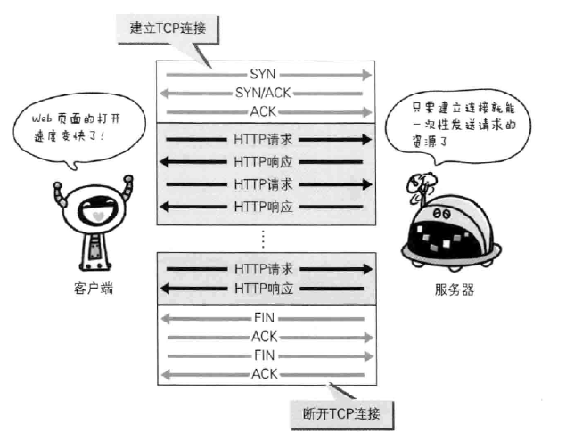
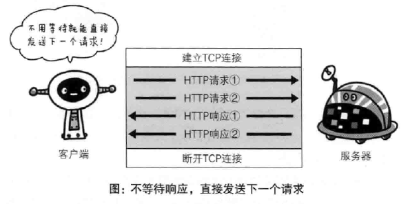

---

title: HTTP简介  
category: [Introduce]  
tag: [http]  
abbrlink: 495fc282  
date: 2019-05-09 19:55:09  
updated: 2023-03-02 14:24:57

---

## 网络基础 TCP/IP

为了理解 HTTP，我们有必要事先了解一下 TCP/IP 协议族。

通常使用的网络(包括互联网)是在 TCP/IP 协议族的基础上运作 的。而 HTTP 属于它内部的一个子集。

### TCP/IP 协议族

TCP/IP 协议族是互联网相关的各类协议族的总称

​​

像这样把与互联网相关联的协议集合起来总称为 TCP/IP。也有说法 认为，TCP/IP 是指 TCP 和 IP 这两种协议。还有一种说法认为，TCP/ IP 是在 IP 协议的通信过程中，使用到的协议族的统称。

### TCP/IP 分层管理

TCP/IP 协议族里重要的一点就是分层。TCP/IP 协议族按层次分别分为以下 4 层:

**应用层**：决定向用户提供应用服务时通信的活动，
`FTP(File Transfer Protocol)` 文件传输协议、`DNS`(`Domain Name System`) 域名系统、`HTTP`(`HyperText Transfer Protocol`)
**传输层**：提供处于网络连接中两台计算机之间的数据传输。
`TCP`(`Transmission Control Protocol`) 传输控制协议、`UDP`(`User Data Protocol`) 用户数据报协议
**网络层（网络互联层）** ：处理在网络上流动的数据包（数据包是网络传输的最小数据单位）。该层规定了通过怎样的路径（传输路线）到达对方计算机，并传递数据。作用就是在与对方计算机之间通过多台计算机或网络设备进行传输时，选择一条传输路线。
**链路层（数据链路层、网络接口层）** ：用来处理网络的硬件部分。包括控制操作系统、硬件设备驱动、`NIC`（`Network Interface Card`，网络适配器）、光纤等物理课件部分（连接器等一切传输媒介）。

### TCP/IP 通信传输流

​​

  应用发请求通过 `TCP`​ 处理报文进行分隔发送给网络层网络层增加 `MAC`​ 地址给链路, 之后反向操作, 请求数据的时候每一层处理完成后会给这个数据加上这个层的首部信息, 相反, 处理请求的时候, 每处理一层就删除一个首部, 这叫做数据信息的封装 (`encapsulate`​)。

​​

## 与 HTTP 关系密切的协议 : IP、TCP 和DNS

### IP 协议

`IP`（`Internet Protocol`）网络协议处于网络层。几乎所有使用网络的系统都会用到 `IP` 协议。`IP` 不是 `IP` 地址，`IP` 只是一种协议名称。

* 作用：把各种数据包传给对方，保证能传送到达需要多种条件，其中最重要的是 `IP`​ 地址和 `MAC`​（`Media Access Control Address`​) 地址。
* ​`IP`​ 地址：指明节点被分配到的地址
* ​`MAC`​ 地址： 网卡所属的固定地址
* ​`IP`​ 地址可以和 `MAC`​ 地址进行配对，`IP`​ 可变，但 `MAC`​ 基本不会更改。

  不同局域网之间的通信需要经过多次中转，在中转时会利用下一站中转设备的 `MAC`​ 地址来搜索下一个中转目标，这时会采用 `ARP`​ 协议（`Addres s Resolution Protocol`​)，这是用于解析地址的协议，可以根据对方 `IP`​ 地址就能反查处对应的 `MAC`​ 地址。  
    信息传输的时候，并不是从一开始就设计好精确的路线，而是边走边瞧，到下一个中转点会自动判断下一个中转点，这叫做路由选择（`routing`​）

​​

### TCP 协议

按层次位于传输层, 提供可靠的字节流服务 (`Byte Stream Service`), 意思是为了方便传输, 将大块数据分割成以报文段(`segment`) 为单位的数据包进行管理可靠的传输服务是指，能够把数据准确可靠的传给对方。

如何确保数据到达目标：三次握手（`three—way handshaking`）策略

​​

- 发送端先发送一个带有 `SYN`（`synchronize` 同步）标识的数据包给对方
- 对方接收到后回传一个带有  `SYN`/`ACK`（`acknowledgement`)标识的数据包已传达确认信息
- 最后发送端再传回一个带有 `ACK` 标识的数据包代表 “握手” 结束。
- 若期间在某个过程莫名中断, `TCP` 协议会在此以相同顺序发送相同数据包。

### DNS 服务

  `DNS` 服务是和 `HTTP` 一样位于应用层, 提供`域名`到 `IP` 地址之间的解析服务。
 计算机可以有 `IP` 地址, 又可以有主机名和域名。比如可以使用 [www.baidu.com](http://www.baidu.com) 访问百度，也可以使用 `119.75.217.109` 访问百度。`DNS` 协议就是可以查询其对应关系的协议。

​​

### 各种协议与 HTTP 协议的关系

  客户端发出对某 `www.`​ 网站的请求, 通过 `DNS`​ 协议获取对应的 `IP`​ 地址, 在通过 `HTTP`​ 协议生成请求报文, 通过 `TCP`​ 进行分隔划分成数据包, 通过三次握手把每个报文段可靠的传给对方, 再通过 `IP`​ 协议分配 `IP`​ 地址和 `MAC`​ 地址, 一遍中转一遍传送, 对方通过 `IP`​ 协议接收一段段报文, 通过 `TCP`​ 协议再一段段重组, 在通过 `HTTP`​ 协议对这些内容进行处理请求信息, 把请求结果再像上边的过程走回客户端。一次完整的传输就结束了。

​​

## URI 和 URL

- `URL`（`Uniform` `Resource` `Locator`) 统一资源定位符，就是 `Web` 浏览器访问 `web` 页面时候的网页地址，[http://www.baidu.com](http://www.baidu.com)
- `URI`（`Uniform` `Resource` `Identifier`) 统一资源标识符
- *`Uniform`* 规定统一格式可方便处理多种不同类型资源。
- *`Resouce`* 资源定义是 “可标识的任何东西”。
- *`Identifier`* 可标识的对象。也称作标识符。

  综上，`URI` 就是由某协议方案表示的资源的定位标识符，其中，访问资源所使用的协议类型， `HTTP` 协议时，协议方案就是 `http`，除此还有 `ftp`、`mailto`、`telent`、`file` 等。
  `URI` 用字符串标识某一互联网资源，`URL` 表示资源的地点，可见 `URL` 是 `URI` 的子集。

绝对 `URI` 格式：

​​

可选项：登录信息、服务器端口号、查询字符串、片段标识符

## HTTP介绍

HTTP 协议一般指 HTTP（超文本传输协议）。

超文本传输协议（英语：HyperText Transfer Protocol，缩写：HTTP）是一种用于分布式、协作式和超媒体信息系统的应用层协议，是因特网上应用最为广泛的一种网络传输协议，所有的 WWW 文件都必须遵守这个标准。

HTTP是一个基于TCP/IP通信协议来传递数据（HTML 文件, 图片文件, 查询结果等）。

## HTTP 工作原理

HTTP协议工作于客户端-服务端架构上。浏览器作为HTTP客户端通过URL向HTTP服务端即WEB服务器发送所有请求。

Web服务器有：Apache服务器，Nginx服务器，IIS服务器（Internet Information Services）等。

Web服务器根据接收到的请求后，向客户端发送响应信息。

HTTP默认端口号为80，但是你也可以改为8080或者其他端口。

**HTTP三点注意事项: **

- HTTP是无连接：无连接的含义是限制每次连接只处理一个请求。服务器处理完客户的请求，并收到客户的应答后，即断开连接。采用这种方式可以节省传输时间。
- HTTP是媒体独立的：这意味着，只要客户端和服务器知道如何处理的数据内容，任何类型的数据都可以通过HTTP发送。客户端以及服务器指定使用适合的MIME-type内容类型。
- HTTP是无状态：HTTP协议是无状态协议。无状态是指协议对于事务处理没有记忆能力。缺少状态意味着如果后续处理需要前面的信息，则它必须重传，这样可能导致每次连接传送的数据量增大。另一方面，在服务器不需要先前信息时它的应答就较快。

## 持久连接节省通信量

### 持久化连接

  当请求的资源有很多时，会发生多次的 `TCP` 连接和断开过程，增加了通信量的开销。于是产生了持久链接（`HTTP` `Persistent` `connections`）。
  **特点：**  只要任意一端没有明确提出断开连接，则保持 `TCP` 连接状态。

### 管线化

  持久化连接需要等待上一个发送请求得到响应之后才能发送下一个请求，但是管线化技术可以直接发送，这样就能同时并发发送多个请求。

## 使用 **Cookie** 的状态管理

  状态管理。为了解决 `HTTP` 的无状态，`Cookie` 技术通过在请求和响应报文中写入 `Cookie` 信息来控制客户端的状态。具体实现是 `Cookie` 根据响应报文内 `Set-Cookie` 的首部字段信息，通知客户端保存 `Cookie`，当下一次再像**该**服务器发送请求，客户端会自动在请求报文中添加 `Cookie` 值后发送。服务端发现客户端发送的 `Cookie` 后，回去检查对比记录，得到状态信息。

​​
