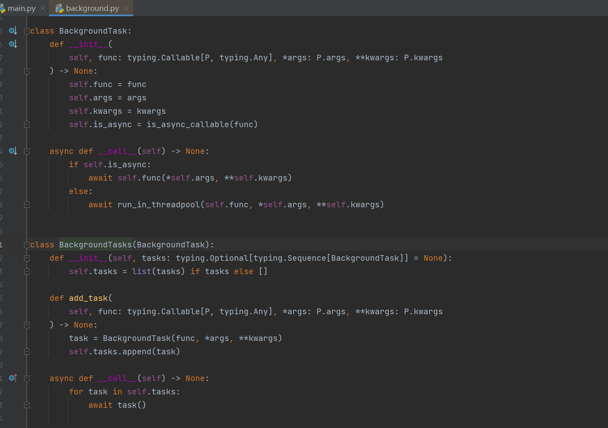

在实际项目中，遇到一个问题，fastapi请求的视图函数中，已经将耗时任务通过`BackgroundTasks`​放到后台任务去执行，但是还是会超时kill当前线程。因此，简单记录一下。

## `BackgroundTasks`​分析

​​

* `BackgroundTasks `​引用了`BackgroundTask`​类；
* ​`BackgroundTask`​类是初始化接收方法参数，以及写了个`__call__`​的调度方法；

  * 在方法内部先判断是否异步函数；
  * 如果是异步函数，则直接执行；
  * 如果不是异步的，会放进线程池里进行；
* 再看回`BackgroundTasks`​类，我们调度了`add_task`​， 其实就是将接收的需执行方法做了"异步化"后塞进`tasks`​任务列表；
* 最后通过`__call__`​函数化调度执行循环该`tasks`​任务列表，通过 `async`​和 `await`​异步执行调度任务

## 案例分析

将项目中的情况抽象为以下代码：

1. 模拟在同步的后台函数中，执行同步的耗时操作
2. 模拟在异步的后台函数中，执行同步的耗时操作
3. 模拟在异步的后台函数中，执行异步的耗时操作

```python
import asyncio
import logging
import time

from fastapi import BackgroundTasks, FastAPI, Request

app = FastAPI()

# 配置日志格式和处理程序
logging.basicConfig(
    format="[%(asctime)s] [%(process)d] [%(levelname)s] %(message)s",
    datefmt="%Y-%m-%d %H:%M:%S %z",
    level=logging.INFO,
)
# 获取日志记录器
logger = logging.getLogger()


# 请求日志中间件
@app.middleware("http")
async def log_requests(request: Request, call_next):
    logger.info(f"Started {request.method} {request.url}")
    response = await call_next(request)
    logger.info(
        f"Completed {request.method} {request.url} "
        f"with status code {response.status_code}"
    )
    return response


def sync_func_sync_timeout() -> None:
    time.sleep(15)
    logger.warn("sync func sync timeout 15")
    return


async def async_func_sync_timeout() -> None:
    time.sleep(15)
    logger.warn("async func sync timeout 15")
    return


async def async_func_async_timeout() -> None:
    await asyncio.sleep(15)
    logger.warn("async func async timeout 15")
    return


@app.get("/")
async def index(request: Request, action: int, background_tasks: BackgroundTasks):
    if action == 1:
        background_tasks.add_task(sync_func_sync_timeout)
    elif action == 2:
        background_tasks.add_task(async_func_sync_timeout)
    elif action == 3:
        background_tasks.add_task(async_func_async_timeout)
    return {"msg": "Hello World, Action: %d" % action}

```

在命令行启动服务，设置为一个worker，请求超时时间为10s，然后分别请求三种action，情况如下：

```bash
❯ gunicorn -b 0.0.0.0:8000 -w 1 -t 10 -k uvicorn.workers.UvicornWorker main:app

[2024-07-11 10:20:00 +0800] [68268] [INFO] Starting gunicorn 20.1.0
[2024-07-11 10:20:00 +0800] [68268] [INFO] Listening at: http://0.0.0.0:8000 (68268)
[2024-07-11 10:20:00 +0800] [68268] [INFO] Using worker: uvicorn.workers.UvicornWorker
[2024-07-11 10:20:00 +0800] [68279] [INFO] Booting worker with pid: 68279
[2024-07-11 10:20:00 +0800] [68279] [INFO] Started server process [68279]
[2024-07-11 10:20:00 +0800] [68279] [INFO] Waiting for application startup.
[2024-07-11 10:20:00 +0800] [68279] [INFO] Application startup complete.

[2024-07-11 10:20:23 +0800] [68279] [INFO] Started GET http://172.16.70.150:8000/?action=1
[2024-07-11 10:20:23 +0800] [68279] [INFO] Completed GET http://172.16.70.150:8000/?action=1 with status code 200
[2024-07-11 10:20:38 +0800] [68279] [WARNING] sync func sync timeout 15

[2024-07-11 10:20:40 +0800] [68279] [INFO] Started GET http://172.16.70.150:8000/?action=2
[2024-07-11 10:20:40 +0800] [68279] [INFO] Completed GET http://172.16.70.150:8000/?action=2 with status code 200
[2024-07-11 10:20:46 +0800] [68268] [CRITICAL] WORKER TIMEOUT (pid:68279)
[2024-07-11 10:20:46 +0800] [68268] [WARNING] Worker with pid 68279 was terminated due to signal 6
[2024-07-11 10:20:46 +0800] [68923] [INFO] Booting worker with pid: 68923
[2024-07-11 10:20:46 +0800] [68923] [INFO] Started server process [68923]
[2024-07-11 10:20:46 +0800] [68923] [INFO] Waiting for application startup.
[2024-07-11 10:20:46 +0800] [68923] [INFO] Application startup complete.

[2024-07-11 10:20:46 +0800] [68923] [INFO] Started GET http://172.16.70.150:8000/?action=3
[2024-07-11 10:20:46 +0800] [68923] [INFO] Completed GET http://172.16.70.150:8000/?action=3 with status code 200
[2024-07-11 10:21:01 +0800] [68923] [WARNING] async func async timeout 15
```

1. 该函数为同步函数：

    1. 开启一个新的线程执行，不影响主线程，其余请求可以正常执行
2. 该函数为异步函数：

    1. 直接在当前请求线程中使用`await`​执行，
    2. 理论上异步函数中遇到耗时可以切换执行，但是在函数中有一个同步的耗时操作，无法切换。因此一直等待，同时还阻塞其他请求处理
    3. 请求线程的超时时间一到，就直接kill掉当前线程，任务无法执行完成
3. 该函数为同步函数：

    1. 直接在当前请求线程中使用`await`​执行
    2. 遇到耗时操作，直接切换执行其他代码；不阻塞其他请求
