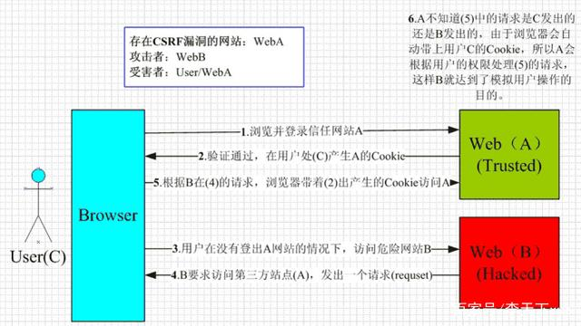
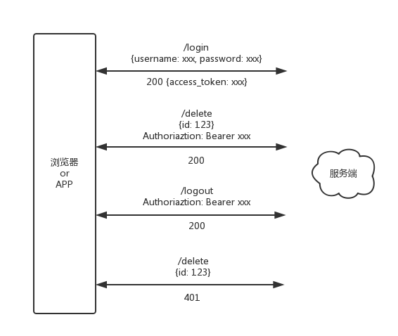

SQL注入，旁注，XSS跨站，COOKIE欺骗，DDOS，0day 漏洞，社会工程学 等等等等，只要有数据交互，就会存在被入侵风险！哪怕你把网线拔掉，物理隔绝，我还可以利用传感器捕捉电磁辐射信号转换成模拟图像。你把门锁上，我就爬窗户；你把窗户关上，我就翻院墙；你把院墙加高，我就挖地洞。。。道高一尺魔高一丈，我始终坚信计算机不存在绝对的安全，你攻我防，此消彼长，有时候，魔与道只在一念之间。
下面，就让我们一起推开计算机中那另一扇不为人知的门

## CSRF

### 基本概念

CSRF（Cross-site request forgery）：跨站请求伪造。

### 攻击原理

​​

用户是网站 A 的注册用户，且登录进去，于是网站 A 就给用户下发 cookie。

从上图可以看出，要完成一次 CSRF 攻击，受害者必须满足两个必要的条件：

（1）登录受信任网站 A，并在本地生成 Cookie。（如果用户没有登录网站 A，那么网站 B 在诱导的时候，请求网站 A 的 api 接口时，会提示你登录）

（2）在不登出 A 的情况下，访问危险网站 B（其实是利用了网站 A 的漏洞）。

我们在讲 CSRF 时，一定要把上面的两点说清楚。

温馨提示一下，cookie 保证了用户可以处于登录状态，但网站 B 其实拿不到 cookie。

### 防范措施

#### 判断请求头中的 Referer

这个字段记录的是请求的来源。比如前端*Vue*页面 `http://localhost:8080/#/showbooks`上调用了服务端*Django*的接口 `http://127.0.0.1:8000/books/?page=2&page_size=10`， 那么在服务端，就可以通过 `Referer` 判断这个请求是来自哪里。

在实际应用中，这些跟业务逻辑无关的操作往往会放在拦截器中（或者说过滤器，不同技术使用的名词可能不同）。意思是说，在进入到业务逻辑之前，就应该要根据 Referer 的值来决定这个请求能不能处理。

用Flask 的话可以使用装饰器；在Django 中是叫中间件。每种技术它走的流程其实都一样。

而在 Django 可以通过以下代码获取对应信息

```python
request.META['HTTP_REFERER']  # 来路

request.META.get("HTTP_USER_AGENT")  # 请求头
```

在Flask中，则获取方式不同。

```python
request.referrer  # 来路

request.headers.get('User-Agent')  # 请求头
```

但要注意的是，Referer 是浏览器设置的，在浏览器兼容性大不相同的时代中，如果存在某种浏览器允许用户修改这个值，那么 CSRF 漏洞依然存在。

#### 在请求参数中加入 csrf token

讨论 GET 和 POST 两种请求，对于 GET，其实也没什么需要防范的。为什么？

因为 GET 在 “约定” 当中，被认为是查询操作，查询的意思就是，你查一次，查两次，无数次，结果都不会改变（用户得到的数据可能会变），这不会对数据库造成任何影响，所以不需要加其他额外的参数。

> 所以这里要提醒各位的是，尽量遵从这些约定，不要在 GET 请求中出现 /delete, /update, /edit 这种单词。把 “写” 操作放到 POST 中。

对于 POST，服务端在创建表单的时候可以加一个隐藏字段，也是通过某种加密算法得到的。在处理请求时，验证这个字段是否合法，如果合法就继续处理，否则就认为是恶意操作。

```html
<form method="post" action="/delete">
  <!-- 其他字段 -->
  <input type="hidden" />
</form>
```

这个 html 片段由服务端生成。

这的确是一个很好的防范措施，再增加一些处理的话，还能防止表单重复提交。

可是对于一些新兴网站，很多都采用了 “前后端分离开发” 的设计，或者退一步，无论是不是前后端分离，它的 HTML 可能是由 JavaScript 拼接而成，并且表单也都是异步提交。所以这个办法有它的应用场景，也有局限性。

#### 新增 HTTP Header

方法二和方法一有点像，本质上没有太大区别，只是使用方式上有区别。

把 token 隐藏在 http 的 head 头中。

服务端可以像获取 Referer 一样获取这个请求头，不同的是，这个 token 是由服务端生成的，所以攻击者他没办法猜。

另一篇文章讲解的——**​**​**​`JWT`​**​**​**——就是基于这个方式。抛开 JWT 不谈，它的工作原理是这样的:

​​

解释一下这四个请求，类型都是 POST 。

1. 通过 `/login` 接口，用户登录，服务端传回一个 `access_token`，前端把它保存起来，可以是内存当中，如果你希望用来模拟 `session` 的话。也可以保存到 `localStorage` 中，这样可以实现自动登录。
2. 调用 `/delete` 接口，参数是某样商品的 id。仔细看，在这个请求中，多了一个名为 `Authoriaztion` 的 `header`，它的值是之前从服务端传回来的 `access_token`，在前面加了一个 “`Bearer`”（这是和服务端的约定，约定就是说，说好了加就一起加，不加就都不加……）
3. 调用 `/logout` 接口，同样把 `access_token` 加在 `header` 中传过去。成功之后，服务端和前端都会把这个 `token` 置为失效，或直接删除。
4. 再调用 `/delete` 接口，由于此时已经没有 `access_token` 了，所以服务端判断该请求没权限，返回 401 。

从头至尾，整个过程没有涉及 cookie，所以 CSRF 是不可能发生的！

## XSS

### 基本概念

XSS（Cross Site Scripting）：跨域脚本攻击。

### 攻击原理

XSS 攻击的核心原理是：不需要你做任何的登录认证，它会通过合法的操作（比如在 url 中输入、在评论框中输入），向你的页面注入脚本（可能是 js、hmtl 代码块等）。

最后导致的结果可能是：

盗用 Cookie 破坏页面的正常结构，插入广告等恶意内容 D-doss 攻击

### 攻击方式

#### 反射型

发出请求时，XSS 代码出现在 url 中，作为输入提交到服务器端，服务器端解析后响应，XSS 代码随响应内容一起传回给浏览器，最后浏览器解析执行 XSS 代码。这个过程像一次反射，所以叫反射型 XSS。

#### 存储型存

储型 XSS 和反射型 XSS 的差别在于，提交的代码会存储在服务器端（数据库、内存、文件系统等），下次请求时目标页面时不用再提交 XSS 代码。

### 防范措施

XSS 的防范措施主要有三个：

#### 编码

对用户输入的数据进行`HTML Entity` 编码。

比如说这段代码：

```js
<script>alert(1)</script>
```

若不进行任何处理，则浏览器会执行 `alert` 的 js 操作，实现 `XSS` 注入。

进行编码处理之后，在浏览器中的显示结果就是 `<script>alert(1)</script>`，实现了将 `$var` 作为纯文本进行输出，且不引起 `JavaScript` 的执行。

#### 过滤

移除用户输入的和事件相关的属性。如 `onerror` 可以自动触发攻击，还有 `onclick` 等。（总而言是，过滤掉一些不安全的内容）移除用户输入的 `Style` 节点、`Script` 节点、`Iframe` 节点。（尤其是 `Script` 节点，它可是支持跨域的，一定要移除）。

#### 校正

避免直接对 `HTML Entity` 进行解码。使用 `DOM Parse` 转换，校正不配对的 `DOM` 标签。备注：我们应该去了解一下`DOM Parse`这个概念，它的作用是把文本解析成 `DOM` 结构。

比较常用的做法是，通过第一步的编码转成文本，然后第三步转成 DOM 对象，然后经过第二步的过滤。

## SQL注入

### 基本概念

SQL 注入（SQLi）是一种注入攻击，可以执行恶意 SQL 语句。

### 攻击原理

它通过将任意 SQL 代码插入数据库查询，使攻击者能够完全控制 Web 应用程序后面的数据库服务器。攻击者可以使用 SQL 注入漏洞绕过应用程序安全措施；可以绕过网页或 Web 应用程序的身份验证和授权，并检索整个 SQL 数据库的内容；还可以使用 SQL 注入来添加，修改和删除数据库中的记录。

SQL 注入漏洞可能会影响使用 SQL 数据库（如 MySQL，Oracle，SQL Server 或其他）的任何网站或 Web 应用程序。犯罪分子可能会利用它来未经授权访问用户的敏感数据：客户信息，个人数据，商业机密，知识产权等。SQL 注入攻击是最古老，最流行，最危险的 Web 应用程序漏洞之一。

### 攻击方式

#### 带内注入

这是典型的攻击，攻击者可以通过相同的通信通道发起攻击并获得结果。这是通过两种带内技术完成的：

基于错误的 SQL 注入：从显示的错误消息中获取有关数据库的信息

基于联合的 SQL 注入：依赖于攻击者能够将 UNION ALL 被盗信息的结果与合法结果连接起来。

这两种技术都依赖于攻击者修改应用程序发送的 SQL，以及浏览器中显示的错误和返回的信息。如果应用程序开发人员或数据库开发人员无法正确地参数化他们在查询中使用的值，那么它会成功。两者都是试错法，可以检测到错误。

#### 盲注入

也称为推理 SQL 注入，盲注入攻击不会直接从目标数据库中显示数据；相反，攻击者会仔细检查行为中的间接线索。HTTP 响应中的详细信息，某些用户输入的空白网页以及数据库响应某些用户输入需要多长时间，这些都可以是线索，具体取决于攻击者的目标。他们还可以指向攻击者尝试的另一个 SQL 攻击途径。

#### 带外注入

这种攻击有点复杂，当攻击者无法在单个直接查询 - 响应攻击中实现其目标时，攻击者可能会使用此攻击。通常，攻击者会制作 SQL 语句，这些语句在呈现给数据库时会触发数据库系统创建与攻击者控制的外部服务器的连接。以这种方式，攻击者可以收集数据或可能控制数据库的行为。

二阶注入就是一种带外注入攻击。在这种情况下，攻击者将提供 SQL 注入，该注入将由数据库系统的单独行为存储和执行。当二级系统行为发生时（它可能类似于基于时间的作业或由其他典型管理员或用户使用数据库触发的某些事情）并且执行攻击者的 SQL 注入，那就是当 “伸出” 到系统时攻击者控制发生了。

### 防范措施

1. 不要使用动态 SQL

   避免将用户提供的输入直接放入 SQL 语句中；最好使用准备好的语句和参数化查询，这样更安全。
2. 不要将敏感数据保留在纯文本中

   加密存储在数据库中的私有 / 机密数据；这样可以提供了另一级保护，以防攻击者成功地排出敏感数据。
3. 限制数据库权限和特权

   将数据库用户的功能设置为最低要求；这将限制攻击者在设法获取访问权限时可以执行的操作。
4. 避免直接向用户显示数据库错误

   攻击者可以使用这些错误消息来获取有关数据库的信息。
5. 对访问数据库的 Web 应用程序使用 Web 应用程序防火墙（WAF）

   这为面向 Web 的应用程序提供了保护，它可以帮助识别 SQL 注入尝试；根据设置，它还可以帮助防止 SQL 注入尝试到达应用程序（以及数据库）。
6. 定期测试与数据库交互的 Web 应用程序

   这样做可以帮助捕获可能允许 SQL 注入的新错误或回归。
7. 将数据库更新为最新的可用修补程序

   这可以防止攻击者利用旧版本中存在的已知弱点 / 错误。
