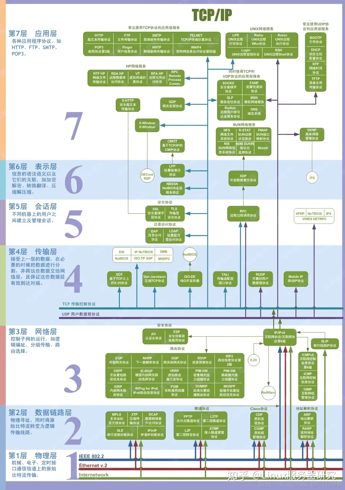
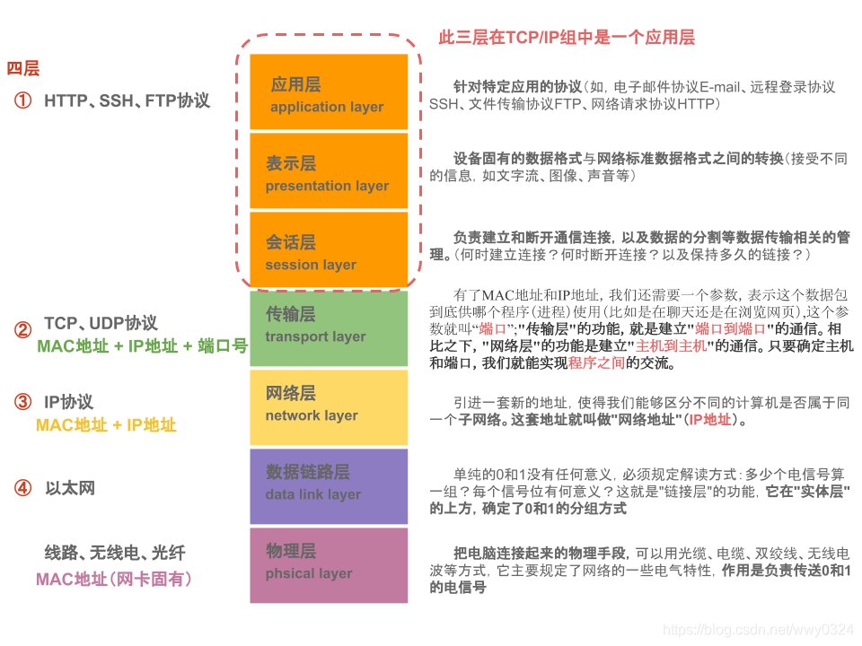

本文主要介绍了计算机网络中常用的两种网络协议模型——OSI七层模型和TCP/IP四层模型。其中，OSI模型包括七个层次，分别为应用层、表示层、会话层、传输层、网络层、数据链路层和物理层，每个层次都有其特定的功能和任务。而TCP/IP模型则是将OSI模型的七层简化为了四层，即应用层、传输层、网络层和网络接口层，更具有实用性和可操作性。

## OSI 七层模型

七层模型，亦称 OSI（Open System Interconnection）。参考模型是国际标准化组织（ISO）制定的一个用于计算机或通信系统间互联的标准体系，一般称为 OSI 参考模型或七层模型。
它是一个七层的、抽象的模型体，不仅包括一系列抽象的术语或概念，也包括具体的协议。

​​

### 7. 应用层

网络服务与最终用户的一个接口
各种应用程序协议
协议有：HTTP(超文本传输协议) FTP（文本传输协议） TFTP（简单文件传输协议） [SMTP](https://so.csdn.net/so/search?q=SMTP&spm=1001.2101.3001.7020)（简单邮件传输协议） SNMP（简单网络管理协议） DNS（域名系统） TELNET（远程终端协议） HTTPS（超文本传输安全协议） POP3（邮局协议版本 3 ） DHCP（动态主机配置协议）

### 6. 表示层

数据的表示、安全、压缩。（在五层模型里面已经合并到了应用层）
信息的语法语义以及他们的关联，如加密解密、转换翻译、压缩解压
格式有，JPEG、ASCll、EBCDIC、加密格式等 [2]
如 LPP（轻量级表示协议）

### 5. 会话层

建立、管理、终止会话。（在五层模型里面已经合并到了应用层）
不同机器上的用户之间建立及管理会话
对应主机进程，指本地主机与远程主机正在进行的会话
安全协议：SSL（安全套接字层协议）、TLS（安全传输层协议）

### 4. 传输层

定义传输数据的协议端口号，以及流控和差错校验。
接受上一层数据，在必要的时候把数据进行切割，并将这些数据交给网络层，并保证这些数据段有效到达对端
协议有：TCP UDP，数据包一旦离开网卡即进入网络传输层

### 3. 网络层

进行逻辑地址寻址，实现不同网络之间的路径选择。
控制子网的运行，如逻辑编址、分组传输、路由选择
协议有：ICMP（互联网控制信息协议） IGMP（组管理协议） IP（IPV4 IPV6）（互联网协议）
安全协议、路由协议（vrrp 虚拟路由冗余）

### 2. 数据链路层

建立逻辑连接、进行硬件地址寻址、差错校验 [3] 等功能。（由底层网络定义协议）
将比特组合成字节进而组合成帧，用 MAC 地址访问介质，错误发现但不能纠正。
物理寻址、同时将原始比特流转变为逻辑传输线路
地址解析协议：ARP、PARP（反向地址转换协议）

### 1. 物理层

建立、维护、断开物理连接。（由底层网络定义协议）
机械、电子、定时接口通信信道上的原始比特流传输
TCP/IP 层级模型结构，应用层之间的协议通过逐级调用传输层（Transport layer）、网络层（Network Layer）和物理数据链路层（Physical Data Link）而可以实现应用层的应用程序通信互联。

应用层需要关心应用程序的逻辑细节，而不是数据在网络中的传输活动。应用层其下三层则处理真正的通信细节。在 Internet 整个发展过程中的所有思想和着重点都以一种称为 RFC（Request For Comments）的文档格式存在。针对每一种特定的 TCP/IP 应用，有相应的 RFC
一些典型的 TCP/IP 应用有 FTP、Telnet、SMTP、SNTP、REXEC、TFTP、LPD、[SNMP](https://so.csdn.net/so/search?q=SNMP&spm=1001.2101.3001.7020)、NFS、INETD 等。RFC 使一些基本相同的 TCP/IP 应用程序实现了标准化，从而使得不同厂家开发的应用程序可以互相通信

## TCP/IP 四层模型

TCP/IP（Transmission Control Protocol/Internet Protocol，**传输控制协议 / 网际协议**）是指能够在多个不同网络间实现信息传输的协议簇。TCP/IP 协议不仅仅指的是 TCP 和 IP 两个协议，而是指一个由 FTP、SMTP、TCP、UDP、IP 等协议构成的协议簇， 只是因为在 TCP/IP 协议中 TCP 协议和 IP 协议最具代表性，所以被称为 TCP/IP 协议。

* TCP/IP 是在网络的使用中的**最基本的通信协议**。
* TCP/IP 传输协议对互联网中各部分进行**通信的标准和方法进行了规定**。
* TCP/IP 传输协议是**保证网络数据信息及时、完整传输**的两个重要的协议。
* TCP/IP 传输协议是严格来说是一个**四层**的体系结构，**应用层**、**传输层**、**网络层**和**数据链路层**都包含其中。

这个图真的超详细，建议多看！！！！！

​​

* 应用层的主要协议有 Telnet、FTP、SMTP 等，是用来接收来自传输层的数据或者按不同应用要求与方式将数据传输至传输层；
* 传输层的主要协议有 UDP、TCP，是使用者使用平台和计算机信息网内部数据结合的通道，可以实现数据传输与数据共享；
* 网络层的主要协议有 ICMP、IP、IGMP，主要负责网络中数据包的传送等；
* 数据链路层，主要协议有 ARP、RARP，主要功能是提供链路管理错误检测、对不同通信媒介有关信息细节问题进行有效处理等。

### TCP/IP 协议的组成

TCP/IP 协议在一定程度上参考了 OSI 的体系结构。OSI 模型共有七层，但是比较复杂，所以在 TCP/IP 协议中，它们被简化为了四个层次

（1）应用层、表示层、会话层三个层次提供的服务相差不是很大，所以在 TCP/IP 协议中，它们被合并为应用层一个层次
（2）由于运输层和网络层在网络协议中的地位十分重要，所以在 TCP/IP 协议中它们被作为独立的两个层次
（3）因为数据链路层和物理层的内容相差不多，所以在 TCP/IP 协议中它们被归并在网络接口层一个层次里。

只有四层体系结构的 TCP/IP 协议，与有七层体系结构的 OSI 相比要简单了不少，也正是这样，TCP/IP 协议在实际的应用中**效率更高，成本更低**

​​

### TCP/IP 协议中的四个层次

* 应用层：应用层是 TCP/IP 协议的第一层，是直接为应用进程提供服务的。
  （1）对不同种类的应用程序它们会根据自己的需要来使用应用层的不同协议，邮件传输应用使用了 SMTP 协议、万维网应用使用了 HTTP 协议、远程登录服务应用使用了有 TELNET 协议
  （2）应用层还能加密、解密、格式化数据
  （3）应用层可以建立或解除与其他节点的联系，这样可以充分节省网络资源
* 运输层：作为 TCP/IP 协议的第二层，运输层在整个 TCP/IP 协议中起到了中流砥柱的作用。且在运输层中，TCP 和 UDP 也同样起到了中流砥柱的作用
* 网络层：网络层在 TCP/IP 协议中的位于第三层。在 TCP/IP 协议中网络层可以进行网络连接的建立和终止以及 IP 地址的寻找等功能
* 网络接口层：在 TCP/IP 协议中，网络接口层位于第四层。由于网络接口层兼并了物理层和数据链路层所以，网络接口层既是传输数据的物理媒介，也可以为网络层提供一条准确无误的线路

### 特点

TCP/IP 协议能够迅速发展起来并成为事实上的标准，是它恰好适应了世界范围内数据通信的需要。它有以下特点：
（1）协议标准是完全开放的，可以供用户免费使用，并且独立于特定的计算机硬件与操作系统。
（2）独立于网络硬件系统，可以运行在广域网，更适合于互联网。
（3）网络地址统一分配，网络中每一设备和终端都具有一个唯一地址。
（4）高层协议标准化，可以提供多种多样可靠网络服务

### 通信过程及相关协议

在网络通信的过程中，将发出数据的主机称为源主机，接收数据的主机称为目的主机。

当源主机发出数据时，数据在源主机中从上层向下层传送。

* 源主机中的应用进程先将数据交给应用层，应用层加上必要的控制信息就成了报文流，向下传给传输层。
* 传输层将收到的数据单元加上本层的控制信息，形成报文段、数据报，再交给网际层。
* 网际层加上本层的控制信息，形成 IP 数据报，传给网络接口层。
* 网络接口层将网际层交下来的 IP 数据报组装成帧，并以比特流的形式传给网络硬件（即物理层），数据就离开源主机。

## 备注

> 原文地址 [https://blog.csdn.net/wwy0324/article/details/109310658](https://blog.csdn.net/wwy0324/article/details/109310658)
