## HTTP介绍

HTTP 协议一般指 HTTP（超文本传输协议）。

超文本传输协议（英语：HyperText Transfer Protocol，缩写：HTTP）是一种用于分布式、协作式和超媒体信息系统的应用层协议，是因特网上应用最为广泛的一种网络传输协议，所有的 WWW 文件都必须遵守这个标准。

HTTP是一个基于TCP/IP通信协议来传递数据（HTML 文件, 图片文件, 查询结果等）。

## HTTP 工作原理

HTTP协议工作于客户端-服务端架构上。浏览器作为HTTP客户端通过URL向HTTP服务端即WEB服务器发送所有请求。

Web服务器有：Apache服务器，Nginx服务器，IIS服务器（Internet Information Services）等。

Web服务器根据接收到的请求后，向客户端发送响应信息。

HTTP默认端口号为80，但是你也可以改为8080或者其他端口。

HTTP三点注意事项:

* HTTP是无连接：无连接的含义是限制每次连接只处理一个请求。服务器处理完客户的请求，并收到客户的应答后，即断开连接。采用这种方式可以节省传输时间。
* HTTP是媒体独立的：这意味着，只要客户端和服务器知道如何处理的数据内容，任何类型的数据都可以通过HTTP发送。客户端以及服务器指定使用适合的MIME-type内容类型。
* HTTP是无状态：HTTP协议是无状态协议。无状态是指协议对于事务处理没有记忆能力。缺少状态意味着如果后续处理需要前面的信息，则它必须重传，这样可能导致每次连接传送的数据量增大。另一方面，在服务器不需要先前信息时它的应答就较快。

## HTTP 报文

HTTP 是基于客户端/服务端（C/S）的架构模型，通过一个可靠的链接来交换信息，是一个无状态的请求/响应协议。

一个 HTTP"客户端"是一个应用程序（Web 浏览器或其他任何客户端），通过连接到服务器达到向服务器发送一个或多个 HTTP 的请求的目的。

一个 HTTP"服务器"同样也是一个应用程序（通常是一个 Web 服务，如 Apache Web 服务器或 IIS 服务器等），通过接收客户端的请求并向客户端发送 HTTP 响应数据。

HTTP 使用统一资源标识符（Uniform Resource Identifiers, URI）来传输数据和建立连接。

用于 HTTP 协议交互的信息被称为 **HTTP 报文**。

请求端(客户端)的 HTTP 报文叫做请求报文，响应端(服务器端)的叫做响应报文。

HTTP 报文大致可分为报文首部和报文主体两块。两者由最初出现的 空行(`CR+LF`​)来划分。通常，并不一定要有报文主体。

​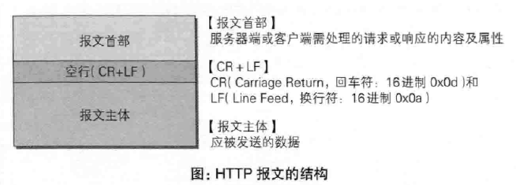​

### 请求报文及响应报文的结构

我们来看一下请求报文和响应报文的结构。

​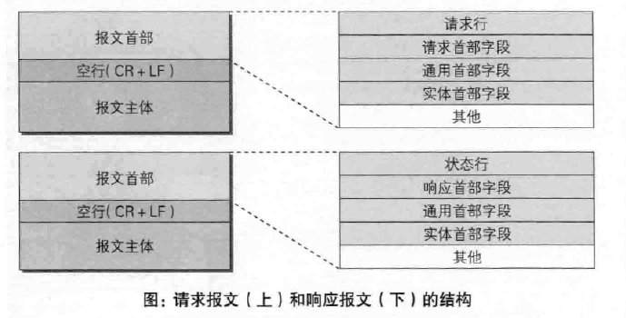​

客户端请求消息

客户端发送一个 HTTP 请求到服务器的请求消息包括以下格式：请求行（request line）、**可选的**请求头部（header）、空行和请求数据四个部分组成，下图给出了请求报文的一般格式。

​​

​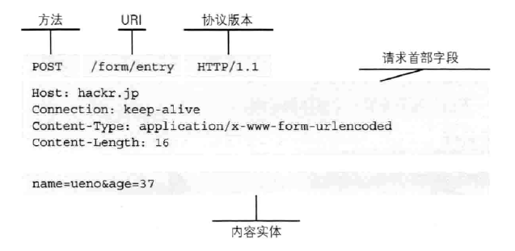​

### 服务器响应消息

HTTP 响应也由四个部分组成，分别是：状态行、消息报头、空行和响应正文。

​​

​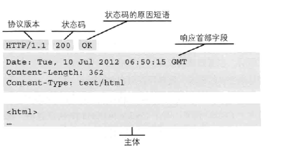​

### 编码提升传输速率

HTTP 在传输数据时可以按照数据原貌直接传输，但也可以在传输过 程中通过编码提升传输速率。通过在传输时编码，能有效地处理大量 的访问请求。但是，编码的操作需要计算机来完成，因此会消耗更多 的 CPU 等资源。

#### 报文主体和实体主体的差异

报文(**message**)是 HTTP 通信中的基本单位，由 8 位组字节流(octet sequence， 其中 octet 为 8 个比特)组成，通过 HTTP 通信传输。

实体(**entity**) 作为请求或响应的有效载荷数据(补充项)被传输，其内容由实

体首部和实体主体组成。  
HTTP 报文的主体用于传输请求或响应的实体主体。

通常，报文主体等于实体主体。只有当传输中进行编码操作时，实体  
主体的内容发生变化，才导致它和报文主体产生差异。

#### 压缩传输的内容编码

​`HTTP`​ 协议中的内容编码功能就像用压缩软件压缩东西一样，对实体内容进行编码压缩，内容编码后的实体由客户端接受并解码。这可以压缩传输内容，加快传输速度。

​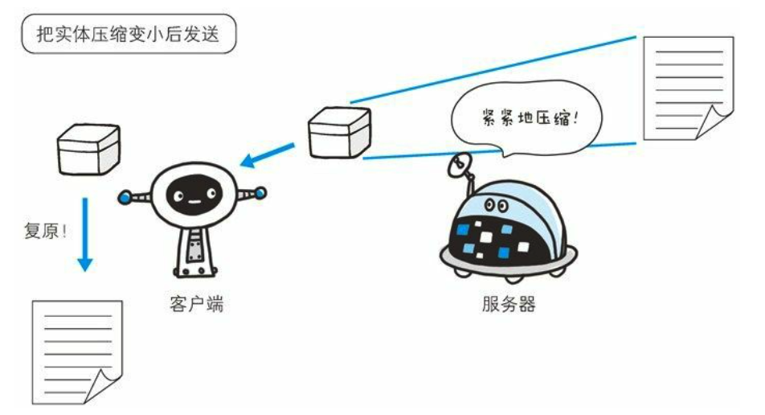​

常用的内容编码有以下几种。

* **gzip**(**GNU zip**)
* **compress**(**UNIX** 系统的标准压缩)
* **deflate**(**zlib**)
* **identity**(不进行编码)

#### 分割发送的分块传输编码

​`HTTP`​ 通信过程中，请求的编码实体资源尚未传输完成之前，浏览器无法显示请求页面，传输大容量数据时候，通过数据分割成多块，能让浏览器逐步显示页面。这就是分块传输编码（`Chunked`​ `Transfer`​ `Coding`​）。它将实体主体分成多个部分，每一块用十六进制来标记，最后一块使用 `0（CR+LF)`​ 来标记。传输给客户端，由客户端进行解码恢复。

​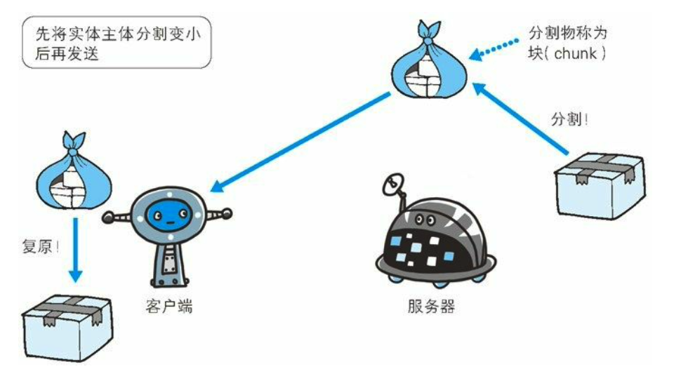​

### 获取部分内容的范围请求

过去，用户下载东西中断了必须要从头下载，为了解决这问题，要实现该功能需要指定下载的实体范围，指定范围发送的请求叫做范围请求（`Range`​ `Request`​)  
对一份 10000 字节大小的资源，如果使用范围请求，可以只请求 5001~10000 字节内的资源。这样就算中断了，也可以向服务端指明自己需要的资源字节范围，这些需要在首部字段中表名。  
形式如下：

​`Range`​ : `bytes`​ = 5001 - 10000
5001 到 10000 的
`Range`​ : `bytes`​ = 5001 -
5001 到之后全部的
`Range`​ : `bytes`​ = -3000, 5000 - 7000
从头到 3000， 5000 到 7000 的

​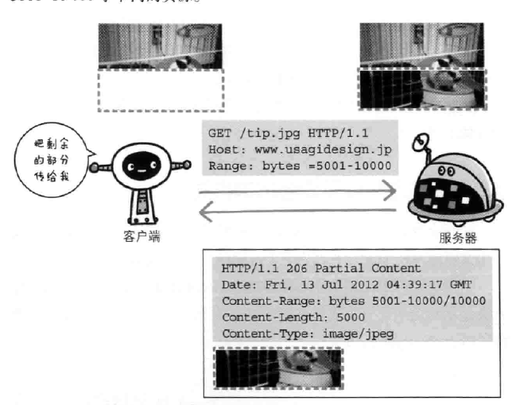​

针对范围请求，响应会返回状态码为 `206 Partial Content`​ 的响应报文，另外，对于多重范围的范围请求，响应会在首部字段 `Content-Type`​ 标明 `multipart`​/`byteranges`​ 后返回响应报文，如果服务器无法响应请求，返回状态码 `200 OK `​ 和完整的实体内容。

### 发送多种数据的多部分对象集合

​`MIME`​（`Multipurpose`​ `Internet`​ `Mail`​ `Extensions`​, 多用途因特网邮件扩展），它允许邮件处理文本，图片，视频等多个不同类型的数据，这使我们可以在邮件里写入文字并添加多分附件成为了现实。例如：图片等二进制数据以 `ASCII`​ 码字符串编码方式表名，就是利用 `MIME`​ 来标记数据类型，在 `MIME`​ 扩展中会使用一种称为多部分对象集合（`Multipart`​）的方法，来容纳多份不同类型的数据。  
相应的，`HTTP`​ 协议中也采纳了多部分对象集合，发送的一份报文主体内可含有多类型实体，通常在图片或文本文件等上传时使用。  
多部分对象集合包括：

* ​`multipart`​/`form-data`​ 在 `Web`​ 表单文件上传使用

​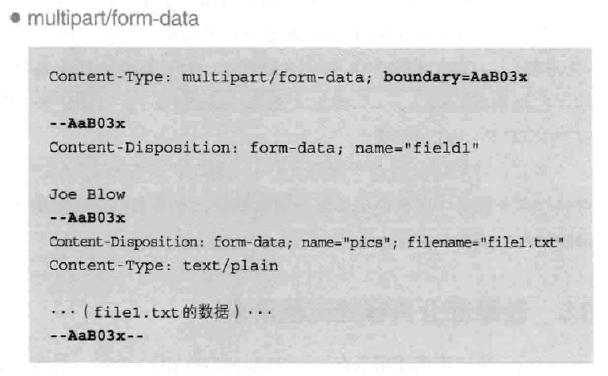​

* ​`multipart`​/`byteranges`​ 状态码 206（`Partial`​ `Content`​，部分内容）响应报文包含了多个范围的内容时使用。

​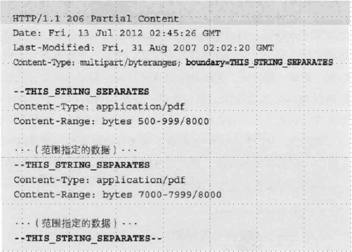​

​`HTTP`​ 报文使用这个多部分对象集合的时候，需要在首部添加 `Content-type`​ 字段。  
使用 `boundary`​ 字符串来划分多部分  
在 `boundary`​ 字符串指定的各个实体的起始行之前插入 `--`​ 标记（`--AaB03x`​、`--THis_STRING_SEPARATES`​)  
在多部分对象集合对应的字符串的最后插入 `--`​ 标记（`--AaB03x--`​）

多部分对象集合的每个部分类型中，都可以含有首部字段。另外，可以在部分中潜逃使用多部分对象集合。

### 内容协商返回最合适的内容

同一个 Web 网站可能有存着多分相同内容的页面，如中文版和英文版，内容虽然相同，单语言不同。当浏览器默认语言为哪种，访问相同的 `URI`​ 的 `Web`​ 页面时，会对应返回哪种语言的 Web 页面，这样的机制就叫做内容协商（`Content`​ `Negotiation`​）。  
这协商的请求会包含在首部字段

* ​`Accept`​
* ​`Accept-Charset`​
* ​`Accept-Encoding`​
* ​`Accept-Language`​
* ​`Content-Language`​

类型：  
服务器驱动协商（`Server-driven`​ `Negotiation`​)  
服务器通过请求的首部字段为参考自动处理，但以浏览器直接发送的信息不一定能筛选出最优的内容。  
客户端驱动协商（`Agent-driven`​ `Negotiation`​)  
用户从浏览器显示的可选项列表中选择， 还可以利用 JS 脚本在 Web 页面自动进行上述选择。  
透明协商（`Transparent`​ `Negotiation`​)  
上两种方法的结合体。

## HTTP请求方法

根据 HTTP 标准，HTTP 请求可以使用多种请求方法。

HTTP1.0 定义了三种请求方法： GET, POST 和 HEAD 方法。

HTTP1.1 新增了六种请求方法：OPTIONS、PUT、PATCH、DELETE、TRACE 和 CONNECT 方法。

|方法|描述|
| :--------| :-----------------------------------------------------------------------------------------------------------------------------------------|
|GET|请求指定的页面信息，并返回实体主体。|
|HEAD|类似于 GET 请求，只不过返回的响应中没有具体的内容，用于获取报头|
|POST|向指定资源提交数据进行处理请求（例如提交表单或者上传文件）。数据被包含在请求体中。POST 请求可能会导致新的资源的建立和/或已有资源的修改。|
|PUT|从客户端向服务器传送的数据取代指定的文档的内容。|
|DELETE|请求服务器删除指定的页面。|
|CONNECT|HTTP/1.1 协议中预留给能够将连接改为管道方式的代理服务器。|
|OPTIONS|允许客户端查看服务器的性能。|
|TRACE|回显服务器收到的请求，主要用于测试或诊断。|
|PATCH|是对 PUT 方法的补充，用来对已知资源进行局部更新 。|

## HTTP状态码

HTTP状态码（HTTP Status Code）是用以表示网页服务器HTTP响应状态的3位数字代码。借助状态码，用户可以知道服务器端是正常处理了请求，还是出现了错误。

‍

​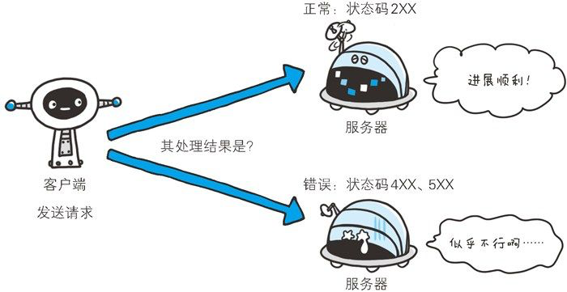​

它由 RFC 2616 规范定义的，并得到RFC 2518、RFC 2817、RFC 2295、RFC 2774、RFC 4918等规范扩展。

HTTP 状态码由三个十进制数字组成，第一个十进制数字定义了状态码的类型。

响应分为五类：信息响应(100–199)，成功响应(200–299)，重定向(300–399)，客户端错误(400–499)和服务器错误 (500–599)：

||**类别**|**原因短语**|
| ------| ----------------------------------| ------------------------------------------------|
|​`1XX`​|Informational（信息性状态码）|信息，服务器收到请求，需要请求者继续执行操作|
|​`2XX`​|Success（成功状态码）|成功，操作被成功接收并处理|
|​`3XX`​|Redirection（重定向状态码）|重定向，需要进一步的操作以完成请求|
|​`4XX`​|Client Error（客户端错误状态码）|客户端错误，请求包含语法错误或无法完成请求|
|​`5XX`​|Server Error（服务器错误状态码）|服务器错误，服务器在处理请求的过程中发生了错误|

### 1xx（临时响应）

> 表示临时响应并需要请求者继续执行操作的状态代码。

|状态码|状态码英文名称|中文描述|
| :------: | :-------------------: | ------------------------------------------------------------------------------------------------|
|100|Continue|（继续） 请求者应当继续提出请求。 服务器返回此代码表示已收到请求的第一部分，正在等待其余部分。|
|101|Switching Protocols|（切换协议） 请求者已要求服务器切换协议，服务器已确认并准备切换。|

### 2xx （成功）

> 表示成功处理了请求的状态代码。

|状态码|状态码英文名称|中文描述|
| :------: | :------------------------------| ------------------------------------------------------------------------------------------------------|
|200|OK|（成功） 服务器已成功处理了请求，该操作是幂等的（Idempotent）。 通常，这表示服务器提供了请求的网页。|
|201|Created|（已创建） 请求成功并且服务器创建了新的资源。|
|202|Accepted|（已接受） 服务器已接受请求，但尚未处理。即请求已经进入后台排队（异步任务）|
|203|Non-Authoritative Information|（非授权信息） 服务器已成功处理了请求，但返回的信息可能来自另一来源。|
|204|No Content|（无内容） 服务器成功处理了请求，但没有返回任何内容。|
|205|Reset Content|（重置内容） 服务器成功处理了请求，但没有返回任何内容。|
|206|Partial Content|（部分内容） 服务器成功处理了部分 GET 请求。|

### 3xx （重定向）

> 表示要完成请求，需要进一步操作。 通常，这些状态代码用来重定向。

|状态码|状态码英文名称|中文描述|
| :------: | :-------------------| --------------------------------------------------------------------------------------------------------------------------|
|300|Multiple Choices|（多种选择） 针对请求，服务器可执行多种操作。 服务器可根据请求者 (user agent) 选择一项操作，或提供操作列表供请求者选择。|
|301|Moved Permanently|（永久移动） 请求的网页已永久移动到新位置。 服务器返回此响应（对 GET 或 HEAD 请求的响应）时，会自动将请求者转到新位置。|
|302|Found|（临时移动） 服务器目前从不同位置的网页响应请求，但请求者应继续使用原有位置来进行以后的请求。|
|303|See Other|（查看其他位置） 请求者应当对不同的位置使用单独的 GET 请求来检索响应时，服务器返回此代码。|
|304|Not Modified|（未修改） 自从上次请求后，请求的网页未修改过。 服务器返回此响应时，不会返回网页内容。|
|305|Use Proxy|（使用代理） 请求者只能使用代理访问请求的网页。 如果服务器返回此响应，还表示请求者应使用代理。|
|307|Temporary Redirect|（临时重定向） 服务器目前从不同位置的网页响应请求，但请求者应继续使用原有位置来进行以后的请求。|

### 4xx（请求错误）

> 这些状态代码表示请求可能出错，妨碍了服务器的处理。

|状态码|状态码英文名称|中文描述|
| :------: | :-------------------------------: | ---------------------------------------------------------------------------------|
|400|Bad Request|（错误请求） 服务器不理解请求的语法。|
|401|Unauthorized|（未授权） 请求要求身份验证。 对于需要登录的网页，服务器可能返回此响应。|
|403|Forbidden|（禁止） 服务器拒绝请求。|
|404|Not Found|（未找到） 服务器找不到请求的网页。|
|405|Method Not Allowed|（方法禁用） 禁用请求中指定的方法。|
|406|Not Acceptable|（不接受） 无法使用请求的内容特性响应请求的网页。|
|407|Proxy Authentication Required|（需要代理授权） 此状态代码与 401（未授权）类似，但指定请求者应当授权使用代理。|
|408|Request Time-out|（请求超时） 服务器等候请求时发生超时。|
|409|Conflict|（冲突） 服务器在完成请求时发生冲突。 服务器必须在响应中包含有关冲突的信息。|
|410|Gone|（已删除） 如果请求的资源已永久删除，服务器就会返回此响应。|
|411|Length Required|（需要有效长度） 服务器不接受不含有效内容长度标头字段的请求。|
|412|Precondition Failed|（未满足前提条件） 服务器未满足请求者在请求中设置的其中一个前提条件。|
|413|Request Entity Too Large|（请求实体过大） 服务器无法处理请求，因为请求实体过大，超出服务器的处理能力。|
|414|Request-URI Too Large|（请求的 URI 过长） 请求的 URI（通常为网址）过长，服务器无法处理。|
|415|Unsupported Media Type|（不支持的媒体类型） 请求的格式不受请求页面的支持。|
|416|Requested range not satisfiable|（请求范围不符合要求） 如果页面无法提供请求的范围，则服务器会返回此状态代码。|
|417|Expectation Failed|（未满足期望值） 服务器未满足"期望"请求标头字段的要求。|

### 5xx（服务器错误）

> 这些状态代码表示服务器在尝试处理请求时发生内部错误。 这些错误可能是服务器本身的错误，而不是请求出错。

|状态码|状态码英文名称|中文描述|
| :------: | :--------------------------: | --------------------------------------------------------------------------------------------|
|500|Internal Server Error|（服务器内部错误） 服务器遇到错误，无法完成请求。|
|501|Not Implemented|（尚未实施） 服务器不具备完成请求的功能。 例如，服务器无法识别请求方法时可能会返回此代码。|
|502|Bad Gateway|（错误网关） 服务器作为网关或代理，从上游服务器收到无效响应。|
|503|Service Unavailable|（服务不可用） 服务器目前无法使用（由于超载或停机维护）。 通常，这只是暂时状态。|
|504|Gateway Time-out|（网关超时） 服务器作为网关或代理，但是没有及时从上游服务器收到请求。|
|505|HTTP Version not supported|（HTTP 版本不受支持） 服务器不支持请求中所用的 HTTP 协议版本。|

## 持久连接节省通信量

### 持久化连接

#### 短连接

​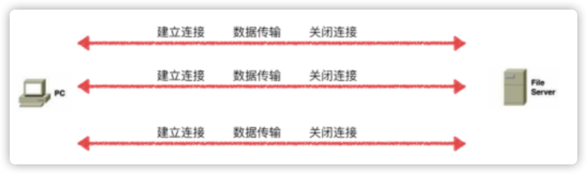​

1. client 向 server 发起连接请求
2. server 接到请求，双方建立连接
3. client 向 server 发送消息
4. server 回应 client
5. 一次读写完成，此时双方任何一个都可以发起 close 操作

#### 持久链接

当请求的资源有很多时，会发生多次的 `TCP`​ 连接和断开过程，增加了通信量的开销。于是产生了持久链接（`HTTP`​ `Persistent`​ `connections`​）。

​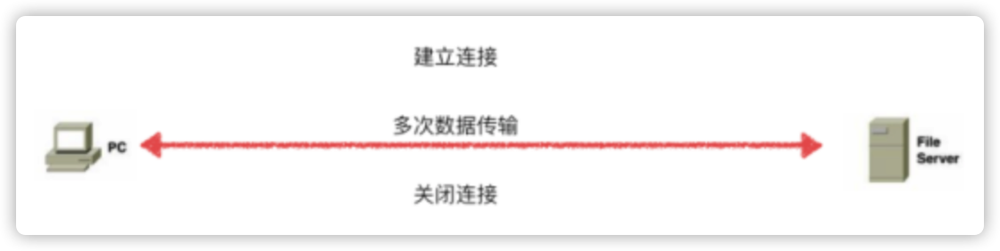​

1. client 向 server 发起连接
2. server 接到请求，双方建立连接
3. client 向 server 发送消息
4. server 回应 client
5. 一次读写完成，连接不关闭
6. 后续读写操作…
7. 长时间操作之后 client 发起关闭请求

**特点：**   只要任意一端没有明确提出断开连接，则保持 `TCP`​ 连接状态。

​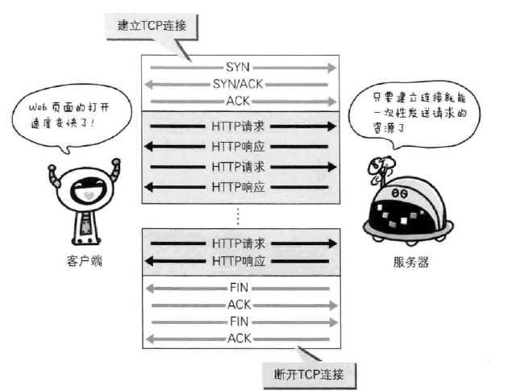​

‍

#### 优缺点分析

1. 长连接可以省去较多的 TCP 建立和关闭的操作，节约时间。但是如果用户量太大容易造成服务器负载过高最终导致服务不可用
2. 短连接对于服务器来说实现起来较为简单，存在的连接都是有用的连接，不需要额外的控制手段。但是如果用户访问量很大, 往往可能在很短时间内需要创建大量的连接，造成服务器响应速度过慢

#### 总结

1. 小的 WEB 网站的 http 服务一般都用短链接，因为长连接对于服务端来说会耗费一定的资源来让套接字保持存活。
2. 对于中大型 WEB 网站一般都采用长连接，好处是响应用户请求的时间更短，用户体验更好，虽然更耗硬件资源一些，但这都不是事儿。另外，数据库的连接用长连接，如果用短连接频繁的通信会造成 socket 错误。

### 管线化

  持久化连接需要等待上一个发送请求得到响应之后才能发送下一个请求，但是管线化技术可以直接发送，这样就能同时并发发送多个请求。

​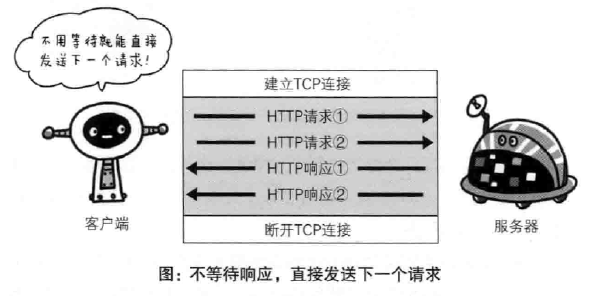​

## 使用 **Cookie** 的状态管理

  状态管理。为了解决 `HTTP`​ 的无状态，`Cookie`​ 技术通过在请求和响应报文中写入 `Cookie`​ 信息来控制客户端的状态。具体实现是 `Cookie`​ 根据响应报文内 `Set-Cookie`​ 的首部字段信息，通知客户端保存 `Cookie`​，当下一次再像**该**服务器发送请求，客户端会自动在请求报文中添加 `Cookie`​ 值后发送。服务端发现客户端发送的 `Cookie`​ 后，回去检查对比记录，得到状态信息。

​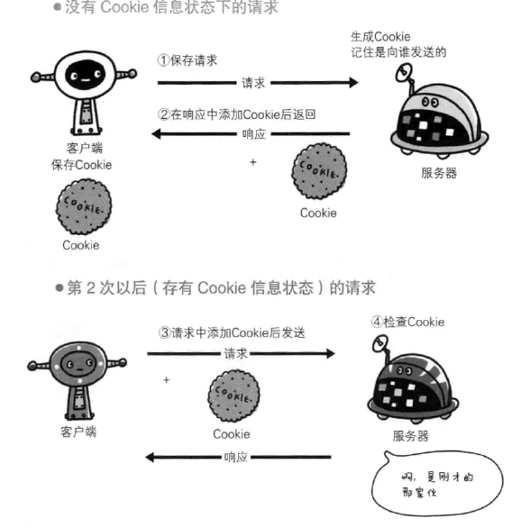​
