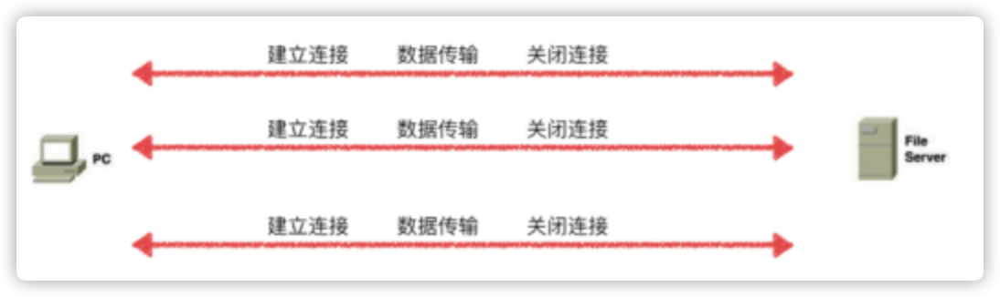
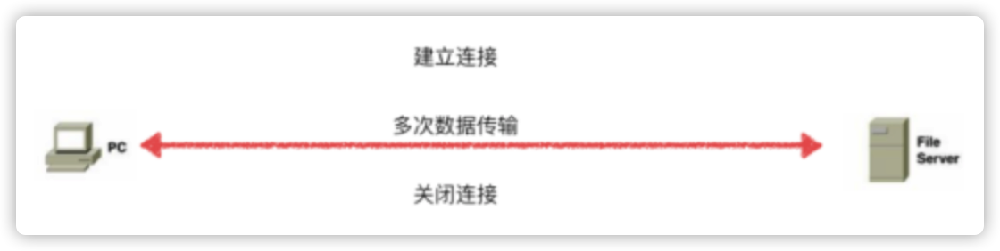

---

title: 网络通信-长连接与短连接  
category: [Introduce]  
tag: [http]  
abbrlink: '97529371'  
date: 2020-08-16 18:27:27  
updated: 2023-03-02 14:45:52

---

简单介绍长连接与短连接的优缺点。

## 短连接

1. client 向 server 发起连接请求
2. server 接到请求，双方建立连接
3. client 向 server 发送消息
4. server 回应 client
5. 一次读写完成，此时双方任何一个都可以发起 close 操作

## 长连接

1. client 向 server 发起连接
2. server 接到请求，双方建立连接
3. client 向 server 发送消息
4. server 回应 client
5. 一次读写完成，连接不关闭
6. 后续读写操作…
7. 长时间操作之后 client 发起关闭请求

## 优缺点分析

1. 长连接可以省去较多的 TCP 建立和关闭的操作，节约时间。但是如果用户量太大容易造成服务器负载过高最终导致服务不可用
2. 短连接对于服务器来说实现起来较为简单，存在的连接都是有用的连接，不需要额外的控制手段。但是如果用户访问量很大, 往往可能在很短时间内需要创建大量的连接，造成服务器响应速度过慢

## 总结

1. 小的 WEB 网站的 http 服务一般都用短链接，因为长连接对于服务端来说会耗费一定的资源来让套接字保持存活。
2. 对于中大型 WEB 网站一般都采用长连接，好处是响应用户请求的时间更短，用户体验更好，虽然更耗硬件资源一些，但这都不是事儿。另外，数据库的连接用长连接，如果用短连接频繁的通信会造成 socket 错误。
