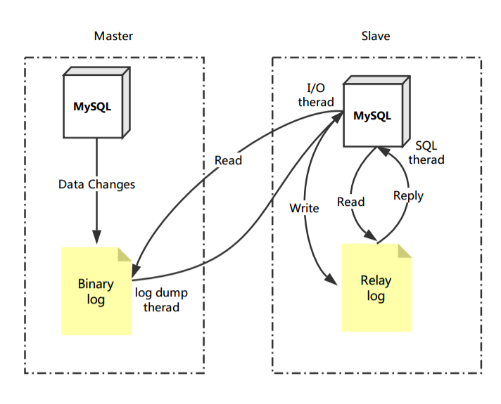

# 主从同步

## 起因

　　1、在业务复杂的系统中，有这么一个情景，有一句sql语句需要锁表，导致暂时不能使用读的服务，那么就很影响运行中的业务，使用主从复制，让主库负责写，从库负责读，这样，即使主库出现了锁表的情景，通过读从库也可以保证业务的正常运作。

　　2、做数据的热备

　　3、架构的扩展。业务量越来越大，I/O访问频率过高，单机无法满足，此时做多库的存储，降低磁盘I/O访问的频率，提高单个机器的I/O性能。

## 概念

　　MySQL 主从复制是指数据可以从一个MySQL数据库服务器主节点复制到一个或多个从节点。MySQL 默认采用异步复制方式，这样从节点不用一直访问主服务器来更新自己的数据，数据的更新可以在远程连接上进行，从节点可以复制主数据库中的所有数据库或者特定的数据库，或者特定的表。

## 原理

1. master服务器将数据的改变记录到二进制日志(binlog)，当master上的数据发生改变时，则将其改变写入二进制日志中；这些记录过程叫做二进制日志事件，binary log events;
2. slave服务器会在一定时间间隔内对master二进制日志进行探测其是否发生改变，如果发生改变，则开始一个I/O Thread请求master二进制事件，同时主节点为每个I/O线程启动一个dump线程，用于向其发送二进制事件，并保存至slave服务器本地的中继日志(relay log)中;
3. slave服务器将启动SQL线程从中继日志中读取二进制日志，将改变应用到自己的数据库中，使得其数据和主节点的保持一致，最后I/O Thread和SQL Thread将进入睡眠状态，等待下一次被唤醒。MySQL复制是异步的且串行化的

　　

　　**也就是说：**

- 从库会生成两个线程,一个I/O线程,一个SQL线程;
- I/O线程会去请求主库的binlog,并将得到的binlog写到本地的relay-log(中继日志)文件中;
- 主库会生成一个log dump线程,用来给从库I/O线程传binlog;
- SQL线程,会读取relay log文件中的日志,并解析成sql语句逐一执行;

　　**注意：**

1. master将操作语句记录到binlog日志中，然后授予slave远程连接的权限（master一定要开启binlog二进制日志功能；通常为了数据安全考虑，slave也开启binlog功能）。
2. slave开启两个线程：IO线程和SQL线程。其中：IO线程负责读取master的binlog内容到中继日志relay log里；SQL线程负责从relay log日志里读出binlog内容，并更新到slave的数据库里，这样就能保证slave数据和master数据保持一致了。
3. Mysql复制至少需要两个Mysql的服务，当然Mysql服务可以分布在不同的服务器上，也可以在一台服务器上启动多个服务。
4. Mysql复制最好确保master和slave服务器上的Mysql版本相同（如果不能满足版本一致，那么要保证master主节点的版本低于slave从节点的版本）
5. master和slave两节点间时间需同步
6. 每个slave只有一个master；
7. 每个master可以有多个salve
8. 每个slave只能有一个唯一的服务器ID
9. 复制的最大问题:延时
10. 在配置同步之前，首先保证**主机**和**从机**数据一致，不一致，先手动操作，保证一致。

## 步骤

1. mysql版本一致且后台以服务运行

   - slave_ip: 192.168.1.47
   - master_ip: 192.168.1.49
2. 主从都配置在[mysqld]结点下，都是小写
3. 主机(windows)修改`my.ini`配置文件

   ```ini
   # [必须]启动主服务器唯一ID
   server-id=1
   # [必须]启用二进制日志 
   # log-bin=自己本地的路径/mysqlbin
   log-bin=D:/software/mysql/8.0.28/data/binlog
   # [可选]根目录
   # basedir="自己本地路径"
   basedir="D:/software/mysql/8.0.28"
   # [可选]临时目录
   # tmpdir="自己本地路径"
   tmpdir="D:/software/mysql/8.0.28"
   # [可选]数据目录
   # datadir="自己本地路径/Data/"
   datadir=D:/software/mysql/8.0.28/data/
   # 主机，读写都可以
   read-only=0 
   # [可选]设置不要复制的数据库
   binlog-ignore-db=mysql
   # [可选]设置需要复制的数据库
   # binlog-do-db=需要复制的主数据库名字
   # binlog-do-db=test01

   ```
4. 从机(linux)修改`/etc/my.cnf`配置文件

   ```ini
   # [必须]从服务器唯一ID
   server-id=2
   # [可选]启用二进制日志
   log-bin=binlog
   ```
5. 因修改过配置文件，请主机+从机都重启后台mysql服务

   ```shell
   service mysql stop
   service mysql start
   ```
6. 主机、从机都需要关闭防火墙

   ```shell
   # windows 手动关闭
   # Linux命令关闭
   service iptables stop
   ```
7. 在master上建立帐户并授权slave

   ```sql
   # 先创建一个用户，用来让从机访问主机的
   create user 'liusf'@'%' identified with mysql_native_password BY '123456';
   # 授权 从机 同步主机的权限
   GRANT REPLICATION SLAVE ON *.* TO 'liusf'@'%';
   # % 代表任意ip的主机都可以访问主机，如果考虑安全，可以指明特定从机的ip
   # 刷新权限
   flush privileges;
   ```
   ```sql
   mysql> show master status;
   +---------------+----------+--------------+------------------+-------------------+
   | File          | Position | Binlog_Do_DB | Binlog_Ignore_DB | Executed_Gtid_Set |
   +---------------+----------+--------------+------------------+-------------------+
   | binlog.000014 |     4381 |              |                  |
       |
   +---------------+----------+--------------+------------------+-------------------+
   1 row in set (0.03 sec)
   ```
   记录下File和Position的值
8. 在Linux从机上配置需要复制的主机

   ```sql
   # 指定从机复制主机所需的参数，这一步就是上一步的参数， 
   CHANGE MASTER TO MASTER_HOST='192.168.1.47', MASTER_USER='liusf', MASTER_PASSWORD=' 123456', MASTER_LOG_FILE='binlog.000003', MASTER_LOG_POS=2720;
   # 启动从服务器复制功能
   start slave;
   # 查看从机配置状态
   show slave status;
   # 下面两个参数都是Yes，则说明主从配置成功！
   # Slave_IO_Running: Yes
   # Slave_SQL_Running: Yes
   ```
   > 如果参数`Slave_IO_Running`和`Slave_SQL_Running`不是都为Yes
   >

   需要在从机上运行`stop slave;`命令停止同步;

   再在主机上使用命令`show master status;`重新查询master status，用新的参数在从机上重新配置

   > 如果参数`Slave_IO_Running`和`Slave_SQL_Running`全是Yes,但是从机并没有同步主机数据
   >

   需要在从机上运行`stop slave;`命令停止同步;

   将主机上的数据导出为SQL脚本，在从机上执行，保证在同步之前，从机和主机数据一致;

   最后，重新配置同步即可;
