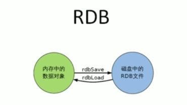
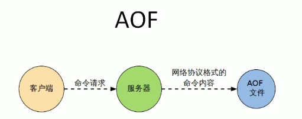

# 持久化

Redis是一个内存数据库，数据保存在内存中，但是我们都知道内存的数据变化是很快的，也容易发生丢失。幸好Redis还为我们提供了持久化的机制，分别是RDB(Redis DataBase)和AOF(Append Only File)。

## RDB

RDB(Redis DataBase): 在指定的时间间隔内将内存中的数据集快照写入磁盘，也就是行话讲的Snapshot快照，它是默认的持久化方式，这种方式是就是将内存中数据以快照的方式写入到二进制文件中，默认的文件名为dump.rdb。它恢复时是将快照文件直接读到内存里。

Redis会单独创建（fork）一个子进程来进行持久化，会先将数据写入到一个临时文件中，待持久化过程都结束了，再用这个临时文件替换上次持久化好的文件。

整个过程中，主进程是不进行任何IO操作的，这就确保了极高的性能。如果需要进行大规模数据的恢复，且对于数据恢复的完整性不是非常敏感，那RDB方式要比AOF方式更加的高效。RDB的缺点是最后一次持久化后的数据可能丢失。

Fork的作用是复制一个与当前进程一样的进程。新进程的所有数据（变量、环境变量、程序计数器等）数值都和原进程一致，但是是一个全新的进程，并作为原进程的子进程

> 如何触发RDB快照

- 配置文件中默认的快照配置，然后需要冷拷贝后重新使用，也就是将备份文件复制到另一物理机上，防止硬件损坏
- 命令`save`或`bgsave`触发，生成备份文件

  - Save: `save`时只管保存，其它不管，全部阻塞
  - BGSAVE: Redis会在后台异步进行快照操作，快照同时还可以响应客户端请求。可以通过lastsave
    命令获取最后一次成功执行快照的时间
- 执行`flushall`命令，也会产生`dump.rdb`文件，但里面是空的，无意义

> 异常文件修复

```shell
root@XTZJ-20220305QE:/var/lib/redis# redis-check-rdb dump.rdb
[offset 0] Checking RDB file dump.rdb
[offset 26] AUX FIELD redis-ver = '4.0.9'
[offset 40] AUX FIELD redis-bits = '64'
[offset 52] AUX FIELD ctime = '1649088861'
[offset 67] AUX FIELD used-mem = '803576'
[offset 83] AUX FIELD aof-preamble = '0'
[offset 85] Selecting DB ID 0
[offset 121] Checksum OK
[offset 121] \o/ RDB looks OK! \o/
[info] 4 keys read
[info] 0 expires
[info] 0 already expired
```

> 如何恢复

- 将备份文件（dump.rdb）移动到redis安装目录并启动服务即可
- `CONFIG GET dir`获取工作目录

> 优势

- 适合大规模的数据恢复，对数据完整性和一致性要求不高

> 劣势

- 在一定间隔时间做一次备份，所以如果redis意外down掉的话，就会丢失最后一次快照后的所有修改
- Fork的时候，内存中的数据被克隆了一份，大致2倍的膨胀性需要考虑

> 如何停止

动态所有停止RDB保存规则的方法：命令修改：`config set save ""`

> 小结



- RDB是一个非常紧凑的文件
- RDB在保存RDB文件时，父进程唯一需要做的就是fork出一个子进程，接下来的工作全部由子进程来做，父进程不需要再做其他IO操作，所以RDB持久化方式可以最大化redis的性能
- 与AOF相比，在恢复大的数据集的时候，RDB方式会更快一些
- 数据丢失风险大
- RDB需要经常fork子进程来保存数据集到硬盘上，当数据集比较大的时候，fork的过程是非常耗时的，可能会导致Redis在一些毫秒级不能相应客户端请求。

## AOF

AOF(Append Only File):以日志的形式来记录每个写操作，将Redis执行过的所有写指令记录下来（读操作不记录），只许通加文件但不可以改写文件，redis启动之初会读取该文件重新构建数据，换言之，redis重启的话就根据日志文件的内容将写指令从前到后执行一次以完成数据的恢复工作

Aof保存的是`appendonly.aof`文件。

> AOF启动/恢复

- 正常恢复

  - 启动：设置Yes
  - 将有数据的aof文件(`config get dir`)复制一份保存到对应目录
  - 恢复：重启redis然后重新加载

> 异常文件修复

```shell
root@XTZJ-20220305QE:/var/lib/redis# redis-check-aof --fix appendonly.aof
0x              87: Expected prefix '*', got: 'd'
AOF analyzed: size=157, ok_up_to=135, diff=22
This will shrink the AOF from 157 bytes, with 22 bytes, to 135 bytes
Continue? [y/N]: y
Successfully truncated AOF
```

> Rewrite

**概念**

AOF采用文件追加方式，文件会越来越大为避免出现此种情况，新增了重写机制，当AOF文件的大小超过所设定的阈值时，Redis就会启动AOF文件的内容压缩，只保留可以恢复数据的最小指令集，可以使用命令`bgrewriteaof`

**原理**

AOF文件持续增长而过大时，会fork出一条新进程来将文件重写（也是先写临时文件最后再rename），遍历新进程的内存中数据，每条记录有一条的Set语句。重写aof文件的操作，并没有读取旧的aof文件，而是将整个内存中的数据库内容用命令的方式重写了一个新的aof文件，这点和快照有点类似

**触发机制**

Redis会记录上次重写时的AOF大小，默认配置是当AOF文件大小是上次rewrite后大小的一倍且文件大于64M时触发

> 优势

每秒同步： appendfsync always 同步持久化每次发生数据变更会被立即记录到磁盘 性能较差但数据完整性比较好
每修改同步： appendfsync everysec 异步操作，每秒记录 如果一秒内宕机，有数据丢失
不同步： appendfsync no 从不同步

> 劣势

相同数据集的数据而言aof文件要远大于rdb文件，恢复速度慢于rdb Aof运行效率要慢于rdb

每秒同步策略效率较好，不同步效率和rdb相同

> 小结



- AOF文件时一个只进行追加的日志文件
- Redis可以在AOF文件体积变得过大时，自动地在后台对AOF进行重写
- AOF文件有序地保存了对数据库执行的所有写入操作，这些写入操作以Redis协议的格式保存，因此AOF文件的内容非常容易被人读懂对文件进行分析也很轻松
- 对于相同的数据集来说，AOF文件的体积通常要大于RDB文件的体积
- 根据所使用的fsync策略，AOF的速度可能会慢于RDB

## 总结

> which one?

RDB持久化方式能够在指定的时间间隔能对你的数据进行快照存储

AOF持久化方式记录每次对服务器写的操作，当服务器重启的时候会重新执行这些命令来恢复原始的数据，AOF命令以redis协议追加保存每次写的操作到文件末尾，Redis还能对AOF文件进行后台重写，使得AOF文件的体积不至于过大

只做缓存：如果你只希望你的数据在服务器运行的时候存在，你也可以不使用任何持久化方式。

同时开启两种持久化方式
在这种情况下，**当redis重启的时候会优先载入AOF文件来恢复原始的数据**，因为在通常情况下AOF文件保存的数据集要比RDB文件保存的数据集要完整。

RDB的数据不实时，同时使用两者时服务器重启也只会找AOF文件。**那要不要只使用AOF呢？作者建议不要**，因为RDB更适合用于备份数据库（AOF在不断变化不好备份），快速重启，而且不会有AOF可能潜在的bug，留着作为一个万一的手段。

> 性能建议

因为RDB文件只用作后备用途，建议只在Slave上持久化RDB文件，而且只要15分钟备份一次就够了，只保留save 900 1这条规则。

如果Enalbe AOF，好处是在最恶劣情况下也只会丢失不超过两秒数据，启动脚本较简单只load自己的AOF文件就可以了。代价一是带来了持续的IO，二是AOF rewrite的最后将rewrite过程中产生的新数据写到新文件造成的阻塞几乎是不可避免的。只要硬盘许可，应该尽量减少AOF rewrite的频率，AOF重写的基础大小默认值64M太小了，可以设到5G以上。默认超过原大小100%大小时重写可以改到适当的数值。

如果不Enable AOF，仅靠Master-Slave Replication实现高可用性也可以，能省掉一大笔IO也减少了rewrite时带来的系统波动，代价是如果Master/Slave同时倒掉，会丢失十几分钟的数据，启动脚本也要比较两个Master/Slave中的RDB文件，载入较新的那个。新浪微博就选用了这种架构

‍
