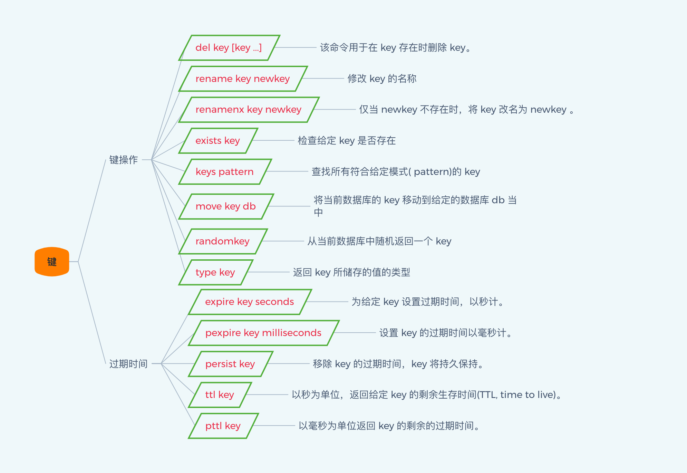
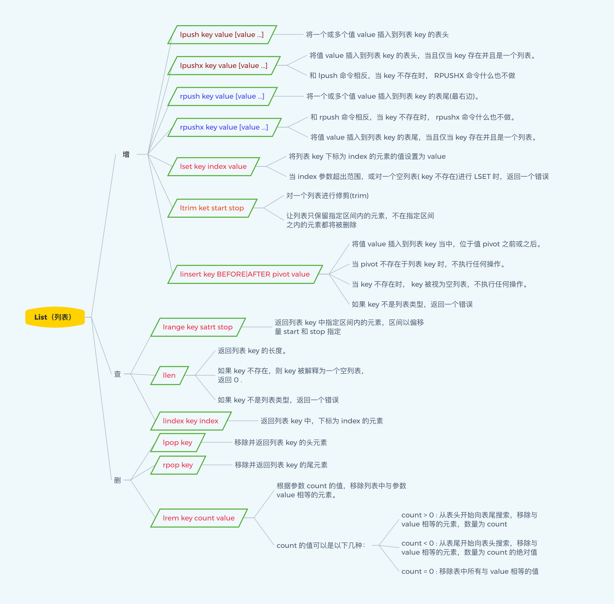
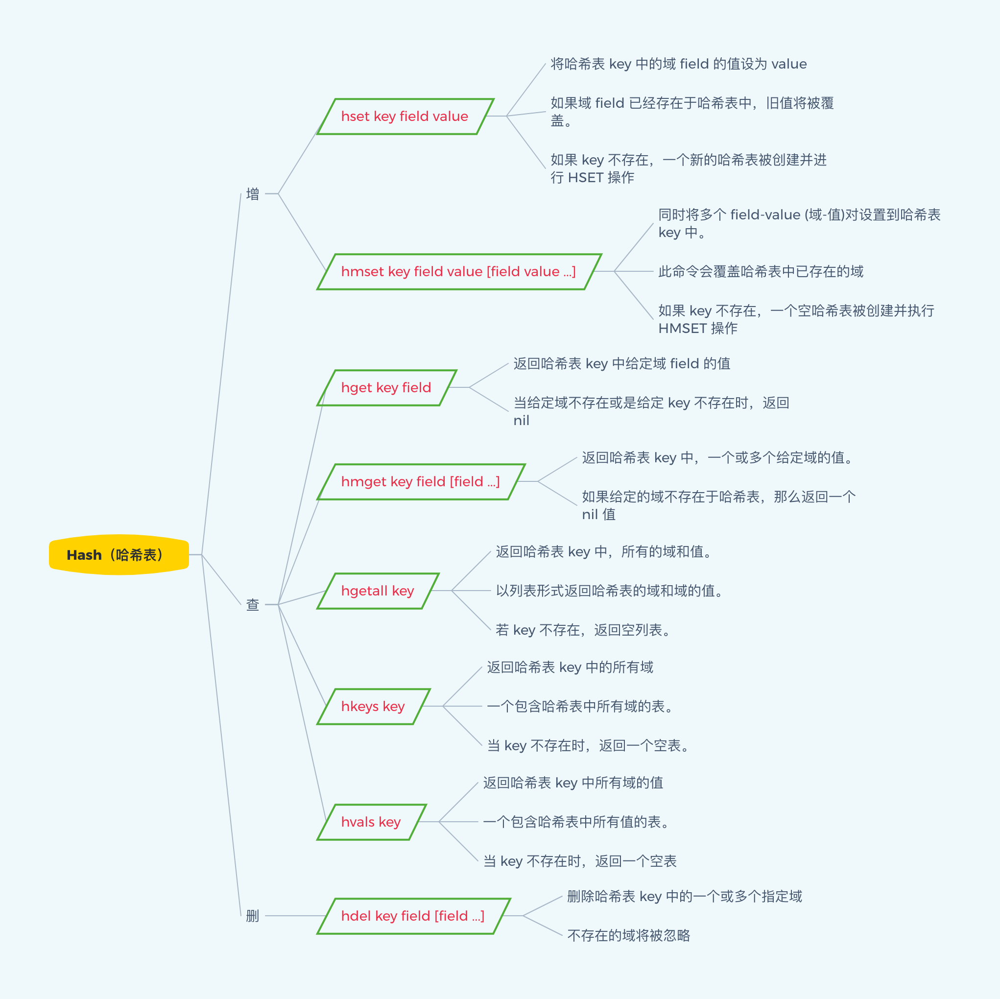

## 全局命令

​​

```shell
127.0.0.1:6379> ping  # 测试是否连接某个redis服务
PONG
127.0.0.1:6379> FLUSHDB  # 清空当前库
OK

127.0.0.1:6379> FLUSHALL  # 清空所有库
OK

127.0.0.1:6379> select 1  # 切换库，库索引0-15，共16个库
OK

127.0.0.1:6379[1]> dbsize  # 查看当前键的数量
(integer) 0

127.0.0.1:6379> keys *  # 查看所有的键
(empty list or set)

127.0.0.1:6379> set k1 1  # 插入字符串类型的键值对
OK
127.0.0.1:6379> set k2 2
OK
127.0.0.1:6379> set k3 3
OK

127.0.0.1:6379> exists k1  # 判断键是否存在，键存在，返回1，否则，返回0
(integer) 1
127.0.0.1:6379> EXISTS k3
(integer) 0

127.0.0.1:6379> move k2 2  # 将键移到另外的库
(integer) 1

127.0.0.1:6379> expire k1 200  # 给键设置过期时间，键存在设置成功，返回1；否则，返回0
(integer) 1
127.0.0.1:6379> expire k2 200
(integer) 0

127.0.0.1:6379> ttl k1  # 返回键的过期时间，键不存在，返回-2，键没有设置过期时间，返回-1
(integer) 194
127.0.0.1:6379> ttl k2
(integer) -2
127.0.0.1:6379> ttl k3
(integer) -1

127.0.0.1:6379> type k1  # 查看键的数据类型，键不存在，返回none
string
127.0.0.1:6379> type k2
none

127.0.0.1:6379> del k3  # 删除键。存在键删除成功，返回1,；否则，返回0；
(integer) 1
127.0.0.1:6379> del k2
(integer) 0
127.0.0.1:6379> del k1 k4 k5  # 同样，后面可以跟多个键，同时删除，返回删除成功的个数
(integer) 1
```

## 字符串

> String（字符串）

string是redis最基本的类型，你可以理解成与Memcached一模一样的类型，一个key对应一个value。

string类型是二进制安全的。意思是redis的string可以包含任何数据。比如jpg图片或者序列化的对象。

string类型是Redis最基本的数据类型，一个redis中字符串value最多可以是512M。

​​

**单值单value**

> 设置、获取字符串类型的值

```shell
127.0.0.1:6379> set k1 1  # 给键设置值，无论键是否存在，都可以成功
OK
127.0.0.1:6379> get k1  # 获取键对应的值，键不存在，返回none
"1"
127.0.0.1:6379> append k1 234  # 在键对应的值后面追加值，无论建是否存在
(integer) 4
127.0.0.1:6379> get k1
"1234"
127.0.0.1:6379> strlen k1  # 得到字符串的长度，键不存在，返回none
(integer) 4

127.0.0.1:6379> getrange k1 1 3  # 根据指定的范围获取对应得值
"234"
127.0.0.1:6379> setrange k1 0 xxx  # 从指定的下标开始设置值
(integer) 4
127.0.0.1:6379> get k1
"xxx4"
```

> 当键对应得值是数字时，可以对键进行自增、自减操作

```shell
127.0.0.1:6379> flushdb
OK
127.0.0.1:6379> set k3 3
OK

127.0.0.1:6379> incr k3  # 对键的值自增1
(integer) 4
127.0.0.1:6379> incr k3
(integer) 5
127.0.0.1:6379> decr k3  # 对键的值自减1
(integer) 4
127.0.0.1:6379> decr k3
(integer) 3
127.0.0.1:6379> incrby k3 3  # 按照指定的值对键对应得值进行自增
(integer) 6
127.0.0.1:6379> decrby k3 2  # 按照指定的值对键对应得值进行自减
(integer) 4

127.0.0.1:6379> get k3
"4"
```

> set命令有几个选项：

- ex seconds：为键设置秒级过期时间。
- px milliseconds：为键设置毫秒级过期时间。
- nx：键必须不存在，才可以设置成功，用于添加。
- xx：与nx相反，键必须存在，才可以设置成功，用于更新。

```shell
127.0.0.1:6379> flushdb
OK
127.0.0.1:6379> set k1 1 ex 100 nx  # 设置键对应得值，同时设置过期时间为100s，且键存在，不能设置
OK
127.0.0.1:6379> set k1 1 ex 100 nx
(nil)
127.0.0.1:6379> ttl k1
(integer) 92
127.0.0.1:6379> get k1
"1"

127.0.0.1:6379> set k1 11 px 100000 xx  # 设置键对应的值，同时设置过期时间为100000毫秒，即100秒，且键不存在，不能设置
OK
127.0.0.1:6379> set k11 11 px 100000 xx
(nil)
127.0.0.1:6379> get k1
"11"
127.0.0.1:6379> ttl k1
(integer) 91
```

> 除了`set`选项，Redis还提供了`setex`和`setnx`两个命令

```shell
127.0.0.1:6379> flushdb
OK

127.0.0.1:6379> setex k1 10 1  # 设置键的值得同时，还设置过期时间10s
OK

127.0.0.1:6379> setnx k1 1  # 设置键对应的值，但是只有键不存在，才能设置成功
(integer) 1
127.0.0.1:6379> get k1
"1"
127.0.0.1:6379> setnx k1 1
(integer) 0

127.0.0.1:6379> mset k1 1 k2 2 k3 3  #同时设置多个键值对
OK
127.0.0.1:6379> keys *
1) "k1"
2) "k2"
3) "k3"

127.0.0.1:6379> msetnx k3 3 k4 4  # 只有键都不存在，才可以设置成功，任务一个键存在，都设置失败
(integer) 0
127.0.0.1:6379> msetnx k4 4 k5 5
(integer) 1
```

## 列表

> **List（列表）**

Redis 列表是简单的字符串列表，按照插入顺序排序。你可以添加一个元素导列表的头部（左边）或者尾部（右边）。  
它的底层实际是个链表。

​​

**单值多value**

> 设置、获取列表类型的值

```shell
127.0.0.1:6379> flushdb
OK

127.0.0.1:6379> lpush list01 1 2 3 4 5 # 在列表的头部插入数据
(integer) 5
127.0.0.1:6379> lrange list01 0 -1  # 根据指定的下标返回区间内的数据
1) "5"
2) "4"
3) "3"
4) "2"
5) "1"
127.0.0.1:6379> rpush list02 1 2 3 4 5  # 在列表的尾部追加数据
(integer) 5
127.0.0.1:6379> lrange list02 0 -1
1) "1"
2) "2"
3) "3"
4) "4"
5) "5"

127.0.0.1:6379> llen list01 # 获取列表的长度
(integer) 5
127.0.0.1:6379> lindex list01 0  # 获取列表指定下标的值，不存在，则为none
"5"
127.0.0.1:6379> lindex list01 1
"4"
127.0.0.1:6379> lindex list01 11
(nil)
```

> 删除列表的数据

```shell
127.0.0.1:6379> lpop list02  # 从队头删除数据
"1"
127.0.0.1:6379> rpop list02 # 从队尾删除数据
"5"
127.0.0.1:6379> lrange list02 0 -1
1) "2"
2) "3"
3) "4"
```

> 移除n个指定值的元素

```shell
127.0.0.1:6379> FLUSHDB
OK
127.0.0.1:6379> rpush list01 3 4 3 3 5
(integer) 5
127.0.0.1:6379> lrange list01 0 -1
1) "3"
2) "4"
3) "3"
4) "3"
5) "5"
127.0.0.1:6379> lrem list01 2 3
(integer) 2
127.0.0.1:6379> lrange list01 0 -1
1) "4"
2) "3"
3) "5"
```

> 只保留指定区间内的元素，其余元素舍弃

```shell
127.0.0.1:6379> FLUSHDB
OK
127.0.0.1:6379> rpush list01 1 2 3 4 5 6
(integer) 6
127.0.0.1:6379> lrange list01 0 -1
1) "1"
2) "2"
3) "3"
4) "4"
5) "5"
6) "6"
127.0.0.1:6379> ltrim list01 2 5  # 保留下标2-5区间内的元素，即保留3 4 5 6 
OK
127.0.0.1:6379> lrange list01 0 -1
1) "3"
2) "4"
3) "5"
4) "6"
```

> 从源列表的尾部弹出元素，插入到目的列表的头部

```shell
127.0.0.1:6379> FLUSHDB
OK
127.0.0.1:6379> rpush l1 1 2
(integer) 2
127.0.0.1:6379> rpush l2 a1 a2
(integer) 2
127.0.0.1:6379> lrange l1 0 -1
1) "1"
2) "2"
127.0.0.1:6379> lrange l2 0 -1
1) "a1"
2) "a2"
127.0.0.1:6379> rpoplpush l1 l2
"2"
127.0.0.1:6379> lrange l1 0 -1
1) "1"
127.0.0.1:6379> lrange l2 0 -1
1) "2"
2) "a1"
3) "a2"
```

> 修改列表中指定下标的值

```shell
127.0.0.1:6379> lrange l2 0 -1
1) "2"
2) "a1"
3) "a2"
127.0.0.1:6379> lset l2 0 22
OK
127.0.0.1:6379> lrange l2 0 -1
1) "22"
2) "a1"
3) "a2"
```

> 在指定元素后面插入新的值

```shell
127.0.0.1:6379> lrange l2 0 -1
1) "22"
2) "a1"
3) "a2"
127.0.0.1:6379> linsert l2 before 22 python
(integer) 4
127.0.0.1:6379> lrange l2 0 -1
1) "python"
2) "22"
3) "a1"
4) "a2"
127.0.0.1:6379> linsert l2 after 22 vue
(integer) 5
127.0.0.1:6379> lrange l2 0 -1
1) "python"
2) "22"
3) "vue"
4) "a1"
5) "a2"
```

> 小结

列表是一个字符串链表，left、right都可以添加；

如果键不存在，创建新的链表；

如果键已存在，新增内容；

如果值全移除，则键也消失；

链表的操作无论是头和尾哪一端效率都极高，但假如是对中间元素操作，效率就极低。

## 集合

> Set（集合）

Redis的Set是string类型的无序集合。它是通过HashTable实现实现的

​​

**单值多value**

> 设置、获取集合类型的值

```shell
127.0.0.1:6379> FLUSHDB
OK
127.0.0.1:6379> sadd set01 1 1 2 2 2 3  # 向集合中添加多个值，集合会自动去重
(integer) 3
127.0.0.1:6379> smembers set01  # 获取集合中所有的元素
1) "1"
2) "2"
3) "3"

127.0.0.1:6379> sismember set01 3  # 判断元素是否为集合中的成员，是返回1，否则返回0
(integer) 1
127.0.0.1:6379> sismember set01 4
(integer) 0

127.0.0.1:6379> scard set01  # 返回集合中的元素个数
(integer) 3

127.0.0.1:6379> srandmember set01 1 # 随机返回结集合中1个整数
1) "1"
```

> 删除集合的元素

```shell
127.0.0.1:6379> srem set01 3  # 删除集合中指定的元素，成功，返回1，否则，返回0
(integer) 1

127.0.0.1:6379> spop set01 1 # 随机从集合中删除n个元素
1) "1"
127.0.0.1:6379> spop set01 1
1) "2"
```

> 将源集合的一个元素移到目的集合

```shell
127.0.0.1:6379> FLUSHDB
OK
127.0.0.1:6379> sadd set01 1 2 3 4
(integer) 4
127.0.0.1:6379> sadd set02 11 22 33 44
(integer) 4
127.0.0.1:6379> smove set01 set02 1
(integer) 1
127.0.0.1:6379> smembers set02
1) "1"
2) "11"
3) "22"
4) "33"
5) "44"
```

> 数学运算

```shell
127.0.0.1:6379> FLUSHDB
OK
127.0.0.1:6379> sadd set01 1 2 3 4 5
(integer) 5
127.0.0.1:6379> sadd set02 3 4 5 6 7
(integer) 5
127.0.0.1:6379> sdiff set01 set02  # 求差集，即只在第一个元素，不在其余任何一个集合的元素
1) "1"
2) "2"
127.0.0.1:6379> sinter set01 set02  # 求交集，即所有集合中都有的元素
1) "3"
2) "4"
3) "5"
127.0.0.1:6379> sunion set01 set02  # 求并集，即包含所有集合元素的大集合
1) "1"
2) "2"
3) "3"
4) "4"
5) "5"
6) "6"
7) "7"
```

## 哈希

> Hash（哈希）

Redis hash是一个键值对集合。

Redis hash是一个string类型的field和value的映射表，hash特别适合用于存储对象。

**KV模式不变，但V是一个键值对**

​​

> 设置、获取哈希类型的值

```shell
127.0.0.1:6379> FLUSHDB
OK
127.0.0.1:6379> hset user id 1  # 在user对应的值中存入一个键值对
(integer) 1
127.0.0.1:6379> hget user id  # 从user中存储的键值对中获取固定字段的值
"1"
127.0.0.1:6379> hset user name z3
(integer) 1
127.0.0.1:6379> hget user name
"z3"

127.0.0.1:6379> hmset user02 id 2 name l4  # 在user对应的值中存入多个键值对
OK
127.0.0.1:6379> hmget user02 id name  # 从user中存储的键值对中获取多个字段的值
1) "2"
2) "l4"
127.0.0.1:6379> hgetall user02  #  # 从user中存储的键值对中获取全部字段的值
1) "id"
2) "2"
3) "name"
4) "l4"

127.0.0.1:6379> hkeys user02  # 获取所有字段
1) "name"
2) "id"
127.0.0.1:6379> hvals user02  # 获取所有字段对应的值
1) "l4"
2) "2"
```

> 从存储的键值对中删除特定的字段

```shell
127.0.0.1:6379> hgetall user02
1) "id"
2) "2"
3) "name"
4) "l4"
127.0.0.1:6379> hdel user02 id
(integer) 1
127.0.0.1:6379> hgetall user02
1) "name"
2) "l4"
```

> 判断某个字段是否存在

```shell
127.0.0.1:6379> hlen user02  # 获取存储的键值对个数
(integer) 2

127.0.0.1:6379> hexists user02 age  # 判断某个字段是否存在
(integer) 0
127.0.0.1:6379> hexists user02 name
(integer) 1
```

> 对某个字段的值进行增加

```shell
127.0.0.1:6379> hmset user02 age 20 score 99.5
OK
127.0.0.1:6379> hincrby user02 age 1
(integer) 21
127.0.0.1:6379> hincrbyfloat user02 score 0.5
"100"
```

> 在哈希对象中判断是否添加某个字段

```shell
127.0.0.1:6379> hsetnx user02 age 30  # 添加字段时，如果存在，不能重复添加，不存在，则添加成功
(integer) 0
127.0.0.1:6379> hsetnx user02 email lisi@163.com
(integer) 1
```

## 有序集合

> zset（sorted set：有序集合）

Redis zset和set一样也是string类型元素的集合，且不允许重复的成员。

不同的是每个元素都会关联一个double类型的分数。

redis正是通过分数来为集合中的成员进行从小到大的排序。zset的成员是唯一的，但分数（score）却可以重复。

​​

> 在set基础上，加一个score值之前set是k1 v1 v2 v3，现在zset是k1 score1 v1 score2 v2

```shell
127.0.0.1:6379> zadd zset01 60 v1 70 v2 80 v3 90 v4 100 v5
(integer) 5
127.0.0.1:6379> zrange zset01 0 -1  # 按照指定的下标范围展示元素
1) "v1"
2) "v2"
3) "v3"
4) "v4"
5) "v5"
127.0.0.1:6379> zrange zset01 0 -1 withscores  # 按照指定的下标范围展示元素和对应的分数
 1) "v1"
 2) "60"
 3) "v2"
 4) "70"
 5) "v3"
 6) "80"
 7) "v4"
 8) "90"
 9) "v5"
10) "100"

127.0.0.1:6379> zrangebyscore zset01 60 90  # 按照指定的分数范围展示元素
1) "v1"
2) "v2"
3) "v3"
4) "v4"
127.0.0.1:6379> zrangebyscore zset01 60 90 withscores  # 按照指定的分数范围展示元素和对应的分数
1) "v1"
2) "60"
3) "v2"
4) "70"
5) "v3"
6) "80"
7) "v4"
8) "90"
```

> 分页

```shell
# 每次两条数据，偏移0条，即第一页
127.0.0.1:6379> zrangebyscore zset01 60 90 withscores limit 0 2
1) "v1"
2) "60"
3) "v2"
4) "70"
# 每次两条数据，偏移2条，即第二页
127.0.0.1:6379> zrangebyscore zset01 60 90 withscores limit 2 2
1) "v3"
2) "80"
3) "v4"
4) "90"
```

> 删除元素

```shell
127.0.0.1:6379> zrem zset01 v5  # 删除有序集合中的特定元素
(integer) 1
127.0.0.1:6379> zrange zset01 0 -1
1) "v1"
2) "v2"
3) "v3"
4) "v4"
```

> 集合元素统计

```shell
127.0.0.1:6379> zcard zset01  # 统计有序集合中元素的个数
(integer) 4
127.0.0.1:6379> zcount zset01 60 80 # 统计指定分数范围内的元素个数
(integer) 3
127.0.0.1:6379> zrank zset01 v4  # 获取指定元素的下标
(integer) 3
127.0.0.1:6379> zscore zset01 v4  # 获取指定元素的分数
"90"
```

> 倒序处理

```shell
127.0.0.1:6379> zrange zset01 0 -1 withscores
1) "v1"
2) "60"
3) "v2"
4) "70"
5) "v3"
6) "80"
7) "v4"
8) "90"

127.0.0.1:6379> zrevrank zset01 v4  # 获得元素的倒序下标
(integer) 0

127.0.0.1:6379> zrevrange zset01 0 -1  # 获取指定下标区间内，元素的倒序输出
1) "v4"
2) "v3"
3) "v2"
4) "v1"

127.0.0.1:6379> zrevrangebyscore zset01 90 60  # 获取指定分数区间内，按照降序分数的元素展示
1) "v4"
2) "v3"
3) "v2"
4) "v1"
```

更多命令参考[Redis教程](https://cloud.tencent.com/developer/doc/1203)
