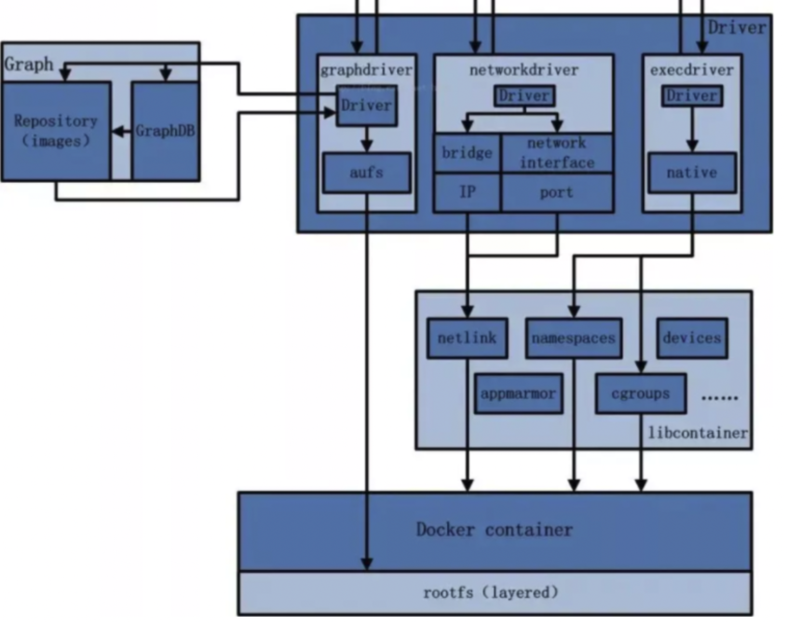
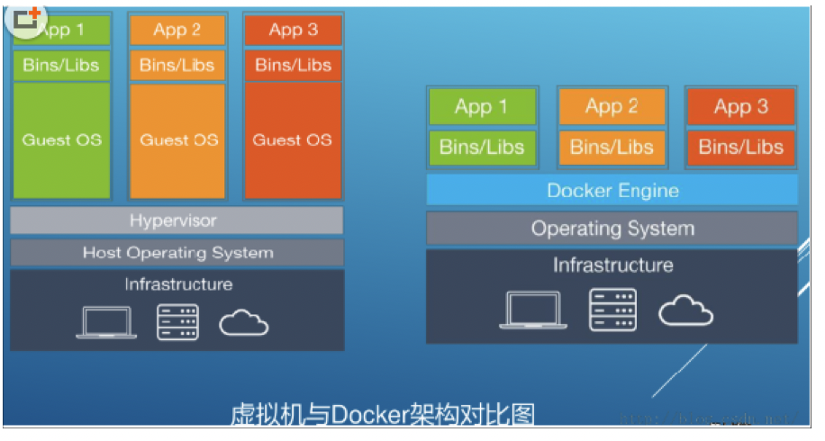

# Docker安装

### Docker的基本组成

#### 镜像（image）

Docker 镜像（Image）就是一个 **只读** 的模板。镜像可以用来创建 Docker 容器， 一个镜像可以创建很多容器 。

它也相当于是一个root文件系统。比如官方镜像 centos:7 就包含了完整的一套 centos:7 最小系统的 root 文件系统。

相当于容器的“源代码”， docker镜像文件类似于Java的类模板，而docker容器实例类似于由类new出来的实例对象。

#### 容器（container）

* **从面向对象角度**

Docker 利用容器（Container）独立运行的一个或一组应用，应用程序或服务运行在容器里面；容器就类似于一个虚拟化的运行环境， 容器是用镜像创建的运行实例 。

就像是Python中的类和实例对象一样，镜像是静态的定义，容器是镜像运行时的实体。

容器为镜像提供了一个标准的和隔离的运行环境 ，它可以被启动、开始、停止、删除。

每个容器都是相互隔离的、保证安全的平台

* **从镜像容器角度**

**可以把容器看做是一个简易版的** **Linux** **环境** （包括root用户权限、进程空间、用户空间和网络空间等）和运行在其中的应用程序。

#### 仓库（repository）

仓库（Repository）是 集中存放镜像 文件的场所；类似于github仓库，存放各种git项目的地方。

Docker公司提供的官方`registry`​被称为Docker Hub，存放各种镜像模板的地方。

仓库分为公开仓库（Public）和私有仓库（Private）两种形式。

​最大的公开仓库是 Docker Hub([https://hub.docker.com/](https://hub.docker.com/)) ，存放了数量庞大的镜像供用户下载。

国内的公开仓库包括阿里云 、网易云等

#### 总结

> **需要正确的理解仓库/镜像/容器这几个概念:**

Docker 本身是一个容器运行载体或称之为管理引擎。

把应用程序和配置依赖打包好形成一个可交付的运行环境，这个打包好的运行环境就是image镜像文件。​

只有通过这个镜像文件才能生成Docker容器实例(类似由类new出来一个对象)。

image文件可以看作是容器的模板。Docker 根据 image 文件生成容器的实例。同一个 image 文件，可以生成多个同时运行的容器实例。

> **镜像文件**

image 文件生成的容器实例，本身也是一个文件，称为镜像文件。

> **容器实例**

一个容器运行一种服务，当我们需要的时候，就可以通过docker客户端创建一个对应的运行实例，也就是我们的容器 。

> **仓库**

就是放一堆镜像的地方，我们可以把镜像发布到仓库中，需要的时候再从仓库中拉下来就可以了。

### Docker平台架构图解（入门版）

​​​​

#### Docker工作原理

Docker是一个Client-Server结构的系统，Docker守护进程运行在主机上， 然后通过Socket连接从客户端访问，守护进程从客户端接受命令并管理运行在主机上的容器 。 

容器，是一个运行时环境，就是我们前面说到的集装箱。

​​

#### 整体架构及底层通信原理简述

Docker是一个C/S模式的架构，后端是一个松耦合架构，众多模块各司其职

#### Docker运行的基本流程为：

1. ​用户是使用Docker Client 与Docker Daemon 建立通信，并发送请求给后者。​
2. Docker Daemon 作为Docker架构中的主体部分，首先提供Docker Server 的功能时期可以接受 Docker Client的请求。
3. Docker Engine 执行Docker内部的一些列工作，每一项工作都是以一个Job的形式的存在。
4. Job的运行过程中，当需要容器镜像是，则从Docker Register中下载镜像，并通过镜像管理驱动Graph driver 将下载镜像以Graph的形式存储。
5. 当需要为Docker创建网络环境时，通过网络驱动Network driver创建并配置Docker容器网络环境。
6. 当需要限制Docker容器运行资源或执行用户指令等操作时，则通过Exec driver来完成。
7. Libcontainer是一项独立的容器管理包，Network driver以及Exec driver都是通过Libcontainer来实现具体容器进行的操作。

​​

​​

‍

### 安装步骤

#### Fedora/CentOS/RHEL

1、若您安装过docker，需要先删掉，之后再安装依赖:

```
sudo yum remove docker docker-common docker-selinux docker-engine
sudo yum install -y yum-utils device-mapper-persistent-data lvm2
```

2、根据版本不同，下载repo文件。

```
# CentOS/RHEL 
wget -O /etc/yum.repos.d/docker-ce.repo https://repo.huaweicloud.com/docker-ce/linux/centos/docker-ce.repo
# Fedora
wget -O /etc/yum.repos.d/docker-ce.repo https://repo.huaweicloud.com/docker-ce/linux/fedora/docker-ce.repo
```

软件仓库地址替换为：

```
# CentOS/RHEL 
sudo sed -i 's+download.docker.com+repo.huaweicloud.com/docker-ce+' /etc/yum.repos.d/docker-ce.repo
# Fedora
sudo sed -i 's+download.docker.com+repo.huaweicloud.com/docker-ce+' /etc/yum.repos.d/docker-ce.repo
```

3、更新索引文件并安装

```
sudo yum makecache fast
sudo yum install docker-ce
```

#### Debian/Ubuntu

1、若您安装过docker，需要先删掉，之后再安装依赖:

```
sudo apt-get remove docker docker-engine docker.io
sudo apt-get install apt-transport-https ca-certificates curl gnupg2 software-properties-common
```

2、根据版本不同，运行公钥，添加软件仓库。

信任Docker的GPG公钥:

```
# Debian
curl -fsSL https://repo.huaweicloud.com/docker-ce/linux/debian/gpg | sudo apt-key add -
# Ubuntu
curl -fsSL https://repo.huaweicloud.com/docker-ce/linux/ubuntu/gpg | sudo apt-key add -
```

对于amd64架构的计算机，添加软件仓库:

```
# Debian
sudo add-apt-repository "deb [arch=amd64] https://repo.huaweicloud.com/docker-ce/linux/debian $(lsb_release -cs) stable"
# Ubuntu
sudo add-apt-repository "deb [arch=amd64] https://repo.huaweicloud.com/docker-ce/linux/ubuntu $(lsb_release -cs) stable"
```

对于树莓派或其它Arm架构计算机，请运行:

```
# Debian
echo "deb [arch=armhf] https://repo.huaweicloud.com/docker-ce/linux/debian $(lsb_release -cs) stable" | sudo tee /etc/apt/sources.list.d/docker.list
# Ubuntu
echo "deb [arch=armhf] https://repo.huaweicloud.com/docker-ce/linux/ubuntu $(lsb_release -cs) stable" | sudo tee /etc/apt/sources.list.d/docker.list
```

3、更新索引文件并安装

```
sudo apt-get update
sudo apt-get install docker-ce
```

### 阿里云镜像加速

* ​地址：[https://promotion.aliyun.com/ntms/act/kubernetes.html](https://promotion.aliyun.com/ntms/act/kubernetes.html)
* 注册一个属于自己的阿里云账户
* 获得加速器地址连接：

  1. ​登陆阿里云开发者平台
  2. 点击控制台
  3. 选择容器镜像服务
  4. 获取加速器地址

粘贴脚本直接执行

```shell
mkdir -p /etc/docker 
tee /etc/docker/daemon.json <<-'EOF'
{ 
  "registry-mirrors": ["https://aa25jngu.mirror.aliyuncs.com"] 
} 
EOF 
```

或者分开步骤执行

```
mkdir -p /etc/docker
vim /etc/docker/daemon.json
```

**重启服务器**

```shell
# 重启服务器
systemctl daemon-reload
systemctl restart docker
```

### 永远的HelloWorld

启动Docker后台容器（测试运行 hello-world）

```
# 命令
docker run hello-world
```

​​

### 底层原理

为什么Docker会比VM虚拟机快:

* docker有着比虚拟机更少的抽象层

  由于docker不需要Hypervisor(虚拟机)实现硬件资源虚拟化,运行在docker容器上的程序直接使用的都是实际物理机的硬件资源。因此在CPU、内存利用率上docker将会在效率上有明显优势。
* docker利用的是宿主机的内核,而不需要加载操作系统OS内核

  当新建一个容器时,docker不需要和虚拟机一样重新加载一个操作系统内核。进而避免引寻、加载操作系统内核返回等比较费时费资源的过程,当新建一个虚拟机时,虚拟机软件需要加载OS,返回新建过程是分钟级别的。而docker由于直接利用宿主机的操作系统,则省略了返回过程,因此新建一个docker容器只需要几秒钟。

​​

‍
