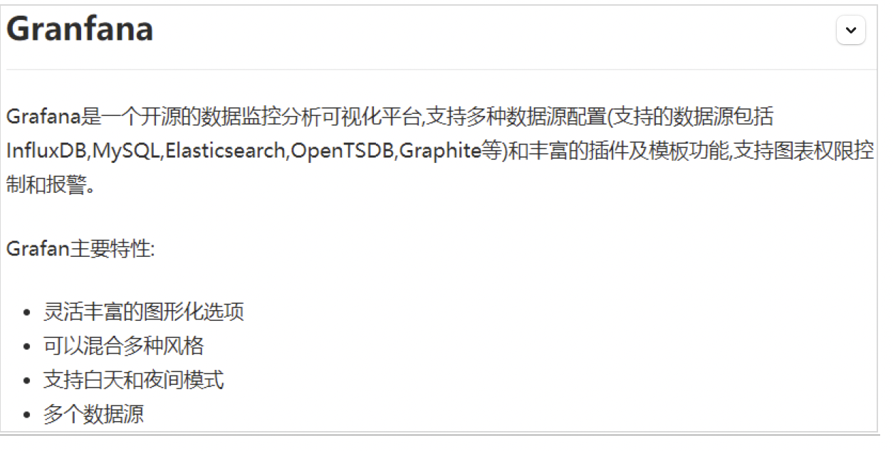

# Docker容器监控之CAdvisor+InfluxDB+Granfana

#### 原生命令

通过`docker stats`​命令可以很方便的看到当前宿主机上所有容器的CPU,内存以及网络流量等数据， 一般小公司够用了。。。。。

但是，`docker stats`​统计结果只能是当前宿主机的全部容器，数据资料是实时的，没有地方存储、没有健康指标过线预警等功能

#### 容器监控3剑客

CAdvisor监控收集+InfluxDB存储数据+Granfana展示图表

**CAdvisor**

​​

**InfluxDB**

​​

Granfana

​​

#### compose容器编排

新建docker-compose.yml

```yaml
version: '3.1' 
  
volumes: 
  grafana_data: {} 
  
services: 
 influxdb: 
  image: tutum/influxdb:0.9 
  restart: always 
  environment: 
    - PRE_CREATE_DB=cadvisor 
  ports: 
    - "8083:8083" 
    - "8086:8086" 
  volumes: 
    - ./data/influxdb:/data 
  
 cadvisor: 
  image: google/cadvisor 
  links: 
    - influxdb:influxsrv 
  command: -storage_driver=influxdb -storage_driver_db=cadvisor -storage_driver_host=influxsrv:8086 
  restart: always 
  ports: 
    - "8080:8080" 
  volumes: 
    - /:/rootfs:ro 
    - /var/run:/var/run:rw 
    - /sys:/sys:ro 
    - /var/lib/docker/:/var/lib/docker:ro 
  
 grafana: 
  user: "104" 
  image: grafana/grafana 
  user: "104" 
  restart: always 
  links: 
    - influxdb:influxsrv 
  ports: 
    - "3000:3000" 
  volumes: 
    - grafana_data:/var/lib/grafana 
  environment: 
    - HTTP_USER=admin 
    - HTTP_PASS=admin 
    - INFLUXDB_HOST=influxsrv 
    - INFLUXDB_PORT=8086 
    - INFLUXDB_NAME=cadvisor 
    - INFLUXDB_USER=root 
    - INFLUXDB_PASS=root 

```

启动docker-compose文件

```shell
docker-compose up
```

查看三个服务容器是否启动

```shell
docker ps
```

测试

```properties
1. 浏览cAdvisor收集服务，http://ip:8080/

第一次访问慢，请稍等

cadvisor也有基础的图形展现功能，这里主要用它来作数据采集
2. 浏览influxdb存储服务，http://ip:8083/

3. 浏览grafana展现服务，http://ip:3000
  ip+3000端口的方式访问,默认帐户密码（admin/admin）
  https://gitee.com/yooome/golang/tree/main/Docker详细教程
  配置步骤
  [1] 配置数据源
  [2] 选择influxdb数据源
  [3] 配置细节
  [4] 配置面板panel
  [5] 到这里cAdvisor+InfluxDB+Grafana容器监控系统就部署完成了
```
