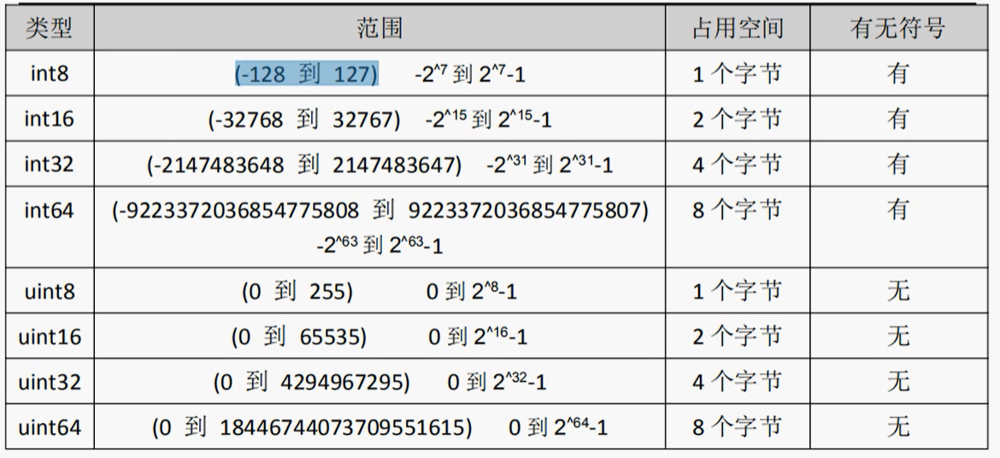

## 数字

> 在 Go 语言中，`int`​ 和 `float`​ 的大小依赖于底层计算机的体系结构和操作系统。在大多数平台上，`int`​ 类型的大小是 32 位或 64 位，而 `float`​ 类型的大小通常是 32 位或 64 位。
>
> 具体来说，`int`​ 类型在 32 位系统上是 32 位的有符号整数，范围为 `-2,147,483,648`​ 到 `2,147,483,647`​，而在 64 位系统上是 64 位的有符号整数，范围为 `-9,223,372,036,854,775,808`​ 到 `9,223,372,036,854,775,807`​。`float`​ 类型在 32 位系统上是 32 位的浮点数，而在 64 位系统上是 64 位的浮点数。
>
> 需要注意的是，在不同平台和编译器下，`int`​ 和 `float`​ 的大小可能会有所不同，因此在编写程序时需要谨慎考虑跨平台的兼容性问题。为了确保代码的可移植性，建议使用明确的整数和浮点类型，如 `int32`​、`int64`​、`float32`​ 和 `float64`​。

### 整型

整型的类型有很多中，包括 int8，int16，int32，int64。我们可以根据具体的情况来进行定义

​​

> 可以通过unsafe.Sizeof 查看不同长度的整型，在内存里面的存储空间
>
> ```
> var num2 = 12
> fmt.Println(unsafe.Sizeof(num2))
> ```

#### 数字字面量语法

Go1.13版本之后，引入了数字字面量语法，这样便于开发者以二进制、八进制或十六进制浮点数的格式定义数字，例如：

```go
v := 0b00101101  // 代表二进制的101101
v：= Oo377       // 代表八进制的377
```

#### 进制转换

```go
var number = 17
// 原样输出
fmt.Printf("%v\n", number)
// 十进制输出
fmt.Printf("%d\n", number)
// 以八进制输出
fmt.Printf("%o\n", number)
// 以二进制输出
fmt.Printf("%b\n", number)
// 以十六进制输出
fmt.Printf("%x\n", number)
```

### 浮点型

Go语言支持两种浮点型数：float32和float64。这两种浮点型数据格式遵循IEEE754标准：

float32的浮点数的最大范围约为3.4e38，可以使用常量定义：math.MaxFloat32。float64的浮点数的最大范围约为1.8e308，可以使用一个常量定义：math.MaxFloat64

打印浮点数时，可以使用fmt包配合动词%f，代码如下：

```go
var pi = math.Pi
// 打印浮点类型，默认小数点6位
fmt.Printf("%f\n", pi)
// 打印浮点类型，打印小数点后2位
fmt.Printf("%.2f\n", pi)
```

> **精度丢失**

几乎所有的编程语言都有精度丢失的问题，这是典型的二进制浮点数精度损失问题，在定长条件下，二进制小数和十进制小数互转可能有精度丢失

```go
d := 1129.6
fmt.Println(d*100) //输出112959.99999999
```

解决方法，使用第三方包来解决精度损失的问题

http://github.com/shopspring/decimal

> 注意：由于浮点数在计算机内部的存储方式是近似值，因此在比较浮点数时，应该使用一个误差范围来判断它们是否相等，而不能直接使用等于号进行比较。

### 算术运算符

> 算术运算符：`+`​（加）、`-`​（减）、`*`​（乘）、`/`​（除）、`%`​（取余）。

```go
a := 10
b := 3
fmt.Println(a + b) // 13
fmt.Println(a - b) // 7
fmt.Println(a * b) // 30
fmt.Println(a / b) // 3
fmt.Println(float64(a) / float64(b) // 3.3333333333333335
fmt.Println(a % b) // 1
```

### 位移运算符

> 位运算符：`&`​（按位与）、`|`​（按位或）、`^`​（按位异或）、`<<`​（左移）、`>>`​（右移）。

```go
a := 0b1010 // 10
b := 0b1100 // 12
fmt.Printf("%b\n", a&b)  // 1000（按位与）
fmt.Printf("%b\n", a|b)  // 1110（按位或）
fmt.Printf("%b\n", a^b)  // 0110（按位异或）
fmt.Printf("%b\n", a<<1) // 10100（左移）
fmt.Printf("%b\n", b>>1) // 110（右移）
```

### 赋值运算符

> 赋值运算符：`=`​, `+=`​, `-=`​, `*=`​, `/=`​, `%=`​，`&=`​, `|=`​, `^=`​, `<<=`​, `>>=`​。

```go
a := 10
a += 5 // 等价于 a = a + 5
fmt.Println(a) // 15

b := 3
b *= 4 // 等价于 b = b * 4
fmt.Println(b) // 12
```

## 布尔

### 类型定义

```go
var fl = false
if f1 {
    fmt.Println("true")
} else {
    fmt.Println("false")
}
```

### 比较运算符

> 比较运算符：`==`​（等于）、`!=`​（不等于）、`<`​（小于）、`>`​（大于）、`<=`​（小于等于）、`>=`​（大于等于）。

```go
a := 10
b := 3
fmt.Println(a == b) // false
fmt.Println(a != b) // true
fmt.Println(a < b)  // false
fmt.Println(a > b)  // true
fmt.Println(a <= b) // false
fmt.Println(a >= b) // true
```

### 逻辑运算符

> 逻辑运算符：`&&`​（逻辑与）、`||`​（逻辑或）、`!`​（逻辑非）。

```go
a := true
b := false
fmt.Println(a && b) // false
fmt.Println(a || b) // true
fmt.Println(!a)    // false
```

## 字符串

在Go语言中，字符串类型表示文本数据。字符串是不可变的，意味着一旦创建，就不能修改其内容。在Go中，字符串类型用`string`​关键字来声明。

### 初始化

Go语言里的字符串的内部实现使用UTF-8编码。字符串的值为双引号（"）中的内容，可以在Go语言的源码中直接添加非ASCll码字符，例如：

```go
s1 := "hello"
s1 := "你好"
```

如果想要定义多行字符串，可以使用反引号

```go
var str = `第一行
第二行`
fmt.Println(str)
// Output:
// 第一行
// 第二行
```

### 字符串操作

```go
// 可以使用 + 运算符来拼接字符串
s := "Hello, " + "World!"  

// 可以使用切片语法来获取字符串的一部分
fmt.Println(s[0:5])    // 输出：Hello


// 可以使用 range 关键字来遍历字符串中的每个字符
for _, c := range s {
    fmt.Println(string(c))
}
```

### 内置函数

Go语言提供了很多用于处理字符串的内置函数，包括：

* ​`len()`​：返回字符串的长度
* ​`strconv.Atoi()`​：将字符串转换为整数。
* ​`strconv.ParseFloat()`​：将字符串转换为浮点数。
* ​`strconv.ParseBool()`​：将字符串转换为布尔值。
* ​`strconv.Itoa()`​：将整数转换为字符串。
* ​`strconv.FormatFloat()`​：将浮点数转换为字符串。
* ​`strconv.FormatBool()`​：将布尔值转换为字符串。
* ​`strings.ToLower()`​：将字符串转换为小写
* ​`strings.ToUpper()`​：将字符串转换为大写
* ​`strings.Contains(s, substr string) bool`​：判断字符串 `s`​ 是否包含子串 `substr`​，返回布尔值。
* ​`strings.HasPrefix(s, prefix string) bool`​：判断字符串 `s`​ 是否以前缀 `prefix`​ 开始，返回布尔值。
* ​`strings.HasSuffix(s, suffix string) bool`​：判断字符串 `s`​ 是否以后缀 `suffix`​ 结束，返回布尔值。
* ​`strings.Index(s, substr string) int`​：查找字符串 `s`​ 中子串 `substr`​ 第一次出现的位置，返回位置索引（如果没有找到，则返回 `-1`​）。
* ​`strings.LastIndex(s, substr string) int`​：查找字符串 `s`​ 中子串 `substr`​ 最后一次出现的位置，返回位置索引（如果没有找到，则返回 `-1`​）。
* ​`strings.Count(s, substr string) int`​：计算字符串 `s`​ 中子串 `substr`​ 出现的次数，返回出现次数。
* ​`strings.Replace(s, old, new string, n int) string`​：将字符串 `s`​ 中前 `n`​ 个 `old`​ 子串替换为 `new`​，返回新字符串。
* ​`strings.Split(s, sep string) []string`​：将字符串 `s`​ 按照分隔符 `sep`​ 分割为多个子串，并将它们存储在一个字符串切片中，返回切片。
* ​`strings.Join(a []string, sep string) string`​：将一个字符串切片 `a`​ 中的所有元素按照分隔符 `sep`​ 连接为一个字符串，返回连接后的字符串。
* ​`strings.Trim(s string, cutset string) string`​：去除字符串 `s`​ 两侧的 `cutset`​ 中包含的字符，返回新的字符串。
* ​`strings.TrimSpace(s string) string`​：去除字符串 `s`​ 两侧的空格字符，返回新的字符串。
* ​`strings.TrimLeft(s string, cutset string) string`​：去除字符串 `s`​ 左侧的 `cutset`​ 中包含的字符，返回新的字符串。
* ​`strings.TrimRight(s string, cutset string) string`​：去除字符串 `s`​ 右侧的 `cutset`​ 中包含的字符，返回新的字符串。

### byte 和 rune类型

组成每个字符串的元素叫做 “字符”，可以通过遍历字符串元素获得字符。字符用单引号 '' 包裹起来

Go语言中的字符有以下两种类型

* uint8类型：或者叫byte型，代表了ACII码的一个字符
* rune类型：代表一个UTF-8字符

当需要处理中文，日文或者其他复合字符时，则需要用到rune类型，rune类型实际上是一个int32

Go使用了特殊的rune类型来处理Unicode，让基于Unicode的文本处理更为方便，也可以使用byte型进行默认字符串处理，性能和扩展性都有照顾。

需要注意的是，在go语言中，一个汉字占用3个字节（utf-8），一个字母占用1个字节

```go
package main
import "fmt"

func main() {
	var a byte = 'a'
	// 输出的是ASCII码值，也就是说当我们直接输出byte（字符）的时候，输出的是这个字符对应的码值
	fmt.Println(a)
	// 输出的是字符
	fmt.Printf("%c", a)

	// for循环打印字符串里面的字符
	// 通过len来循环的，相当于打印的是ASCII码
	s := "你好 golang"
	for i := 0; i < len(s); i++ {
		fmt.Printf("%v(%c)\t", s[i], s[i])
	}

	// 通过rune打印的是 utf-8字符
	for index, v := range s {
		fmt.Println(index, v)
	}
}
```

### 修改字符串

要修改字符串，需要先将其转换成[]rune 或 []byte类型，完成后在转换成string，无论哪种转换都会重新分配内存，并复制字节数组

转换为 []byte 类型

```go
// 字符串转换
s1 := "big"
byteS1 := []byte(s1)
byteS1[0] = 'p'
fmt.Println(string(byteS1))
```

转换为rune类型

```go
// rune类型
s2 := "你好golang"
byteS2 := []rune(s2)
byteS2[0] = '我'
fmt.Println(string(byteS2))
```

### 格式化输出

在 Go 中，可以使用 `fmt`​ 包提供的函数进行格式化输出。常用的格式化输出函数包括：

* ​`fmt.Printf()`​：按照指定的格式将数据输出到标准输出设备。
* ​`fmt.Println()`​：将参数格式化成字符串后，按照默认格式输出到标准输出设备。
* ​`fmt.Sprintf()`​：按照指定的格式将数据格式化为字符串。
* ​`fmt.Errorf()`​：将错误信息格式化为字符串。

格式化输出的格式由一个字符串控制，其中包含普通文本和转换说明符。转换说明符以百分号 `%`​ 开头，其后紧跟一个字符，用于表示要输出的数据类型和格式。常用的转换说明符包括：

* ​`%v`​：表示任意类型的值，按照默认格式输出。
* ​`%d`​：表示整数类型的值，按照十进制格式输出。
* ​`%f`​：表示浮点数类型的值，按照默认格式输出。
* ​`%s`​：表示字符串类型的值，按照默认格式输出。

下面是一些具体的例子：

```go
package main

import "fmt"

func main() {
    // 格式化输出整数和字符串
    age := 20
    name := "Alice"
    fmt.Printf("My name is %s and I'm %d years old.\n", name, age)

    // 格式化输出浮点数
    pi := 3.1415926
    fmt.Printf("The value of pi is approximately %f.\n", pi)
    fmt.Printf("The value of pi is approximately %.2f.\n", pi)

    // 格式化输出任意类型的值
    a := []int{1, 2, 3}
    fmt.Printf("%v\n", a)

    // 格式化输出到字符串
    s := fmt.Sprintf("My name is %s and I'm %d years old.", name, age)
    fmt.Println(s)
  
    // 可以一次输出多个参数，每个参数之间会自动添加一个空格，并在输出完成后自动换行。
    fmt.Println("My name is", name, "and I'm", age, "years old.")
}

```

输出结果为：

```go
My name is Alice and I'm 20 years old.
The value of pi is approximately 3.141593.
The value of pi is approximately 3.14.
[1 2 3]
My name is Alice and I'm 20 years old.
My name is Alice and I'm 20 years old.
```

## 基本数据类型转换

### 数字相互转换

```go
// 整型和浮点型之间转换
var aa int8 = 20
var bb int16 = 40
fmt.Println(int16(aa) + bb)

// 建议整型转换成浮点型
var cc int8 = 20
var dd float32 = 40
fmt.Println(float32(cc) + dd)
```

> **注意**，高位转低位的时候，需要注意，会存在精度丢失，建议从低位转换成高位

### 数字转成字符串

第一种方式，就是通过 fmt.Sprintf()来转换

```go
// 字符串类型转换
var i int = 20
var f float64 = 12.456
var t bool = true
var b byte = 'a'
str1 := fmt.Sprintf("%d", i)
fmt.Printf("类型：%v-%T \n", str1, str1)

str2 := fmt.Sprintf("%f", f)
fmt.Printf("类型：%v-%T \n", str2, str2)

str3 := fmt.Sprintf("%t", t)
fmt.Printf("类型：%v-%T \n", str3, str3)

str4 := fmt.Sprintf("%c", b)
fmt.Printf("类型：%v-%T \n", str4, str4)
```

第二种方法就是通过strconv包里面的集中转换方法进行转换

```go
// int类型转换str类型
var num1 int64 = 20
s1 := strconv.FormatInt(num1, 10)
fmt.Printf("转换：%v - %T", s1, s1)

// float类型转换成string类型
var num2 float64 = 3.1415926

/*
参数1：要转换的值
参数2：格式化类型 'f'表示float，'b'表示二进制，‘e’表示 十进制
参数3：表示保留的小数点，-1表示不对小数点格式化
参数4：格式化的类型，传入64位 或者 32位
	 */
s2 := strconv.FormatFloat(num2, 'f', -1, 64)
fmt.Printf("转换：%v-%T", s2, s2)
```

### 字符串转成数字

```go
str := "10"
// 第一个参数：需要转换的数，第二个参数：进制， 参数三：32位或64位
num,_ = strconv.ParseInt(str, 10, 64)

// 转换成float类型
str2 := "3.141592654"
num,_ = strconv.ParseFloat(str2, 10)
```

‍
