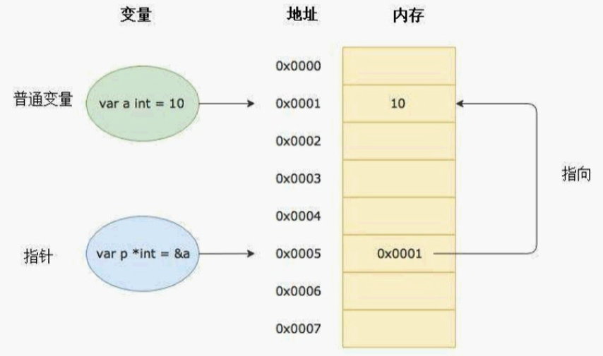

要搞明白Go语言中的指针需要先知道三个概念

- 指针地址
- 指针类型
- 指针取值

## 指针地址和指针类型

Go语言中的指针操作非常简单，我们只需要记住两个符号：

* ​`&`​：取地址
* ​`*`​：根据地址取值

语法如下：

```go
// v代表数据变量，类型为T，则ptr就是v的地址信息，类型为*T
ptr = &v // 获取变量v的地址，赋值给变量ptr
v = *ptr  // 获取指针ptr指向的数据，赋值给变量v
```



> 指针也是一个变量，但它是一种特殊的变量，它存储的数据不是一个普通的值，而是另一个变量的内存地址。当然，**指针本身也有自己的地址**。

## 指针取值

### 普通变量

例如，我们有一个名为`foo`​的函数，它接收一个指向`int`​类型数据的指针作为参数，那么在调用`foo`​函数时，需要传递一个`int`​类型变量的地址作为参数。在`foo`​函数中，接收到的参数类型是指针类型`*int`​，这个指针指向的是传递进来的`int`​类型变量的地址，我们可以通过这个指针来访问和修改被指向的`int`​类型数据。

例如下面的代码：

```go
func foo(ptr *int) {
    *ptr = 10 // 修改ptr指向的int类型数据的值为10
}

func main() {
    x := 5
    ptr := &x
    fmt.Println(x) // 输出5
    foo(ptr)
    fmt.Println(x) // 输出10，foo函数修改了x的值
}
```

在上面的代码中，`foo`​函数接收一个指向`int`​类型数据的指针`ptr`​作为参数，在`foo`​函数中，我们使用`*ptr`​来访问和修改被指向的`int`​类型数据的值。在`main`​函数中，我们定义一个`int`​类型变量`x`​，并将它的地址赋值给`ptr`​变量，然后调用`foo`​函数，`foo`​函数修改了`x`​的值为10，我们在`main`​函数中输出`x`​的值，可以看到`x`​的值已经被修改了。

> 在函数中，修改指针对应的数据，函数外面的值也会随之修改

### 结构体变量

假设我们有一个名为`person`​的结构体

```go
type Person struct {
	Name string
	Age  int
}
```

定义了一个指向该结构体的指针类型作为函数参数，例如：

```go
func (p *Person) ShowInfo() {
	person := *p
	fmt.Printf("指针直接访问：%s的年龄是%d\n", p.Name, person.Age)
}
```

在上面的代码中，`ShowInfo`​函数接收一个指向`Person`​类型数据的指针`p`​作为参数，我们在函数内部分别使用了指针变量的字段访问方式和解引用后使用字段访问方式来访问结构体字段，结果都可以正常取到数据，因此说明这两种方式是等价的。

> 获取结构体数据时，`p.name`​ 实际和 `(*p).name`​ 是一样的作用。

当想要修改`Person`​结构体中的字段，例如：

```go
func (p *Person) SetName(name string) {
	p.Name = name
}

func (p *Person) SetAge(age int) {
	(*p).Age = age
}
```

在上面的代码中，我们在函数内部分别使用了指针变量的字段访问方式和解引用后使用字段访问方式来访问结构体字段，结果都可以正常修改结构体中的数据，因此说明这两种方式是等价的。

> 修改结构体数据时，`p.name`​ 实际和 `(*p).name`​ 是一样的作用。

> ​`p`​是一个指针，`name`​字段是`p`​指向的结构体数据的字段， 为什么`p.name`​可以获取结构体中的数据呢？

在 Go 语言中，指针类型的变量和指向它所指向的数据的结构体类型变量是可以互相访问对方的数据的。当我们定义一个指针类型变量`p1`​时，它实际上是指向一个`Person`​类型的数据的内存地址，即它存储的是该数据的地址。因此，当我们使用`p1.name`​访问`Person`​类型数据中的`name`​字段时，Go 语言会自动解引用指针变量，获取它所指向的`Person`​类型数据的值，并访问该数据的`name`​字段。

```go
func Test(p *Person) {
	fmt.Printf("结构体地址: %d\n", unsafe.Pointer(p))
	fmt.Printf("结构体p本身地址: %d\n", unsafe.Pointer(&p))
}
func main() {
	p := &test.Person{
		Name: "小红",
		Age:  20,
	}
	fmt.Printf("结构体地址: %d\n", unsafe.Pointer(p))
	fmt.Printf("结构体p本身地址: %d\n", unsafe.Pointer(&p))
	Test(p)
}

```

上面的代码可以看出，当把指针p作为参数传递时：函数内外，p都是一个值，即结构体本身的地址；但是，也可以看出函数内外，p自身的地址又是不一样的。此时，对结构体来说，函数传参是引用；对指针p来说，函数传参是值的拷贝。

> 在函数内部修改结构体指针所指向的内存空间时，会影响到函数外部的结构体指针所指向的内存空间。因此，在 Go 语言中，需要特别注意：**函数参数是结构体指针时可能会发生的副作用**

如果为了避免结构体指针传参的问题，可以将结构体本身传递到函数中。当然，这样一来，当结构体数据过大时，也会产生大量数据的拷贝，带来性能问题。所以，情况需要慎重考虑，具体问题具体分析。

```go

func ModifyName(p Person, name string) {
	p.Name = name

	p.ShowInfo()
}


func main() {
	p := &test.Person{
		Name: "小红",
		Age:  20,
	}
	ModifyName(*p, "小米")
}

```

上面的代码中，函数接收的结构体本身，即结构体数据的拷贝，而不是原始数据。因此，此时的参数传递就是**值传递**，在函数中修改结构体字段，并不影响原始数据。

## 内存分配

对于指针变量来说

```go
// 指针变量初始化
var a *int
*a = 100
fmt.Println(a)
```

这段代码会引发空指针异常（panic），为什么呢？给指针变量 `a`​ 解引用赋值之前，没有为它分配有效的内存空间。在 Go 语言中，解引用一个空指针是非法的，会导致程序崩溃。

Go中的`new`​ 函数用于分配内存并返回指向该内存的指针，适用于任何类型。它返回一个指向新分配的**零值**的指针。

```go
func new(Type) *Type
```

其中

- Type表示类型，new函数只接受一个参数，这个参数是一个类型
- *Type表示类型指针，new函数返回一个指向该类型内存地址的指针

上面的代码更正为：

```go
package main

import (
	"fmt"
)

func main() {
	var p *int = new(int)
	*p = 100
	fmt.Println(*p)
}

```

make 是 Go 语言中的一个内置函数，主要用于创建引用类型（切片、映射和通道等）的实例，为它们分配内存并进行初始化。需要注意的是，`make`​ 函数只能用于引用类型，不能用于创建其他类型的实例。

引用类型在 Go 中是一种特殊的数据类型，它们可以动态增长，并且在传递给函数时不会复制数据，而是传递引用。

```go
make(T, args...)
```

其中，T 是要创建的引用类型，args... 是传递给该类型构造函数的参数。具体来说：  
  
对于切片（slice）：`make([]T, length, capacity)`​ 创建一个长度为 length，容量为 capacity 的切片。切片是基于数组实现的动态数组，具有自动扩容的能力。  
对于映射（map）：`make(map[K]V, initialCapacity)`​ 创建一个映射，并可以指定初始容量。映射是一种键值对的集合。  
对于通道（channel）：`make(chan T, capacity)`​ 创建一个通道，用于在 Go 协程之间进行通信。

> `new`​和`make`​**区别与联系**：

1. 区别：

    * ​`make`​ 仅适用于切片、映射和通道等引用类型，它返回的是一个初始化后的引用类型实例。
    * ​`new`​ 适用于任何类型，它返回的是一个指向零值的指针，用于分配内存。
2. 联系：

    * 两者都用于分配内存，但 `make`​ 用来**创建引用类型的实例**，而 `new`​ 则用来**分配指定类型的内存并获取指针**。
    * 无论使用 `make`​ 还是 `new`​，都需要将分配的内存释放，以避免内存泄漏。

```go
package main

import "fmt"

func main() {
    // 使用 make 创建切片
    slice := make([]int, 5, 10)
    fmt.Println("Slice:", slice)

    // 使用 new 创建整数指针
    numPtr := new(int)
    fmt.Println("Value at numPtr:", *numPtr)
}
```

> Go中引用和指针的区别

**引用（Reference）** ： 引用是一种语言特性，它允许你直接访问数据，而不需要知道其内存地址。引用通常与高级语言的抽象层次概念相关，例如对象、结构体、数组、切片、映射等。在 Go 语言中，切片和映射就是引用类型。

引用的主要特点是：

* 你通过引用可以直接访问数据，不需要关心数据的内存地址。
* 引用可以动态增长、缩小，可以指向不同的数据对象。
* 传递引用到函数时，函数会操作引用指向的实际数据，而不是拷贝数据。

**指针（Pointer）** ： 指针是一种存储内存地址的变量，它们提供了直接访问内存位置的能力。在 Go 语言中，指针是一种数据类型，它可以指向任何其他数据类型（包括基本类型和自定义类型）的内存地址。

指针的主要特点是：

* 指针存储了一个变量的内存地址，通过指针可以访问该内存地址上存储的数据。
* 使用指针可以避免数据的拷贝，可以在函数间传递数据的引用。
* 指针需要显式地进行解引用操作才能获取或修改其指向的数据。

在 Go 中，切片和映射是引用类型，它们具有引用的特性，可以直接操作数据，而指针则是另一种概念，用于直接访问内存地址上的数据。这两者在语义上有明显的差异，但都可以用于实现不同的编程模式和解决不同的问题。
