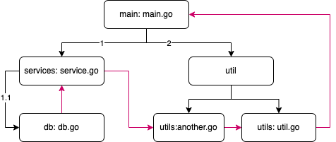

# 包管理

## 包的介绍

包（package）是多个Go源码的集合，是一种高级的代码复用方案，Go语言为我们提供了很多内置包，如fmt、strconv、strings、sort、errors、time、encoding/json、os、io等。

Golang中的包可以分为三种：1、系统内置包   2、自定义包   3、第三方包

* **系统内置包**：Golang 语言给我们提供的内置包，引入后可以直接使用，如fmt、strconv、strings、sort、errors、time、encoding/json、os、io等。
* **自定义包**：开发者自己写的包
* **第三方包**：属于自定义包的一种，需要下载安装到本地后才可以使用。

## 包管理演变历史

Go语言的包管理演变历史涵盖了从初始的`GOPATH`​到更现代的`GoModule`​的过程。

### GOPA​TH

在Go语言早期，使用者必须设置一个全局环境变量叫做`GOPATH`​。这个环境变量指定了一个工作空间，所有的Go代码和依赖都被存放在该目录结构下。

我们在项目中使用第三方类库的时候，使用go get命令去下载安装的第三方类库的包，而拉取下来的包就会直接下载到 `GOPATH`​目录下的 src 中。`GOPATH`​本身是不区分项目的，代码中任何`import`​的路径均从`GOPATH`​为根目录开始；

#### 不区分依赖项版本

当有多个项目时，不同项目对于依赖库的版本需求不一致时，无法在一个GOPATH下面放置不同版本的依赖项。

典型的例子：当有多项目时候，A项目依赖C 1.0.0，B项目依赖C 2.0.0，由于没有依赖项版本的概念，C 1.0.0和C 2.0.0无法同时在GOPATH下共存，解决办法是分别为A项目和B项目设置GOPATH，将不同版本的C源代码放在两个GOPATH中，彼此独立（编译时切换），或者C 1.0.0和C 2.0.0两个版本更改包名。无论哪种解决方法，都需要人工判断更正，不具备便利性。

并且不同的 `GOPATH`​ 都需要下载依赖，那么磁盘中重复的依赖就会非常多，会占用大量的磁盘空间。

#### 依赖项列表无法数据化

在项目中没有任何语义化的数据可以知道当前项目的所有依赖项，需要手动找出所有依赖。对项目而言，需要将所有的依赖项全部放入源代码控制中。如果剔除某个依赖，需要在源代码中手工确认某个依赖是否剔除。

### Vendor目录

Go 语言在Go1.5引入了`vendor`​文件夹，用于解决依赖管理问题的一种方案。

它是一个存放项目依赖的目录，位于项目根目录下，用于存放项目所使用的外部依赖库的拷贝。

通过将依赖库拷贝到项目下的 `vendor`​ 目录中，项目可以在一定程度上实现依赖的隔离，避免不同项目之间的依赖冲突。然而，`vendor`​ 目录也存在一些局限性：重复依赖等。

综上所述，尽管`vendor`​ 目录在一定程度上解决了依赖隔离和版本控制的问题，但也存在一些局限性，这促使 Go 社区推出了更现代、更灵活的包管理解决方案：Go Modules。

### GoModule

那么究竟什么是 GoModule？

* Go Modules是语义化版本管理的依赖项的包管理工具；它解决了GOPATH存在的缺陷，最重要的是，它是Go官方出品。
* 说得直白一下，GoModule 就是一个用来取代 GoPath 的 Golang 的工作空间。

我们之前说过，所有的 Golang 的文件，都需要放在 GoPath 目录下才能进行正确的编译和运行，而有了 GoModule 之后，那么我们就可以把文件放在 GoModule 目录下，而放在 GoModule 目录下的 Golang 文件，也可以正确地编译运行。

那么我们有了 GoModule 之后，GoPath 是不是就可以被舍弃了？

不是的！

我们之前说过，GoPath 所引出的问题，就是因为第三方类库的包所导致的，所以我们在有了 GoModule 之后，GoPath 和 GoModule 就分别负责不同的职责，共同为我们的 Golang 项目服务。

GoPath 我们用来存放我们从网上拉取的第三方依赖包。<br />GoModule 我们用来存放我们自己的 Golang 项目文件，当我们自己的项目需要依赖第三方的包的时候，我们通过 GoModule 目录下的一个 go.mod 文件来引用 GoPath 目录 src 包下的第三方依赖即可。

这样依赖，既解决了原来只能局限在 GoPath 目录 src 包下进行编程的问题，也解决了第三方依赖包难以管理和重复依赖占用磁盘空间的问题。

总而言之，在引入 GoModule 之后，我们不会直接在 GoPath 目录进行编程，而是把 GoPath 作为一个第三方依赖包的仓库，我们真正的工作空间在 GoModule 目录下。

## GoModule

`go module`​是Go1.11版本之后官方推出的版本管理工具，并且从Go1.13版本开始，`go module`​将是Go语言默认的依赖管理工具。

### GO111MODULE

要启用`go module`​支持首先要设置环境变量`GO111MODULE`​，通过它可以开启或关闭模块支持，它有三个可选值：`off`​、`on`​、`auto`​。

1. ​`GO111MODULE=off`​​禁用模块支持，编译时会从`GOPATH`​​和`vendor`​​文件夹中查找包。
2. ​`GO111MODULE=on`​​启用模块支持，编译时会忽略`GOPATH`​​和`vendor`​​文件夹，只根据 `go.mod`​​下载依赖。
3. ​`GO111MODULE=auto`​​​，当项目在`$GOPATH/src`​​​外且项目根目录有`go.mod`​​​文件时，开启模块支持。

使用 go module 管理依赖后会在项目根目录下生成两个文件`go.mod`​和`go.sum`​。

当然，Go1.11 和 1.12 版本的`GO111MODULE`​默认是`off`​，需要手动设置。而在 Golang1.13 及以上的版本中，GoModule 的默认配置为 `auto`​。所以 Golang1.13 + 的版本中我们就不需要配置 `GO111MODULE`​ 属性了。

### GOPROXY

`GOPROXY`​ 是一个环境变量，用于设置 Go Modules 的代理服务器地址，用来加速依赖包的下载，并可以缓存已下载的依赖包，从而减少网络传输和提高构建效率。

可以在`~/.zshrc`​或`~/.bashrc ​`​设置环境变量：

```bash
export GOPROXY=https://mirrors.aliyun.com/goproxy,direct
```

* ​`https://mirrors.aliyun.com/goproxy`​​ 是阿里的 Go Modules 代理服务器，可以加速依赖包的下载。
* ​`direct`​​ 参数表示，如果在指定的代理服务器上找不到所需的依赖包，会直接从原始源（比如官方的 Go 代理服务器） [https://proxy.golang.org](https://proxy.golang.org)

这样设置 `GOPROXY`​ 环境变量可以在 代理服务器 找不到依赖包时，直接从官方代理服务器下载，以确保获取所需的依赖包。

### go mod命令

常用的`go mod`​命令如下：

```bash
# 初始化一个新的模块
go mod init mymodule

# 添加一个新的依赖包
go get github.com/example/some-package

# 更新依赖包到最新版本
go get -u github.com/example/some-package

# 指定依赖包的版本
go get github.com/example/some-package@v1.2.3

# 查看当前模块的所有依赖列表
go list -m all

# 下载当前模块的所有依赖包
go mod download

# 清除不再使用的依赖包
go mod tidy

# 将模块的依赖复制到本地的 vendor 目录
go mod vendor

# 查看特定依赖包的详细信息
go list -m -json github.com/example/some-package

# 查看当前模块路径
go list -m

# 生成并验证 go.sum 文件
go mod verify

# 查看为何特定模块被引入到项目中
go mod why github.com/example/some-package

# 编辑模块版本信息，例如固定依赖的版本
go mod edit -require=github.com/example/another-package@v2.0.1

# 编辑模块的替代路径，用于测试或开发
go mod edit -replace=github.com/example/some-package=./local/some-package

# 移除某个替代路径
go mod edit -dropreplace=github.com/example/some-package

# 添加新的替代路径
go mod edit -replace=github.com/old-package=github.com/new-package@v1.0.0
```

### 自定义包

包（package）是多个Go源码的集合，一个包可以简单理解为一个存放多个.go文件的文件夹。

该文件夹下面的所有go文件都要在代码的第一行添加如下代码，声明该文件归属的包。

```go
package package_name
```

**注意事项**

* 一个文件夹下面直接包含的文件只能归属一个package，同样一个package的文件不能在多个文件夹下。
* 包名可以不和文件夹的名字一样，包名不能包含`-`​符号，通常使用小写字母和`_`​。
* 包名为main的包为应用程序的入口包，这种包编译后会得到一个可执行文件，而编译不包含main包的源代码则不会得到可执行文件。

当使用 Go Modules 进行开发时，可以创建自定义的包和嵌套包，以组织项目的代码结构。

假设我们有一个项目目录结构如下：

```bash
myproject/
├── go.mod
├── main.go
└── utils/
    ├── helper.go
    └── subpackage/
        └── feature.go
```

在这个示例中，我们有一个名为 `myproject`​ 的项目，其中包含一个自定义的包 `utils`​ 和一个嵌套包 `subpackage`​。

首先，我们需要初始化一个模块并设置其路径。在项目根目录下运行以下命令：

```bash
go mod init myproject
```

然后，我们可以创建自定义的包 `utils`​ 和嵌套包 `subpackage`​ 的文件。

在 `helper.go`​ 中，我们可以定义一些辅助函数：

```bash
// utils/helper.go

package utils

import "fmt"

func SayHello() {
    fmt.Println("Hello from utils!")
}
```

在 `feature.go`​ 中，我们可以定义一些特性函数：

```bash
// utils/subpackage/feature.go

package subpackage

import "fmt"

func ShowFeature() {
    fmt.Println("This is a feature from subpackage!")
}

```

最后，在 `main.go`​ 中，我们可以使用这些自定义包和嵌套包：

```bash
// main.go

package main

import (
    "myproject/utils"
    "myproject/utils/subpackage"
)

func main() {
    utils.SayHello()
    subpackage.ShowFeature()
}

```

通过这个简单的示例，我们展示了如何在 Go Modules 项目中创建自定义的包和嵌套包，然后在主程序中引入和使用它们。这种方式可以帮助你更好地组织代码，使项目结构更清晰和模块化。

## ​`init`​初始化函数

### 介绍

在 Go 中，`init`​ 函数是一种特殊的函数，用于初始化包或模块。每个包可以有一个或多个 `init`​ 函数，这些函数会在程序运行之前被自动调用。`init`​ 函数通常用于执行包级别的初始化操作，如设置全局变量、初始化数据库连接、注册服务等。

​`init`​ 函数的特点：

* 无参数和返回值。
* 可以有多个 `init`​ 函数。
* ​`init`​ 函数没有显示的调用，而是在包被引用时自动执行。

### 执行顺序

Go语言包会从main包开始检查其导入的所有包，每个包中又可能导入了其他的包。Go编译器由此构建出一个树状的包引用关系，再根据引用顺序决定编译顺序，依次编译这些包的代码。

* 导入不同的包时，这些包的 `init`​ 函数的执行顺序将按照导入顺序执行。
* 在同一个包中，不同文件的 `init`​ 函数的执行顺序是按照文件名字母顺序执行的。
* 导入一个嵌套的包时，即 `A->B->C`​，最后导入的包的`init`​ 函数会优先执行，即 `C.init->B.init->A.init`​

### 案例验证

当涉及到多个不同的包和多个文件时，它们之间 `init`​ 函数的执行顺序与导入顺序和文件名的字母顺序有关。

假设有以下的目录结构和代码：

```bash
project/
├── db
│   └── db.go
├── go.mod
├── main.go
├── services
│   └── service.go
└── utils
    ├── anthor.go
    └── util.go
```

`util.go`​ 文件中的代码如下：

```bash
// utils/util.go

package utils

import "fmt"

func init() {
    fmt.Println("utils_package: util init")
}

func UtilFunction() {
    fmt.Println("UtilFunction called")
}
```

`another.go`​ 文件中的代码如下：

```go
// utils/another.go

package utils

import "fmt"

func init() {
    fmt.Println("utils_package: another init")
}

func AnotherFunction() {
    fmt.Println("AnotherFunction called")
}
```

`db.go`​ 文件中的代码如下：

```go
// db/db.go

package db

import "fmt"

func init() {
    fmt.Println("db_package: db init")
}

func DBFunction() {
    fmt.Println("DBFunction called")
}

```

`service.go`​ 文件中的代码如下：

```go
// services/service.go

package services

import (
    "fmt"
    "project/db"
)

func init() {
    fmt.Println("services_package: service init")
}

func ServiceFunction() {
    db.DBFunction()
    fmt.Println("ServiceFunction called")
}
```

`main.go`​ 文件中的代码如下：

```go
// main.go

package main

import (
    "fmt"
    "project/services"
    "project/utils"
)

func init() {
    fmt.Println("main package init")
}

func main() {
    fmt.Println("Main started")
    utils.UtilFunction()
    utils.AnotherFunction()
    services.ServiceFunction()
    fmt.Println("Main ended")
}
```

运行 `main.go`​ 时，以下是输出的顺序：

```bash
db_package: db init
services_package: service init
utils_package: another init
utils_package: util init
main package init
Main started
UtilFunction called
AnotherFunction called
DBFunction called
ServiceFunction called
Main ended
```

示意图如下：

　　​​
