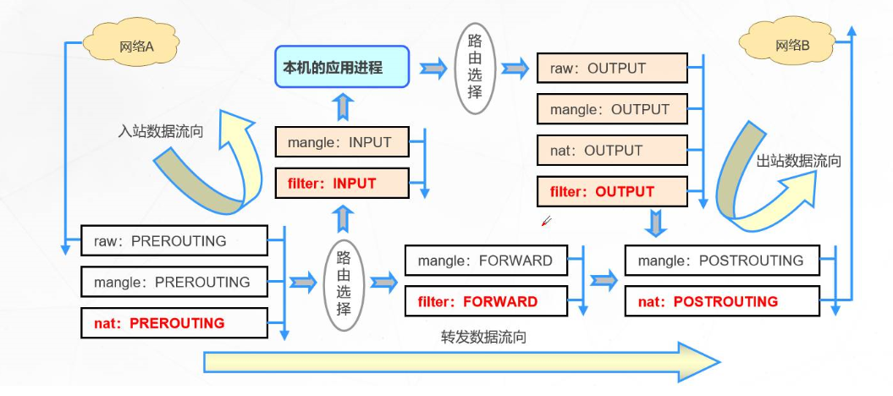

​`iptables`​ 是 Linux 中用于管理网络流量的强大工具，它通过定义规则来控制数据包的过滤、转发和地址转换。

## 基础概念

​`iptables`​ 由**表**（tables）和**链**（chains）组成。表中包含规则链，每个规则链包含一系列用于过滤或修改数据包的规则。

​​

### 四表

1. **filter 表**：主要用于数据包过滤。

    * **常用链**：`INPUT`​（进入本机的数据包），`FORWARD`​（转发的数据包），`OUTPUT`​（本机发出的数据包）。
2. **nat 表**：用于网络地址转换（NAT）。

    * **常用链**：`PREROUTING`​（路由前处理），`POSTROUTING`​（路由后处理），`OUTPUT`​（本地生成数据包）。
3. **mangle 表**：用于修改数据包的服务质量、标记等属性。
4. **raw 表**：主要用于决定是否启用连接追踪机制。

数据包处理顺序：`raw > mangle > nat > filter`​

### 五链

* **PREROUTING**：处理入站数据包，主要用于目标地址转换（DNAT）。
* **INPUT**：处理进入本机的数据包。
* **FORWARD**：处理通过本机转发的数据包。
* **OUTPUT**：处理本机发出的数据包。
* **POSTROUTING**：处理出站数据包，常用于源地址转换（SNAT）。

## 常用命令

### 查看规则

要查看某个表中的所有链及其规则，可以使用以下命令：

```bash
# 查看 filter 表中的规则
iptables -t filter -L -n -v --line-numbers

# 查看 NAT 表的规则
iptables -t nat -L -n -v --line-numbers
```

* ​`-t`​：指定表，如 `filter`​ 表。
* ​`-L`​：列出链中的规则。
* ​`-n`​：不解析 IP 地址。
* ​`-v`​：显示详细信息。
* ​`--line-numbers`​：显示规则的行号。

### 添加规则

```bash
# 允许来自 IP 地址 192.168.1.100 的所有流量进入系统
iptables -A INPUT -s 192.168.1.100 -j ACCEPT
# 阻止来自 IP 地址 10.0.0.5 的所有流量进入系统
iptables -A INPUT -s 10.0.0.5 -j DROP
# 允许来自 192.168.1.0 网段（即 192.168.1.1 到 192.168.1.254）的流量进入系统
iptables -A INPUT -s 192.168.1.0/24 -j ACCEPT
# 允许来自 192.168.1.0/24网段的 TCP 流量访问 22端口
iptables -A INPUT -p tcp --dport 22 -s 192.168.1.0/24 -j ACCEPT


# 允许所有发往 IP 地址 192.168.1.100 的流量
iptables -A INPUT -d 192.168.1.100 -j ACCEPT
# 拒绝所有发送到 IP 地址 10.0.0.1 的流量
iptables -A INPUT -d 10.0.0.1 -j DROP
# 允许发送到目标 IP 地址 192.168.1.50 的 HTTP 流量（端口 80）
iptables -A INPUT -d 192.168.1.50 -p tcp --dport 80 -j ACCEPT


# 允许来自源端口 8080 的 TCP 流量
iptables -A INPUT -p tcp --sport 8080 -j ACCEPT
# 拒绝来自源端口 3000 的流量
iptables -A INPUT -p tcp --sport 3000 -j DROP
# 允许 FTP 控制端口（21）
iptables -A INPUT -p tcp --dport 21 -j ACCEPT
# 允许被动 FTP 数据传输端口范围（30000-31000）
iptables -A INPUT -p tcp --dport 30000:31000 -j ACCEPT

# 允许 ICMP ping 请求
iptables -A INPUT -p icmp --icmp-type 8 -j ACCEPT


# 允许来自源端口 80 和 443 的流量
iptables -A INPUT -p tcp -m multiport --sport 80,443 -j ACCEPT
# 允许所有已建立的连接返回
iptables -A INPUT -m state --state ESTABLISHED,RELATED -j ACCEPT
# 限制同一源 IP 的并发连接数
iptables -A INPUT -p tcp --dport 80 -m conntrack --ctstate NEW -m connlimit --connlimit-above 100 -j REJECT
# 限制每 30 秒最多允许 10 个连接
iptables -A INPUT -p tcp --dport 80 -m state --state NEW -m recent --set
iptables -A INPUT -p tcp --dport 80 -m state --state NEW -m recent --update --seconds 30 --hitcount 10 -j DROP
# 禁止包含特定字符串的流量（例如包含 "xunlei" 的流量）
iptables -A INPUT -p tcp --sport 443 -m string --string "xunlei" --algo kmp -j DROP

# 允许所有目的地不是 192.168.1.1 的 TCP 流量到达 80 端口
iptables -A INPUT -p tcp --dport 80 ! -d 192.168.1.1 -j ACCEPT

```

* ​`-A`​：向链的末尾添加规则。
* ​`-p`​：指定协议，如 `tcp`​、`udp`​ 、`icmp`​(ping协议)等。
* ​`!`​ ：用于取反条件，可以创建更复杂和灵活的流量过滤规则
* ​`-s`​：指定源 IP 地址。
* ​`-d`​：指定目标地址。
* ​`--dport`​：指定目标端口。
* ​`--sport`​：指定源端口号。
* ​`-m`​：用于加载模块以实现更复杂的匹配功能

  * ​`multiport`​ 模块允许在一个规则中指定多个端口
  * ​`state`​ 模块用于基于连接状态来匹配数据包。常见的状态有：`NEW`​、`ESTABLISHED`​ 和 `RELATED`​
  * ​`conntrack`​ 模块提供对连接跟踪功能的支持，可以使用 `conntrack`​ 进行更细粒度的流量控制。
  * ​`recent`​ 模块用于管理连接的时间戳和频率，常用于限制特定 IP 的连接次数。
  * ​`string`​ 模块用于匹配数据包中的字符串，可以用于深度包检查。
* ​`-j`​：指定动作，如 `ACCEPT`​、`DROP`​。

### 插入规则

```bash
# 在 INPUT 链的第 5 条规则前插入禁止非 192.168.1.0/24 网络访问 80 端口的规则
iptables -I INPUT 5 -p tcp --dport 80 ! -s 192.168.1.0/24 -j DROP
```

### 替换规则

```bash
# iptables -R <链名> <行号> -p <协议> --dport <端口号> -j <动作>

# 将 INPUT 链中第 2 条规则从允许 TCP 端口 22 的连接更改为允许 TCP 端口 80 的连接
iptables -R INPUT 2 -p tcp --dport 80 -j ACCEPT

# 修改 INPUT 链中第 1 条规则，允许从192.168.1.0/24 网络访问 TCP 端口 80 修改为端口 443
iptables -R INPUT 1 -p tcp --dport 443 -s 192.168.1.0/24 -j ACCEPT
```

### 删除规则

要删除 `INPUT`​ 链中的某条规则，可以通过行号或规则本身来完成。

```bash
# 通过行号删除
iptables -D INPUT 1
# 通过规则删除
iptables -D INPUT -p tcp --dport 22 -s 192.168.1.0/24 -j ACCEPT
```

### 清空规则

要清空某个表的所有规则（默认为 `filter`​ 表），可以使用以下命令：

```bash
# 清空filter表的所有规则
iptables -F -t filter
```

### 查看默认策略

每个链都有默认规则，可以设置白名单或黑名单。

```bash
# 将 INPUT 链的默认策略设置为丢弃所有流量，默认拒绝其他连接
iptables -P INPUT DROP
```

### 自定义链

创建一个名为 `MYCHAIN`​ 的自定义链

```bash
iptables -N MYCHAIN
```

然后将规则添加到该链中：

```bash
iptables -A MYCHAIN -p tcp --dport 80 -j ACCEPT
```

## ipset 的使用

​`ipset`​ 是一个与 `iptables`​ 配合使用的工具，允许创建和管理 IP 地址的集合，提供更灵活的方式来处理大量 IP 地址。`ipset`​ 可以提高规则管理的效率，尤其是在处理动态黑白名单时。

### 创建 ipset 集合

```bash
ipset create <集合名称> hash:ip timeout 0
```

* ​`timeout`​：可设置过期时间，单位为秒。

**示例**：创建一个名为 `ssh-allow`​ 的集合，允许某些 IP 访问 SSH：

```bash
ipset create ssh-allow hash:ip timeout 86400
```

### 添加 IP 到集合

```bash
ipset add <集合名称> <IP地址> timeout <秒>
```

**示例**：将 `192.168.47.1`​ 添加到 `ssh-allow`​ 集合，过期时间为 86400 秒：

```bash
ipset add ssh-allow 192.168.47.1 timeout 86400
```

### 在 iptables 中使用 ipset

可以在 `iptables`​ 规则中使用 `ipset`​ 集合：

```bash
iptables -A INPUT -m set --match-set ssh-allow src -j ACCEPT
```

## firewalld

firewalld 是一种动态的防火墙管理工具，提供了简化的管理方式，可以更方便地管理 iptables。它使用区域和服务的概念，允许管理员对不同网络区域应用不同的规则。

启动 firewalld

```bash
systemctl start firewalld
```

查看区域和服务

```bash
# 查看当前的区域和它们的规则
firewall-cmd --get-active-zones
# 查看所有的规则
firewall-cmd --list-all

# 查看特定区域的详细规则
firewall-cmd --zone=public --list-all
```

* ​`--zone`​：指定一个网络区域（zone）。每个区域都有一组预定义的规则，这些规则定义了允许或拒绝哪些类型的网络流量。

  * ​`public`​：用于不信任的网络。通常只允许最基本的服务（如 SSH）。
  * ​`home`​：用于家庭网络，通常允许更多服务。
  * ​`work`​：用于工作环境，通常根据组织的安全策略允许特定服务。
  * ​`internal`​：用于内部网络，通常被认为是可信任的网络，允许大部分流量。
  * ​`dmz`​：用于受保护的网络区域，通常只允许外部流量访问特定服务。

放行服务

```bash
firewall-cmd --zone=public --add-service=ssh --permanent

firewall-cmd --zone=public --add-port=22/tcp --permanent
```

* ​`--add-service`​: 通过添加一个预定义的服务来打开相应的端口和协议。使用服务名称更易于理解和管理，因为它自动处理相关的端口和协议设置。如果服务有更新或更改，使用服务名称可以确保防火墙规则始终是最新的。
* ​`--add-port`​：直接开放端口，提供了更高的灵活性，可以对不在 `firewalld`​ 服务列表中的自定义应用进行配置。适用于用户希望打开某个特定端口而不依赖于预定义服务的情况。
* ​`--permanent`​：永久生效，需重载规则生效。

删除规则

```bash
firewall-cmd --zone=public --remove-port=80/tcp --permanent
```

重载规则

```bash
firewall-cmd --reload
```

​`firewalld`​ 是 `iptables`​ 的管理层。启用 `firewalld`​ 后，系统中的 `iptables`​ 规则会自动更新，不建议同时使用 `firewalld`​ 和 `iptables`​ 直接修改规则，以避免冲突。

## 结论

本文详细介绍了 `iptables`​ 的基本命令（查看、添加、删除和修改规则），结合 `ipset`​、`firewalld`​ 的相关配置。通过合理配置 `iptables`​，可以有效地控制网络流量，保护系统安全。
