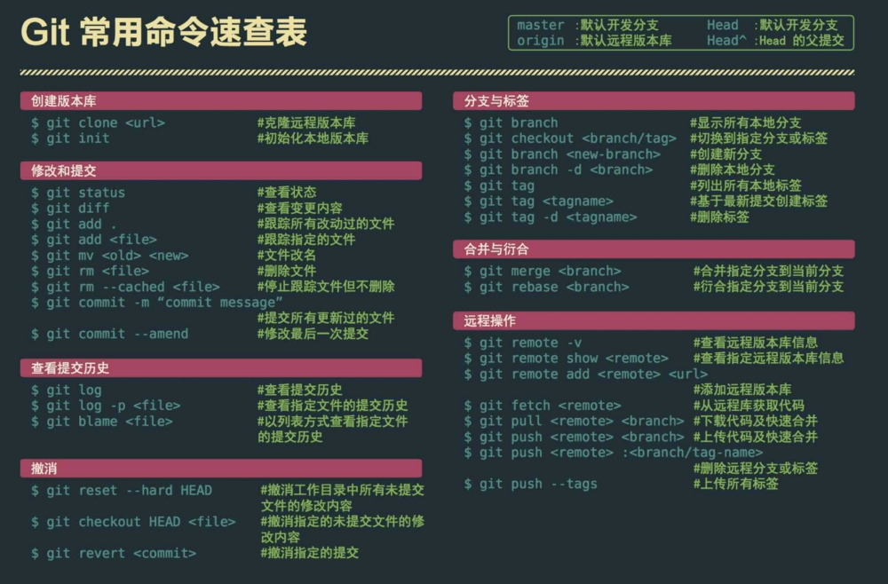
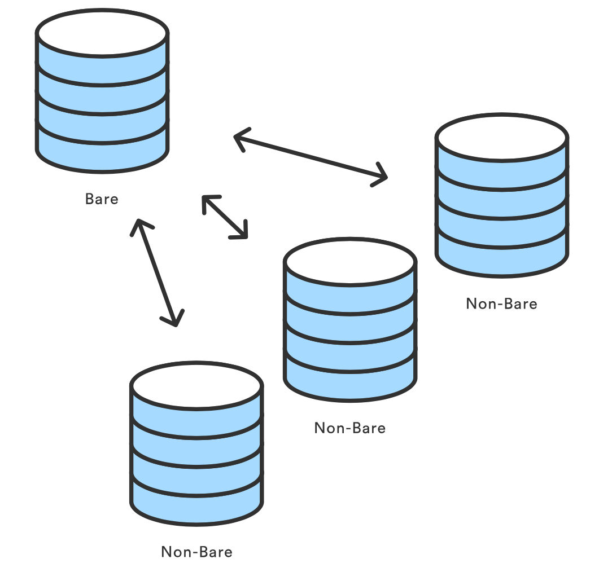
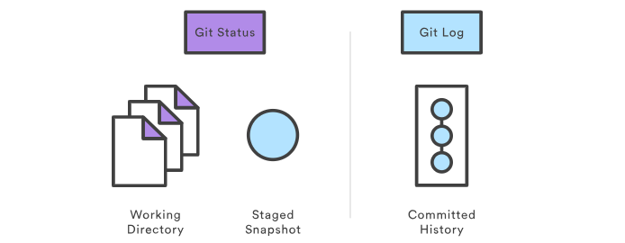
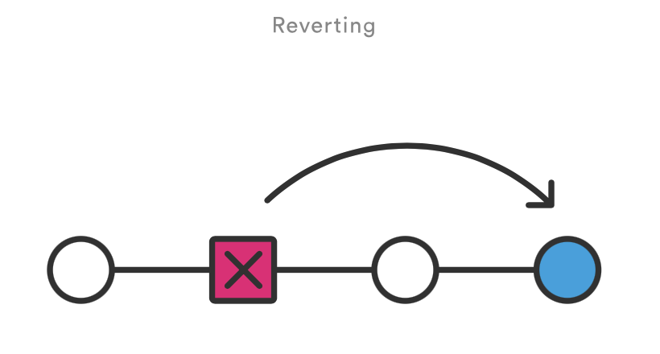
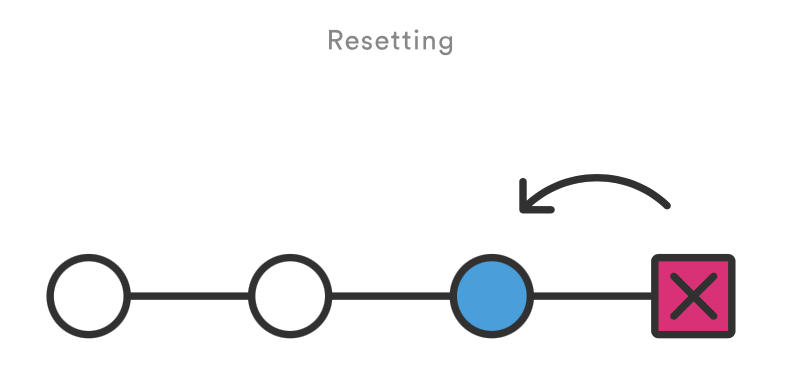
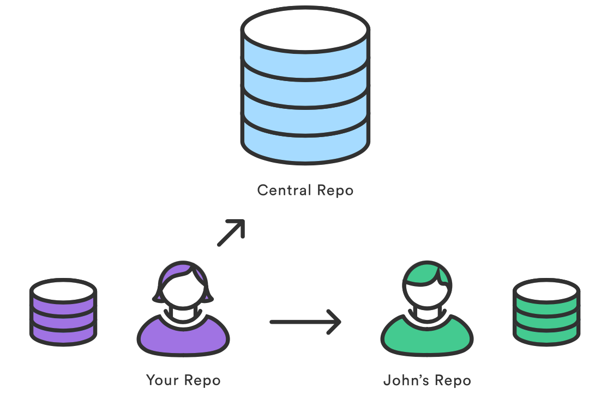
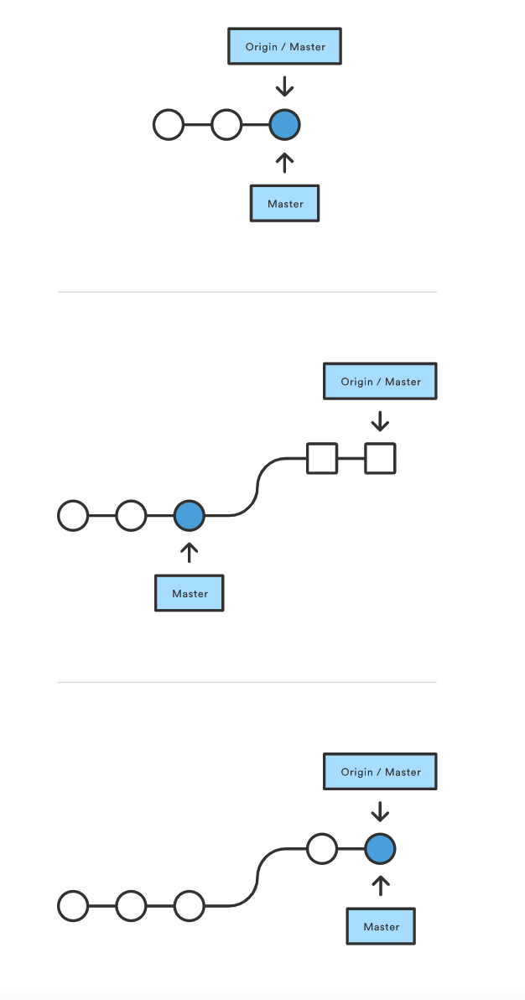
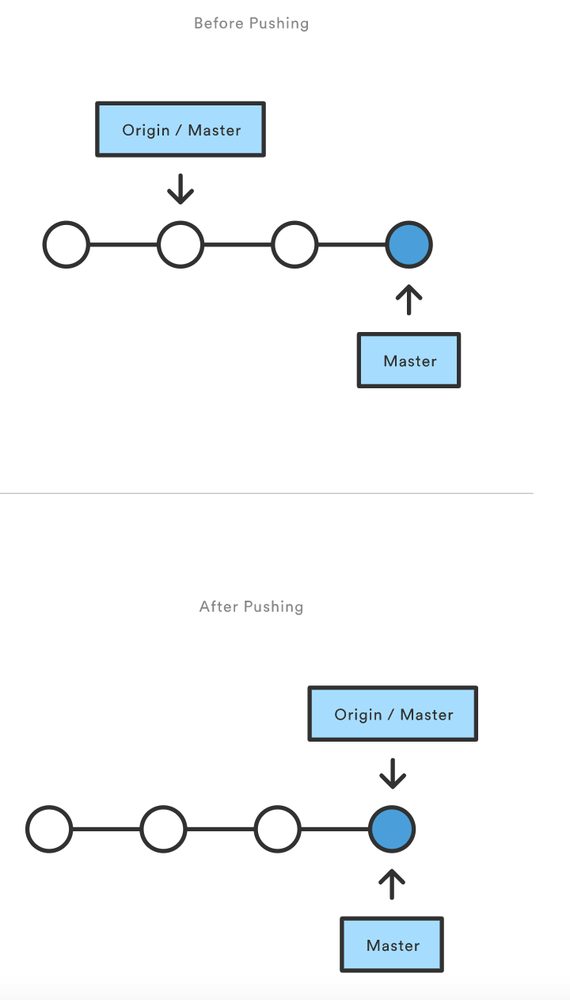

Git是目前世界上最先进的分布式版本控制系统，可以有效、高速的处理从很小到非常大的项目版本管理。Git非常强大，可以说是开发人员必备技能。

# 环境配置

- windows：到git官网上下载, [Download](https://gitforwindows.org/) git,下载后会有一个Git Bash的命令行工具，以后就用这个工具来使用git。
- linux：对linux来说实在是太简单了，因为最早的git就是在linux上编写的，只需要一行代码

  ```shell
  sudo apt-get install git
  ```

  安装好后，用`git --version` 来查看一下版本


# 常用命令

​​

# 命令详解

## 创建仓库

### git init

`git init` 命令创建一个新的 Git 仓库。它用来将已存在但还没有版本控制的项目转换成一个 Git 仓库，或者创建一个空的新仓库。大多数Git命令在未初始化的仓库中都是无法使用的，所以这就是你运行新项目的第一个命令了。

运行 `git init` 命令会在你项目的根目录下创建一个新的 `.git` 目录，其中包含了你项目必需的所有元数据。除了 `.git` 目录之外，已经存在的项目不会被改变（Git 不强制每个子目录中都有一个 `.git` 目录）。

```zsh
git init
```

将当前的目录转换成一个 Git 仓库。它在当前的目录下增加了一个 `.git` 目录，于是就可以开始记录项目版本了。

```zsh
git init <directory>
```

在指定目录创建一个空的 Git 仓库。运行这个命令会创建一个名为 `directory`，只包含 `.git` 子目录的空目录。

```zsh
git init --bare <directory>
```

初始化一个**裸**的 Git 仓库，但是忽略工作目录。共享的**中心仓库**应该总是用 `--bare` 标记创建。

一般来说，用 `—-bare` 标记初始化的仓库以 `.git` 结尾。比如，一个叫`repo`的仓库，它的空版本应该保存在 `repo.git` 目录下（这也是为什么我们从 GitHub clone 仓库的时候，地址都是 xxx.git 这样的形式的原因）。

并且这个仓库是可以被正常 `clone`​ 和 `push`​ 更新的， **裸仓库**不包含工作区，所以并不会存在在裸仓库上直接提交变更的情况。

​​

### git clone

`git clone` 命令拷贝整个 Git 仓库。这个命令在本地创建一个完备的Git仓库——它包含自己的历史，管理自己的文件，以及环境和原仓库完全隔离。

为了方便起见，`clone` 自动创建了一个名为 `origin` 的远程连接，指向原有仓库。这让和中央仓库之间的交互更加简单。

```zsh
git clone <repo>
```

将位于 `<repo>` 的仓库克隆到本地机器。原仓库可以在本地文件系统中，或是通过 HTTP 或 SSH 连接的远程机器。

```zsh
git clone <repo> <directory>
```

将位于 `<repo>` 的仓库克隆到本地机器上的 `<directory>` 目录。

### git config

​`git config`​命令可以查看和操作配置参数。

git在默认作用域下，如果本地仓库、全局或系统参数在获取或设置值时发生冲突，按如下的优先级获取或设置参数值。

```shell
# 获取默认配置，如果当前地址中仓库信息不存在，则查看全局，然后再读取系统配置
git config --list
 
# 本地仓库配置 高优先级
git config --local --list
 
# 全局用户配置 中优先级
git config --global --list

# 系统配置 低优先级
git config --system --list
```

git最终将读取所有的配置文件。如果使用了诸如--local等命令，那么其作用域就将切换到--local。意味着此时无法获取或设置global和system的值。

获取操作

直接通过key value的方式获取值（总是从本地仓库开始获取参数值）

```lua
git config user.name

git config user.email
```

* 通过get查看参数值（键不存在时，会返回空，同一文件下键有多个值时，取最后一个）

```lua
 git config --get core.bare
```

```shell
git config --global user.name "your-username"
git config --global user.email "your-email-address"
# git config --global user.password "your-password"
```

当然还可以针对当前仓库设置用户信息

```shell
git config user.name "your-username"
git config user.email "your-email-address"
# git config user.password "your-password"
```

## 保存更改

### git add

`git add` 命令将工作目录中的变化添加到暂存区。它告诉 Git 你想要在下一次提交时包含这个文件的更新。但是，`git add` 不会实质上地影响你的仓库——在你运行 `git commit` 前更改都还没有真正被记录。

```zsh
git add <file>
```

将 `<file>` 中的更改加入下次提交的缓存。

```zsh
git add <directory>
```

将 `<directory>` 下的更改加入下次提交的缓存。

### git commit

`git commit`命令将缓存的快照提交到项目历史。提交的快照可以认为是项目安全的版本，Git 永远不会改变它们，除非你这么要求。和 `git add` 一样，这是最重要的 Git 命令之一。

```zsh
git commit
```

提交已经缓存的快照。它会运行文本编辑器，等待你输入提交信息。当你输入信息之后，保存文件，关闭编辑器，创建实际的提交。

```zsh
git commit -m "<message>"
```

提交已经缓存的快照。但将 `<message>` 作为提交信息，而不是运行文本编辑器。

## 查看查看状态

### git status

`git status` 命令显示工作目录和缓存区的状态。你可以看到哪些更改被缓存了，哪些还没有，以及哪些还未被 Git 追踪。status 的输出 *不会* 告诉你任何已提交到项目历史的信息。如果你想看的话，应该使用 `git log` 命令。

```zsh
git status
```

`git status` 是一个相对简单的命令。 它告诉你 `git add` 和 `git commit` 的进展。status 信息还包括了添加缓存和移除缓存的相关指令。

#### 忽略文件

未追踪的文件通常有两类。它们要么是项目新增但还未提交的文件，要么是像 `.pyc`、`.obj`、`.exe` 等编译后的二进制文件。显然前者应该出现在 `git status` 的输出中，而后者会让我们困惑究竟发生了什么。

因此，Git 允许完全忽略这些文件，只需要将路径放在一个特定的 `.gitignore` 文件中。所有想要忽略的文件应该分别写在单独一行，`*` 字符用作通配符。比如，将下面这行加入项目根目录的`.gitignore`文件可以避免编译后的Python模块出现在`git status`中：

```
*.pyc
```

### git log

​`git log`​ 命令显示已提交的快照。你可以列出项目历史，筛选，以及搜索特定更改。`git status`​ 允许你查看工作目录和缓存区，而 `git log`​ 只作用于提交的项目历史。

​​

log 输出可以有很多种自定义的方式，从简单地筛选提交，到用完全自定义的格式显示。其中一些最常用的 `git log` 配置如下所示。

```zsh
git log
```

使用默认格式显示完整地项目历史。如果输出超过一屏，你可以用 `空格键` 来滚动，按 `q` 退出。

```zsh
git log -n <limit>
```

用 `<limit>` 限制提交的数量。比如 `git log -n 3` 只会显示 3 个提交。

```zsh
git log --oneline
```

将每个提交压缩到一行。当你需要查看项目历史的上层情况时这会很有用。

```zsh
git log --stat
```

除了 `git log` 信息之外，包含哪些文件被更改了，以及每个文件相对的增删行数。

```zsh
git log -p
```

显示代表每个提交的一堆信息。显示每个提交全部的差异（diff），这也是项目历史中最详细的视图。

## 回滚错误提交

### git revert

`git revert` 命令用来撤销一个已经提交的快照。但是，它是通过搞清楚如何撤销这个提交引入的更改，然后在最后加上一个撤销了更改的 *新* 提交，而不是从项目历史中移除这个提交。这避免了Git丢失项目历史，这一点对于你的版本历史和协作的可靠性来说是很重要的。

```zsh
git revert <commit>
```

生成一个撤消了 `<commit>` 引入的修改的新提交，然后应用到当前分支。

### git reset

如果说 `git revert` 是一个撤销更改安全的方式，你可以将 `git reset` 看做一个 *危险* 的方式。当你用 `git reset` 来重设更改时(提交不再被任何引用或引用日志所引用)，我们无法获得原来的样子——这个撤销是永远的。使用这个工具的时候务必要小心，因为这是少数几个可能会造成工作丢失的命令之一。

和 `git checkout` 一样，`git reset` 有很多种用法。它可以被用来移除提交快照，尽管它通常被用来撤销缓存区和工作目录的修改。不管是哪种情况，它应该只被用于 *本地* 修改——你永远不应该重设和其他开发者共享的快照。

```zsh
git reset <file>
```

从缓存区移除特定文件，但不改变工作目录。它会取消这个文件的缓存，而不覆盖任何更改。

```zsh
git reset
```

重设缓冲区，匹配最近的一次提交，但工作目录不变。它会取消 *所有* 文件的缓存，而不会覆盖任何修改，给你了一个重设缓存快照的机会。

```zsh
git reset --hard
```

重设缓冲区和工作目录，匹配最近的一次提交。除了取消缓存之外，`--hard` 标记告诉 Git 还要重写所有工作目录中的更改。换句话说：它清除了所有未提交的更改，所以在使用前确定你想扔掉你所有本地的开发。

```zsh
git reset <commit>
```

将当前分支的末端移到 `<commit>`，将缓存区重设到这个提交，但不改变工作目录。所有 `<commit>` 之后的更改会保留在工作目录中，这允许你用更干净、原子性的快照重新提交项目历史。

```zsh
git reset --hard <commit>
```

将当前分支的末端移到 `<commit>`，将缓存区和工作目录都重设到这个提交。它不仅清除了未提交的更改，同时还清除了 `<commit>` 之后的所有提交。

### revert VS reset

​​

​​

撤销和重设相比有两个重要的优点。首先，它不会改变项目历史，对那些已经发布到共享仓库的提交来说这是一个安全的操作。

其次，`git revert` 可以针对历史中任何一个提交，而 `git reset`只能从当前提交向前回溯。比如，你想用 `git reset` 重设一个旧的提交，你不得不移除那个提交后的所有提交，再移除那个提交，然后重新提交后面的所有提交。不用说，这并不是一个优雅的回滚方案。

### git clean

`git clean` 命令将未跟踪的文件从你的工作目录中移除。它只是提供了一条捷径，因为用 `git status` 查看哪些文件还未跟踪然后手动移除它们也很方便。和一般的 `rm` 命令一样，`git clean` 是无法撤消的，所以在删除未跟踪的文件之前想清楚，你是否真的要这么做。

`git clean` 命令经常和 `git reset --hard` 一起使用。记住，reset 只影响被跟踪的文件，所以还需要一个单独的命令来清理未被跟踪的文件。这个两个命令相结合，你就可以将工作目录回到之前特定提交时的状态。

```zsh
git clean -n
```

执行一次git clean的『演习』。它会告诉你那些文件在命令执行后会被移除，而不是真的删除它。

```zsh
git clean -f
```

移除当前目录下未被跟踪的文件。`-f`（强制）标记是必需的，它 *不会* 删除 `.gitignore` 中指定的未跟踪的文件。

```zsh
git clean -f <path>
```

移除未跟踪的文件，但限制在某个路径下。

```zsh
git clean -df
```

移除未跟踪的文件，以及目录。

```zsh
git clean -xf
```

移除当前目录下未跟踪的文件，以及 Git 一般忽略的文件。

## 代码同步

Git 给予每个开发者一份自己的仓库拷贝，拥有自己完整的本地历史和分支结构。用户通常共享一系列的提交而不是单个变更集合。Git 允许你在仓库间共享整个分支，而不是从工作副本提交一个差异集合到中央仓库。

下面的命令让你管理仓库之间的连接，将分支「推送」到其他仓库来发布本地历史，或是将分支「拉取」到本地仓库来查看其它开发者的贡献。

### git remote

`git remote` 命令允许你创建、查看和删除和其它仓库之间的连接。远程连接更像是书签，而不是直接跳转到其他仓库的链接。它用方便记住的别名引用不那么方便记住的 URL，而不是提供其他仓库的实时连接。

例如，下图显示了你的仓库和中央仓库以及另一个开发者仓库之间的远程连接。你可以向 Git 命令传递 origin 和 john 的别名来引用这些仓库，替代完整的 URL。

​​

```zsh
git remote
```

列出你和其他仓库之间的远程连接。

```zsh
git remote -v
```

和上个命令相同，但同时显示每个连接的 URL。

```zsh
git remote add <name> <url>
```

创建一个新的远程仓库连接。在添加之后，你可以将 `<name>`作为 `<url>` 便捷的别名在其他 Git 命令中使用。

```zsh
git remote rm <name>
```

移除名为的远程仓库的连接。

```zsh
git remote rename <old-name> <new-name>
```

将远程连接从 `<old-name>` 重命名为 `<new-name>`。

> **名为 origin 的远程连接**

当你用 `git clone` 克隆仓库时，它自动创建了一个名为 origin 的远程连接，指向被克隆的仓库。当开发者创建中央仓库的本地副本时非常有用，因为它提供了拉取上游更改和发布本地提交的快捷方式。这也是为什么大多数基于 Git 的项目将它们的中央仓库取名为 origin。

> **仓库的 URL**

Git 支持多种方式来引用一个远程仓库。其中两种最简单的方式便是 HTTP 和 SSH 协议。HTTP 是允许匿名、只读访问仓库的简易方式。比如：

```zsh
http://host/path/to/repo.git
```

但是，直接将提交推送到一个 HTTP 地址一般是不可行的（你不太可能希望匿名用户也能随意推送）。如果希望对仓库进行读写，你需要使用 SSH 协议：

```zsh
ssh://user@host/path/to/repo.git
```

你需要在托管的服务器上有一个有效的 SSH 账户，但不用麻烦了，Git 支持开箱即用的 SSH 认证连接。

### git fetch

`git fetch` 命令将提交从远程仓库导入到你的本地仓库。拉取下来的提交储存为远程分支，而不是我们一直使用的普通的本地分支。你因此可以在整合进你的项目副本之前查看更改。

```zsh
git fetch <remote>
```

拉取仓库中所有的分支。同时会从另一个仓库中下载所有需要的提交和文件。

```zsh
git fetch <remote> <branch>
```

和上一个命令相同，但只拉取指定的分支。

当你希望查看其他人的工作进展时，你需要 fetch。fetch 下来的内容表示为一个远程分支，因此不会影响你的本地开发。这是一个安全的方式，在整合进你的本地仓库之前，检查那些提交。你可以看到中央仓库的历史进展如何，但它不会强制你将这些进展合并入你的仓库。

### git pull

在基于 Git 的协作工作流中，将上游更改合并到你的本地仓库是一个常见的工作。我们已经知道应该使用 `git fetch`，然后是 `git merge`，但是 `git pull` 将这两个命令合二为一。

```zsh
git pull <remote>
```

拉取当前分支对应的远程副本中的更改，并立即并入本地副本。效果和 `git fetch` 后接 `git merge origin/.` 一致。

```zsh
git pull --rebase <remote>
```

和上一个命令相同，但使用 `git rebase` 合并远程分支和本地分支，而不是使用 `git merge`。

下图揭示了 pull 过程中的每一步。

​​

你认为你的仓库已经同步了，但 `git fetch` 发现 origin 中 `master` 的版本在上次检查后已经有了新进展。 接着 `git merge` 立即将 `remote master` 并入本地的分支。

### git push

Push 是你将本地仓库中的提交转移到远程仓库中时要做的事。它和 `git fetch` 正好相反，fetch 将提交导入到本地分支，而 push 将提交导出到远程分支。它可以覆盖已有的更改，所以你需要小心使用。这些情况请见下面的讨论。

```zsh
git push <remote> <branch>
```

将指定的分支推送到 `<remote>` 上，包括所有需要的提交和提交对象。它会在目标仓库中创建一个本地分支。为了防止你覆盖已有的提交，如果会导致目标仓库非快速向前合并时，Git 不允许你 push。

```zsh
git push <remote> --force
```

和上一个命令相同，但即使会导致非快速向前合并也强制推送。除非你确定你所做的事，否则不要使用 `--force` 标记。

```zsh
git push <remote> --all
```

将所有本地分支推送到指定的远程仓库

```zsh
git push <remote> --tags
```

当你推送一个分支或是使用 `--all`​ 选项时，标签不会被自动推送上去。`--tags`​ 将你所有的本地标签推送到远程仓库中去。

​​

上图显示了当你本地的 master 分支进展超过了中央仓库的 `master` 分支，当你运行 `git push origin master` 发布更改时发生的事情。注意，`git push` 和在远程仓库内部运行 `git merge master` 事实上是一样的。

## 分支协同开发

首先，简单讲解如何创建分支，就像请求一份新的项目历史一样。然后，我们会看到 git checkout 是如何切换分支的。最后，学习一下 git merge 是如何整合独立分支的历史。

我们已经知道，Git 分支和 SVN 分支不同。SVN 分支只被用来记录偶尔大规模的开发效果，而 Git 分支是你日常工作流中不可缺失的一部分。

### git branch

分支代表了一条独立的开发流水线。分支是我们之前讨论过的「编辑/缓存/提交」流程的抽象。你可以把它看作请求全新「工作目录、缓存区、项目历史」的一种方式。新的提交被存放在当前分支的历史中，导致了项目历史被 fork 了一份。

`git branch` 命令允许你创建、列出、重命名和删除分支。它不允许你切换分支或是将被 fork 的历史放回去。因此，`git branch` 和 `git checkout`、`git merge` 这两个命令通常紧密地结合在一起使用。

```zsh
git branch
```

列出仓库中所有分支。

```zsh
git branch <branch>
```

创建一个名为 `<branch>` 的分支。*不会* 自动切换到那个分支去。

```zsh
git branch -d <branch>
```

删除指定分支。这是一个安全的操作，Git 会阻止你删除包含未合并更改的分支。

```zsh
git branch -D <branch>
```

强制删除指定分支，即使包含未合并更改。如果你希望永远删除某条开发线的所有提交，你应该用这个命令。

```zsh
git branch -m <branch>
```

将当前分支命名为 `<branch>`。

### git checkout

`git checkout` 命令允许你切换用 `git branch` 创建的分支。查看一个分支会更新工作目录中的文件，以符合分支中的版本，它还告诉 Git 记录那个分支上的新提交。将它看作一个选中你正在进行的开发的一种方式。

在上一篇中，我们看到了如何用 `git checkout` 来查看旧的提交。「查看分支」和「将工作目录更新到选中的版本/修改」很类似；但是，新的更改 *会* 保存在项目历史中——这不是一个只读的操作。

```zsh
git checkout <existing-branch>
```

查看特定分支，分支应该已经通过 `git branch` 创建。这使得 `<existing-branch>` 成为当前的分支，并更新工作目录的版本。

```zsh
git checkout -b <new-branch>
```

创建并查看 `<new-branch>`，`-b` 选项是一个方便的标记，告诉Git在运行 `git checkout <new-branch>` 之前运行 `git branch <new-branch>`。

```zsh
git checkout -b <new-branch> <existing-branch>
```

和上一条相同，但将 `<existing-branch>` 作为新分支的基，而不是当前分支。

### git merge

合并是 Git 将被 fork 的历史放回到一起的方式。`git merge` 命令允许你将 `git branch` 创建的多条分支合并成一个。

注意，下面所有命令将更改 *并入* 当前分支。当前分支会被更新，以响应合并操作，但目标分支完全不受影响。也就是说 `git merge` 经常和 `git checkout` 一起使用，选择当前分支，然后用 `git branch -d` 删除废弃的目标分支。

```zsh
git merge <branch>
```

将指定分支并入当前分支。Git 会决定使用哪种合并算法（下文讨论）。

```zsh
git merge --no-ff <branch>
```

将指定分支并入当前分支，但 *总是* 生成一个合并提交（即使是快速向前合并）。这可以用来记录仓库中发生的所有合并。

#### 合并算法

一旦你在单独的分支上完成了功能的开发，重要的是将它放回主代码库。取决于你的仓库结构，Git 有几种不同的算法来完成合并：**快速向前合并**或者**三路合并**。

当当前分支顶端到目标分支路径是线性之时，我们可以采取 **快速向前合并** 。Git 只需要将当前分支顶端（快速向前地）移动到目标分支顶端，即可整合两个分支的历史，而不需要“真正”合并分支。它在效果上合并了历史，因为目标分支上的提交现在在当前分支可以访问到。比如，`some-feature`​ 到 `master`​ 分支的快速向前合并会是这样的：

​​

但是，如果分支已经分叉了，那么就无法进行快速向前合并。当和目标分支之间的路径不是线性之时，Git 只能执行 **三路合并** 。三路合并使用一个专门的提交来合并两个分支的历史。这个术语取自这样一个事实，Git 使用 *三个* 提交来生成合并提交：两个分支顶端和它们共同的祖先。

​​

但你可以选择使用哪一种合并策略时，很多开发者喜欢使用快速向前合并（搭配 rebase 使用）来合并微小的功能或者修复 bug，使用三路合并来整合长期运行的功能。后者导致的合并提交作为两个分支的连接标志。

#### 解决冲突

如果你尝试合并的两个分支同一个文件的同一个部分，Git 将无法决定使用哪个版本。当这种情况发生时，它会停在合并提交，让你手动解决这些冲突。

Git 的合并流程令人称赞的一点是，它使用我们熟悉的「编辑/缓存/提交」工作流来解决冲突。当你遇到合并冲突时，运行 `git status` 命令来查看哪些文件存在需要解决的冲突。比如，如果两个分支都修改了 `hello.py` 的同一处，你会看到下面的信息：

```python
# On branch master
# Unmerged paths:
# (use "git add/rm ..." as appropriate to mark resolution)
#
# both modified: hello.py
#
```

接下来，你可以自己修复这个合并。当你准备结束合并时，你只需对冲突的文件运行 `git add` 告诉 Git 冲突已解决。然后，运行 `git commit` 生成一个合并提交。这和提交一个普通的快照有着完全相同的流程，也就是说，开发者能够轻而易举地管理他们的合并。

注意，提交冲突只会出现在三路合并中。在快速向前合并中，我们不可能出现冲突的更改。
