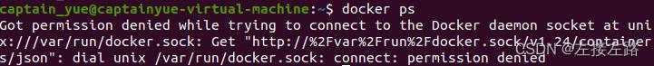

## 在线安装

### Fedora/CentOS/RHEL

1、若您安装过docker，需要先删掉，之后再安装依赖:

```
sudo yum remove docker docker-common docker-selinux docker-engine
sudo yum install -y yum-utils device-mapper-persistent-data lvm2
```

2、根据版本不同，下载repo文件。

```
# CentOS/RHEL 
wget -O /etc/yum.repos.d/docker-ce.repo https://repo.huaweicloud.com/docker-ce/linux/centos/docker-ce.repo
# Fedora
wget -O /etc/yum.repos.d/docker-ce.repo https://repo.huaweicloud.com/docker-ce/linux/fedora/docker-ce.repo
```

软件仓库地址替换为：

```
# CentOS/RHEL 
sudo sed -i 's+download.docker.com+repo.huaweicloud.com/docker-ce+' /etc/yum.repos.d/docker-ce.repo
# Fedora
sudo sed -i 's+download.docker.com+repo.huaweicloud.com/docker-ce+' /etc/yum.repos.d/docker-ce.repo
```

3、更新索引文件并安装

```
sudo yum makecache fast
sudo yum install docker-ce
```

### Debian/Ubuntu

1、若您安装过docker，需要先删掉，之后再安装依赖:

```
sudo apt-get remove docker docker-engine docker.io
sudo apt-get install apt-transport-https ca-certificates curl gnupg2 software-properties-common
```

2、根据版本不同，运行公钥，添加软件仓库。

信任Docker的GPG公钥:

```
# Debian
curl -fsSL https://repo.huaweicloud.com/docker-ce/linux/debian/gpg | sudo apt-key add -
# Ubuntu
curl -fsSL https://repo.huaweicloud.com/docker-ce/linux/ubuntu/gpg | sudo apt-key add -
```

对于amd64架构的计算机，添加软件仓库:

```
# Debian
sudo add-apt-repository "deb [arch=amd64] https://repo.huaweicloud.com/docker-ce/linux/debian $(lsb_release -cs) stable"
# Ubuntu
sudo add-apt-repository "deb [arch=amd64] https://repo.huaweicloud.com/docker-ce/linux/ubuntu $(lsb_release -cs) stable"
```

对于树莓派或其它Arm架构计算机，请运行:

```
# Debian
echo "deb [arch=armhf] https://repo.huaweicloud.com/docker-ce/linux/debian $(lsb_release -cs) stable" | sudo tee /etc/apt/sources.list.d/docker.list
# Ubuntu
echo "deb [arch=armhf] https://repo.huaweicloud.com/docker-ce/linux/ubuntu $(lsb_release -cs) stable" | sudo tee /etc/apt/sources.list.d/docker.list
```

3、更新索引文件并安装

```
sudo apt-get update
sudo apt-get install docker-ce
```

## 离线安装

### 下载二进制文件

Docker 各版本下载地址：[https://download.docker.com/linux/static/stable/x86_64/](https://download.docker.com/linux/static/stable/x86_64/)

```console
$ wget https://download.docker.com/linux/static/stable/x86_64/docker-20.10.24.tgz
$ tar zxvf docker-20.10.24.tgz
$ cp docker/* /usr/bin
```

### containerd service

<span data-type="text">准备 containerd 的 service</span>文件

```console
$ cat > /usr/lib/systemd/system/containerd.service <<EOF
[Unit]
Description=containerd container runtime
Documentation=https://containerd.io
After=network.target local-fs.target

[Service]
ExecStartPre=-/sbin/modprobe overlay
ExecStart=/usr/bin/containerd

Type=notify
Delegate=yes
KillMode=process
Restart=always
RestartSec=5
# Having non-zero Limit*s causes performance problems due to accounting overhead
# in the kernel. We recommend using cgroups to do container-local accounting.
LimitNPROC=infinity
LimitCORE=infinity
LimitNOFILE=infinity
# Comment TasksMax if your systemd version does not supports it.
# Only systemd 226 and above support this version.
TasksMax=infinity
OOMScoreAdjust=-999

[Install]
WantedBy=multi-user.target
EOF
```

### docker service

<span data-type="text">准备 docker 的 service文件</span>

```console
$ cat > /usr/lib/systemd/system/docker.service << EOF
[Unit]
Description=Docker Application Container Engine
Documentation=https://docs.docker.com
After=network-online.target docker.socket firewalld.service containerd.service
Wants=network-online.target
Requires=docker.socket containerd.service

[Service]
Type=notify
# the default is not to use systemd for cgroups because the delegate issues still
# exists and systemd currently does not support the cgroup feature set required
# for containers run by docker
ExecStart=/usr/bin/dockerd -H unix:// --containerd=/run/containerd/containerd.sock
ExecReload=/bin/kill -s HUP 
TimeoutSec=0
RestartSec=2
Restart=always

# Note that StartLimit* options were moved from "Service" to "Unit" in systemd 229.
# Both the old, and new location are accepted by systemd 229 and up, so using the old location
# to make them work for either version of systemd.
StartLimitBurst=3

# Note that StartLimitInterval was renamed to StartLimitIntervalSec in systemd 230.
# Both the old, and new name are accepted by systemd 230 and up, so using the old name to make
# this option work for either version of systemd.
StartLimitInterval=60s

# Having non-zero Limit*s causes performance problems due to accounting overhead
# in the kernel. We recommend using cgroups to do container-local accounting.
LimitNOFILE=infinity
LimitNPROC=infinity
LimitCORE=infinity

# Comment TasksMax if your systemd version does not support it.
# Only systemd 226 and above support this option.
TasksMax=infinity

# set delegate yes so that systemd does not reset the cgroups of docker containers
Delegate=yes

# kill only the docker process, not all processes in the cgroup
KillMode=process
OOMScoreAdjust=-500

[Install]
WantedBy=multi-user.target
EOF
```

### docker socket

<span data-type="text">准备 docker 的 socket 文件</span>

```console
$ cat > /usr/lib/systemd/system/docker.socket << EOF
[Unit]
Description=Docker Socket for the API

[Socket]
ListenStream=/var/run/docker.sock
SocketMode=0660
SocketUser=root
SocketGroup=docker

[Install]
WantedBy=sockets.target
EOF
```

### <span data-type="text">docker </span>daemon config

```console
$ mkdir -p /etc/docker

$ cat >/etc/docker/daemon.json <<EOF
{
    "exec-opts": [
        "native.cgroupdriver=systemd"
    ],
    "data-root": "/var/lib/docker",
    "max-concurrent-downloads": 20,
    "max-concurrent-uploads": 10,
    "default-ulimits": {
        "nofile": {
            "Name": "nofile",
            "Hard": 655360,
            "Soft": 655360
        }
    },
    "log-driver": "json-file",
    "log-opts": {
        "max-size": "100m",
        "max-file": "5"
    },
    "storage-driver": "overlay2",
    "ipv6": false,
    "registry-mirrors": [
        "https://dockerpull.com"
    ]
}
EOF
```

### 启动服务

```console
# 添加 docker 用户名组
$ groupadd docker
# 重载配置 
$ systemctl daemon-reload
# 启动服务
$ systemctl start containerd.service && systemctl enable containerd.service
$ systemctl start docker.socket && systemctl enable docker.socket
$ systemctl start docker.service && systemctl enable docker.service
```

## 阿里云镜像加速

* ​地址：[https://promotion.aliyun.com/ntms/act/kubernetes.html](https://promotion.aliyun.com/ntms/act/kubernetes.html)
* 注册一个属于自己的阿里云账户
* 获得加速器地址连接：

  1. ​登陆阿里云开发者平台
  2. 点击控制台
  3. 选择容器镜像服务
  4. 获取加速器地址

```console
mkdir -p /etc/docker 
tee /etc/docker/daemon.json <<-'EOF'
{ 
  "registry-mirrors": ["https://aa25jngu.mirror.aliyuncs.com"] 
} 
EOF
```

**重启服务器**

```shell
# 重启服务器
systemctl daemon-reload
systemctl restart docker
```

## Docker命令中必须加上sudo

### 问题背景

初次使用 docker 时，安装后通过终端进行 docker 命令时必须加上 root 权限，否则将会报错，如下所示：

​​

问题原因和相应的解决方法在官方网站中有文档解释：

[https://docs.docker.com/engine/install/linux-postinstall/](https://docs.docker.com/engine/install/linux-postinstall/)

### 问题原因

docker 提供服务的后台守护进程是绑定至一个 Unix socket 上而非 TCP 端口上，而通常这个 Unix socket 只能由 root 用户使用，普通权限的用户使用时必须加上 ***sudo*** 命令

### 解决方法

知道原因以后，解决方法就显而易见了：让当前用户有使用 Unix socket 的权限  
具体做法是创建一个名叫 docker 的 Unix 用户组，并且把当前用户添加进去，当 docker 守护进程启动创建 Unix socket 时就会自动令该组下的所有成员能够进行访问

```bash
sudo groupadd docker
sudo usermod -aG docker $USER		#此处的USER是系统变量，直接使用该语句即可
newgrp docker
```

通过上述方法可能会令当前用户拥有 root 权限，所以应当谨慎使用，具体风险如下：

[https://docs.docker.com/engine/security/#docker-daemon-attack-surface](https://docs.docker.com/engine/security/#docker-daemon-attack-surface)

大家可以看一看官方文档，里面也列举了可能会遇到的其他问题

## 永远的HelloWorld

启动Docker后台容器（测试运行 hello-world）

```console
$ docker run --rm hello-world
Unable to find image 'hello-world:latest' locally
latest: Pulling from hello-world
c1ec31eb5944: Pull complete
Digest: sha256:1408fec50309afee38f3535383f5b09419e6dc0925bc69891e79d84cc4cdcec6
Status: Downloaded newer image for hello-world:latest

Hello from Docker!
This message shows that your installation appears to be working correctly.

To generate this message, Docker took the following steps:
 1. The Docker client contacted the Docker daemon.
 2. The Docker daemon pulled the "hello-world" image from the Docker Hub.
    (amd64)
 3. The Docker daemon created a new container from that image which runs the
    executable that produces the output you are currently reading.
 4. The Docker daemon streamed that output to the Docker client, which sent it
    to your terminal.

To try something more ambitious, you can run an Ubuntu container with:
 $ docker run -it ubuntu bash

Share images, automate workflows, and more with a free Docker ID:
 https://hub.docker.com/

For more examples and ideas, visit:
 https://docs.docker.com/get-started/
```

‍
