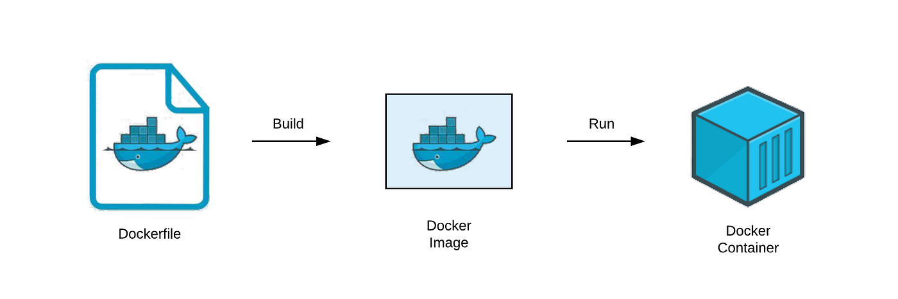
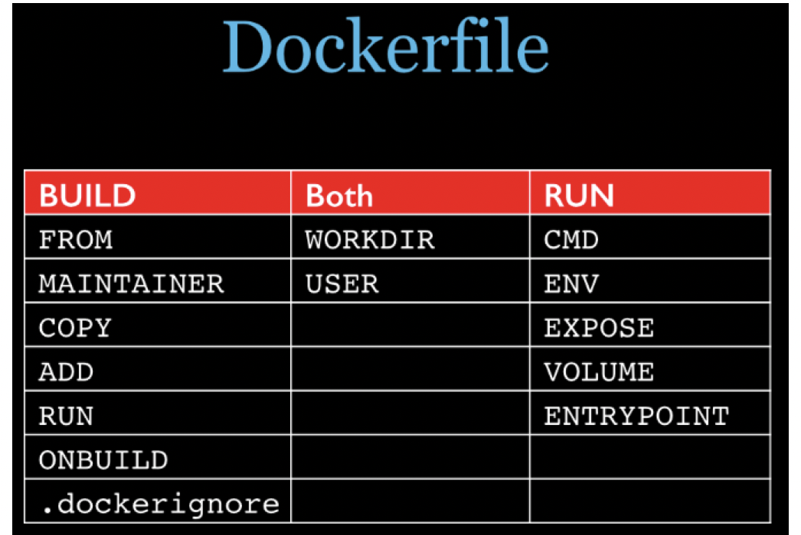

DockerFile是用来构建Docker镜像的文本文件，是有一条条构建镜像所需的指令和参数构成的脚本。

​​

从应用软件的角度来看，Dockerfile、Docker镜像与Docker容器分别代表软件的三个不同阶段，

* Dockerfile是软件的原材料
* Docker镜像是软件的交付品
* Docker容器则可以认为是软件镜像的运行态，也即依照镜像运行的容器实例

Dockerfile面向开发，Docker镜像成为交付标准，Docker容器则涉及部署与运维，三者缺一不可，合力充当Docker体系的基石。

1. Dockerfile，需要定义一个Dockerfile，Dockerfile定义了进程需要的一切东西。Dockerfile涉及的内容包括执行代码或者是文件、环境变量、依赖包、运行时环境、动态链接库、操作系统的发行版、服务进程和内核进程(当应用进程需要和系统服务和内核进程打交道，这时需要考虑如何设计namespace的权限控制)等等;
2. Docker镜像，在用Dockerfile定义一个文件之后，docker build时会产生一个Docker镜像，当运行 Docker镜像时会真正开始提供服务;
3. Docker容器，容器是直接提供服务的。

## 构建过程解析

### **基础知识**

1. 每条保留字指令都必须为大写字母且后面跟随至少一个参数
2. 指令按照从上到下，顺序执行
3. ​`#`​表示注释
4. 每条指令都会创建一个新的镜像层并对镜像进行提交。

### **执行流程**

1. docker从技术镜像运行一个容器
2. 执行一条指令比鞥对容器做出修改
3. 执行类似docker commit 的操作提交一个新的镜像层
4. docker 在基于刚提交的镜像运行一个新容器
5. 执行dockerfile中的下一条指令直到所有执行执行完成。

## 常用指令

* ​`FROM`​: 基础镜像，当前新镜像是基于哪个镜像的，指定一个已经存在的镜像作为模板，第一条必须是`FROM`​
* ​`MANINTAINER`​: 镜像维护者的姓名和邮箱地址
* ​`RUN`​: 用于在构建镜像时执行命令，即`docker build`​时执行。`RUN`​ 指令有两种主要的格式：`shell`​ 格式和 `exec`​ 格式。

  * Shell 格式将命令作为单个字符串传递给默认的 shell（通常是 `/bin/sh -c`​），例如：

    ```dockerfile
    RUN echo "Hello, World!"
    ```

  * Exec 格式则是将命令和参数作为 JSON 数组传递，避免了 shell 解析，适用于需要避免 shell 处理的情况：

    ```dockerfile
    RUN ["echo", "Hello, World!"]
    ```

* ​`EXPOSE`​：当前容器对外暴露出的端口
* ​`WORKDIR`​：指定在创建容器后默认的工作目录。

* ​`USER`​：指定该镜像以什么样的用户去执行，如果都不指定，默认是root
* ​`ENV`​：用来在构建镜像过程中设置环境变量

  ```dockerfile
  ENV MY_PATH /usr/mytest 
  # 这个环境变量可以在后续的任何RUN指令中使用，这就如同在命令前面指定了环境变量前缀一样； 
  也可以在其它指令中直接使用这些环境变量， 
    
  WORKDIR $MY_PATH 
  ```

* ​`ADD`​：将宿主机目录下的文件拷贝进镜像且会自动处理URL和解压tar压缩包
* ​`COPY`​：类似`ADD`​，拷贝文件和目录到镜像中。将从构建上下文目录中<源路径>的文件/目录复制到新的一层镜像内的<目标路径>位置

  ```dockerfile
  COPY src dest

  COPY ["src","dest"]

  # <src源路径>：源文件或源目录

  # <dest目标路径>: 容器内的指定路径，该路径不用事先建好，路径不存在的话，会自动创建。
  ```

* ​`VOLUME`​：容器数据卷，用于数据保存和持久化的工作
* ​`CMD`​：为启动的容器指定默认要运行的程序，程序运行结束，容器也就结束；

  **==Dockerfile 中可以由多个CMD指令，但是只有最后一个生效，CMD会被docker run 之后的参数替换。==**

  他和前面RUN命令的区别：

  * **==CMD 是在 docker run 时运行。==**
  * **==RUN 是在docker build 时运行==**
* ​`ENTRYPOINT`​：也是用来指定一个容器启动时要运行的命令

  类似于CMD指令，但是ENTRYPOINT不会被`docker run `​后面的命令覆盖，而且这些命令行参数会被当作参数送给ENTRYPOINT指令指定的程序。

  命令格式：`ENTRYPOINT["<executeable>","<param1>","<param2>",...]`​

  ENTRYPOINT 可以和CMD一起用，一般是 变参 才会使用 CMD ，这里的CMD等于是在给 ENTRYPOINT 传参。

  ```dockerfile
  FROM nginx

  ENTRYPOINT ["nginx", "-c"]  #定参
  CMD ["/etc/nginx/nginx.conf"] # 变参
  ```

  |是否传参|按照dockerfile编写执行|传参运行|
  | ----------------| ----------------------| --------|
  |Docker命令|​`docker run nginx:test`​|​`docker run nginx:test -c /etc/nginx/new.conf`​|
  |衍生出的实际命令|​`nginx -c /etc/nginx/nginx.conf`​|​`nginx -c /etc/nginx/new.conf`​|

  优点：**==在执行docker run 的时候可以指定 ENTRYPOINT 运行所需的参数。==**

  注意：**==如果Dockerfile 中如果存在多个 ENTRYPOINT 指令，仅最后一个生效。==**

​​

## 构建镜像

编写DockerFile文件

```dockerfile
FROM nginx
MAINTAINER liusf<lsf_2012@163.com> 

ENV STATIDCPATH /usr/share/nginx/html 
WORKDIR $STATIDCPATH

RUN echo "<h1>hello world</h1>" > $STATIDCPATH/index.html

EXPOSE 80 

CMD ["nginx", "-g", "daemon off;"]
```

<span data-type="text">构建</span>镜像

```console
$ docker build -t nginx-helloworld:latest .
Sending build context to Docker daemon   70.9MB
Step 1/7 : FROM nginx
 ---> fffffc90d343
Step 2/7 : MAINTAINER liusf<lsf_2012@163.com>
 ---> Running in 603cfd20d690
Removing intermediate container 603cfd20d690
 ---> 49806f7cc92e
Step 3/7 : ENV STATIDCPATH /usr/share/nginx/html
 ---> Running in 596c474c36c9
Removing intermediate container 596c474c36c9
 ---> d76cb0bc5ec7
Step 4/7 : WORKDIR $STATIDCPATH
 ---> Running in 2510d1f0fd5d
Removing intermediate container 2510d1f0fd5d
 ---> d610c3ee0f83
Step 5/7 : RUN echo "<h1>hello world</h1>" > $STATIDCPATH/index.html
 ---> Running in b1bbe3224f46
Removing intermediate container b1bbe3224f46
 ---> d31e39296b3b
Step 6/7 : EXPOSE 80
 ---> Running in 24dd94df0272
Removing intermediate container 24dd94df0272
 ---> 48aa6fb49c84
Step 7/7 : CMD ["nginx", "-g", "daemon off;"]
 ---> Running in fedf9d7e145a
Removing intermediate container fedf9d7e145a
 ---> 05452cc18ba6
Successfully built 05452cc18ba6
Successfully tagged nginx-helloworld:latest
```

<span data-type="text">运行</span>镜像

```console
$ docker run -d --name nginx-helloworld -p 80:80 nginx-helloworld:latest
d7d57a5f0b48617b6613ea167ee16ab66b2ba10e150637cad07d0f455a6d5b24
$ docker ps -a
CONTAINER ID   IMAGE                     COMMAND                  CREATED         STATUS        PORTS
                    NAMES
d7d57a5f0b48   nginx-helloworld:latest   "/docker-entrypoint.…"   2 seconds ago   Up 1 second   0.0.0.0:80->80/tcp, :::80->80/tcp   nginx-helloworld
```

## 最小镜像

​`scratch`​

官方说明：该镜像是一个空的镜像，可以用于构建基础镜像（例如 Debian、Busybox）或超小镜像，可以说是真正的从零开始构建属于自己的镜像。

从 Docker 1.5.0 开始，`FROM scratch`​在DockerFile中是一个无操作，并且不会在镜像中创建额外的层（因此以前的 2 层镜像将改为 1 层镜像）。

> 解决了先有鸡还是先有蛋的问题，即第一个镜像是怎么来的

实际上，我们可以创建自己的 scratch 镜像：

```bash
$ tar cv --files-from /dev/null | docker import - scratch
```

下面是一个简单的 Go 语言开发的 web 程序代码：

```go
package main

import (
	"fmt"
	"net/http"
)

func main() {
	http.HandleFunc("/", func(w http.ResponseWriter, r *http.Request) {
		fmt.Fprintf(w, "Hello, you've requested: %s\n", r.URL.Path)
	})

	http.ListenAndServe(":80", nil)
}
```

我们可以使用 `go build`​构建 helloworld 可执行文件的时候指定静态链接标志 `-static`​ 和其他参数，使生成的 helloowrld 二进制文件静态链接所有的库：

```bash
$ CGO_ENABLED=0 GOOS=linux go build -a -ldflags '-extldflags "-static"' -o helloworld .
```

以 scratch 为基础制作 docker 镜像，dockerfile 如下：

```dockerfile
FROM scratch
ADD helloworld /
CMD ["/helloworld"]
```

接下来开始编译并构建 docker 镜像：

```bash
$ docker build -t helloworld .
Sending build context to Docker daemon  7.376MB
Step 1/3 : FROM scratch
 --->
Step 2/3 : ADD helloworld /
 ---> 000f150706c7
Step 3/3 : CMD ["/helloworld"]
 ---> Running in f9c2c6932a34
Removing intermediate container f9c2c6932a34
 ---> 496f865c05e4
Successfully built 496f865c05e4
Successfully tagged helloworld:latest
```

这样镜像就构建成功了，我们来看一下大小

```bash
mc@mcmbp:~/gocode/src/hello# docker image ls
REPOSITORY          TAG                 IMAGE ID            CREATED             SIZE
helloworld          latest              496f865c05e4        8 seconds ago       7.37MB
```

运行 docker 镜像：

```console
$ docker run -ti -d -p 80:80 helloworld
3c77ae750352245369c4d142e4e57fd3c0f1e11d67ef857235417ec475ef6286
mc@mcmbp:~/gocode/src/hello# curl -v localhost
* Rebuilt URL to: localhost/
*   Trying 127.0.0.1...
* Connected to localhost (127.0.0.1) port 80 (#0)
> GET / HTTP/1.1
> Host: localhost
> User-Agent: curl/7.47.0
> Accept: */*
>
< HTTP/1.1 200 OK
< Date: Tue, 19 Mar 2019 12:54:28 GMT
< Content-Length: 27
< Content-Type: text/plain; charset=utf-8
<
Hello, you've requested: /
* Connection #0 to host localhost left intact
```

## 多阶段构建

对于上面的构建过程实在是过于麻烦，对于有些有强迫症的程序员来说，他们想更进一步，为什么不在容器里面编译可执行文件然后再构建镜像呢？这样的好处在于可以控制 Go 语言的编译环境，保证可重复编译，而且对于某些与持续集成工具集成的项目来说十分友好。

Docker-CE 17.5 引入了一个从 scratch 构建镜像的新特性，叫做“Multi-Stage Builds”。有了这个新特性之后，我们可以这样去写我们的 dockerfile:

```dockerfile
FROM golang as compiler
WORKDIR /opt/helloworld/
ADD * .
RUN CGO_ENABLED=0 GOOS=linux go build -a -ldflags '-extldflags "-static"' -o helloworld .

FROM scratch
WORKDIR /app
COPY --from=compiler /opt/helloworld/helloworld .
EXPOSE 80
CMD ["./helloworld"]
```

是的，你没有看错，确实是一个 dockerfile 里面包含两个 FROM 指令，需要说明的是：

1. ​`FROM golang as compiler`​ 是给第一阶段的构建起一个名字叫 `compiler`​
2. ​`COPY --from=compiler /opt/helloworld/helloworld .`​ 是引用第一阶段的构建产出，以此构建第二阶段

如果你没有给第一阶段起名，可以使用构建阶段的序号(以0开始)来指定，像这样：`--from=0`​，但是出于可读性的考虑，起名感觉更好一点儿。

构建镜像

```dockerfile
$ docker build -f Dockerfile -t liusf/helloworld:v1 .
[+] Building 25.7s (11/11) FINISHED                                                                                                                         
 => [internal] load build definition from Dockerfile                                                                                                       0.0s
 => => transferring dockerfile: 298B                                                                                                                       0.0s
 => [internal] load .dockerignore                                                                                                                          0.0s
 => => transferring context: 2B                                                                                                                            0.0s
 => [internal] load metadata for docker.io/library/golang:latest                                                                                          15.4s
 => [compiler 1/4] FROM docker.io/library/golang@sha256:c72fa9afc50b3303e8044cf28fb358b48032a548e1825819420fd40155a131cb                                   0.0s
 => CACHED [stage-1 1/2] WORKDIR /app                                                                                                                      0.0s
 => [internal] load build context                                                                                                                          0.0s
 => => transferring context: 382B                                                                                                                          0.0s
 => CACHED [compiler 2/4] WORKDIR /opt/helloworld/                                                                                                         0.0s
 => [compiler 3/4] ADD * .                                                                                                                                 0.0s
 => [compiler 4/4] RUN CGO_ENABLED=0 GOOS=linux go build -a -ldflags '-extldflags "-static"' -o helloworld .                                              10.0s
 => [stage-1 2/2] COPY --from=compiler /opt/helloworld/helloworld .                                                                                        0.0s
 => exporting to image                                                                                                                                     0.1s
 => => exporting layers                                                                                                                                    0.1s
 => => writing image sha256:ac3add61f74c073f6b901d2a4ad82a312bc5f039f8a4fd7fed73d1132871e2e5                                                               0.0s
 => => naming to docker.io/liusf/helloworld:v1                                                                                                             0.0s
```

构建完成后我们来看镜像的大小：

```dockerfile
$ docker images                                  
REPOSITORY                      TAG       IMAGE ID       CREATED          SIZE
liusf/helloworld                v1        ac3add61f74c   16 seconds ago   6.07MB
```

运行 docker 镜像：

```console
$ docker run -dit -p 80:80 --name hellworld liusf/helloworld:v1
3c77ae750352245369c4d142e4e57fd3c0f1e11d67ef857235417ec475ef6286

$ curl -v localhost
*   Trying ::1...
* TCP_NODELAY set
* Connected to localhost (::1) port 80 (#0)
> GET / HTTP/1.1
> Host: localhost
> User-Agent: curl/7.64.1
> Accept: */*
> 
< HTTP/1.1 200 OK
< Date: Sat, 29 Jul 2023 23:40:35 GMT
< Content-Length: 27
< Content-Type: text/plain; charset=utf-8
< 
Hello, you've requested: /
* Connection #0 to host localhost left intact
* Closing connection 0
```

这样，我们就将编译并创建最终镜像集成到一个 dockerfile 里面了，而且构建出来的镜像体积也非常小。

‍

‍
