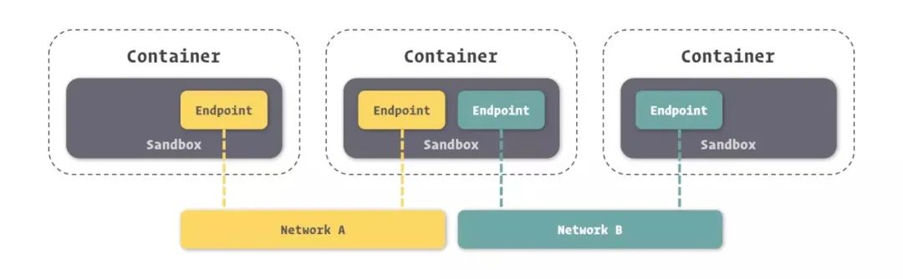
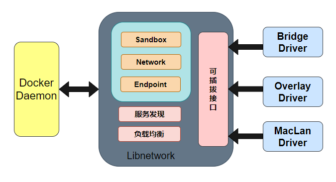
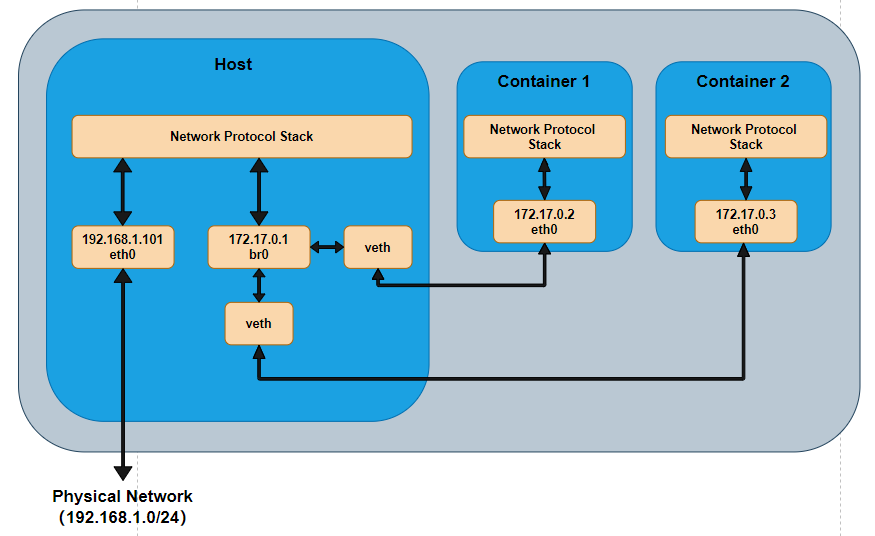
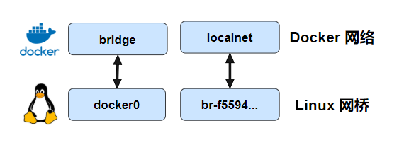
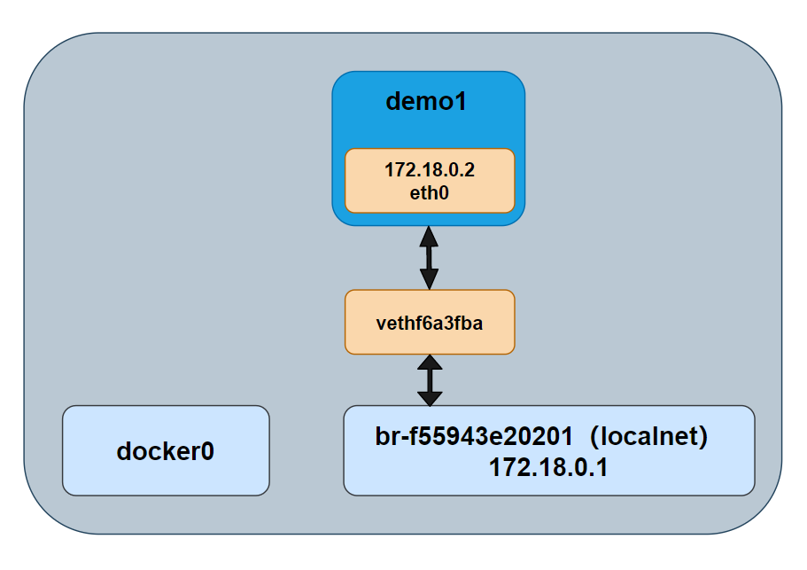
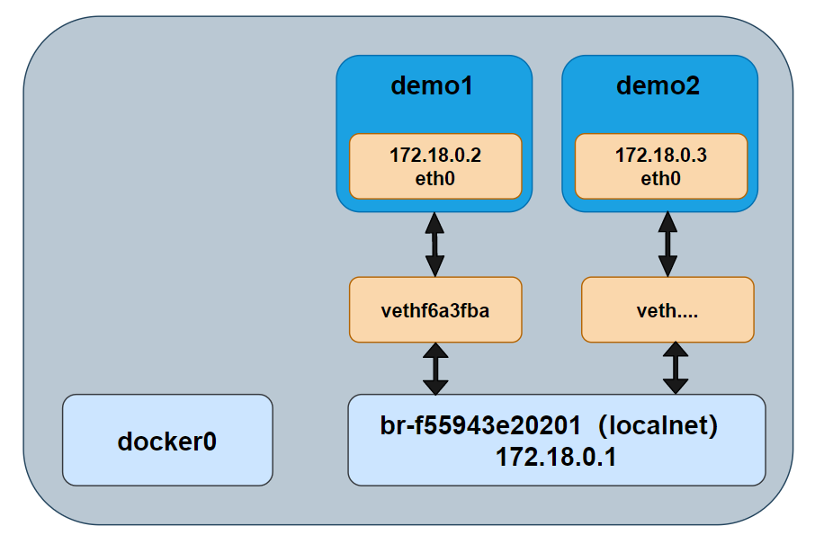
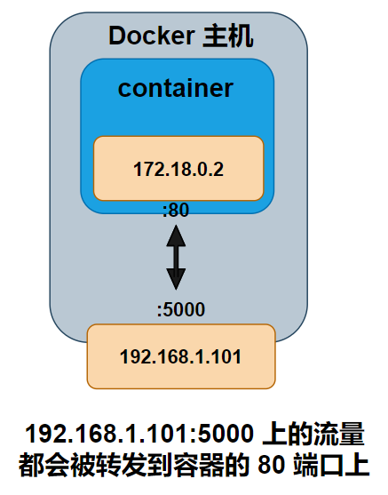
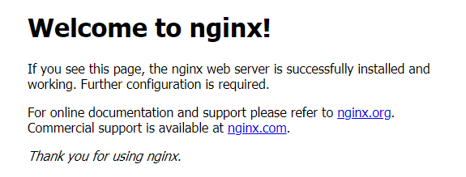

## **Docker 网络理论**

容器网络实质上是由 Dokcer 为应用程序所创造的虚拟环境的一部分，它能让应用从宿主机操作系统的网络环境中独立出来，形成容器自有的网络设备、IP 协议栈、端口套接字、IP 路由表、防火墙等等与网络相关的模块。

Docker 为实现容器网络，主要采用的架构由三部分组成：CNM、Libnetwork 和驱动。

### **CNM**

Docker 网络架构采用的设计规范是 CNM（Container Network Model）：CNM 中规定了 Docker 网络的基础组成要素：Sandbox、Endpoint、Network。如图所示，

​​

* Sandbox，提供了容器的虚拟网络栈，也即端口套接字、IP 路由表、防火墙、DNS 配置等内容。主要用于隔离容器网络与宿主机网络，形成了完全独立的容器网络环境。
* Network，Docker 内部的虚拟子网，网络内的参与者相互可见并能够进行通讯。Docker 的虚拟网路和宿主机网络是存在隔离关系的，其目的主要是形成容器间的安全通讯环境。
* Endpoint，就是虚拟网络的接口，就像普通网络接口一样，Endpoint 的主要职责是负责创建连接。在 CNM 中，终端负责将沙盒连接到网络。个人理解：Endpoint 与常见的网络适配器类似，也就意味着 Endpoint 只能接入某一个网络。因此，如果容器需要接入到多个网络，就需要多个 Endpoint。

> ★如上图所示（我们将图中的三个容器从左到右依次标记为 1、2、3），那么容器 2 有两个 endpoint 并且分别接入 NetworkdA 和 NetworkB。那么容器 1 和容器 2 是可以实现通信的，因为都接入了 NetworkA。但是容器 3 和容器 1，以及容器 2 的两个 Endpoint 之间是不能通信的，除非有三层路由器的支持。 ”

### **Libnetwork**

Libnetwork 是 CNM 的标准实现。Libnetwork 是开源库，采用 Go 语言编写（跨平台的），也是 Docker 所使用的库，Docker 网络架构的核心代码都在这个库中。Libnetwork 实现了 CNM 中定义的全部三个组件，此外它还实现了本地服务发现、基于 Ingress 的容器负载均衡，以及网络控制层和管理层功能。

### **驱动**

如果说 Libnetwork 实现了控制层和管理层功能，那么驱动就负责实现数据层。比如网络的连通性和隔离性是由驱动来处理的。驱动通过实现特定网络类型的方式扩展了 Docker 网络栈，例如桥接网络和覆盖网络。

Docker 内置了若干驱动，通常被称作原生驱动或者本地驱动。比如 ​**Bridge Driver**​、​**Host Driver**​、​**Overlay Driver**​、​**MacLan Driver**​、**None Driver** 等等。第三方也可以编写 Docker 网络驱动，这些驱动被叫做远程驱动，例如 Calico、Contiv、Kuryr 以及 Weave 等。每个驱动负责创建其上所有网络资源的创建和管理。

其中 Bridge 和 Overlay 在开发过程中使用频率较高。

* Bridge，Docker 容器的默认网络驱动，通过网桥来实现网络通讯。
* Overlay，借助 Docker 集群模块 Docker Swarm 搭建的跨 Docker Daemon 网络。通过它可以搭建跨物理网络主机的虚拟网络，进而让不同物理机中运行的容器感知不到多个物理机的存在。

​​

在 Docker 安装时，会自动安装一块 Docker 网卡称为 docker0，用于 Docker 各容器及宿主机的网络通信。

```javascript
docker0   Link encap:Ethernet  HWaddr 02:42:be:6b:61:dc
          inet addr:172.17.0.1  Bcast:172.17.255.255  Mask:255.255.0.0
          inet6 addr: fe80::42:beff:fe6b:61dc/64 Scope:Link
          UP BROADCAST RUNNING MULTICAST  MTU:1500  Metric:1
          RX packets:0 errors:0 dropped:0 overruns:0 frame:0
          TX packets:332 errors:0 dropped:0 overruns:0 carrier:0
          collisions:0 txqueuelen:0
          RX bytes:0 (0.0 B)  TX bytes:30787 (30.7 KB)
```

> ★个人理解：CNM 就是一个设计文档，指导你怎么去实现容器网络，而 Libnetwork 和驱动则是其具体实现，从而确保容器网络的通信。 ”

## **桥接网络**

​**Docker 的 bridge 网络采用内置的 bridge 驱动，而 bridge 的底层采用的是 Linux 内核中 Linux bridge 技术**​（这意味着 bridge 是高性能并且是非常稳定的）。

那么 Linux 内核中 Linux bridge 应用于容器的话，到底是一个什么样的拓扑图呢？如图所示（这个拓扑关系不清楚接下去的很多东西难以理解，所以先贴出采用 bridge 之后的一个拓扑图），由于容器运行在自己单独的 network namespace 中，所以有单独的协议栈。容器中配置网关为 172.17.0.1，发出去的数据包先到达 br0，然后交给主机的协议栈，由于目的 IP 是外网 IP，且主机会开启 IP forward 功能，于是数据包通过主机的 eth0 发出去。由于 172.17.0.1 是内网 IP ，所以一般发出去之前会做 NAT 转换。由于要进过主机的协议栈并且要做 NAT 转换，所以性能上可能会差点，但是优点就是容器处于内网中，安全性相对要高点。

​​

默认情况下，创建的容器在没有使用 --network 参数指定要加入的 docker 网络时，默认都是加入 Docker 默认的单机桥接网络，也就是下面的 name 为 bridge 的网络。

```javascript
$ docker network ls
NETWORK ID          NAME                DRIVER              SCOPE
0dda6f303b8b        bridge              bridge              local
```

而默认的 bridge 网络是被映射到内核中为 docker0 的网桥上。

```javascript
$ ip link show docker0
4: docker0: <NO-CARRIER,BROADCAST,MULTICAST,UP> mtu 1500 qdisc noqueue state DOWN mode DEFAULT group default
    link/ether 02:**:**:**:**:** brd ff:ff:ff:ff:ff:ff

$ docker network inspect bridge | grep bridge.name
            "com.docker.network.bridge.name": "docker0",
```

Docker 默认的 bridge 网络和 Linux 内核中的 “docker0” 网桥是一个对应关系，如图所示。bridge 是 Docker 中对网络的命名，而 docker0 是内核中网桥的名字。（个人理解：你就可以把 bridge 和 docker0 当成 Linux 网桥的两个名字，两个都是代表同一个东西。docker 为了管理网络，又给 docker0 这个网桥取名为 bridge）。

​​

那么，容器在没有指定要加入的网络情况下，都是加入这个网络的，假如之后的拓扑图跟前面的一样。另外，单机桥接网络中的容器想要对外发布服务的话，需要依赖于端口映射，这也是为啥我们在启动容器的时候需要指定端口映射关系 的原因。

下面我们通过创建一个新的 Docker 桥接网络来阐述容器内部的通信、端口映射等情况。

### **创建新的单机桥接网络**

使用 `docker network create`​ 命令，我们可创建一个名为 “localnet” 的单机桥接网络，并且在内核中还会多出一个新的 Linux 网桥。

```javascript
$ docker network create -d bridge localnet

$ docker network ls
NETWORK ID          NAME                DRIVER              SCOPE
			......
f55943e20201        localnet            bridge              local
```

在创建完之后，我们可以通过 brctl 工具来查看系统中的 Linux 网桥。可以看到，输出的内容中包含了两个网桥，docker0 是默认的 Docker bridge 网络所使用的网桥，br-f55943e20201 是 Docker localnet 网络所使用的网桥。这两个网桥目前都没有任何设备接入（看 interface 列）。这两个网桥所处的网段是不同的，一个是 172.18.0.1，另一个则是 172.17.0.1。

```javascript
$ brctl show
bridge name     bridge id               STP enabled     interfaces
br-f55943e20201 8000.02421d9aa3e1       no
docker0         8000.0242be6b61dc       no

$ ifconfig
br-f55943e20201 Link encap:Ethernet  HWaddr 02:42:1d:9a:a3:e1
          inet addr:172.18.0.1  Bcast:172.18.255.255  Mask:255.255.0.0
			......
docker0   Link encap:Ethernet  HWaddr 02:42:be:6b:61:dc
          inet addr:172.17.0.1  Bcast:172.17.255.255  Mask:255.255.0.0
			......
```

​​

### **同个网络中的容器间通信**

使用下面这条命令即可运行一个新的容器，并且让这个新容器加入到 localnet 这个网络中的。

```javascript
$ docker container run -d --name demo1 --network localnet alpine sleep 3600
```

我们查看网桥的情况，demo1 的网络接口连接到了网桥 br-f55943e20201 上，如图所示。

```javascript
$ brctl show
bridge name     bridge id               STP enabled     interfaces
br-f55943e20201 8000.02421d9aa3e1       no              vethf6a3fba
docker0         8000.0242be6b61dc       no
```

​​

如果在相同的网络中继续接入新的容器，那么新接入的容器是可以通过 demo1 这个名称来 ping 通的。如下所示，我们创建了一个新的容器（demo2），并且在这个容器中直接 ping demo1 发现可以的 ping 通的。这是因为，demo2 运行了一个本地 DNS 解析器，该解析器会将该请求转发到 Docker 内部 DNS 服务器中。DNS 服务器中记录了容器启动时通过 --name 或者 --net-alias 参数指定的名称和容器之间的和映射关系。

之外，我们可以看到 demo1 的 IP 地址是 172.18.0.2，这个与网桥 br-f55943e20201 是处于同一个网段内的。

```javascript
/ # ls
bin    dev    etc    home   lib    media  mnt    opt    proc   root   run    sbin   srv    sys    tmp    usr    var
/ # ping demo1
PING demo1 (172.18.0.2): 56 data bytes
64 bytes from 172.18.0.2: seq=0 ttl=64 time=0.230 ms
64 bytes from 172.18.0.2: seq=1 ttl=64 time=0.161 ms
```

​​

> ★Docker 默认的 bridge 网络是不支持通过 Docker DNS 服务进行域名解析的，自定义桥接网络是可以的。 ”

### **暴露端口**

同一个网络中的容器之间虽然可以互相 ping 通，但是并不意味着可以任意访问容器中的任何服务。Docker 为容器增加了一套安全机制，只有容器自身允许的端口，才能被其他容器所访问。如下所示，我们可以通过 `docker container ls`​ 命令可以看到容器暴露给其他容器访问的端口是 80，那么我们只能容器的 80 端口进行访问，而不能对没有开放的 22 端口进行访问。

```javascript
$ docker container ls
CONTAINER ID        IMAGE               COMMAND                  CREATED             STATUS              PORTS               NAMES
5a8dece3841d        nginx               "/docker-entrypoint.…"   3 minutes ago       Up 3 minutes        80/tcp              web

$ telnet 172.18.0.2 80
Trying 172.18.0.2...
Connected to 172.18.0.2.
Escape character is '^]'.

$ telnet 172.18.0.2 20
Trying 172.18.0.2...
telnet: Unable to connect to remote host: Connection refused
```

我们可以在镜像创建的时候定义要暴露的端口，也可以在容器创建时定义要暴露的端口，使用 --expose。如下所示，就额外暴露了 20、22 这两个端口。

```javascript
$ docker container run -d --name web --expose 22 --expose 20 nginx

$ docker container ls
CONTAINER ID        IMAGE               COMMAND                  CREATED             STATUS              PORTS                    NAMES
4749dac32711        nginx               "/docker-entrypoint.…"   12 seconds ago      Up 10 seconds       20/tcp, 22/tcp, 80/tcp   web
```

容器的端口暴露类似于打开了容器的防火墙，具体能不能通过这个端口访问容器中的服务，还得看容器中有无应用监听并处理来自这个端口的请求。

### **端口映射**

上面提到的桥接网络中的容器只能与位于相同网络中的容器进行通信，假如一个容器想对外提供服务的话，需要进行端口映射。端口映射将容器的某个端口映射到 Docker 主机端口上。那么任何发送到该端口的流量，都会被转发到容器中。如图所示，容器内部开放端口为 80，该端口被映射到了 Docker 主机的 10.0.0.15 的 5000 端口上。最终访问 10.0.0.15:5000 的所有流量都会被转发到容器的 80 端口。

​​

如下图所示，假设我们运行了一个新的 web 服务容器，并且将容器 80 端口映射到 Dokcer 主机的 5000 端口。

```javascript
$ docker container run -d --name web --network localnet -p 5000:80 nginx
```

那么，当我们通过 web 浏览器访问 Docker 主机的 5000 端口时，会得到如图所示的结果。外部系统可以通过访问 Docker 主机的 TCP 端口 5000，来访问运行在桥接网络上的 Nginx 容器了。

端口映射之后，假如主机的 5000 端口被占用了，那么其他容器就不能再使用这个端口了。

​​

## **相关命令**

```javascript
# 列出运行在本地 docker 主机上的全部网络
docker network ls

# 提供 Docker 网络的详细配置信息
docker network inspect <NETWORK_NAME>

# 创建新的单机桥接网络，名为 localnet，其中 -d 不指定的话，默认是 bridge 驱动。并且主机内核中也会创建一个新的网桥。
docker network create -d bridge localnet

# 删除 Docker 主机上指定的网络
docker network rm

# 删除主机上全部未使用的网络
docker network prune

# 运行一个新的容器，并且让这个容器加入 Docker 的 localnet 这个网络中
docker container run -d --name demo1 --network localnet alpine sleep 3600

# 运行一个新的容器，并且让这个容器暴露 22、20 两个端口
docker container run -d --name web --expose 22 --expose 20 nginx

# 运行一个新的容器，并且将这个容器的 80 端口映射到主机的 5000 端口
docker container run -d --name web --network localnet -p 5000:80 nginx

# 查看系统中的网桥
brctl show
```

## 备注

转载[https://cloud.tencent.com/developer/article/1747307](https://cloud.tencent.com/developer/article/1747307)，如有侵权删除
