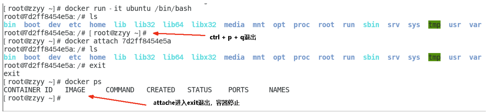
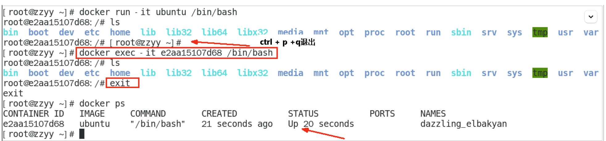
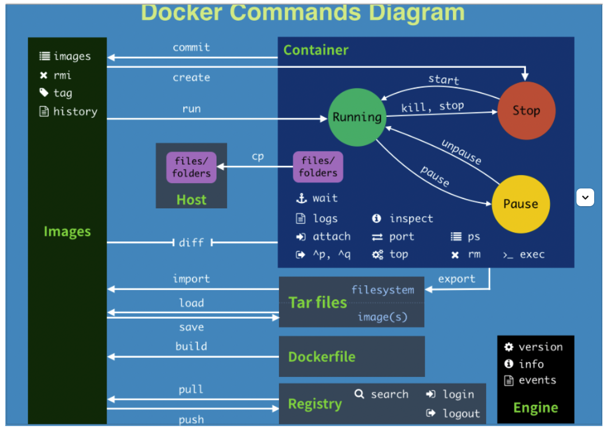

# docker命令

# 容器

## 生命周期

### 创建并启动容器

- 基于mysql 5.7版本的镜像
- `--name`: 指定容器名字为`mysql3307`
- `-p`: 端口映射，将容器内的3306的端口号与本地主机的3307进行映射
- `-v`: 路径映射，将容器内的`/var/lib/mysql/`与本地主机的`~/mysql/`进行映射
- `-d`: 代表后台运行容器，返回容器ID
- `-i`: 代表需要进行容器内，进入交互模式
- `-t`: 指定进入模式时，所使用的终端工具，一般`it`是绑定使用

> 容器的名字和ID都是唯一的，对容器进行操作时，通过容器名或ID都可以找到唯一的容器

```shell
docker run -itd --name="mysql3307" -p 3307:3306 -v ~/mysql3307/conf/:/etc/mysql/ -v ~/mysql3307/data:/var/lib/mysql -v ~/mysql3307/logs:/var/log/mysql -e MYSQL_ROOT_PASSWORD="mysql"  mysql:5.7  /bin/bash
```

### 创建容器

```shell
docker create --name="mysql3308" -p 3308:3306 -v ~/mysql3308/conf/:/etc/mysql/ -v ~/mysql3308/data:/var/lib/mysql -v ~/mysql3307/logs:/var/log/mysql -e MYSQL_ROOT_PASSWORD="mysql"  mysql:5.7
```

### 启动容器

```shell
docker start mysql3308
# docker start 0bf12834fcf2e55
```

### 停止容器

```shell
docker stop mysql3308
```

### 重启容器

一般是修改容器内的配置文件时，需要重启容器

```shell
docker restart mysql3308
```

### 杀掉一个正在运行的容器

```shell
docker kill -s KILL mysql3308
```

### 删除容器

- 可以跟多个容器ID实现批量删除
- `-f`: 强制删除，即使容器正在运行。默认只能删除停止的容器

```shell
docker rm -f mysql3307 mysql3308
```

### 进入正在运行的容器

- 跟进入容器内使用的终端
- 还可以跟容器内的命令执行

```shell
docker exec -it mysql3306 /bin/bash
docker exec -it mysql3306 mysql -uroot -p
```

> 连接容器内的数据库，还可以通过网络连接

```shell
mysql -u root -h 127.0.0.1 -P 3306 -p
# 注意：此时的地址不能写localhost
```

> 进入容器，也可以使用 `docker attach 容器ID`​  
> **区别：**
>
> 1. attach 直接进入容器启动命令的终端，不会启动新的进程用exit退出，会导致容器的停止。
>
>     ​​
> 2. exec 是在容器中打开新的终端，并且可以启动新的进程用exit退出，不会导致容器的停止。
>
>     ​​

## 容器操作

### 查看容器

- 查看当前主机的容器列表
- `-a`: 查看所有容器，包括已经停止的容器。默认只能查看正在运行的容器
  `-q`: 静默查看容器列表，即只查看容器ID

```shell
docker ps -qa
```

### 查看容器中运行的进程信息

```shell
docker top mysql3306
```

### 查看容器日志

- `--since`: 指定日志的开始时间
- `--tail`: 指定最新的n条日志
- `-f`: 指定跟踪日志输出

```sql
docker logs --since="2022-04-12" --tail=10 -f mysql3306
```

### 查看容器的端口映射情况

```shell
docker port mysql3306
```

## 文件系统

### 将本地文件拷贝到容器内

```shell
docker cp ~/blog myblog:/var/www/blog
```

### 将容器内的文件拷贝到本地

```shell
docker cp myblog:/var/www/blog ~/blog
```

# 镜像

## 镜像仓库

### 登录镜像仓库

- 不指定仓库地址，即默认为docker hub的地址

```shell
docker login -u username -p password
# docker login -u username -p password http://other_docker_hub.com
```

### 退出镜像仓库

```shell
docker logout
# docker logout http://other_docker_hub.com
```

## 镜像操作

### 搜索镜像

- 指定搜索的关键字
- `-f`或`--filter`: 指定过滤条件， `is-official`(官方标记,是否为官方出品)、`is-automated`(自动构建标记,是否为自动构建)、`stars`(点赞数, 至少多少个点赞)
- `--format`: 指定输出方式， `.Name`(镜像名)、`.Description`(描述)、`.StarCount`(点赞数)、`.IsOfficial`(官方标记)、`.ISAutomated`(自动构建标记)

```shell
docker search --filter is-official=true --filter stars=3 --format "table {{.Name}}\t{{.IsAutomated}}\t{{.IsOfficial}}" mysql
```

> automated: 自动化构建， 就是使用Docer Hub连接一个包含Dockfile文件的Github仓库或者BitBucket仓库，Docker Hub则会自动构建镜像，通过这种方式构建的镜像则会被标记为Automated Build，也称之为受信构建（Trusted Build），这种方式构建的镜像，其他人可以自由查看`Dockerfile`内容；同时，由于构建过程是自动的，所以可以确保仓库的镜像都是最新的。

### 下载镜像

- 不指定仓库地址，即默认为docker hub的地址
- 不指定镜像标签，即默认为最新标签
- `-a`:下载远程仓库所有REPOSITORY符合条件的镜像

```shell
docker pull python:3.7
docker pull python
docker pull -a python
# docker pull https://registry_host:5000/path/python:last
```

### 上传镜像

- 不指定仓库地址，即默认为docker hub的地址

```shell
docker push python:v1
# docker push https://registry_host:5000/path/python:last
```

### 镜像commit

* 根据容器名mysql3306，生成的镜像名为mysql3306，标签为5.7
* ​`-a`​: 指定镜像的作者
* ​`-m`​：生成镜像的说明信息

```shell
docker commit -a "liusf" -m "mysql3306" mysql3306 mysql3306:5.7
```

### 导入和导出

#### ​`save`​ 和`load`​

​`docker save`​​:将一个镜像导出为文件，保存的是该镜像的所有历史记录；

```shell
$ docker images
REPOSITORY       TAG       IMAGE ID       CREATED         SIZE
liusf/ubuntu     latest    df42f957a047   3 hours ago     186MB

$ docker save liusf/ubuntu:latest > ./ubuntu1.tar
$ docker save df42f957a047 -o ./ubuntu2.tar

$ ll
total 786688
-rw-r--r--  1 liusf  staff   182M  7 29 15:45 ubuntu1.tar
-rw-r--r--  1 liusf  staff   182M  7 29 15:47 ubuntu2.tar
```

`docker export`​:将一个容器导出为文件，保存的是容器当时的状态，即容器快照；

​`docker load`​:将镜像存储文件导入到本地镜像库；

```shell
$ docker images
REPOSITORY       TAG       IMAGE ID       CREATED         SIZE

$ docker load < ubuntu1.tar
621f0455cd78: Loading layer [==================================================>]  116.1MB/116.1MB
Loaded image: liusf/ubuntu:latest

$ docker images
REPOSITORY       TAG       IMAGE ID       CREATED         SIZE
liusf/ubuntu     latest    df42f957a047   3 hours ago     186MB


$ docker images
REPOSITORY       TAG       IMAGE ID       CREATED         SIZE

$ docker load -i ubuntu2.tar
621f0455cd78: Loading layer [==================================================>]  116.1MB/116.1MB
Loaded image ID: sha256:df42f957a0477413d352a09f0e56f6f756a9cc59477a190da63232af9f393cea

$ docker images
REPOSITORY       TAG       IMAGE ID       CREATED         SIZE
<none>           <none>    df42f957a047   3 hours ago     186MB
```

> 使用镜像id导出的镜像，导入时会缺失`REPOSITORY`​ 和`TAG`​

#### ​`export`​和`import`​

​`docker export`​:将一个容器导出为文件，保存的是容器当时的状态，即容器快照；

```shell
$ docker ps
CONTAINER ID   IMAGE           COMMAND   CREATED          STATUS          PORTS     NAMES
b798ae485855   ubuntu:latest   "bash"    54 seconds ago   Up 53 seconds             ubuntu
$ docker export ubuntu > ubuntu1.tar

$ ll
total 164800
-rw-r--r--  1 liusf  staff    72M  7 29 16:06 ubuntu1.tar
```

​`docker load`​​:将镜像存储文件导入到本地镜像库；

```shell
$ docker load < ubuntu1.tar
Loaded image: liusf/ubuntu:latest

$ docker load -i ubuntu2.tar
Loaded image: liusf/ubuntu:latest
```

​`docker import`​​:导入一个容器快照到本地镜像库；

```shell
$ docker import ubuntu1.tar ubuntu:latest
sha256:1fe90471d87e4e06680ce8505a3d41520b1800befd691b977ba766e71c9fa744

$ docker images
REPOSITORY       TAG       IMAGE ID       CREATED          SIZE
ubuntu           latest    1fe90471d87e   11 seconds ago   72.8MB

$ docker run -dit --name ubuntu ubuntu:latest
docker: Error response from daemon: No command specified.
See 'docker run --help'.

$ docker run -dit --name ubuntu ubuntu:latest bash
5cc23b0b83fd283cedf3607671b49ff113387920d0ad7358d2209a8744dd83cc
```

> **注意**：运行导入的镜像的时候必须带`command`​，否则启动报错；具体的`command`​需要在导出容器的时候通过`docker ps`​查看到。

‍

#### 总结

‍

> 区别

​**`docker save`**​**和**​**`docker export`**​**之间的区别：**

1. `docker save`​是将镜像保存为tar包，且会保存该镜像的父层、标签、所有历史等信息；

    `docker export`​是将容器文件系统保存为tar包，保存的是容器当时的状态(快照)；

2. ​`docker save`​可以同时指定多个镜像名称；

    `docker export`​只能指定一个容器名称；
3. `docker save`​保存的镜像文件tar包使用`docker load`​命令加载还原；

    `docker export`​保存的容器快照tar包使用`docker import`​命令导入还原；
4. `docker save`​保存的tar包文件通常比`docker export`​导出的文件要大；

**docker load和docker import之间的区别：**

1. `docker load`​将镜像存储文件导入到本地镜像库；

    `docker import`​将容器快照文件导入到本地镜像库；
2. `docker load`​不能指定url；而`docker import`​可以指定url来进行导入；

### 镜像打标签

​`docker tag`​ 用于给镜像打标签

```shell
$ docker images
REPOSITORY       TAG       IMAGE ID       CREATED         SIZE
<none>           <none>    df42f957a047   3 hours ago     186MB

$ docker tag df42f957a047 liusf/ubuntu:v1

$ docker images
REPOSITORY       TAG       IMAGE ID       CREATED         SIZE
liusf/ubuntu     v1        df42f957a047   3 hours ago     186MB

$ docker tag  liusf/ubuntu:v1 liusf/ubuntu:v2

$ docker images
REPOSITORY       TAG       IMAGE ID       CREATED         SIZE
liusf/ubuntu     v1        df42f957a047   3 hours ago     186MB
liusf/ubuntu     v2        df42f957a047   3 hours ago     186MB
```

> 现在有一个 ubuntu 镜像，对 ubuntu 进行开发，开发了第一个版本，我就可以对这个版本打标签，打完标签后会生成新的镜像；继续对 centos 进行开发，开发了第二个版本，继续打标签；以此类推，每开发一个版本打一个标签，如果以后我想回滚版本，就可以使用指定标签的镜像来创建容器

‍

# 总结

​​

```shell
attach    Attach to a running container                 # 当前 shell 下 attach 连接指定运行镜像 
build     Build an image from a Dockerfile              # 通过 Dockerfile 定制镜像 
commit    Create a new image from a container changes   # 提交当前容器为新的镜像 
cp        Copy files/folders from the containers filesystem to the host path   #从容器中拷贝指定文件或者目录到宿主机中 
create    Create a new container                        # 创建一个新的容器，同 run，但不启动容器 
diff      Inspect changes on a container's filesystem   # 查看 docker 容器变化 
events    Get real time events from the server          # 从 docker 服务获取容器实时事件 
exec      Run a command in an existing container        # 在已存在的容器上运行命令 
export    Stream the contents of a container as a tar archive   # 导出容器的内容流作为一个 tar 归档文件[对应 import ] 
history   Show the history of an image                  # 展示一个镜像形成历史 
images    List images                                   # 列出系统当前镜像 
import    Create a new filesystem image from the contents of a tarball # 从tar包中的内容创建一个新的文件系统映像[对应export] 
info      Display system-wide information               # 显示系统相关信息 
inspect   Return low-level information on a container   # 查看容器详细信息 
kill      Kill a running container                      # kill 指定 docker 容器 
load      Load an image from a tar archive              # 从一个 tar 包中加载一个镜像[对应 save] 
login     Register or Login to the docker registry server    # 注册或者登陆一个 docker 源服务器 
logout    Log out from a Docker registry server          # 从当前 Docker registry 退出 
logs      Fetch the logs of a container                 # 输出当前容器日志信息 
port      Lookup the public-facing port which is NAT-ed to PRIVATE_PORT    # 查看映射端口对应的容器内部源端口 
pause     Pause all processes within a container        # 暂停容器 
ps        List containers                               # 列出容器列表 
pull      Pull an image or a repository from the docker registry server   # 从docker镜像源服务器拉取指定镜像或者库镜像 
push      Push an image or a repository to the docker registry server    # 推送指定镜像或者库镜像至docker源服务器 
restart   Restart a running container                   # 重启运行的容器 
rm        Remove one or more containers                 # 移除一个或者多个容器 
rmi       Remove one or more images       # 移除一个或多个镜像[无容器使用该镜像才可删除，否则需删除相关容器才可继续或 -f 强制删除] 
run       Run a command in a new container              # 创建一个新的容器并运行一个命令 
save      Save an image to a tar archive                # 保存一个镜像为一个 tar 包[对应 load] 
search    Search for an image on the Docker Hub         # 在 docker hub 中搜索镜像 
start     Start a stopped containers                    # 启动容器 
stop      Stop a running containers                     # 停止容器 
tag       Tag an image into a repository                # 给源中镜像打标签 
top       Lookup the running processes of a container   # 查看容器中运行的进程信息 
unpause   Unpause a paused container                    # 取消暂停容器 
version   Show the docker version information           # 查看 docker 版本号 
wait      Block until a container stops, then print its exit code   # 截取容器停止时的退出状态值 
```
