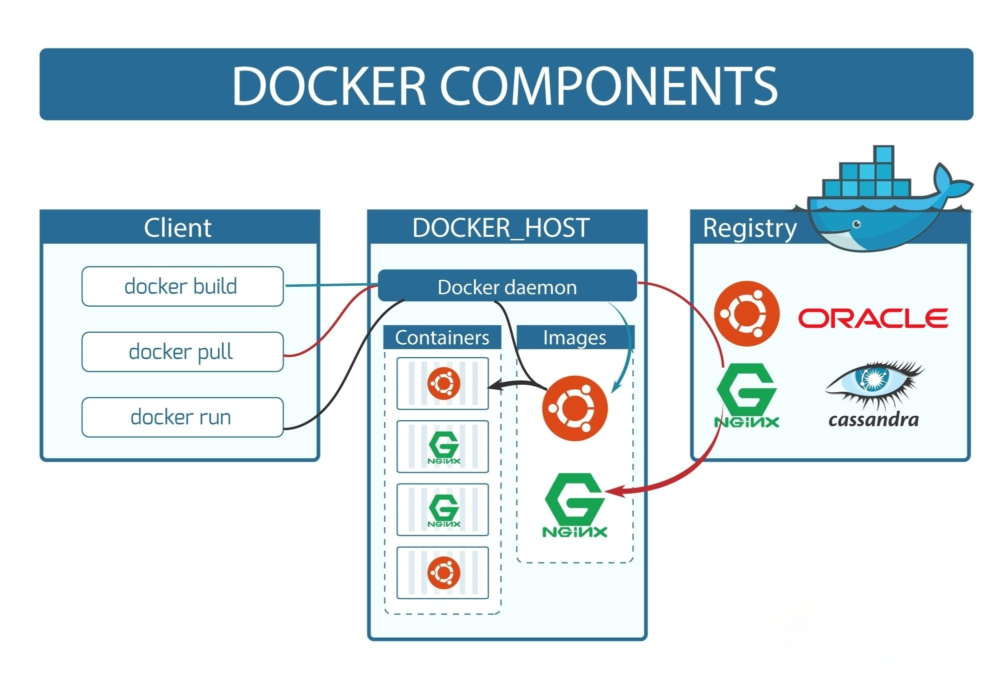
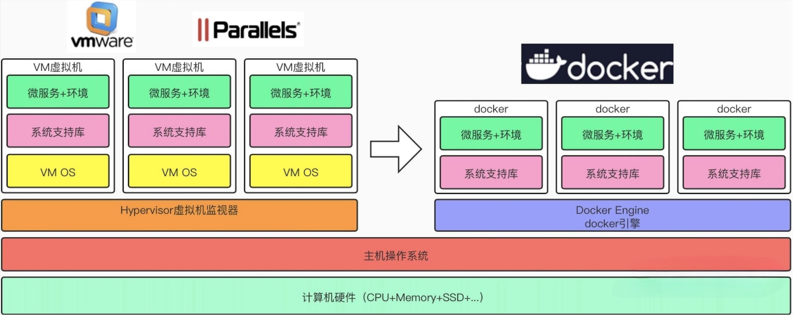
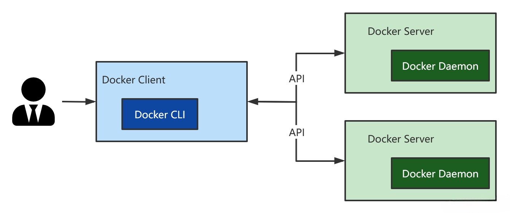
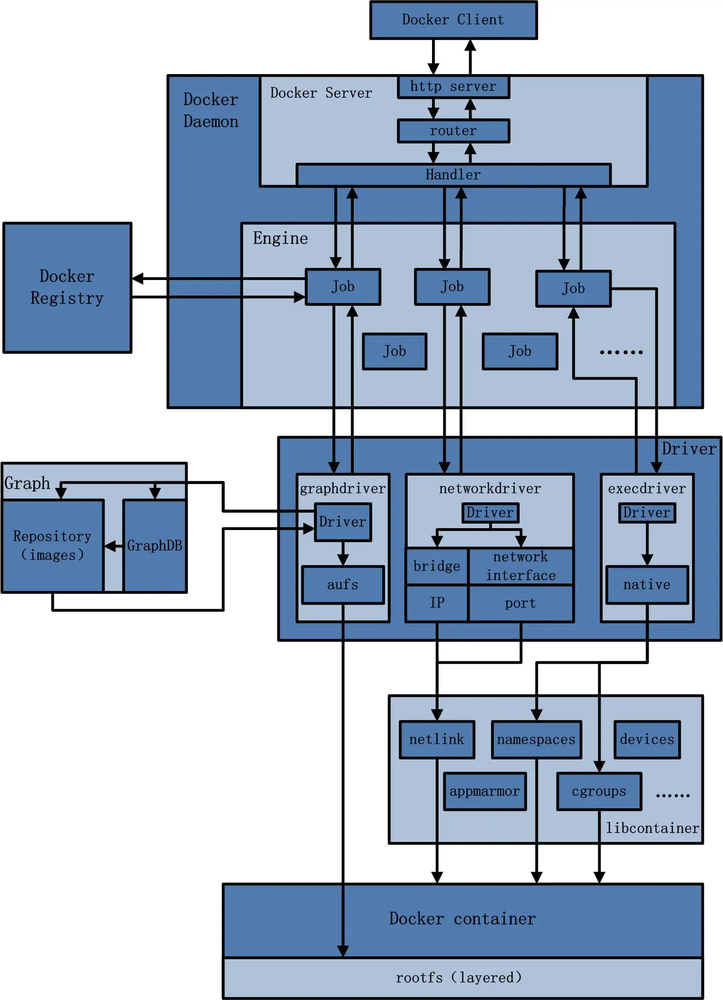

## Docker是什么

Docker 是一个开源的平台，旨在简化应用程序的创建、部署和运行。它基于容器技术，可以让开发者将应用程序及其所有依赖打包到一个独立的、可移植的容器中。这些容器可以在任何环境中运行，无论是开发环境、测试环境还是生产环境，都能保持一致性。

### Docker 的出现背景

在 Docker 之前，开发和部署应用程序的过程常常涉及到一系列复杂的问题，例如：

1. **环境一致性**：开发人员在本地机器上构建应用程序，但当将应用程序部署到生产环境时，可能会遇到因为环境不同而导致的问题。例如，依赖库的版本不同、配置文件不一致等问题。
2. **依赖管理**：应用程序通常依赖于多个库和服务。管理这些依赖关系并确保所有依赖都安装正确且版本一致是一项挑战。
3. **部署复杂性**：不同的开发、测试和生产环境可能具有不同的操作系统和配置，这使得部署过程变得复杂且容易出错。
4. **资源隔离**：在同一个主机上运行多个应用程序时，需要确保这些应用程序之间互不干扰，并且能够有效利用系统资源。

### Docker解决了哪些问题

1. **一致的运行环境**：Docker 使用容器将应用程序及其所有依赖打包在一起，这样应用程序可以在任何地方以相同的方式运行，无论是在开发者的机器上，还是在生产环境中的服务器上。这大大减少了“在我机器上能跑”的问题。
2. **简化的依赖管理**：通过将应用程序及其依赖打包到一个容器镜像中，Docker 确保了所有的依赖都被正确地包含和管理。容器镜像中包含了应用程序运行所需的一切，从操作系统库到应用程序本身。
3. **便捷的部署**：Docker 容器可以在任何支持 Docker 的环境中运行，简化了部署过程。开发人员可以通过 Docker 镜像直接部署应用程序，而不需要担心环境配置的细节。
4. **资源隔离**：Docker 容器能够隔离应用程序和服务的运行环境，确保不同容器中的应用程序互不干扰。此外，容器的资源隔离特性也有助于提高系统资源的利用效率。
5. **轻量化**：相较于传统的虚拟机，Docker 容器更加轻量，不需要完整的操作系统镜像，而只需要应用程序运行所需的最小系统环境。这样不仅节省了系统资源，也加快了启动速度。

通过这些功能，Docker 成为了现代 DevOps 实践中的重要工具，帮助团队更高效地构建、测试和部署应用程序。

## Docker的基本组成

​​

### 镜像（image）

Docker 镜像（Image）就是一个 **只读** 的模板。镜像可以用来创建 Docker 容器， 一个镜像可以创建很多容器 。

它也相当于是一个root文件系统。比如官方镜像 centos:7 就包含了完整的一套 centos:7 最小系统的 root 文件系统。

相当于容器的“源代码”， docker镜像文件类似于Java的类模板，而docker容器实例类似于由类new出来的实例对象。

### 容器（container）

Docker 利用容器（Container）独立运行的一个或一组应用，应用程序或服务运行在容器里面；容器就类似于一个虚拟化的运行环境， 容器是用镜像创建的运行实例 。

就像是Python中的类和实例对象一样，镜像是静态的定义，容器是镜像运行时的实体。

容器为镜像提供了一个标准的和隔离的运行环境 ，它可以被启动、开始、停止、删除。

每个容器都是相互隔离的、保证安全的平台

> 容器与虚拟机比较

Docker 容器和虚拟机 (VM) 都是虚拟化技术的形式，用于隔离和运行应用程序，但它们在架构、性能和使用方式上有显著区别。下面是它们之间的比较，以及一个简化的图示来帮助理解这些差异。

1. **架构**

    * **Docker 容器**：

      * **共享操作系统**：容器共享宿主机的操作系统内核，但每个容器运行在自己的用户空间中。这意味着容器不需要运行完整的操作系统，而是利用宿主机的内核资源。
      * **镜像**：应用程序及其依赖被打包在镜像中，容器通过镜像创建。
      * **启动时间**：容器启动较快，因为不需要引导完整的操作系统。
    * **虚拟机 (VM)** ：

      * **完整操作系统**：每个虚拟机都有自己的操作系统（称为来宾操作系统），并且完全隔离于宿主机操作系统。每个虚拟机都包括一个完整的操作系统和应用程序。
      * **虚拟化层**：虚拟机依赖于虚拟化管理程序（Hypervisor），如 VMware、Hyper-V 或 VirtualBox。
      * **启动时间**：虚拟机启动较慢，因为需要启动整个操作系统。
2. **资源消耗**

    * **Docker 容器**：

      * **轻量化**：容器不需要完整的操作系统，因此占用的系统资源较少。容器运行时的资源开销小。
      * **共享资源**：容器共享宿主机的操作系统内核，资源利用效率高。
    * **虚拟机 (VM)** ：

      * **较重**：虚拟机需要运行完整的操作系统，因此占用更多的内存和存储。
      * **资源隔离**：虚拟机的资源相对隔离，但由于每个虚拟机运行一个完整的操作系统，资源消耗较高。
3. **隔离级别**

    * **Docker 容器**：

      * **用户空间隔离**：容器提供进程级别的隔离，利用操作系统的资源隔离机制。
      * **网络隔离**：容器之间通过网络进行隔离，具有自己的网络堆栈和虚拟网络接口。
    * **虚拟机 (VM)** ：

      * **完整隔离**：虚拟机提供完整的硬件隔离，每个虚拟机拥有自己的虚拟硬件和操作系统。
      * **网络隔离**：虚拟机之间通过虚拟网络进行隔离，可以配置为拥有完全隔离的网络环境。
4. **管理和部署**

    * **Docker 容器**：

      * **易于创建和销毁**：容器可以快速创建、启动和销毁，非常适合动态扩展和自动化部署。
      * **配置管理**：使用 Dockerfile 和容器编排工具（如 Docker Compose 和 Kubernetes）来管理和自动化容器的部署。
    * **虚拟机 (VM)** ：

      * **较慢的创建和销毁**：虚拟机创建和销毁较慢，因为涉及到完整操作系统的安装和配置。
      * **管理复杂**：虚拟机的配置和管理较复杂，需要配置虚拟硬件和操作系统。

下面是一个简化的图示，展示了 Docker 容器与虚拟机的区别：

​​

**总结**：Docker 容器适合于需要快速部署、轻量级和高效资源利用的场景，而虚拟机适合需要完整隔离、兼容性强的场景。选择使用哪种技术，通常取决于具体的应用需求和环境。

> **从镜像容器角度**

**可以把容器看做是一个简易版的** **Linux** **环境** （包括root用户权限、进程空间、用户空间和网络空间等）和运行在其中的应用程序。

### 仓库（repository）

仓库（Repository）是 集中存放镜像 文件的场所；类似于github仓库，存放各种git项目的地方。

Docker公司提供的官方`registry`​被称为Docker Hub，存放各种镜像模板的地方。

仓库分为公开仓库（Public）和私有仓库（Private）两种形式。

最大的公开仓库是 Docker Hub([https://hub.docker.com/](https://hub.docker.com/)) ，存放了数量庞大的镜像供用户下载。

国内的公开仓库包括阿里云 、网易云等

### 总结

> **需要正确的理解仓库/镜像/容器这几个概念:**

Docker 本身是一个容器运行载体或称之为管理引擎。

把应用程序和配置依赖打包好形成一个可交付的运行环境，这个打包好的运行环境就是image镜像文件。

只有通过这个镜像文件才能生成Docker容器实例(类似由类new出来一个对象)。

image文件可以看作是容器的模板。Docker 根据 image 文件生成容器的实例。同一个 image 文件，可以生成多个同时运行的容器实例。

> **镜像文件**

image 文件生成的容器实例，本身也是一个文件，称为镜像文件。

> **容器实例**

一个容器运行一种服务，当我们需要的时候，就可以通过docker客户端创建一个对应的运行实例，也就是我们的容器 。

> **仓库**

就是放一堆镜像的地方，我们可以把镜像发布到仓库中，需要的时候再从仓库中拉下来就可以了。

## Docker工作原理

Docker是一个Client-Server结构的系统，Docker守护进程运行在主机上， 然后通过Socket连接从客户端访问，守护进程从客户端接受命令并管理运行在主机上的容器 。

​​

> 具体流程：

1. 用户是使用Docker Client 与Docker Daemon 建立通信，并发送请求给后者。
2. Docker Daemon 作为Docker架构中的主体部分，首先提供Docker Server 的功能时期可以接受 Docker Client的请求。
3. Docker Engine 执行Docker内部的一些列工作，每一项工作都是以一个Job的形式的存在。
4. Job的运行过程中，当需要容器镜像是，则从Docker Register中下载镜像，并通过镜像管理驱动Graph driver 将下载镜像以Graph的形式存储。
5. 当需要为Docker创建网络环境时，通过网络驱动Network driver创建并配置Docker容器网络环境。
6. 当需要限制Docker容器运行资源或执行用户指令等操作时，则通过Exec driver来完成。
7. Libcontainer是一项独立的容器管理包，Network driver以及Exec driver都是通过Libcontainer来实现具体容器进行的操作。

‍

​​

‍
