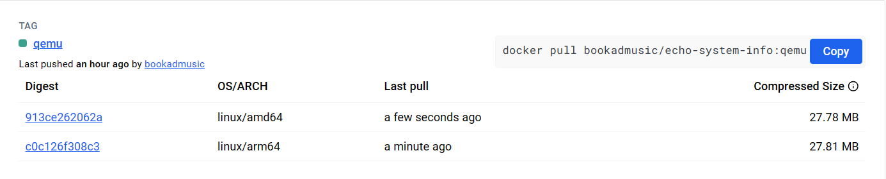
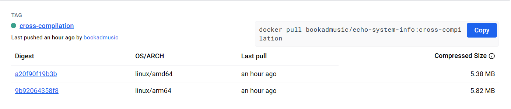

构建跨平台镜像是 Docker 生态系统中的一个重要话题，因为跨平台镜像可以在多种平台上运行，极具灵活性。除了使用 `docker manifest`​这种方法之外。还有目前最流行的方式，使用 Docker 的 `buildx`​ 工具，这种方式不仅可以轻松构建跨平台镜像，还可以自动化整个构建过程，大大提高了效率。在本文中，我们将重点介绍使用 `buildx`​ 构建跨平台镜像的方法和技巧。

## 简介

​`buildx`​ 是 Docker 官方提供的一个构建工具，它可以帮助用户快速、高效地构建 Docker 镜像，并支持多种平台的构建。使用 `buildx`​，用户可以在单个命令中构建多种架构的镜像，例如 AMD和 ARM 架构，而无需手动操作多个构建命令。此外，`buildx`​ 还支持 Dockerfile 的多阶段构建和缓存，这可以大大提高镜像构建的效率和速度。

## 安装

​`buildx`​ 是一个管理 Docker 构建的 CLI 插件，底层使用 [BuildKit](https://docs.docker.com/build/buildkit/) 扩展了 Docker 构建功能。

笔记：`BuildKit`​ 是 Docker 官方提供的一个高性能构建引擎，可以用来替代 Docker 原有的构建引擎。相比于原有引擎，`BuildKit`​ 具有更快的构建速度、更高的并行性、更少的资源占用和更好的安全性。

要安装并使用 `buildx`​，需要 Docker Engine 版本号大于等于 19.03。

如果你使用的是 Docker Desktop，则默认安装了 `buildx`​。可以使用 `docker buildx version`​ 命令查看安装版本，得到以下类似输出，证明已经安装过了。

```
$ docker buildx version
github.com/docker/buildx v0.9.1 ed00243a0ce2a0aee75311b06e32d33b44729689
```

如果需要手动安装，可以从 GitHub 发布页面[下载](https://github.com/docker/buildx/releases/latest)对应平台的最新二进制文件，重命名为 `docker-buildx`​，然后将其放到 Docker 插件目录下（Linux/Mac 系统为 `$HOME/.docker/cli-plugins`​，Windows 系统为 `%USERPROFILE%\.docker\cli-plugins`​）。

Linux/Mac 系统还需要给插件增加可执行权限 `chmod +x ~/.docker/cli-plugins/docker-buildx`​，之后就可以使用 `buildx`​ 了。

更详细的安装过程可以参考[官方文档](https://docs.docker.com/build/install-buildx/)。

## 功能清单

​`buildx`​常用的命令可以通过 `--help`​ 参数进行查看。

```
$ docker buildx --help

Usage:  docker buildx [OPTIONS] COMMAND

Extended build capabilities with BuildKit

Options:
      --builder string   Override the configured builder instance

Management Commands:
  imagetools  Commands to work on images in registry

Commands:
  bake        Build from a file
  build       Start a build
  create      Create a new builder instance
  du          Disk usage
  inspect     Inspect current builder instance
  ls          List builder instances
  prune       Remove build cache
  rm          Remove a builder instance
  stop        Stop builder instance
  use         Set the current builder instance
  version     Show buildx version information

Run 'docker buildx COMMAND --help' for more information on a command.
```

如 `stop`​、`rm`​ 可以管理 `builder`​ 的生命周期。每条子命令又可以使用 `docker buildx COMMAND --help`​ 方式查看使用帮助。

## 构建策略

您可以使用三种不同的策略构建多平台映像， 根据您的用例：

> 使用仿真，通过 Linux 内核中的 [QEMU](https://zh.wikipedia.org/wiki/QEMU) 支持

QEMU 是最简单的构建跨平台镜像策略。它不需要对原有的 `Dockerfile`​ 进行任何更改，`BuildKit`​ 会通过 [binfmt_misc](https://zh.wikipedia.org/wiki/Binfmt_misc) 这一 Linux 内核功能实现跨平台程序的执行。

> 使用 Dockerfile 中的阶段[进行交叉编译](https://docs.docker.com/build/building/multi-platform/#cross-compilation) 不同的架构

交叉编译的复杂度不在于 Docker，而是取决于程序本身。比如 Go 程序就很容易实现交叉编译，只需要在使用 `go build`​ 构建程序时指定 `GOOS`​、`GOARCH`​ 两个环境变量即可实现。

> 建立在由[不同架构的多个节点](https://docs.docker.com/build/building/multi-platform/#multiple-native-nodes)支持的单个构建器上。

使用多个本机节点为更复杂的情况提供更好的支持 QEMU 无法处理，并且还提供更好的性能。

您可以使用该标志向构建器添加其他节点。`--append`​

假如已经使用`docker context command`​已经添加了节点：`node-amd64`​、`node-arm64`​。使用下面的命令可以创建一个多节点的builder：

```console
$ docker buildx create --use --name mybuild node-amd64
mybuild
$ docker buildx create --append --name mybuild node-arm64
$ docker buildx build --platform linux/amd64,linux/arm64 .
```

虽然这种方法比仿真具有优势，但管理多节点构建器 引入了设置和管理构建器集群的一些开销。

## 构建流程

### ​`builder`​初始化

要使用 `buildx`​ 构建跨平台镜像，我们需要先创建一个 `builder`​，可以翻译为「构建器」。

#### 查看`builder`​

使用 `docker buildx ls`​ 命令可以查看 `builder`​ 列表：

```shell
$ docker buildx ls
NAME/NODE       DRIVER/ENDPOINT STATUS  BUILDKIT PLATFORMS
default*             docker
 \_ default           \_ default                       running   v0.13.2    linux/amd64, linux/amd64/v2, linux/amd64/v3, linux/386, linux/arm64, linux/riscv64, linux/ppc64le, linux/s390x, linux/mips64le, linux/mips64, linux/arm/v7, linux/arm/v6
```

这是默认 `builder`​，`default *`​ 中的 `*`​ 表示当前正在使用的 `builder`​，当我们运行 `docker build`​ 命令时就是在使用此 `builder`​ 构建镜像。

可以发现，默认的 `builder`​ 第二列 `DRIVER/ENDPOINT`​ 项的值是 `docker`​，表示它们都使用 `docker`​ 驱动程序。

​`buildx`​ 支持以下几种驱动程序：

|驱动|说明|
| ------------------| ---------------------------------------------------------------------------------|
|docker|使用捆绑到 Docker 守护进程中的 BuildKit 库，就是安装 Docker 后默认的 BuildKit。|
|docker-container|使用 Docker 新创建一个专用的 BuildKit 容器。|
|kubernetes|在 Kubernetes 集群中创建一个 BuildKit Pod。|
|remote|直接连接到手动管理的 BuildKit 守护进程。|

默认的 `docker`​ 驱动程序优先考虑简单性和易用性，所以它对缓存和输出格式等高级功能的支持有限，并且不可配置。其他驱动程序则提供了更大的灵活性，并且更擅长处理高级场景。

具体差异你可以到[官方文档](https://docs.docker.com/build/drivers/)中查看。

#### 创建`builder`​

因为使用 `docker`​ 驱动程序的默认 `builder`​ 不支持使用单条命令（默认 `builder`​ 的 `--platform`​ 参数只接受单个值）构建多平台镜像，所以我们需要使用 `docker-container`​ 驱动创建一个新的 `builder`​。

命令语法如下：

```shell
$ docker buildx create --name=<builder-name> --driver=<driver> --driver-opt=<driver-options>
```

参数含义如下：

* ​`--name`​：构建器名称，必填。
* ​`--driver`​：构建器驱动程序，默认为 `docker-container`​。
* ​`--driver-opt`​：驱动程序选项，如选项 `--driver-opt=image=moby/buildkit:v0.11.3`​ 可以安装指定版本的 `BuildKit`​，默认值是 [moby/buildkit](https://hub.docker.com/r/moby/buildkit)。

更多可选参数可以参考[官方文档](https://docs.docker.com/engine/reference/commandline/buildx_create/#options)。

我们可以使用如下命令创建一个新的 `builder`​：

```shell
$ docker buildx create --name multi-builder
multi-builder
```

再次查看 `builder`​ 列表：

```shell
❯ docker builder ls
NAME/NODE            DRIVER/ENDPOINT                   STATUS     BUILDKIT   PLATFORMS
multi-builder        docker-container
 \_ multi-builder0    \_ unix:///var/run/docker.sock   inactive
default*             docker
 \_ default           \_ default                       running    v0.13.2    linux/amd64, linux/amd64/v2, linux/amd64/v3, linux/386, linux/arm64, linux/riscv64, linux/ppc64le, linux/s390x, linux/mips64le, linux/mips64, linux/arm/v7, linux/arm/v6
```

可以发现选中的构建器还是`default`​，如果需要切换默认构建器，需要手动使用 `docker buildx use multi-builder`​ 命令切换构建器。

#### 启动 `builder`​

我们新创建的 `mybuilder`​ 当前状态为 `inactive`​，需要启动才能使用。

```shell
❯ docker buildx inspect --bootstrap multi-builder
[+] Building 16.8s (1/1) FINISHED
 => [internal] booting buildkit                                                                                                                                  16.8s
 => => pulling image moby/buildkit:buildx-stable-1                                                                                                               16.1s
 => => creating container buildx_buildkit_mybuilder0                                                                                                              0.7s
Name:          multi-builder
Driver:        docker-container
Last Activity: 2024-07-16 07:09:41 +0000 UTC

Nodes:
Name:                  multi-builder0
Endpoint:              unix:///var/run/docker.sock
Status:                running
BuildKit daemon flags: --allow-insecure-entitlement=network.host
BuildKit version:      v0.14.1
Platforms:             linux/amd64, linux/amd64/v2, linux/amd64/v3, linux/arm64, linux/riscv64, linux/ppc64le, linux/s390x, linux/386, linux/mips64le, linux/mips64, linux/arm/v7, linux/arm/v6
```

​`inspect`​ 子命令用来检查构建器状态，使用 `--bootstrap`​ 参数则可以启动 `multi-builder`​ 构建器。

再次查看 `builder`​ 列表，`mybuilder`​ 状态已经变成了 `running`​。

```shell
❯ docker builder ls
NAME/NODE            DRIVER/ENDPOINT                   STATUS    BUILDKIT   PLATFORMS
multi-builder        docker-container
 \_ multi-builder0    \_ unix:///var/run/docker.sock   running   v0.14.1    linux/amd64, linux/amd64/v2, linux/amd64/v3, linux/arm64, linux/riscv64, linux/ppc64le, linux/s390x, linux/386, linux/mips64le, linux/mips64, linux/arm/v7, linux/arm/v6
default*             docker
 \_ default           \_ default                       running   v0.13.2    linux/amd64, linux/amd64/v2, linux/amd64/v3, linux/386, linux/arm64, linux/riscv64, linux/ppc64le, linux/s390x, linux/mips64le, linux/mips64, linux/arm/v7, linux/arm/v6
```

其中 `PLATFORMS`​ 一列所展示的值 `linux/arm64, linux/amd64, linux/riscv64, linux/ppc64le, linux/s390x, linux/386, linux/mips64le, linux/mips64, linux/arm/v7, linux/arm/v6`​ 就是当前构建器所支持的所有平台了。

现在使用 `docker ps`​ 命令可以看到 `mybuilder`​ 构建器所对应的 `BuildKit`​ 容器已经启动。

```
❯ docker ps
CONTAINER ID   IMAGE                                                   COMMAND                   CREATED         STATUS         PORTS
                                NAMES
70ebf5070507   moby/buildkit:buildx-stable-1                           "buildkitd --allow-i…"    2 minutes ago   Up 2 minutes
                                buildx_buildkit_multi-builder0
```

这个容器就是辅助我们构建跨平台镜像用的，不要手动删除它。

### 构建多平台镜像

#### QEMU仿真

##### QEMU支持

Mac、Win系统的`Docker Desktop`​默认是支持构建多平台镜像的，因为本身的VM中捆绑QEMU。利用这些，可以直接构建非本机架构的镜像。

如果是Linux系统的Docker引擎，必须安装静态编译的 QEMU 二进制文件并将它们注册到`binfmt_misc`​。

使用如下命令可以简单实现：

```console
# install
docker run --privileged --rm tonistiigi/binfmt --install all
docker run --privileged --rm tonistiigi/binfmt --install arm64,riscv64,arm

# uninstall
docker run --privileged --rm tonistiigi/binfmt --uninstall qemu-aarch64
docker run --privileged --rm tonistiigi/binfmt --uninstall qemu-*
```

或者

```console
# install
docker run --rm --privileged multiarch/qemu-user-static --reset -p yes
```

如果执行成功，可以在 主机的`/proc/sys/fs/binfmt_misc/`​目录中，看到一系列以 `qemu-`​开头的文件。

##### C程序

```c
#include <stdio.h>
#include <stdlib.h>
#include <sys/utsname.h>
#include <string.h>

// Function to read a specific field from a file
void read_os_release_field(const char *filename, const char *field, char *result, size_t size) {
    FILE *file = fopen(filename, "r");
    if (file == NULL) {
        perror("fopen");
        exit(EXIT_FAILURE);
    }

    char line[256];
    while (fgets(line, sizeof(line), file) != NULL) {
        if (strncmp(line, field, strlen(field)) == 0) {
            // Extract the value part
            char *value = strchr(line, '=');
            if (value) {
                value++; // Skip '='
                value[strcspn(value, "\n")] = 0; // Remove newline
                // Remove quotes if present
                if (value[0] == '"') {
                    value++;
                    value[strlen(value) - 1] = '\0';
                }
                strncpy(result, value, size - 1);
                result[size - 1] = '\0'; // Ensure null-terminated string
                break;
            }
        }
    }

    fclose(file);
}

int main() {
    struct utsname sys_info;
  
    if (uname(&sys_info) != 0) {
        perror("uname");
        exit(EXIT_FAILURE);
    }

    char os_name[256] = "Unknown";
    char os_version[256] = "Unknown";

    // Read OS name and version from /etc/os-release
    read_os_release_field("/etc/os-release", "NAME", os_name, sizeof(os_name));
    read_os_release_field("/etc/os-release", "VERSION", os_version, sizeof(os_version));

    printf("Hostname: %s\n", sys_info.nodename);
    printf("OS: %s\n", sys_info.sysname);
    printf("Platform: %s\n", os_name);
    printf("PlatformVersion: %s\n", os_version);
    printf("KernelVersion: %s\n", sys_info.release);
    printf("Machine: %s\n", sys_info.machine);

    return 0;
}
```

##### Dockerfile

编写 `Dockerfile`​ 内容如下：

```dockerfile
# Stage 1: Build the executable
FROM gcc:bookworm AS builder

# Set the working directory inside the container
WORKDIR /app

# Copy the C source code to the working directory
COPY . .

# Compile the C program
RUN gcc -o system_info system_info.c

# Stage 2: Create a smaller image to run the executable
FROM debian:bookworm-slim

# Set the working directory inside the container
WORKDIR /app

# Copy the compiled executable from the builder stage
COPY --from=builder /app/system_info .

# Set the entry point to run the executable
ENTRYPOINT ["./system_info"]
```

##### Build

使用 `docker buildx`​ 来构建跨平台镜像了。`docker buildx build`​ 语法跟 `docker build`​ 一样。

唯一不同的是对 `--platform`​ 参数的支持，`docker build`​ 的 `--platform`​ 参数只支持传递一个平台信息，如 `--platform linux/arm64`​，也就是一次只能构建单个平台的镜像。

而使用 `docker buildx build`​ 构建镜像则支持同时传递多个平台信息，中间使用英文逗号分隔，这样就实现了只用一条命令便可以构建跨平台镜像的功能。

```console
$ docker buildx build --builder=multi-builder --platform linux/arm64,linux/amd64 -t bookadmusic/echo-system-info:qemu .
...                                                                                                         
WARNING: No output specified with docker-container driver. Build result will only remain in the build cache. To push result image into registry use --push or to load image into docker use --load
```

最后显示一条警告，这条警告提示我们没有为 `docker-container`​ 驱动程序指定输出，生成结果将只会保留在构建缓存中，使用 `--push`​ 可以将镜像推送到 Docker Hub 远程仓库，使用 `--load`​ 可以将镜像保存在本地。

这是因为我们新创建的 `mybuilder`​ 是启动了一个容器来运行 `BuildKit`​，它并不能直接将构建好的跨平台镜像输出到本机或推送到远程，必须要用户来手动指定输出位置。

我们可以尝试指定 `--load`​ 将镜像保存的本地主机。

```shell
❯ docker buildx build --builder=multi-builder --platform linux/arm64,linux/amd64 -t bookadmusic/echo-system-info:qemu . --load
[+] Building 0.0s (0/0)                                                                                                                                                            docker-container:multi-builder
ERROR: docker exporter does not currently support exporting manifest lists
```

结果会得到一条错误日志。看来它并不支持直接将跨平台镜像输出到本机，这其实是因为传递了多个 `--platform`​ 的关系，如果 `--platform`​ 只传递了一个平台，则可以使用 `--load`​ 将构建好的镜像输出到本机。

那么我们就只能通过 `--push`​ 参数将跨平台镜像推送到远程仓库了。不过在此之前需要确保使用 `docker login`​ 完成登录。

```console
$ docker buildx build --builder=multi-builder --platform linux/arm64,linux/amd64 -t bookadmusic/echo-system-info:qemu . --push
...
```

此时可以看到镜像已经推送到远程仓库啦。

​​

我们也可以使用 `imagetools`​ 来检查跨平台镜像的 `manifest`​ 信息。

```console
$ docker buildx imagetools inspect bookadmusic/echo-system-info:qemu
Name:      docker.io/bookadmusic/echo-system-info:qemu
MediaType: application/vnd.oci.image.index.v1+json
Digest:    sha256:8932c94511419bd715f76c424451c3b49254508737dbcf15b5e3a9e80594dc0a

Manifests:
  Name:        docker.io/bookadmusic/echo-system-info:qemu@sha256:913ce262062a4c5024e44110ae54353874acf0ea23e33ba5e9509866bb94c61e
  MediaType:   application/vnd.oci.image.manifest.v1+json
  Platform:    linux/amd64

  Name:        docker.io/bookadmusic/echo-system-info:qemu@sha256:c0c126f308c36ff6c2eb389c9266c083fd30362f90b98cd6e54551c90db82c38
  MediaType:   application/vnd.oci.image.manifest.v1+json
  Platform:    linux/arm64

  Name:        docker.io/bookadmusic/echo-system-info:qemu@sha256:9f46df5071e730e73049d7ab80a35b52e97f0a7e2599bca005423b1f9f6b45c9
  MediaType:   application/vnd.oci.image.manifest.v1+json
  Platform:    unknown/unknown
  Annotations:
    vnd.docker.reference.digest: sha256:913ce262062a4c5024e44110ae54353874acf0ea23e33ba5e9509866bb94c61e
    vnd.docker.reference.type:   attestation-manifest

  Name:        docker.io/bookadmusic/echo-system-info:qemu@sha256:ddfb4c4622d3164992253370165e67abf6bb6471d4243843a957a7a7372bd610
  MediaType:   application/vnd.oci.image.manifest.v1+json
  Platform:    unknown/unknown
  Annotations:
    vnd.docker.reference.digest: sha256:c0c126f308c36ff6c2eb389c9266c083fd30362f90b98cd6e54551c90db82c38
    vnd.docker.reference.type:   attestation-manifest
```

可以看到，这个跨平台镜像包含了两个目标平台的镜像，分别是 `linux/arm64`​ 和 `linux/amd64`​。

我们分别指定AMD平台和 ARM平台来启动这个 Docker 镜像看下输出结果。

```console
$ docker run --platform=linux/amd64 --rm bookadmusic/echo-system-info:qemu
Hostname: eea1830ba16d
OS: Linux
Platform: Debian GNU/Linux
PlatformVersion: 12
KernelVersion: 5.15.153.1-microsoft-standard-WSL2
Machine: x86_64

$ docker run --platform=linux/arm64 --rm bookadmusic/echo-system-info:qemu
Hostname: 82826acd4990
OS: Linux
Platform: Debian GNU/Linux
PlatformVersion: 12
KernelVersion: 5.15.153.1-microsoft-standard-WSL2
Machine: aarch64
```

至此，我们使用 `builder`​借助QEMU仿真完成了多平台镜像的构建。

#### 交叉编译

##### Go程序

使用Go可以很方便实现跨平台编译,此处以Go程序示例。

```go
package main

import (
        "fmt"
        "os/exec"
        "strings"

        "github.com/shirou/gopsutil/host"
        "golang.org/x/text/cases"
        "golang.org/x/text/language"
)

func main() {
        info, err := host.Info()
        if err != nil {
                fmt.Printf("Error getting host info: %v\n", err)
                return
        }
        cmd := exec.Command("uname", "-m")
        arch, err := cmd.Output()
        if err != nil {
                fmt.Printf("Error executing uname -m: %v\n", err)
                return
        }
        c := cases.Title(language.Und)
        fmt.Printf("Hostname: %s\n", info.Hostname)
        fmt.Printf("OS: %s\n", c.String(info.OS))
        fmt.Printf("Platform: %s\n", c.String(info.Platform))
        fmt.Printf("PlatformVersion: %s\n", info.PlatformVersion)
        fmt.Printf("KernelVersion: %s\n", info.KernelVersion)
        fmt.Printf("Machine: %s\n", strings.TrimSpace(string(arch)))
}
```

##### Dockerfile

```dockerfile
# Stage 1: Build the executable using a Go builder image
# Use the image of the current building machine with the same architecture
FROM --platform=$BUILDPLATFORM golang:1.21.9-alpine AS builder

# Set the working directory inside the container
WORKDIR /app

# Copy the Go source code to the working directory
COPY . .

# Cross-compile the Go program for Linux
# GOOS=linux specifies the target OS as Linux
# GOARCH=$TARGETARCH specifies the target architecture (e.g., amd64, arm64)
RUN GOOS=linux GOARCH=$TARGETARCH go build -o system_info

# Stage 2: Create a smaller image to run the executable
# Do not specify the image architecture, default is the target platform architecture
FROM alpine:latest

# Set the working directory inside the container
WORKDIR /app

# Copy the compiled executable from the builder stage
COPY --from=builder /app/system_info .

# Set the entry point to run the executable
ENTRYPOINT ["./system_info"]
```

##### Build

直接使用命令编译并推送到远程仓库

```console
$ docker buildx build --builder=multi-builder --platform linux/arm64,linux/amd64 -t bookadmusic/echo-system-info:cross-compilation . --push
```

​​
