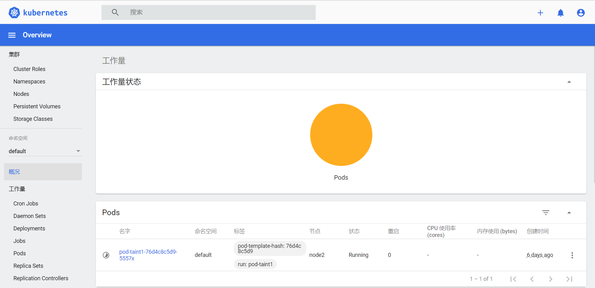

之前在kubernetes中完成的所有操作都是通过命令行工具kubectl完成的。其实，为了提供更丰富的用户体验，kubernetes还开发了一个基于web的用户界面（Dashboard）。用户可以使用Dashboard部署容器化的应用，还可以监控应用的状态，执行故障排查以及管理kubernetes中各种资源。

## 部署dashboard

使用文件([recommended.yaml](https://raw.githubusercontent.com/kubernetes/dashboard/v2.7.0/aio/deploy/recommended.yaml) )部署即可：

```console
$ kubectl apply -f https://jsdelivr.pai233.top/gh/kubernetes/dashboard@v2.7.0/aio/deploy/recommended.yaml                                                                                   
namespace/kubernetes-dashboard created
serviceaccount/kubernetes-dashboard created
service/kubernetes-dashboard created
secret/kubernetes-dashboard-certs created
secret/kubernetes-dashboard-csrf created
secret/kubernetes-dashboard-key-holder created
configmap/kubernetes-dashboard-settings created
role.rbac.authorization.k8s.io/kubernetes-dashboard created
clusterrole.rbac.authorization.k8s.io/kubernetes-dashboard created
rolebinding.rbac.authorization.k8s.io/kubernetes-dashboard created
clusterrolebinding.rbac.authorization.k8s.io/kubernetes-dashboard created
deployment.apps/kubernetes-dashboard created
service/dashboard-metrics-scraper created
deployment.apps/dashboard-metrics-scraper created
```

启动成功之后：

```console
$ kubectl get ns                     
NAME                   STATUS   AGE
default                Active   59m
kube-node-lease        Active   59m
kube-public            Active   59m
kube-system            Active   59m
kubernetes-dashboard   Active   4m22s

$ kubectl get pods -n kubernetes-dashboard                                  
NAME                                         READY   STATUS    RESTARTS   AGE
dashboard-metrics-scraper-795895d745-5hbj2   1/1     Running   0          3m54s
kubernetes-dashboard-56cf4b97c5-pfmw2        1/1     Running   0          3m54s

$ kubectl get service -n kubernetes-dashboard
NAME                        TYPE        CLUSTER-IP       EXTERNAL-IP   PORT(S)    AGE
dashboard-metrics-scraper   ClusterIP   10.106.67.34     <none>        8000/TCP   4m4s
kubernetes-dashboard        ClusterIP   10.100.189.176   <none>        443/TCP    4m6s
```

## 服务暴露

之前都是通过`kubectl`​命令行操作集群，现在就可以在浏览器上直接访问页面，管理集群

### 代理转发

```console
$ kubectl get service -n kubernetes-dashboard    
NAME                        TYPE        CLUSTER-IP       EXTERNAL-IP   PORT(S)    AGE
dashboard-metrics-scraper   ClusterIP   10.106.67.34     <none>        8000/TCP   3h16m
kubernetes-dashboard        ClusterIP   10.100.189.176   <none>        443/TCP    3h16m
```

可以看到service `kubernetes-dashboard`​的类型是`cluster-ip`​,只能集群内部访问

此时如果想要在宿主机上访问，可以使用 `kubectl proxy`​进行代理转发

```console
$ kubectl proxy 
Starting to serve on 127.0.0.1:8001
```

浏览器访问：`http://127.0.0.1:8001/api/v1/namespaces/kubernetes-dashboard/services/https:kubernetes-dashboard:/proxy/#/login`​

> * **本地访问**：
>
>   * 默认情况下，`kubectl proxy`​ 只在本地计算机上启动一个 HTTP 代理，通常监听在 `localhost:8001`​。它的目的是让本地机器可以安全地访问 Kubernetes API，而不暴露给外部网络。
> * **限制访问**：
>
>   * 因为它只监听 `localhost`​，所以即使你的计算机有多个网络接口或 IP 地址，`kubectl proxy`​ 也不会处理来自局域网 IP 地址的请求。

### 端口映射

使用`kubectl port-forward`​进行端口映射

* 直接将pod的端口映射到本地

  ```console
  $ kubectl get pods -n kubernetes-dashboard                                   
  NAME                                         READY   STATUS    RESTARTS   AGE
  dashboard-metrics-scraper-795895d745-5hbj2   1/1     Running   0          177m
  kubernetes-dashboard-56cf4b97c5-pfmw2        1/1     Running   0          177m

  # 查看到容器内服务的真正端口是8443
  $ kubectl describe pods kubernetes-dashboard-56cf4b97c5-pfmw2 -n kubernetes-dashboard
  Name:             kubernetes-dashboard-56cf4b97c5-pfmw2
  Namespace:        kubernetes-dashboard
  ...
  Containers:
    kubernetes-dashboard:
      Container ID:  docker://bdf101562015c1bbc19b915edaf2c8c3f429573b7174a72da1f9e1d349c2b97e
      Image:         kubernetesui/dashboard:v2.7.0
      Image ID:      docker-pullable://kubernetesui/dashboard@sha256:2e500d29e9d5f4a086b908eb8dfe7ecac57d2ab09d65b24f588b1d449841ef93
      Port:          8443/TCP
      Host Port:     0/TCP
  ...

  # 将pod的8443端口映射到本机的8888端口
  $ kubectl port-forward kubernetes-dashboard-56cf4b97c5-pfmw2 8888:8443 -n kubernetes-dashboard
  Forwarding from 127.0.0.1:8888 -> 8443
  Forwarding from [::1]:8888 -> 8443
  ```

  浏览器访问 `https://127.0.0.1:8888`​

* 上面将pod端口映射会出现一个问题，因为如果pod被销毁重建之后，pod名字会发生变化，因此可以将service的端口映射到本地

  ```console
  $ kubectl get service -n kubernetes-dashboard                                     
  NAME                        TYPE        CLUSTER-IP       EXTERNAL-IP   PORT(S)    AGE
  dashboard-metrics-scraper   ClusterIP   10.106.67.34     <none>        8000/TCP   3h2m
  kubernetes-dashboard        ClusterIP   10.100.189.176   <none>        443/TCP    3h2m

  # 查看到service的端口是443,将本地的8008端口映射到service的443端口，但是下面的输出可以看出，实际是映射到pod的8443端口，通过service就不想要知道pod名字
  $ kubectl port-forward service/kubernetes-dashboard 8008:443 -n kubernetes-dashboard
  Forwarding from 127.0.0.1:8008 -> 8443
  Forwarding from [::1]:8008 -> 8443
  ```

  浏览器访问 `https://127.0.0.1:8008`​

### NodePort

除了上面的方式之外，还可以直接创建一个`NodePort`​类型的service,使用集群节点ip直接访问

```yaml
kind: Service
apiVersion: v1
metadata:
  labels:
    k8s-app: kubernetes-dashboard
  name: kubernetes-dashboard-nodeport
  namespace: kubernetes-dashboard
spec:
  type: NodePort
  ports:
    - port: 443
      targetPort: 8443
      nodePort: 30000  # 你可以选择一个范围在30000-32767之间的端口号
  selector:
    k8s-app: kubernetes-dashboard
```

创建service`NodePort`​之后，就可以使用任何一个节点的ip直接访问

```console
$ kubectl apply -f node-service.yaml   
service/kubernetes-dashboard-nodeport created

$ kubectl get service -n kubernetes-dashboard
NAME                            TYPE        CLUSTER-IP       EXTERNAL-IP   PORT(S)         AGE
dashboard-metrics-scraper       ClusterIP   10.106.67.34     <none>        8000/TCP        3h22m
kubernetes-dashboard            ClusterIP   10.100.189.176   <none>        443/TCP         3h22m
kubernetes-dashboard-nodeport   NodePort    10.105.14.111    <none>        443:30000/TCP   5s

$ kubectl get nodes -o wide          
NAME       STATUS   ROLES           AGE     VERSION   INTERNAL-IP    EXTERNAL-IP   OS-IMAGE             KERNEL-VERSION             CONTAINER-RUNTIME
minikube   Ready    control-plane   4h18m   v1.30.0   192.168.49.2   <none>        Ubuntu 22.04.4 LTS   6.6.25-amd64-desktop-hwe   docker://26.1.1
```

浏览器访问：`https://192.168.49.2:30000/#/login`​

> 可以使用节点ip外部访问集群服务，为什么`EXTERNAL-IP`​仍然不存在？

在 Kubernetes 中，`NodePort`​ 类型的 Service 是一种暴露服务的方法，它允许外部流量通过节点的 IP 地址和特定的端口访问集群内部的服务。对于 `NodePort`​ 类型的服务，`EXTERNAL-IP`​ 通常不会被显示，因为它依赖于集群节点的外部 IP，而不是由 Kubernetes 本身分配的外部 IP。以下是一些具体的原因：

1. **依赖于节点的 IP 地址**：`NodePort`​ 类型的服务使用集群中每个节点的 IP 地址来接收外部流量。因此，`EXTERNAL-IP`​ 列不会显示特定的外部 IP 地址，而是通过每个节点的 IP 和指定的 NodePort 端口进行访问。
2. **集群配置**：集群的配置和网络设置可能会影响服务的外部访问方式。通常，`NodePort`​ 服务可以通过任何集群节点的外部 IP 和 NodePort 端口进行访问，例如 `http://<NodeIP>:<NodePort>`​。
3. **类型特性**：`EXTERNAL-IP`​ 通常用于 `LoadBalancer`​ 类型的服务，该类型的服务会请求云提供商分配一个外部 IP 地址，以便直接通过这个外部 IP 进行访问。而 `NodePort`​ 类型的服务只是简单地在每个节点上打开一个端口进行访问，因此不显示 `EXTERNAL-IP`​。

### LoadBalancer

#### 实现负载均衡器

在本地创建的 Kubernetes 集群中，`LoadBalancer`​ 类型的服务通常不会像在云环境中那样自动分配一个外部 IP 地址。这是因为本地集群缺乏云提供商提供的负载均衡器服务。不过，有几种方法可以在本地环境中实现类似的功能：

##### Minikube 嵌入式负载均衡器

Minikube提供了一些内置的方法来模拟 `LoadBalancer`​ 类型的服务：

使用 Minikube 提供的 `tunnel`​ 命令，启动负载均衡器：

```console
$ minikube tunnel
Status:
        machine: minikube
        pid: 307267
        route: 10.96.0.0/12 -> 192.168.49.2
        minikube: Running
        services: []
    errors: 
                minikube: no errors
                router: no errors
                loadbalancer emulator: no errors
```

##### MetalLB

使用文件[metallb-native.yaml](https://github.com/metallb/metallb/blob/v0.14.8/config/manifests/metallb-native.yaml)部署即可：

```console
# 安装 MetalLB
$ kubectl apply -f https://fastly.jsdelivr.net/gh/metallb/metallb@v0.14.8/config/manifests/metallb-native.yaml
namespace/metallb-system created
customresourcedefinition.apiextensions.k8s.io/bfdprofiles.metallb.io created
customresourcedefinition.apiextensions.k8s.io/bgpadvertisements.metallb.io created
customresourcedefinition.apiextensions.k8s.io/bgppeers.metallb.io created
customresourcedefinition.apiextensions.k8s.io/communities.metallb.io created
customresourcedefinition.apiextensions.k8s.io/ipaddresspools.metallb.io created
customresourcedefinition.apiextensions.k8s.io/l2advertisements.metallb.io created
customresourcedefinition.apiextensions.k8s.io/servicel2statuses.metallb.io created
serviceaccount/controller created
serviceaccount/speaker created
role.rbac.authorization.k8s.io/controller created
role.rbac.authorization.k8s.io/pod-lister created
clusterrole.rbac.authorization.k8s.io/metallb-system:controller created
clusterrole.rbac.authorization.k8s.io/metallb-system:speaker created
rolebinding.rbac.authorization.k8s.io/controller created
rolebinding.rbac.authorization.k8s.io/pod-lister created
clusterrolebinding.rbac.authorization.k8s.io/metallb-system:controller created
clusterrolebinding.rbac.authorization.k8s.io/metallb-system:speaker created
configmap/metallb-excludel2 created
secret/metallb-webhook-cert created
service/metallb-webhook-service created
deployment.apps/controller created
daemonset.apps/speaker created
validatingwebhookconfiguration.admissionregistration.k8s.io/metallb-webhook-configuration created
```

为了向服务分配 IP，必须通过 IPAddressPool指示 MetalLB 执行此操作。

```yaml
apiVersion: metallb.io/v1beta1
kind: IPAddressPool
metadata:
  name: first-pool
  namespace: metallb-system
spec:
  addresses:
  - 192.168.1.50-192.168.1.70
```

#### 创建service

这会为 `LoadBalancer`​ 服务分配一个本地可访问的外部 IP 地址。

```yaml
apiVersion: v1
kind: Service
metadata:
  name: kubernetes-dashboard-lb
  namespace: kubernetes-dashboard
spec:
  selector:
    k8s-app: kubernetes-dashboard
  ports:
    - port: 443
      targetPort: 8443
      protocol: TCP
  type: LoadBalancer
```

创建service之后，就可以使用分配的IP访问服务

```console
$ kubectl apply -f lb-service.yaml   
service/kubernetes-dashboard-lb created

$ kubectl get service -n kubernetes-dashboard
NAME                            TYPE           CLUSTER-IP       EXTERNAL-IP    PORT(S)         AGE
dashboard-metrics-scraper       ClusterIP      10.106.67.34     <none>         8000/TCP        3h47m
kubernetes-dashboard            ClusterIP      10.100.189.176   <none>         443/TCP         3h47m
kubernetes-dashboard-lb         LoadBalancer   10.68.237.252    192.168.1.50   443:30742/TCP   3m37s
kubernetes-dashboard-nodeport   NodePort       10.105.14.111    <none>         443:30000/TCP   25m

```

浏览器访问：`https://192.168.1.50:443`​

## access-token

创建一个 ServiceAccount 和 ClusterRoleBinding

```yaml
apiVersion: v1
kind: ServiceAccount
metadata:
  name: admin-user
  namespace: kubernetes-dashboard

---

apiVersion: rbac.authorization.k8s.io/v1
kind: ClusterRoleBinding
metadata:
  name: admin-user
roleRef:
  apiGroup: rbac.authorization.k8s.io
  kind: ClusterRole
  name: cluster-admin
subjects:
  - kind: ServiceAccount
    name: admin-user
    namespace: kubernetes-dashboard
```

应用此配置

```console
$ kubectl apply -f access.yml                                                                    
serviceaccount/admin-user created
clusterrolebinding.rbac.authorization.k8s.io/admin-user created
```

生成令牌

```console
$ kubectl -n kubernetes-dashboard create token admin-user
```

在登录页面上输入上面的token

​​

出现下面的页面代表成功

​​

## 使用DashBoard

本章节以Deployment为例演示DashBoard的使用

**查看**

选择指定的命名空间`dev`​，然后点击`Deployments`​，查看dev空间下的所有deployment

​​

**扩缩容**

在`Deployment`​上点击`规模`​，然后指定`目标副本数量`​，点击确定

​​

**编辑**

在`Deployment`​上点击`编辑`​，然后修改`yaml文件`​，点击确定

​​

**查看Pod**

点击`Pods`​, 查看pods列表

​​

**操作Pod**

选中某个Pod，可以对其执行日志（logs）、进入执行（exec）、编辑、删除操作

​​

> Dashboard提供了kubectl的绝大部分功能，这里不再一一演示
