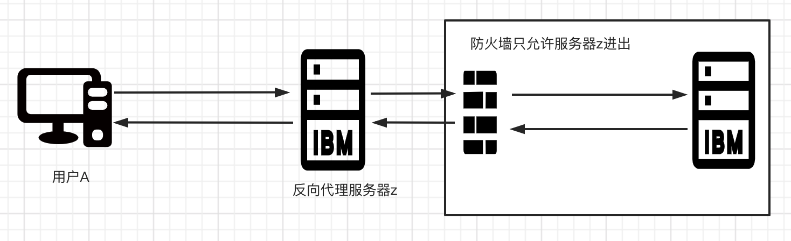
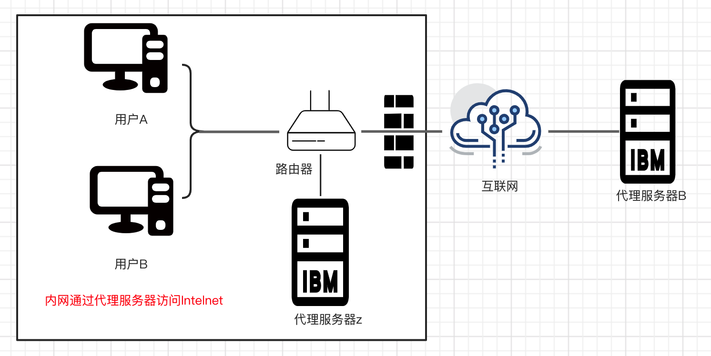
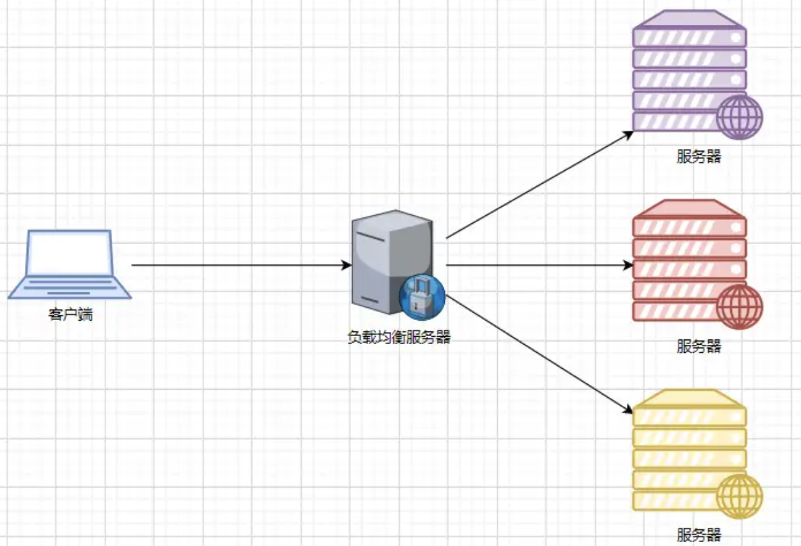

## 代理服务器

代理服务器（Proxy Server）一般是指局域网内部的机器通过代理服务器发送请求到互联网上的服务器，代理服务器一般作用在客户端。

举个通俗的例子，比如本地网络无法直接访问一些网站或者服务器，必须通过一个代理点服务器，那个服务器和你的本地网络是可以直接 ping 通的，然后你就必须设置这个代理服务器的一些参数，比如 ip，端口，然后通过这个平台连接到其他网络区域。

一个完整的代理请求过程为：客户端首先与代理服务器创建连接，接着根据代理服务器所使用的代理协议，请求对目标服务器创建连接、或者获得目标服务器的指定资源。 Web 代理（proxy）服务器是网络的中间实体。代理位于 Web 客户端和 Web 服务器之间，扮演 “中间人” 的角色。代理服务器是介于客户端和 Web 服务器之间的另一台服务器，有了它之后，浏览器不是直接到 Web 服务器去取回网页而是向代理服务器发出请求，信号会先送到代理服务器，由代理服务器来取回浏览器所需要的信息并传送给你的浏览器。

代理服务器是一种重要的服务器安全功能，它的工作主要在开放系统互联 (OSI) 模型的会话层，起到防火墙的作用，保证其安全性。

## 反向代理

是指以代理服务器来接受 internet 上的连接请求，然后将请求转发给内部网络上的服务器，并将从服务器上得到的结果返回给 internet 上请求连接的客户端，此时代理服务器对外就表现为一个反向代理服务器。如

客户端（用户 A）向反向代理服务器 z 发送请求，接着反向代理服务器 Z 将判断将向何处（原始服务器 B）转交请求，获得原始服务器 B 返回的内容后，将获得的内容返回给客户端用户 A。而客户端始终认为它访问的是原始服务器 B 而不是服务器 Z。由于防火墙作用，只允许服务器 Z 进出，防火墙和反向代理共同作用保护了原始服务器 B。

​​

## 正向代理

正向代理是一个位于客户端和原始服务器 (origin server) 之间的服务器，为了从原始服务器获取内容，客户端向代理发送一个请求并指定目标(原始服务器)，然后代理向原始服务器转交请求并将获得的内容返回给客户端。客户端必须要进行一些特别的设置才能使用正向代理。客户端才能使用正向代理。

如客户端 A（用户 A,B）和原始服务器（服务器 B）之间的服务器（代理服务器 Z），为了从原始服务器获取内容，用户 A 向代理服务器 Z 发送一个请求并指定目标（服务器 B），然后代理服务器 Z 向服务器 B 转交请求并将获得的内容返回给客户端。客户端必须要进行一些特别的设置才能使用正向代理。

​​

正向代理为防火墙内的局域网客户端提供了访问 Internet 的途径。还可以使用缓冲特性减少网络使用率。

## 反向代理VS正向代理

### 用途差异

* 正向代理的典型用途是为在防火墙内的局域网客户端提供访问 Internet 的途径。正向代理还可以使用缓冲特性减少网络使用率；
* 反向代理的典型用途是将防火墙后面的服务器提供给 Internet 用户访问。反向代理还可以为后端的多台服务器提供负载平衡，或为后端较慢的服务器提供缓冲服务。
* 另外，反向代理还可以启用高级 URL 策略和管理技术，从而使处于不同 web 服务器系统的 web 页面同时存在于同一个 URL 空间下。

### 安全差异

* 正向代理允许客户端通过它访问任意网站并且隐藏客户端自身，因此必须采取安全措施以确保仅为经过授权的客户端提供服务；
* 反向代理对外都是透明的，访问者并不知道自己访问的是一个代理。

## 负载均衡

负载均衡建立在现有网络结构之上，它提供一种链家有效透明的方法扩展网络设备和服务器的宽带、增加吞吐量，加强网络数据处理能力，提高网络的灵活性和可用性。

​​

## 动静分离

为了加快网站的解析速度，可以把动态页面和静态页面由不同的服务器来解析，加快解析速度，降低原来单个服务器的压力。一般来说，都需要将动态资源和静态资源分开，由于Nginx的高并发和静态资源缓存等特性，经常将静态资源部署在Nginx上。如果请求的是静态资源，直接到静态资源目录获取资源，如果是童泰资源的请求，则利用反向代理的原理，把请求转发给对应后台应用去处理，从而实现动静分离。
