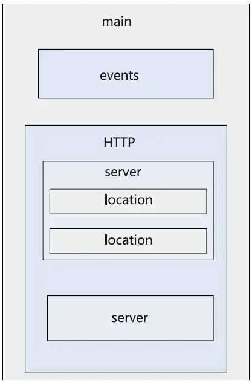

Nginx——Ngine X，是一款高性能的反向代理服务器；也是一个IMAP、POP3、SMTP代理服务器；也是一个Http服务器。

Nginx 是一款轻量级的 Web 服务器 / 反向代理服务器以及电子邮件代理服务器。其特点是占有内存少，并发能力强，事实上 nginx 的并发能力确实在同类型的网页服务器中表现较好。

Nginx 相较于 Apache\lighttpd 具有占有内存少，稳定性高等优势，并且依靠并发能力强，丰富的模块库以及友好灵活的配置而闻名。在 Linux 操作系统下，nginx 使用 epoll 事件模型, 得益于此，nginx 在 Linux 操作系统下效率相当高。

## Nginx应用场景

* 虚拟主机：一台服务器虚拟出多个网站。
* 静态资源服务：提供http资源访问服务。
* 反向代理，负载均衡。当网站的访问量达到一定程度后，单台服务器不能满足用户的请求时，需要用多台服务器集群，可以使用nginx做反向代理。并且多台服务器可以平均分担负载，不会因为某台服务器负载高宕机而某台服务器闲置的情况。

## Nginx 优势

1. 作为 Web 服务器，Nginx 处理静态文件、索引文件，自动索引的效率非常高
2. 作为代理服务器，Nginx 可以实现无缓存的反向代理加速，提高网站运行速度
3. 作为负载均衡服务器，Nginx 既可以在内部直接支持 Rails 和 PHP，也可以支持 HTTP 代理服务器对外进行服务，同时还支持简单的容错和利用算法进行负载均衡
4. 在性能方面，Nginx 是专门为性能优化而开发的，实现上非常注重效率。它采用内核 Poll 模型，可以支持更多的并发连接，最大可以支持对 5 万个并发连接数的响应，而且只占用很低的内存资源
5. 在稳定性方面，Nginx 采取了分阶段资源分配技术，使得 CPU 与内存的占用率非常低。Nginx 官方表示，Nginx 保持 1 万个没有活动的连接，而这些连接只占用 2.5MB 内存，因此，类似 DOS 这样的攻击对 Nginx 来说基本上是没有任何作用的
6. 在高可用性方面，Nginx 支持热部署，启动速度特别迅速，因此可以在不间断服务的情况下，对软件版本或者配置进行升级，即使运行数月也无需重新启动，几乎可以做到 7x24 小时不间断地运行
7. 总的来说 Nginx 具有很高的稳定性；支持热部署；代码质量非常高，代码很规范，手法成熟，模块扩展也很容易。

## Nginx安装

```bash
yum install -y nginx

apt install -y nginx
```

当然，还可以直接下载源码编译安装或者使用docker容器

## 常用命令

```bash
#查看版本
nginx -v

#启动nginx
nginx

#关闭nginx
nginx -s stop

#重加载nginx
nginx -s reload
```

## 配置文件

### 配置文件位置

当没有明确指定 Nginx 配置文件的位置时，Nginx 将按照一定的默认路径和顺序来加载配置文件。在 Linux系统上，默认的配置文件加载路径顺序通常如下：

​`/etc/nginx/nginx.conf`​：这是 Nginx 的主配置文件，如果存在，则会首先尝试加载该文件。

需要注意的是，具体的默认配置文件路径可能会因安装方式、操作系统和 Nginx 版本的不同而有所变化。

在实际使用中，建议通过指定配置文件路径来确保加载正确的配置。可以使用 `-c`​ 命令行选项来指定要加载的配置文件路径，例如：

```shell
nginx -c /path/to/your/nginx.conf
```

这样可以明确告知 Nginx 要加载哪个配置文件，避免不必要的混淆和问题。

### 配置文件解析

```ini
# 定义Nginx运行的用户和用户组
user www-data;
# #nginx进程数，建议设置为等于CPU总核心数。
worker_processes auto;

# 指定 Nginx 进程的 PID 文件路径
pid /run/nginx.pid;

# 包含其他模块配置文件
include /etc/nginx/modules-enabled/*.conf;

# 定义事件处理块，控制并发连接数
events {
	worker_connections 768;
	# multi_accept on;
}

# 定义HTTP服务
http {

	##
	# Basic Settings
	# 基本设置
	##

	# 用来优化文件传输。当客户端请求一个文件时，Nginx 可以使用 sendfile 将文件直接从磁盘发送到网络，而无需将数据复制到用户空间。这可以提高文件传输的效率。
	sendfile on;
	# 确保当服务器有数据发送给客户端时，尽可能地将数据累积到一个 TCP 包中再发送，以减少网络传输的次数，提高性能。
	tcp_nopush on;
	# 禁用了 Nagle 算法，可以减少延迟，特别是在小数据包传输的情况下。
	tcp_nodelay on;
	# 配置客户端和服务器之间保持活动连接的超时时间。如果在指定时间内没有新的请求，连接将被关闭。这有助于减少连接的创建和关闭开销，提高性能。
	keepalive_timeout 65;
	# 定义 MIME 类型哈希表的最大大小。MIME 类型用于指示服务器如何处理不同类型的文件。这个配置项设置哈希表的最大大小，以便更有效地处理 MIME 类型。
	types_hash_max_size 2048;
	# 控制是否在服务器响应头中显示 Nginx 版本信息。将其设置为 off 可以隐藏 Nginx 版本，提高安全性。
	# server_tokens off;

	# 配置服务器名哈希表的桶大小。如果你有很多虚拟主机，可能需要调整这个值来提高性能。
	# server_names_hash_bucket_size 64;
	# 控制在重定向响应中是否使用主机名（Server Name）。将其设置为 off 可以在重定向时不暴露服务器的主机名。
	# server_name_in_redirect off;

	# # MIME类型定义,nginx支持的媒体类型库文件
	include /etc/nginx/mime.types;
	#  # 默认的媒体类型
	default_type application/octet-stream;

	##
	# SSL Settings
	# SSL设置
	##

	# # 指定使用的SSL协议版本
	ssl_protocols TLSv1 TLSv1.1 TLSv1.2 TLSv1.3; # Dropping SSLv3, ref: POODLE
	ssl_prefer_server_ciphers on;

	##
	# Logging Settings
	# 日志设置
	##

	# 访问日志的路径
	access_log /var/log/nginx/access.log;

	# 错误日志的路径
	error_log /var/log/nginx/error.log;

	##
	# Gzip Settings
	# Gzip设置
	##

	# 启用Gzip压缩
	gzip on;

	# gzip_vary on;
	# gzip_proxied any;
	# gzip_comp_level 6;
	# gzip_buffers 16 8k;
	# gzip_http_version 1.1;
	# gzip_types text/plain text/css application/json application/javascript text/xml application/xml application/xml+rss text/javascript;

	##
	# Virtual Host Configs
	# 虚拟主机配置
	##
	# 下面是server虚拟主机的配置
	server {
	    # 提供服务的端口
        listen       80 default_server;
        listen       [::]:80 default_server;
        # 提供服务的主机的域名
        server_name  _;
        # 站点的根目录
        root         /usr/share/nginx/html;

        location / { # location区块
        	# 根路径
        	root html;
        	# 默认的首页文件，多个用空格隔开
        	index index.htm index.html;
        }
		# 出现对应的 http状态码时，返回对应的错误页面
        error_page 404 /404.html;
            location = /40x.html {
        }

        error_page 500 502 503 504 /50x.html;
            location = /50x.html {
        }
    }

	Settings for a TLS enabled server.
	开启ssl加密传输,其余配置和上面类似
	server {
		listen       443 ssl http2 default_server;
		listen       [::]:443 ssl http2 default_server;
		server_name  _;
		root         /usr/share/nginx/html;

		ssl_certificate "/etc/pki/nginx/server.crt";  # ssl加密证书, 证书其实是个公钥，它会被发送到连接服务器的每个客户端
		ssl_certificate_key "/etc/pki/nginx/private/server.key";  # ssl加密的私钥，私钥是用来解密的
		ssl_session_cache shared:SSL:1m; # 设置ssl/tls会话缓存的类型和大小
		ssl_session_timeout  10m; # 客户端可以重用会话缓存中ssl参数的过期时间
		ssl_ciphers PROFILE=SYSTEM; # 选择加密套件，不同的浏览器所支持的套件（和顺序）可能会不同
		ssl_prefer_server_ciphers on;

		# Load configuration files for the default server block.
		include /etc/nginx/default.d/*.conf;

		location / {
		}

		error_page 404 /404.html;
			location = /40x.html {
		}

		error_page 500 502 503 504 /50x.html;
			location = /50x.html {
		}
	}


	# 包含/conf.d/目录下的所有.conf文件
	include /etc/nginx/conf.d/*.conf;
	# 包含/sites-enabled/目录下的所有配置文件
	include /etc/nginx/sites-enabled/*;
}


#mail {
#	# See sample authentication script at:
#	# http://wiki.nginx.org/ImapAuthenticateWithApachePhpScript
#
#       # 配置认证脚本
#	# auth_http localhost/auth.php;
#	# pop3_capabilities "TOP" "USER";
#	# imap_capabilities "IMAP4rev1" "UIDPLUS";
#
#	server {
#		listen     localhost:110;
#		protocol   pop3;
#		proxy      on;
#	}
#
#	server {
#		listen     localhost:143;
#		protocol   imap;
#		proxy      on;
#	}
#}
```

### Nginx文件结构

​​

1、全局块：配置影响nginx全局的指令。一般有运行`nginx`​服务器的用户组，`nginx`​进程`pid`​存放路径，日志存放路径，配置文件引入，允许生成`worker process`​数等。

2、`events`​块：配置影响nginx服务器或与用户的网络连接。有每个进程的最大连接数，选取哪种事件驱动模型处理连接请求，是否允许同时接受多个网路连接，开启多个网络连接序列化等。

3、`http`​块：可以嵌套多个`server`​，配置代理，缓存，日志定义等绝大多数功能和第三方模块的配置。如文件引入，`mime-type`​定义，日志自定义，是否使用`sendfile`​传输文件，连接超时时间，单连接请求数等。

4、`server`​块：配置虚拟主机的相关参数，一个`http`​中可以有多个`server`​。

5、`location`​​块：配置请求的路由，以及各种页面的处理情况。

### Nginx常见的配置项

1. ​`$remote_addr`​ 与 `$http_x_forwarded_for`​ 用以记录客户端的ip地址；
2. ​`$remote_user`​ ：用来记录客户端用户名称；
3. ​`$time_local`​ ： 用来记录访问时间与时区；
4. ​`$request`​ ： 用来记录请求的url与http协议；
5. ​`$status`​ ： 用来记录请求状态；成功是200；
6. ​`$body_bytes_sent`​ ：记录发送给客户端文件主体内容大小；
7. ​`$http_referer`​ ：用来记录从那个页面链接访问过来的；
8. ​`$http_user_agent`​ ：记录客户端浏览器的相关信息；

每个指令必须有分号结束。

## Nginx实例

> 单独的虚拟主机配置一般写在`/etc/nginx/conf.d/`​路径下，一个单独的`conf`​文件中，而不是写在主配置中

### 静态网站

> 以下以`hexo`​静态博客为例，演示部署流程

将生成的静态资源文件夹放到 `/var/www/`​中，起名为`blog`​

打开 `/etc/nginx/conf.d/blog.conf`​配置文件，添加 `server`​ 模块

```ini
# HTTPS 服务器块
server {
    listen 443 ssl;  # 监听 443 端口，启用 SSL
    server_name blog.bookandmusic.cn;  # 服务器名称
    client_max_body_size 20M;  # 最大客户端请求体大小
    ssl_certificate /etc/ssl/blog/blog.bookandmusic.cn.pem;  # SSL 证书文件路径
    ssl_certificate_key /etc/ssl/blog/blog.bookandmusic.cn.key;  # SSL 证书私钥文件路径
  
    # 处理请求的位置块
    location / {
        root /var/www/html/blog/;  # 网站根目录
        try_files $uri $uri/ /index.html;  # 尝试寻找文件，如果不存在则重定向到 /index.html
    }
}

# HTTP 服务器块，用于将请求重定向到 HTTPS
server {
    listen 80;  # 监听 80 端口
    server_name blog.bookandmusic.cn;  # 服务器名称
  
    # 将所有请求重定向到 HTTPS
    rewrite ^(.*)$ https://$host$1 permanent;
}

```

​`listen`​指的是 后期可以在哪个端口中，访问博客，`http`​协议默认端口是 80，hexo博客部署的也是顶级路径，也就是 如果服务器域名是 `http://www.bookandmusic.cn/`​, hexo服务的主页路径也是 `http://www.bookandmusic.cn/`​

### 动静分离

Nginx 动静分离简单来说就是把动态跟静态请求分开，不能理解成只是单纯的把动态页面和静态页面物理分离。

> 以下以 `django`​项目为例，演示 部署流程

确定 django项目中的静态资源路径以及 `supervisor`​​ 启动的django服务的地址

打开 `nginx`​​配置文件，添加 `server`​​ 模块

```ini
server {
    listen 443 ssl;  # 监听 443 端口，启用 SSL
    server_name blog.bookandmusic.cn;  # 服务器名称
    client_max_body_size 20M;  # 最大客户端请求体大小
    ssl_certificate /etc/ssl/blog/blog.bookandmusic.cn.pem;  # SSL 证书文件路径
    ssl_certificate_key /etc/ssl/blog/blog.bookandmusic.cn.key;  # SSL 证书私钥文件路径

    # 静态文件配置
    location /static/ {
        alias /app/collectedstatic/;
        expires max;
        access_log        off;
        log_not_found    off;
    }
    location /media/ {
        # 静态文件配置
        alias /app/uploads/;
        expires max;
    }
    location ~ \.py$ {
        return 403;
    }
    location / {
        proxy_set_header X-Real-IP $remote_addr;
        proxy_set_header X-Forwarded-For $proxy_add_x_forwarded_for;
        proxy_set_header Host $http_host;
        proxy_set_header X-NginX-Proxy true;
        proxy_redirect off;
        if (!-f $request_filename) {
            proxy_pass http://127.0.0.1:8000;
            break;
        }
    }
}
```

​`https`​​协议默认的端口是443，此时默认部署的django项目的路径为 顶级路径，也就是 如果服务器域名是 `https://www.bookandmusic.cn/`​​, django服务的主页路径也是 `https://www.bookandmusic.cn/`​​

> 部署 `https://`​协议对应的网站，需要指明 `ssl`​证书和解密私钥

### 多路径代理

现在有三个不同的服务：

* ​`http://127.0.0.1:7000/`​: 博客服务
* ​`http://127.0.0.1:7001/`​: django文档服务
* ​`http://127.0.0.1:7002/`​: flask文档服务

此时，想要在同样的域名 `http://localhost/`​下，通过不同的子路径来体现不同的服务

```ini
server {
    listen 80;
    server_name localhost;

    location / {
        proxy_pass http://127.0.0.1:7000/;
    }

    location /drf/ {
        proxy_pass http://127.0.0.1:7001/;
    }

    location /flask/ {
        proxy_pass http://127.0.0.1:7002/;
    }
}
```

### 负载均衡

django项目，现在部署了多个服务

* ​`http://192.168.5.21`​
* ​`http://192.168.5.22`​

此时，为了分担压力，在访问 `http://bookandmusic.cn/`​时，需要 分发到不同的服务中，也就是所谓的负载均衡

```ini
upstream django {
    server 192.168.5.21;
    server 192.168.5.22;
}

server {
    listen 80;
    server_name bookandmusic.cn;

    location / {
        proxy_pass http://django/;
    }
}
```

nginx提供了几种分配方式

```ini
#1.轮询（默认）
每个请求按时间顺序逐一分配到不同的后端服务器，如果后端服务器 down 掉，能自动剔除。
upstream django {
    # 此时配置服务时，不需要要 http或https
    server 192.168.5.21;
    server 192.168.5.22;
}

#2.weight
weight 代表权重，默认是1，权重越高被分配的客户端越多。
指定轮询几率，weight和访问比率成正比，用于后端服务器性能不均的情况。例如：
upstream server_pool{
    server 192.168.5.21 weight=1;
    server 192.168.5.22 weight=2;
}

#3. ip_hash
每个请求按访问 ip 的 hash 结果分配，这样每个访客固定一个后端服务器，可以解决session的问题。例如：
upstream server_pool{
    ip_hash
    server 192.168.5.21:80;
    server 192.168.5.22:80;
}
#4.fair(第三方，需要安装第三方模块)
按后端服务器的响应时间来分配请求，响应时间短的优先分配。
upstream server_pool{
    server 192.168.5.21:80;
    server 192.168.5.22:80;
    fair;
}
```
