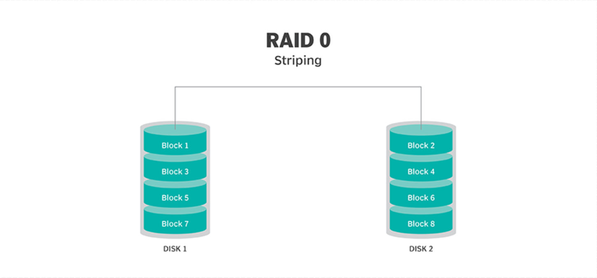
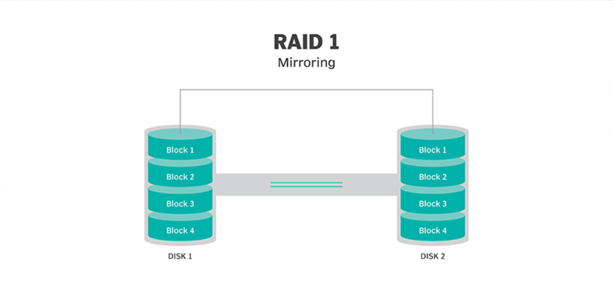
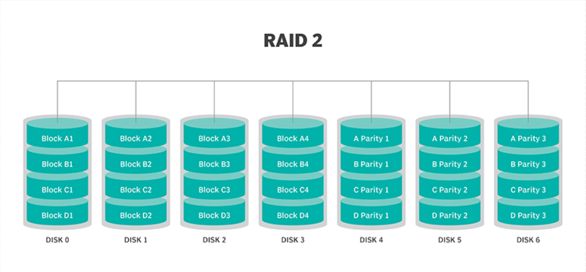
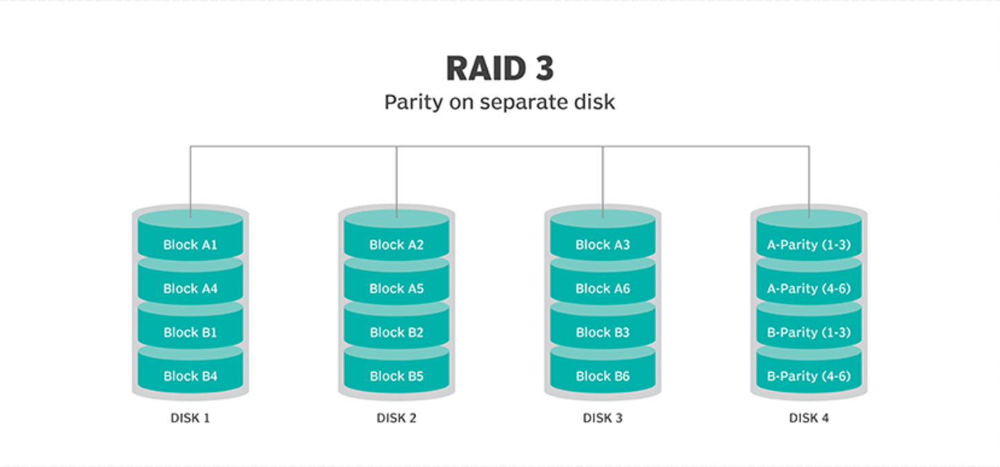
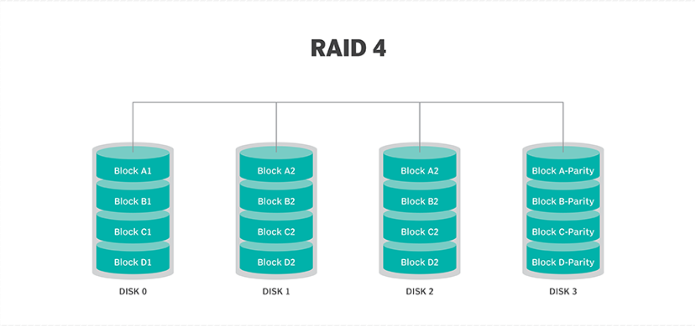
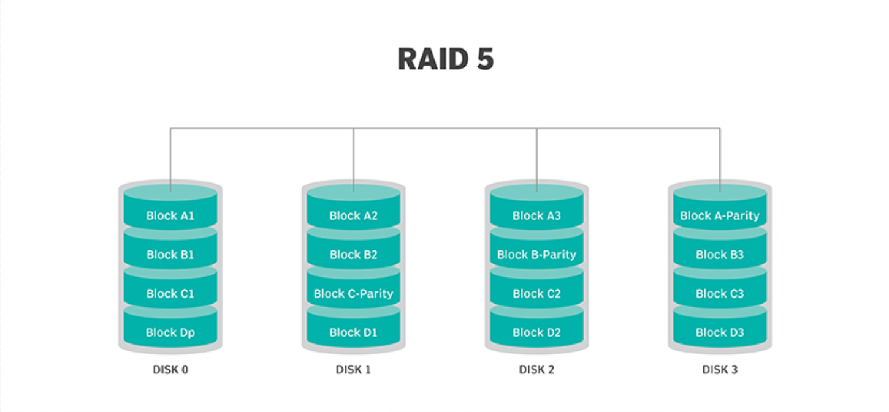
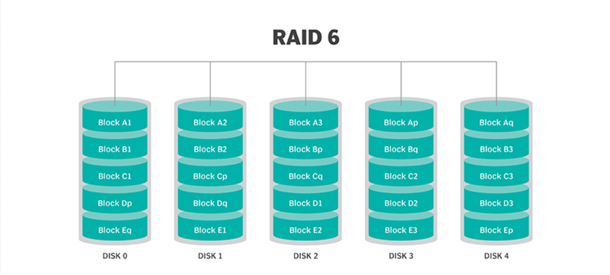
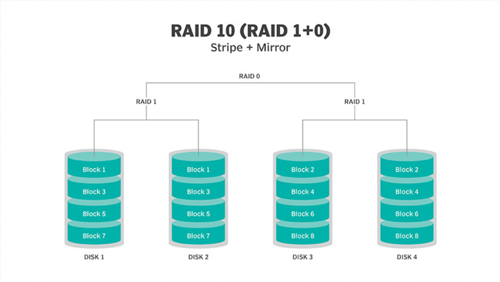

> 原文地址 [https://www.cnblogs.com/zhaojiedi1992/p/zhaojiedi_linux_041_raid.html](https://www.cnblogs.com/zhaojiedi1992/p/zhaojiedi_linux_041_raid.html)

## 什么是 RAID

RAID 全称是独立磁盘冗余阵列（Redundant Array of Independent Disks），基本思想是把多个磁盘组合起来，组合一个磁盘阵列组，使得性能大幅提高。

RAID 分为几个不同的等级，各个不同的等级均在数据可靠性及读写性能做了不同的权衡。实际工作中根据自己的业务需求选择不同的 RAID 方案。

### RAID 0（条带化磁盘）

* 最小要求硬盘数：`2`​ 块
* **特点**：

  * 1、将**数据段分割成**相同大小的**数据块**，每块**数据写入磁盘阵列上的不同磁盘**的方法。
  * 2、两块硬盘的**读写速度**和**容量**都可以叠加。

    ​​
* **缺点**：**一块硬盘损坏整个阵列都无法读取**。
* **性能**：12 块硬盘的情况下，可以提供 12 块硬盘叠加的**连续读取和写入**性能以及 12 块硬盘叠加的**容量**。

### RAID 1（磁盘镜像）

* 最小要求硬盘数：`2`​ 块。
* **特点**：两块硬盘只有**连续读速度**可以叠加，**连续写速度和容量**均以**相对较弱的磁盘**为准，一块硬盘损坏不影响整个阵列。

  ​​
* **缺点**：容量损失较大。
* **性能**：12 块硬盘的情况下，可以提供 12 块硬盘叠加的**连续读取**性能，1 块硬盘的**连续写入**性能，1 块硬盘的容量。

### RAID 2

* 最小要求硬盘数：`3`​ 块。
* **特点**：

  * 1、使用**汉明码**在磁盘的**二进制位级别**进行纠错，对应的汉明码放置在对应序号的磁盘上（PS. 汉明码一般在 2 n 2^n 2n 块磁盘上， n ∈ N n \in \mathbb{N} n∈N（自然数 {0，1，······} ））

    ​​
* **缺点**：容量损失较大，该技术为早期 RAID 技术，现已被更高级别的 RAID 技术所取代
* **性能**：12 块硬盘的情况下，可以提供 8 块硬盘叠加的**读取和写入**性能以及 8 块硬盘的容量。

### RAID 3（独立磁盘冗余阵列）

* 最小要求硬盘数：`3`​ 块。
* **特点**：

  * 1、**字节级条带化**，也就是**使用异或进行奇偶校验的最小单位是**​`字节`​，**而不是磁盘上的**​`块`​。
  * 2、磁盘必须**同步旋转**才能获得数据。
  * 3、每次修改数据以后都要**更新存储校验码磁盘**，导致校验码磁盘的读写是最为频繁的，也导致校验码磁盘损坏概率变高。
  * 4、只有 `N - 1`​ 块硬盘上存有数据，**另外一块硬盘 专门存储**的是数据的**异或信息**，丢失一块硬盘的时候，可以通过异或运算计算出损坏的硬盘上存储的数据是多少。
  * 5、**最多容忍一块硬盘失效**，如果超过一块硬盘失效，磁盘阵列不能保证数据完整性。

    ​​
* **缺点**：一旦**一块硬盘失效，整个磁盘阵列的性能会变得非常差**，读取数据需要占用大量的 CPU 资源进行异或运算来计算数据。
* **性能**：**顺序读写性能很好，随机读写性能很差**（因为随机读写的目标是硬盘上的`块`​，而不是字节）。12 块硬盘的情况下，可以提供 11 块硬盘叠加的**连续读取和写入性能**和 11 块硬盘的容量。

### RAID 4（独立磁盘冗余阵列）

* 最小要求硬盘数：`3`​ 块。
* **特点**：（与 RAID 3 十分相似，只不过条带化的单位变成了`块`​）

  * 1、**块级条带化**，也就是**使用异或进行奇偶校验的最小单位是磁盘的最小存储单位** `块`​。
  * 2、磁盘必须**同步旋转**才能获得数据。
  * 3、每次修改数据以后都要**更新存储校验码磁盘**，导致校验码磁盘的读写是最为频繁的，也导致校验码磁盘损坏概率变高。
  * 4、只有 `N - 1`​ 块硬盘上存有数据，**另外一块硬盘 专门存储**的是数据的**异或信息**，丢失一块硬盘的时候，可以通过异或运算计算出损坏的硬盘上存储的数据是多少。
  * 5、**最多容忍一块硬盘失效**，如果超过一块硬盘失效，磁盘阵列不能保证数据完整性。

    ​​
* **缺点**：一旦**一块硬盘失效，整个磁盘阵列的性能会变得非常差**，读取数据需要占用大量的 CPU 资源进行异或运算来计算数据。
* **性能**：**顺序读写和随机读取**性能很好，**随机写入**性能很差（因为写入时需要向校验盘写入校验数据，相当与需要多块硬盘一起向同一位置进行随机写入）。12 块硬盘的情况下，可以提供 11 块硬盘叠加的**连续读取和写入性能**和 11 块硬盘的容量。

### RAID 5（奇偶校验磁盘条带化）

* 最小要求硬盘数：`3`​ 块。
* **特点**：

  * 1、**块级条带化**，也就是**使用异或进行奇偶校验的最小单位不是**​`字节`​，**而是磁盘上的**​`块`​。
  * 2、**分散存放校验码**，使 RAID 3、4 中**校验码磁盘较大的压力被平均分摊到磁盘组的每一个磁盘上**。
  * 3、只有 `N - 1`​ 块硬盘上存有数据，数据的**异或信息分散存储在硬盘组的各个硬盘中**，丢失一块硬盘的时候，可以通过异或运算计算出损坏的硬盘上存储的数据是多少。
  * 4、**最多容忍一块硬盘失效**，如果超过一块硬盘失效，数据不能保证完整。

    ​​
* **缺点**：一旦**一块硬盘失效，整个磁盘阵列的性能会变得非常差**，读取数据需要占用大量的 CPU 资源进行异或运算来计算数据。
* **性能**：与 RAID 4 类似，**顺序读写和随机读取**性能很好，**随机写入**性能很差。12 块硬盘的情况下，可以提供 11 块硬盘叠加的**连续读取和写入性能**和 11 块硬盘的容量。

### RAID 6

* 最小要求硬盘数：`4`​ 块。
* **特点**：

  * 1、与 RAID 5 一样，使用**块级条带化**。
  * 2、在 RAID 5 的基础上，将奇偶校验位数修改为 `2`​ 位，这样**最多可以容忍两块硬盘失效**。

    ​​
* **缺点**：

  * 1、一旦**一块硬盘失效，整个磁盘阵列的性能会变得非常差**，读取数据需要占用大量的 CPU 资源进行异或运算来计算数据。
  * 2、这种 RAID **控制器设计**起来**十分复杂**，因为**需要为每个数据块计算两个奇偶校验**。
* **性能**：与 RAID 4、5 类似，**顺序读写和随机读取**性能很好，**随机写入**性能很差。12 块硬盘的情况下，可以提供 10 块硬盘叠加的**连续读取和写入性能**和 10 块硬盘的容量。

### RAID 7

RAID 7 是非标准的 RAID 级别，它基于 RAID 3 和 RAID 4，并且需要使用专用硬件。这一 RAID 级别的商标持有人是现已倒闭的 Storage Computer 公司。

### RAID 10（镜像阵列条带，也成为 RAID 1 + 0 ）

* 最小要求硬盘数：`4`​ 块。
* **特点**：

  * 1、同时用到了 RAID 0 和 RAID 1 的思想，两块硬盘通过 RAID 1 组成磁盘组，然后再将各个磁盘组组成 RAID 0。
  * ​​
* **缺点**：磁盘利用率较低，只有 50 %
* **性能**：**顺序读写和随机读写**的性能都还不错。12 块硬盘的情况下，只能提供 6 块硬盘叠加的**连续读取和写入性能**和 6 块硬盘的容量。

## RAID 的实现方式

* 外接式磁盘阵列：通过扩展卡提供适配能力
* 内接式 RAID：主板集成 RAID 控制器安装 OS 前在 BIOS 里配置
* 软件 RAID：通过 OS 实现

## 软 RAID 的实现

### RAID5 的实现

创建由三块硬盘组成的可用空间为 2G 的 RAID5 设备，要求其 chunk 大小为 256k，文件系统为 ext4，开机可自动挂载至 / mydata 目录

#### 先看看我们的磁盘情况

```
[root@centos7 Bash]$ lsblk
NAME   MAJ:MIN RM  SIZE RO TYPE MOUNTPOINT
sda      8:0    0  200G  0 disk 
├─sda1   8:1    0    1G  0 part /boot
├─sda2   8:2    0  128G  0 part 
├─sda3   8:3    0 48.8G  0 part /
├─sda4   8:4    0  512B  0 part 
└─sda5   8:5    0 19.5G  0 part /app
sdb      8:16   0  100G  0 disk 
sdc      8:32   0   20G  0 disk 
sdd      8:48   0   20G  0 disk 
sde      8:64   0   20G  0 disk 
sdf      8:80   0   20G  0 disk 
sr0     11:0    1  8.1G  0 rom  /run/media/root/CentOS 7 x86_64
```

这里我们使用 sdb,sdc,sdd, 每个盘创建一个主分区 1G, 构建 RADI5.

#### 根据实际情况分区

```
[root@centos7 Bash]$ fdisk /dev/sdb
Welcome to fdisk (util-linux 2.23.2).

Changes will remain in memory only, until you decide to write them.
Be careful before using the write command.

Device does not contain a recognized partition table
Building a new DOS disklabel with disk identifier 0x93d380cf.

Command (m for help): n
Partition type:
   p   primary (0 primary, 0 extended, 4 free)
   e   extended
Select (default p): p
Partition number (1-4, default 1): 
First sector (2048-209715199, default 2048): 
Using default value 2048
Last sector, +sectors or +size{K,M,G} (2048-209715199, default 209715199): +1G
Partition 1 of type Linux and of size 1 GiB is set

Command (m for help): t
Selected partition 1
Hex code (type L to list all codes): fd
Changed type of partition 'Linux' to 'Linux raid autodetect'

Command (m for help): p

Disk /dev/sdb: 107.4 GB, 107374182400 bytes, 209715200 sectors
Units = sectors of 1 * 512 = 512 bytes
Sector size (logical/physical): 512 bytes / 512 bytes
I/O size (minimum/optimal): 512 bytes / 512 bytes
Disk label type: dos
Disk identifier: 0x93d380cf

   Device Boot      Start         End      Blocks   Id  System
/dev/sdb1            2048     2099199     1048576   fd  Linux raid autodetect

Command (m for help): w
The partition table has been altered!

Calling ioctl() to re-read partition table.
Syncing disks.
[root@centos7 Bash]$ fdisk /dev/sdc
Welcome to fdisk (util-linux 2.23.2).

Changes will remain in memory only, until you decide to write them.
Be careful before using the write command.

Device does not contain a recognized partition table
Building a new DOS disklabel with disk identifier 0xc56b90d8.

Command (m for help): n
Partition type:
   p   primary (0 primary, 0 extended, 4 free)
   e   extended
Select (default p): p
Partition number (1-4, default 1): 
First sector (2048-41943039, default 2048): 
Using default value 2048
Last sector, +sectors or +size{K,M,G} (2048-41943039, default 41943039): +1G
Partition 1 of type Linux and of size 1 GiB is set

Command (m for help): t
Selected partition 1
Hex code (type L to list all codes): fd
Changed type of partition 'Linux' to 'Linux raid autodetect'

Command (m for help): p

Disk /dev/sdc: 21.5 GB, 21474836480 bytes, 41943040 sectors
Units = sectors of 1 * 512 = 512 bytes
Sector size (logical/physical): 512 bytes / 512 bytes
I/O size (minimum/optimal): 512 bytes / 512 bytes
Disk label type: dos
Disk identifier: 0xc56b90d8

   Device Boot      Start         End      Blocks   Id  System
/dev/sdc1            2048     2099199     1048576   fd  Linux raid autodetect

Command (m for help): w
The partition table has been altered!

Calling ioctl() to re-read partition table.
Syncing disks.
[root@centos7 Bash]$ fdisk /dev/sdd
Welcome to fdisk (util-linux 2.23.2).

Changes will remain in memory only, until you decide to write them.
Be careful before using the write command.

Device does not contain a recognized partition table
Building a new DOS disklabel with disk identifier 0x7e0900d8.

Command (m for help): n
Partition type:
   p   primary (0 primary, 0 extended, 4 free)
   e   extended
Select (default p): p
Partition number (1-4, default 1): 
First sector (2048-41943039, default 2048): 
Using default value 2048
Last sector, +sectors or +size{K,M,G} (2048-41943039, default 41943039): +1G
Partition 1 of type Linux and of size 1 GiB is set

Command (m for help): p

Disk /dev/sdd: 21.5 GB, 21474836480 bytes, 41943040 sectors
Units = sectors of 1 * 512 = 512 bytes
Sector size (logical/physical): 512 bytes / 512 bytes
I/O size (minimum/optimal): 512 bytes / 512 bytes
Disk label type: dos
Disk identifier: 0x7e0900d8

   Device Boot      Start         End      Blocks   Id  System
/dev/sdd1            2048     2099199     1048576   83  Linux

Command (m for help): t
Selected partition 1
Hex code (type L to list all codes): fd
Changed type of partition 'Linux' to 'Linux raid autodetect'

Command (m for help): w
The partition table has been altered!

Calling ioctl() to re-read partition table.
Syncing disks.
```

#### 创建 raid

```
[root@centos7 Bash]$ mdadm -C /dev/md5 -a yes -l 5 -n 3 /dev/sd{b1,c1,d1} -c 256       # -C指定创建， -a yes 自动创建设备 ， -l 设定level , -n 设定磁盘个数， -c chunk大小
Continue creating array? y
mdadm: Defaulting to version 1.2 metadata
mdadm: array /dev/md5 started.
[root@centos7 Bash]$ mdadm -Ds                                                          # 查看信息
ARRAY /dev/md5 metadata=1.2 name=centos7.magedu.com:5 UUID=2c8ae60d:a799fcb7:9008a046:ae6ea430
[root@centos7 Bash]$ mdadm -Ds >/etc/mdadm.conf                                         # 将软raid信息写入到配置文件中去
[root@centos7 Bash]$ mkdir /mnt/md5                                                     # 创建挂载点目录 
[root@centos7 Bash]$ mkfs.ext4 /dev/md5                                                 # 创建文件系统
mke2fs 1.42.9 (28-Dec-2013)
Filesystem label=
OS type: Linux
Block size=4096 (log=2)
Fragment size=4096 (log=2)
Stride=64 blocks, Stripe width=128 blocks
131072 inodes, 523776 blocks
26188 blocks (5.00%) reserved for the super user
First data block=0
Maximum filesystem blocks=536870912
16 block groups
32768 blocks per group, 32768 fragments per group
8192 inodes per group
Superblock backups stored on blocks: 
    32768, 98304, 163840, 229376, 294912

Allocating group tables: done                          
Writing inode tables: done                          
Creating journal (8192 blocks): done
Writing superblocks and filesystem accounting information: done 

[root@centos7 Bash]$ mount /dev/md5 /mnt/md5                                          # 挂载设备 
[root@centos7 Bash]$ tail -n 1 /etc/mtab
/dev/md5 /mnt/md5 ext4 rw,seclabel,relatime,stripe=128,data=ordered 0 0               # 查看挂载信息
[root@centos7 Bash]$ tail -n 1 /etc/mtab >>/etc/fstab                                 #添加到fstab文件中，确保开机启动，这里建议使用uuid
```

#### 验证 raid

```
[root@centos7 md5]$ mdadm -D /dev/md5                                                 #查看详细raid5详细信息，可以发现有3个都是working状态的
/dev/md5:
           Version : 1.2
     Creation Time : Wed Dec  6 19:28:22 2017
        Raid Level : raid5
        Array Size : 2095104 (2046.00 MiB 2145.39 MB)
     Used Dev Size : 1047552 (1023.00 MiB 1072.69 MB)
      Raid Devices : 3
     Total Devices : 3
       Persistence : Superblock is persistent

       Update Time : Wed Dec  6 19:39:06 2017
             State : clean 
    Active Devices : 3
   Working Devices : 3
    Failed Devices : 0
     Spare Devices : 0

            Layout : left-symmetric
        Chunk Size : 256K

Consistency Policy : resync

              Name : centos7.magedu.com:5  (local to host centos7.magedu.com)
              UUID : 2c8ae60d:a799fcb7:9008a046:ae6ea430
            Events : 18

    Number   Major   Minor   RaidDevice State
       0       8       17        0      active sync   /dev/sdb1
       1       8       33        1      active sync   /dev/sdc1
       3       8       49        2      active sync   /dev/sdd1
[root@centos7 md5]$ man mdadm
[root@centos7 md5]$ mdadm /dev/md5 -f /dev/sdc1                                                 # -f 设定指定设备故障， 将/dev/sdc1 这个盘标记失败， 看是否数据能访问，我这里使用-f标记失败，工作中可以根据硬盘指示灯判断磁盘状态
mdadm: set /dev/sdc1 faulty in /dev/md5          
[root@centos7 md5]$ mdadm -D /dev/md5                                                           #在次查看信息，发现工作的是2个， 一个失败的设备 
/dev/md5:
           Version : 1.2
     Creation Time : Wed Dec  6 19:28:22 2017
        Raid Level : raid5
        Array Size : 2095104 (2046.00 MiB 2145.39 MB)
     Used Dev Size : 1047552 (1023.00 MiB 1072.69 MB)
      Raid Devices : 3
     Total Devices : 3
       Persistence : Superblock is persistent

       Update Time : Wed Dec  6 19:41:08 2017
             State : clean, degraded                                                             # 这里注意了。 我们的一个盘坏掉了。 raid5状态为降级使用了。
    Active Devices : 2
   Working Devices : 2
    Failed Devices : 1
     Spare Devices : 0

            Layout : left-symmetric
        Chunk Size : 256K

Consistency Policy : resync

              Name : centos7.magedu.com:5  (local to host centos7.magedu.com)
              UUID : 2c8ae60d:a799fcb7:9008a046:ae6ea430
            Events : 20

    Number   Major   Minor   RaidDevice State
       0       8       17        0      active sync   /dev/sdb1
       -       0        0        1      removed
       3       8       49        2      active sync   /dev/sdd1

       1       8       33        -      faulty   /dev/sdc1
[root@centos7 md5]$ cat a.txt                                          # 发现我们的数据还是能访问的。没有问题。
```

#### 替换设备

我这里是磁盘坏掉后的执行替换的， 完全可以多一个备用盘， 坏掉自动替换的。

```
[root@centos7 md5]$ mdadm /dev/md5 -a /dev/sde1                        # 上面我们的sdc1数据损坏，我们需要更换新的磁盘来顶替他的位置。这里添加一个sde1的磁盘， fdisk操作这里省去了。
mdadm: added /dev/sde1
[root@centos7 md5]$ mdadm -Ds                                          # 查看详细信息
ARRAY /dev/md5 metadata=1.2 name=centos7.magedu.com:5 UUID=2c8ae60d:a799fcb7:9008a046:ae6ea430
[root@centos7 md5]$ mdadm -D /dev/md5                                  # 查看详细信息
/dev/md5:
           Version : 1.2
     Creation Time : Wed Dec  6 19:28:22 2017
        Raid Level : raid5
        Array Size : 2095104 (2046.00 MiB 2145.39 MB)
     Used Dev Size : 1047552 (1023.00 MiB 1072.69 MB)
      Raid Devices : 3
     Total Devices : 4
       Persistence : Superblock is persistent

       Update Time : Wed Dec  6 19:50:01 2017
             State : clean                                                  # 状态恢复正常了。没有问题
    Active Devices : 3
   Working Devices : 3
    Failed Devices : 1
     Spare Devices : 0

            Layout : left-symmetric
        Chunk Size : 256K

Consistency Policy : resync

              Name : centos7.magedu.com:5  (local to host centos7.magedu.com)
              UUID : 2c8ae60d:a799fcb7:9008a046:ae6ea430
            Events : 43

    Number   Major   Minor   RaidDevice State
       0       8       17        0      active sync   /dev/sdb1
       4       8       65        1      active sync   /dev/sde1
       3       8       49        2      active sync   /dev/sdd1

       1       8       33        -      faulty   /dev/sdc1             # 这个盘是坏掉的，我们已经加入了新的磁盘， 这个盘可以干掉了
[root@centos7 md5]$ man mdadm
[root@centos7 md5]$ mdadm /dev/md5 --remove /dev/sdc1                  # 这个盘我们从raid5中移除去。 
mdadm: hot removed /dev/sdc1 from /dev/md5
```

#### 扩展 raid

我们上面使用的是 2+1 构成的 raid5, 磁盘利用率为 66%，如果我们想改成 3+1 可以执行类似如下命令

```
[root@centos7 mnt]$ mkadm -G -r  /dev/md5 -n 4 -a /dev/sdxx                  # 这里我就不测试了。使用/dev/sdxx代替一个设备。-G 是Grown增长的意思，-r 是resizefs的意思，
```

#### 清空 raid 信息

```
[root@centos7 mnt]$ umount /dev/md5                                   # 卸载设备
[root@centos7 mnt]$ mdadm -S /dev/md5                                 # 停止raid5 
mdadm: stopped /dev/md5
[root@centos7 mnt]$ sed -i '$d' /etc/fstab                            # 删除fstab中关于raid5挂载的行
[root@centos7 mnt]$ cat /etc/fstab                                    # 确保fstab没有大问题

#
# /etc/fstab
# Created by anaconda on Tue Nov  7 16:07:01 2017
#
# Accessible filesystems, by reference, are maintained under '/dev/disk'
# See man pages fstab(5), findfs(8), mount(8) and/or blkid(8) for more info
#

UUID=59ccea87-3c4e-4bbc-9e2f-3fadb1dcf2e6 /                       ext4    defaults        1 1
UUID=f4e867e8-bcde-43a2-adc7-c80b0948e85f /app                    ext4    noatime,usrquota,grpquota        1 2
UUID=1d6cbe88-ffb4-4adf-bacf-76be1fa75708 /boot                   ext4    defaults        1 2
#UUID=b2c064f5-1ee5-4b5c-9e75-ed41cb99c5aa swap                    swap    defaults        0 0
#UUID=a0516c4f-40e6-4919-905a-8b44db12ff7b swap               swap    defaults,pri=0        0 0 
#/dev/sdb2 /test ext4 rw,seclabel,relatime,data=ordered 0 0
#/dev/sdb1 /home xfs rw,seclabel,relatime,attr2,inode64,usrquota,grpquota  0 0
[root@centos7 mnt]$ rm -rf /etc/mdadm.conf                                   # 删除raid默认配置文件
```

```
[root@centos7 mnt]$ mdadm --zero-superblock /dev/sd{b1,e1,d1,c1}             # 清空设置上的超级块信息
```

### RAID10 的实现

raid10 ，6 个分区，2 个一组 raid1,3 组 raid0 

#### 案例分析

分析下，我们创建一个 raid10 设置，2 个设备组成一个 raid1,6 个设备 2 个一组可以组成 3 个 raid1, 然后把 3 个 raid1 组成一个 raid0 即可

#### 先创建 6 个设备

```
[root@centos7 mnt]$ lsblk                                # 就是使用fdisk 创建的设备， 具体这里就不写了。 最终使用lsblk显示，我们可以看到sdb1,sdb2,sdd1,sde1一共6个磁盘
NAME   MAJ:MIN RM  SIZE RO TYPE MOUNTPOINT
sda      8:0    0  200G  0 disk 
├─sda1   8:1    0    1G  0 part /boot
├─sda2   8:2    0  128G  0 part 
├─sda3   8:3    0 48.8G  0 part /
├─sda4   8:4    0  512B  0 part 
└─sda5   8:5    0 19.5G  0 part /app
sdb      8:16   0  100G  0 disk 
├─sdb1   8:17   0    1G  0 part 
└─sdb2   8:18   0    1G  0 part 
sdc      8:32   0   20G  0 disk 
├─sdc1   8:33   0    1G  0 part 
└─sdc2   8:34   0    1G  0 part 
sdd      8:48   0   20G  0 disk 
└─sdd1   8:49   0    1G  0 part 
sde      8:64   0   20G  0 disk 
└─sde1   8:65   0    1G  0 part 
sdf      8:80   0   20G  0 disk 
sr0     11:0    1  8.1G  0 rom  /run/media/root/CentOS 7 x86_64
```

#### 创建 raid

```
[root@centos7 mnt]$ mdadm -C /dev/md11 -a yes -l 1 -n 2 /dev/sd{b1,c1}                               # 创建第一个raid1
mdadm: /dev/sdb1 appears to be part of a raid array:
       level=raid5 devices=3 ctime=Wed Dec  6 19:28:22 2017
mdadm: Note: this array has metadata at the start and
    may not be suitable as a boot device.  If you plan to
    store '/boot' on this device please ensure that
    your boot-loader understands md/v1.x metadata, or use
    --metadata=0.90
mdadm: /dev/sdc1 appears to be part of a raid array:
       level=raid5 devices=3 ctime=Wed Dec  6 19:28:22 2017
Continue creating array? y
mdadm: Defaulting to version 1.2 metadata
mdadm: array /dev/md11 started.
[root@centos7 mnt]$ mdadm -C /dev/md12 -a yes -l 1 -n 2 /dev/sd{b2,c2}                                #创建第二个raid1
mdadm: Note: this array has metadata at the start and
    may not be suitable as a boot device.  If you plan to
    store '/boot' on this device please ensure that
    your boot-loader understands md/v1.x metadata, or use
    --metadata=0.90
Continue creating array? y
mdadm: Defaulting to version 1.2 metadata
mdadm: array /dev/md12 started.
[root@centos7 mnt]$ mdadm -C /dev/md13 -a yes -l 1 -n 2 /dev/sd{d1,e1}                                 # 创建第三个raid1
mdadm: /dev/sdd1 appears to be part of a raid array:
       level=raid5 devices=3 ctime=Wed Dec  6 19:28:22 2017
mdadm: Note: this array has metadata at the start and
    may not be suitable as a boot device.  If you plan to
    store '/boot' on this device please ensure that
    your boot-loader understands md/v1.x metadata, or use
    --metadata=0.90
mdadm: /dev/sde1 appears to be part of a raid array:
       level=raid5 devices=3 ctime=Wed Dec  6 19:28:22 2017
Continue creating array? y
mdadm: Defaulting to version 1.2 metadata
mdadm: array /dev/md13 started.
[root@centos7 mnt]$ mdadm -C /dev/md10 -a yes -l 0 -n 3 /dev/md{11,12,13}                             # 将3个raid1 合并为一个raid0 
mdadm: /dev/md11 appears to contain an ext2fs file system
       size=2095104K  mtime=Wed Dec  6 19:29:45 2017
mdadm: /dev/md13 appears to contain an ext2fs file system
       size=2095104K  mtime=Wed Dec  6 19:29:45 2017
Continue creating array? y
mdadm: Defaulting to version 1.2 metadata
mdadm: array /dev/md10 started.
[root@centos7 mnt]$ mkfs.ext
mkfs.ext2  mkfs.ext3  mkfs.ext4          
[root@centos7 mnt]$ mkfs.ext4 /dev/md10                                                                 # 创建文件系统 
mke2fs 1.42.9 (28-Dec-2013)
Filesystem label=
OS type: Linux
Block size=4096 (log=2)
Fragment size=4096 (log=2)
Stride=128 blocks, Stripe width=384 blocks
196224 inodes, 784896 blocks
39244 blocks (5.00%) reserved for the super user
First data block=0
Maximum filesystem blocks=805306368
24 block groups
32768 blocks per group, 32768 fragments per group
8176 inodes per group
Superblock backups stored on blocks: 
    32768, 98304, 163840, 229376, 294912

Allocating group tables: done                          
Writing inode tables: done                          
Creating journal (16384 blocks): done
Writing superblocks and filesystem accounting information: done 

[root@centos7 mnt]$ mdadm -Ds                                                                             # 查看配置信息
ARRAY /dev/md11 metadata=1.2 name=centos7.magedu.com:11 UUID=0ce2cd6c:cd21fab6:3e65cfb5:64bd86f3
ARRAY /dev/md12 metadata=1.2 name=centos7.magedu.com:12 UUID=8af31dff:efab06ed:48e2613b:a599c774
ARRAY /dev/md13 metadata=1.2 name=centos7.magedu.com:13 UUID=a8c99d60:2d0c61e7:97a76809:9396c020
ARRAY /dev/md10 metadata=1.2 name=centos7.magedu.com:10 UUID=50b2fa58:4ce65d67:8c50c853:fa175a28
[root@centos7 mnt]$ mdadm -Ds  >> /etc/mdadm.conf                                                         # 写配置文件到mdadm的配置文件中
[root@centos7 mnt]$ mkdir /mnt/md10                                                                       # 创建挂载目录
[root@centos7 mnt]$ mount /dev/md10 /mnt/md10                                                             # 挂载文件系统
[root@centos7 mnt]$ tail -n 1 /etc/mtab                                                                   # 查看mtab文件中的最后一行， 也就是我们的md10挂载信息
/dev/md10 /mnt/md10 ext4 rw,seclabel,relatime,stripe=384,data=ordered 0 0
[root@centos7 mnt]$ tail -n 1 /etc/mtab >> /etc/fstab                                                     #添加到开机启动
```

#### raid 清除工作

```
[root@centos7 mnt]$ umount /dev/md10                                                                      # 取消挂载
[root@centos7 mnt]$ rm -rf /etc/mdadm.conf                                                                # 删除mdadm的默认配置
[root@centos7 mnt]$ mdadm -S /dev/md10                                                                    # 停止raid0设置
mdadm: stopped /dev/md10
[root@centos7 mnt]$ mdadm -S /dev/md11                                                                    # 停止raid1设置
mdadm: stopped /dev/md11
[root@centos7 mnt]$ mdadm -S /dev/md12                                                                    # 停止radi1 设置
mdadm: stopped /dev/md12 
[root@centos7 mnt]$ mdadm -S /dev/md13                                                                    # 停止raid 1 设置
mdadm: stopped /dev/md13
[root@centos7 mnt]$ sed -i '$d' /etc/fstab                                                                # 删除fstab的挂载 
[root@centos7 mnt]$ cat /etc/fstab                                                                        # 确保正确

#
# /etc/fstab
# Created by anaconda on Tue Nov  7 16:07:01 2017
#
# Accessible filesystems, by reference, are maintained under '/dev/disk'
# See man pages fstab(5), findfs(8), mount(8) and/or blkid(8) for more info
#

UUID=59ccea87-3c4e-4bbc-9e2f-3fadb1dcf2e6 /                       ext4    defaults        1 1
UUID=f4e867e8-bcde-43a2-adc7-c80b0948e85f /app                    ext4    noatime,usrquota,grpquota        1 2
UUID=1d6cbe88-ffb4-4adf-bacf-76be1fa75708 /boot                   ext4    defaults        1 2
#UUID=b2c064f5-1ee5-4b5c-9e75-ed41cb99c5aa swap                    swap    defaults        0 0
#UUID=a0516c4f-40e6-4919-905a-8b44db12ff7b swap               swap    defaults,pri=0        0 0 
#/dev/sdb2 /test ext4 rw,seclabel,relatime,data=ordered 0 0
#/dev/sdb1 /home xfs rw,seclabel,relatime,attr2,inode64,usrquota,grpquota  0 0
[root@centos7 mnt]$ mdadm -D                                                                                  # 再次查看下mdadm信息，确保没有了
mdadm: No devices given.
[root@centos7 mnt]$ mdadm --zero-superblock /dev/sd{b1,b2,c1,c2,d1,e1}                                        # 请求md的元数据信息
```
