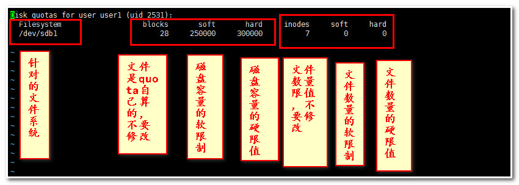
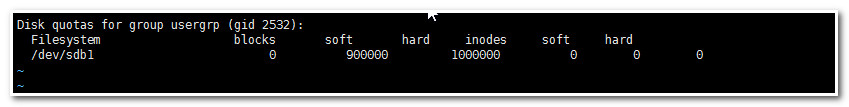
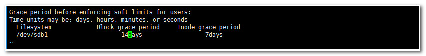

> 原文地址 [https://www.cnblogs.com/zhaojiedi1992/p/zhaojiedi_linux_040_quota.html](https://www.cnblogs.com/zhaojiedi1992/p/zhaojiedi_linux_040_quota.html)

## 1 前言

在 linux 系统中，由于是多用户、多任务的环境，如果有少数几个用户大量使用磁盘空间，导致其他用户的正常使用，因此需要对各个用户的磁盘空间进行管理和限定。

## 2 quota 的用途

限制某一个用户的最大磁盘配额

## 3 quota 的使用限制

* 仅能针对整个文件系统
* 内核必须支持
* 只对一般用户生效
* 这里提供一个样例，针对样例对 quota 的配置管理做个描述

## 4 案例讲解

### 4.1 案例描述

* 创建 5 个用户 user1,user2,user3,user4,user5，密码和用户名相同，初始组为 usergrp 组。
* 5 个用户都可以取得 300M 的磁盘使用空间，文件数量不限。超过 250M, 给于提示。
* usergrp 这个组内成员最大使用空间 1GB。
* 如果有用户超过 soft 限制，给 14 天的宽限时间。

### 4.2 准备磁盘

```
[root@mail ~]# fdisk -l      #查看磁盘情况

Disk /dev/sda: 42.9 GB, 42949672960 bytes, 83886080 sectors
Units = sectors of 1 * 512 = 512 bytes
Sector size (logical/physical): 512 bytes / 512 bytes
I/O size (minimum/optimal): 512 bytes / 512 bytes
Disk label type: dos
Disk identifier: 0x000bd275

   Device Boot      Start         End      Blocks   Id  System
/dev/sda1   *        2048     2099199     1048576   83  Linux
/dev/sda2         2099200    83886079    40893440   8e  Linux LVM

Disk /dev/sdb: 10.7 GB, 10737418240 bytes, 20971520 sectors
Units = sectors of 1 * 512 = 512 bytes
Sector size (logical/physical): 512 bytes / 512 bytes
I/O size (minimum/optimal): 512 bytes / 512 bytes

Disk /dev/mapper/cl-root: 39.7 GB, 39720058880 bytes, 77578240 sectors
Units = sectors of 1 * 512 = 512 bytes
Sector size (logical/physical): 512 bytes / 512 bytes
I/O size (minimum/optimal): 512 bytes / 512 bytes

Disk /dev/mapper/cl-swap: 2147 MB, 2147483648 bytes, 4194304 sectors
Units = sectors of 1 * 512 = 512 bytes
Sector size (logical/physical): 512 bytes / 512 bytes
I/O size (minimum/optimal): 512 bytes / 512 bytes

[root@mail ~]# fdisk /dev/sdb     #对sdb这个盘进行分区，这里就分一个区
Welcome to fdisk (util-linux 2.23.2).

Changes will remain in memory only, until you decide to write them.
Be careful before using the write command.

Device does not contain a recognized partition table
Building a new DOS disklabel with disk identifier 0xbcd17d69.

Command (m for help): n
Partition type:
   p   primary (0 primary, 0 extended, 4 free)
   e   extended
Select (default p): p
Partition number (1-4, default 1): 1
First sector (2048-20971519, default 2048): 
Using default value 2048
Last sector, +sectors or +size{K,M,G} (2048-20971519, default 20971519): 
Using default value 20971519
Partition 1 of type Linux and of size 10 GiB is set

Command (m for help): p

Disk /dev/sdb: 10.7 GB, 10737418240 bytes, 20971520 sectors
Units = sectors of 1 * 512 = 512 bytes
Sector size (logical/physical): 512 bytes / 512 bytes
I/O size (minimum/optimal): 512 bytes / 512 bytes
Disk label type: dos
Disk identifier: 0xbcd17d69

   Device Boot      Start         End      Blocks   Id  System
/dev/sdb1            2048    20971519    10484736   83  Linux

Command (m for help): w
The partition table has been altered!

Calling ioctl() to re-read partition table.
Syncing disks.
[root@mail ~]# mkfs.ext4 /dev/sdb1
mke2fs 1.42.9 (28-Dec-2013)
Filesystem label=
OS type: Linux
Block size=4096 (log=2)
Fragment size=4096 (log=2)
Stride=0 blocks, Stripe width=0 blocks
655360 inodes, 2621184 blocks
131059 blocks (5.00%) reserved for the super user
First data block=0
Maximum filesystem blocks=2151677952
80 block groups
32768 blocks per group, 32768 fragments per group
8192 inodes per group
Superblock backups stored on blocks: 
    32768, 98304, 163840, 229376, 294912, 819200, 884736, 1605632

Allocating group tables: done 
Writing inode tables: done 
Creating journal (32768 blocks): done
Writing superblocks and filesystem accounting information: done 

[root@mail ~]# mkdir /mnt/home          #创建一个目录
[root@mail ~]# mount /dev/sdb1 /mnt/home   #测试挂载下
```

### 4.3. 创建用户

```
[root@mail ~]# vim adduserbat.sh  #创建一个添加用户的脚本
[root@mail ~]# cat adduserbat.sh  #确认下脚本
#!/bin/bash

groupadd usergrp
for user in user1 user2 user3 user4 user5
do 
    useradd -g usergrp -b /mnt/home $user
    echo $user |passwd --stdin $user
done
[root@mail ~]# sh adduserbat.sh    #运行脚本去创建用户
useradd: warning: the home directory already exists.
Not copying any file from skel directory into it.
Creating mailbox file: File exists
Changing password for user user1.
passwd: all authentication tokens updated successfully.
useradd: warning: the home directory already exists.
Not copying any file from skel directory into it.
Creating mailbox file: File exists
Changing password for user user2.
passwd: all authentication tokens updated successfully.
useradd: warning: the home directory already exists.
Not copying any file from skel directory into it.
Creating mailbox file: File exists
Changing password for user user3.
passwd: all authentication tokens updated successfully.
useradd: warning: the home directory already exists.
Not copying any file from skel directory into it.
Creating mailbox file: File exists
Changing password for user user4.
passwd: all authentication tokens updated successfully.
useradd: warning: the home directory already exists.
Not copying any file from skel directory into it.
Creating mailbox file: File exists
Changing password for user user5.
passwd: all authentication tokens updated successfully.
[root@mail ~]# finger user1             #查看用户信息，确保家目录在/dev/sdb1的挂载目录上。
Login: user1                      Name: 
Directory: /mnt/home/user1              Shell: /bin/bash
Never logged in.
No mail.
No Plan.
[root@mail ~]# id user1              #查看用户信息
uid=2531(user1) gid=2532(usergrp) groups=2532(usergrp)
```

### 4.4. 检查操作系统支持

前面提到了 quota 仅仅针对整个文件系统来进行规划的。需要确认我们为各个用户提供存储的位置是独立的文件系统。

```
[root@mail ~]# df -h /mnt/home      #查看我们的挂载点是否是独立文件系统
Filesystem      Size  Used Avail Use% Mounted on
/dev/sdb1       9.8G   37M  9.2G   1% /mnt/home
[root@mail ~]# mount |grep /mnt/home     #查看我们的文件系统
/dev/sdb1 on /mnt/home type ext4 (rw,relatime,data=ordered)
```

### 4.5. 让文件系统支持 quota 设置

```
[root@mail ~]# mount -o remount,usrquota,grpquota /mnt/home   #重新挂载/mnt/home 支持usrquota,grpquota
[root@mail ~]# mount |grep /mnt/home                           #确认下
/dev/sdb1 on /mnt/home type ext4 (rw,relatime,quota,usrquota,grpquota,data=ordered)
[root@mail ~]# tail -n 1 /etc/mtab >> /etc/fstab         #追加到/etc/fstab中去，确保开机启用quota
[root@mail ~]# cat /etc/fstab                            #确保fstab文件正确性

#
# /etc/fstab
# Created by anaconda on Fri Feb 10 03:56:55 2017
#
# Accessible filesystems, by reference, are maintained under '/dev/disk'
# See man pages fstab(5), findfs(8), mount(8) and/or blkid(8) for more info
#
/dev/mapper/cl-root     /                       xfs     defaults        0 0
UUID=dd4c6743-bdf5-4899-a43b-814cbe75c618 /boot                   xfs     defaults        0 0
/dev/mapper/cl-swap     swap                    swap    defaults        0 0
/dev/sr0 /mnt/cdrom iso9660 ro,relatime,uid=0,gid=0,iocharset=utf8,mode=0400,dmode=0500 0 0
/dev/sdb1 /mnt/home ext4 rw,relatime,quota,usrquota,grpquota,data=ordered 0 0
```

### 4.6. 扫描文件系统并新建 quota 的配置文件

```
[root@mail ~]# quotacheck -avug
quotacheck: Your kernel probably supports journaled quota but you are not using it. Consider switching to journaled quota to avoid running quotacheck after an unclean shutdown.
quotacheck: Scanning /dev/sdb1 [/mnt/home] done
quotacheck: Cannot stat old user quota file /mnt/home/aquota.user: No such file or directory. Usage will not be subtracted.
quotacheck: Cannot stat old group quota file /mnt/home/aquota.group: No such file or directory. Usage will not be subtracted.
quotacheck: Cannot stat old user quota file /mnt/home/aquota.user: No such file or directory. Usage will not be subtracted.
quotacheck: Cannot stat old group quota file /mnt/home/aquota.group: No such file or directory. Usage will not be subtracted.
quotacheck: Checked 30 directories and 20 files
quotacheck: Old file not found.
quotacheck: Old file not found.
```

主要参数

* -a:　　扫描所有在 / etc/mtab 内含有 quota 参数的文件系统
* -u:　　针对用户扫描文件与目录的使用情况，会新建一个 aquota.user 文件
* -g:　　针对用户组扫描文件与目录的使用情况，会新增一个 aquota.group 文件
* -v:　　显示扫描过程的信息

### 4.7 启用 quota

```
[root@mail ~]# quotaon  -avug    #启用quota
/dev/sdb1 [/mnt/home]: group quotas turned on
/dev/sdb1 [/mnt/home]: user quotas turned on
```

 这个命令（quotaon） 几乎只需要在第一次启动 quota 时才需要进行，因为下次等你重新启动时，系统的 / etc/rc.d/rc.sysinit 这个初始化脚本就会自动执行这个命令。

如果想关闭可以使用 quotaoff -avug

### 4.8. 编辑账户的的限值

```
[root@mail ~]# edquota -u user1
```

会打开一个 vi 编辑器，修改我们的设置如下图。

​​

* 软限制： 这个值超过了基本上没事，还是可以创建文件继续使用文件，但是在指定 grace 天过后就不能在创建文件了。
* 硬限值： 这个值不能超过。

执行如下命令将 user1 的设置应用到其他用户上

```
[root@mail ~]# edquota -p user1 -u user2    #-p 指定参考用户，这句话的意思就是将user1的quota信息赋值给user2
[root@mail ~]# edquota -p user1 -u user3
[root@mail ~]# edquota -p user1 -u user4
[root@mail ~]# edquota -p user1 -u user5
```

### 4.9. 编辑组的设置

```
[root@mail ~]# edquota -g usergrp
```

​​

### 4.10. 修改宽限时间

```
[root@mail ~]# edquota -t
```

​​

### 4.11. 对用户和组合 quota 限制查看

```
[root@mail ~]# quota -uvs user1       #查看user1的限制信息
Disk quotas for user user1 (uid 2531): 
     Filesystem   space   quota   limit   grace   files   quota   limit   grace
      /dev/sdb1     28K    245M    293M               7       0       0      
[root@mail ~]# quota -gvs usergrp
Disk quotas for group usergrp (gid 2532): #查看usergrp的限制信息
     Filesystem   space   quota   limit   grace   files   quota   limit   grace
      /dev/sdb1      0K    879M    977M               0       0       0
```

参数说明

* -u:　　指定用户
* -g:　　指定用户组
* -s:　　以 1024 为倍数来指定单位，显示 M 之类的单位
* -v:　　显示用户在文件系统的 quota 值

### 4.12 对文件系统 quota 限制查看

```
[root@mail ~]# repquota -as
*** Report for user quotas on device /dev/sdb1                   #这里看到是针对/dev/sdb1的文件系统的
Block grace time: 14days; Inode grace time: 7days
                        Space limits                File limits
User            used    soft    hard  grace    used  soft  hard  grace
----------------------------------------------------------------------
root      --     20K      0K      0K              2     0     0 
zhao      --     52K      0K      0K             13     0     0 
user1     --     28K    245M    293M              7     0     0 
user2     --     28K    245M    293M              7     0     0 
user3     --     28K    245M    293M              7     0     0 
user4     --     28K    245M    293M              7     0     0 
user5     --     28K    245M    293M              7     0     0
```

### 4.13.quota 测试

```
[user1@mail ~]$ dd if=/dev/zero of=bigfile bs=1M count=270  #先创建一个270M的文件看看 
sdb1: warning, user block quota exceeded.                   #这里提示警告了。 也就是我们超过了软限制的值250了。
270+0 records in
270+0 records out
283115520 bytes (283 MB) copied, 0.715086 s, 396 MB/s
[user1@mail ~]$ dd if=/dev/zero of=bigfile2 bs=1M count=40  #这里我们创建一个40M的文件
sdb1: write failed, user block limit reached.               #提示错误了。超出限制了。
dd: error writing ‘bigfile2’: Disk quota exceeded
23+0 records in
22+0 records out
24035328 bytes (24 MB) copied, 0.1165 s, 206 MB/s
[user1@mail ~]$ du -sk                                      #查看两个文件占用情况
300000    .
```

### 4.14 脚本设置 quota 信息

上面我们对用户和组的设置，它会启动一个 vi 编辑器，修改保存才生效。需要交互。如果我们想使用 script 方式快速设置，那就需要使用 setquota 命令了。

命令使用  setquota  [-u  | -g] 用户名或者组名 块大小软限制 块大小硬限制  文件数量软限制 文件数量大小硬限制 文件系统

```
[root@mail ~]# quota -usv user1     #查看user1的quota信息
Disk quotas for user user1 (uid 2531): 
     Filesystem   space   quota   limit   grace   files   quota   limit   grace
      /dev/sdb1    293M*   245M    293M  13days      14       0       0      
[root@mail ~]# setquota -u user1 400000 500000 100 200 /dev/sdb1    #使用setquota修改
[root@mail ~]# quota -usv user1                                     #再次查看quota信息
Disk quotas for user user1 (uid 2531): 
     Filesystem   space   quota   limit   grace   files   quota   limit   grace
      /dev/sdb1    293M    391M    489M              14     100     200
```
