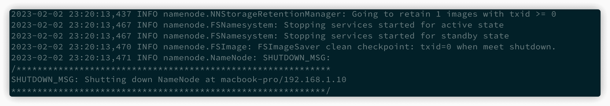
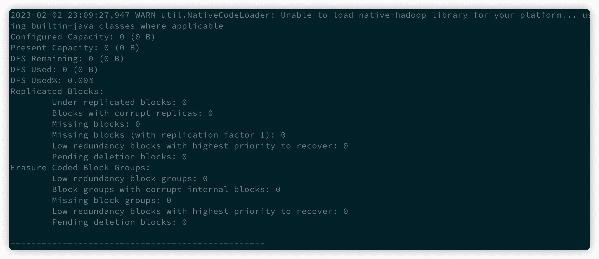
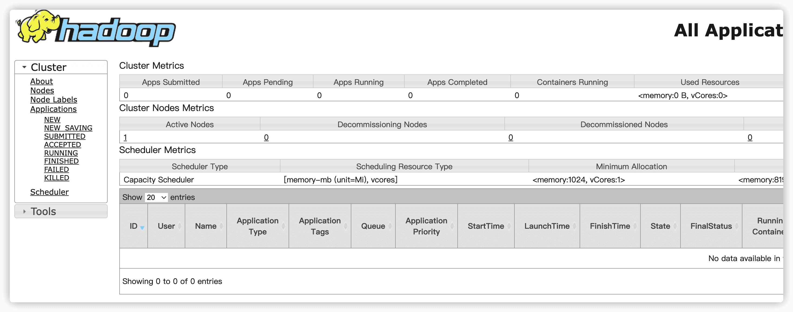

# Hadoop搭建

## 配置本机 ssh 免密登录

　　hadoop 运行过程中需要 ssh localhost，需要做一些配置保证可以执行成功

　　通过 ssh-keygen 生成 ssh key

```sh
ssh-copy-id -i [key 文件] localhost # 配置免密登录
ssh localhost # 验证配置是否成功
```

## 安装 Hadoop

　　从[hadoop官网](https://dlcdn.apache.org/hadoop/common/)下载对应版本的二进制安装包，然后解压到目录: `/opt/hadoop/3.3.4/`

> 可以将该目录拥有者改为当前用户

## 配置

### 配置环境变量

　　确定 hadoop 安装目录:  `/opt/hadoop/3.3.4/`

　　定义 `HADOOP_HOME` 变量并添加到 `PATH` 中

```shell
# Hadoop
export HADOOP_HOME="/opt/hadoop/3.3.4/"
export PATH="$PATH:/opt/hadoop/3.3.4/bin"
```

　　`source ~/.zshrc` 使变量生效

### 配置 core-site

　　`$HADOOOP_HOME/etc/hadoop/core-site.xml`文件中配置临时文件目录及 hdfs 文件访问地址

```xml
<configuration>
  <property>
    <name>hadoop.tmp.dir</name>
    <value>/tmp/hadoop</value>
    <description>NameNode 会将 HDFS 的元数据存储在这个指定的目录下</description>         
  </property> 
  <property>
    <name>fs.default.name</name>
    <value>hdfs://localhost:9000</value>
    <description>指定namenode的地址,适合单一namenode节点的情况，在namenode多节点的情况下，适合使用fs.defaultfs</description>  
  </property>
</configuration>
```

### 配置 hdfs-site

　　`$HADOOOP_HOME/etc/hadoop/hdfs-site.xml`

```xml
<configuration>
  <property> 
    <name>dfs.namenode.name.dir</name>                 
    <value>/tmp/hadoop/name</value> 
    <description>namenode的目录位置，对应的目录需要存在value里面的路径</description> 
  </property>
  <property> 
    <name>dfs.datanode.data.dir</name>         
    <value>/tmp/hadoop/data</value>
    <description>datanode的目录位置，对应的目录需要存在value里面的路径，可以是一个或多个用逗号分隔的本地路径</description>         
  </property> 
  <property>
    <name>dfs.replication</name>
    <value>1</value>
    <description>hdfs系统的副本数量</description> 
  </property>
  <property> 
    <name>dfs.namenode.http-address</name>     
    <value>localhost:50070</value> 
    <description>namenode的http地址</description> 
  </property> 
  <property> 
    <name>dfs.namenode.secondary.http-address</name>     
    <value>localhost:9001</value> 
    <description>备份namenode的http地址</description> 
  </property> 
  <property>
    <name>dfs.permissions</name>
    <value>false</value>
    <description>关闭权限检查</description> 
  </property>
</configuration>
```

　　**配置 hadoop-env**
`$HADOOOP_HOME/etc/hadoop/hadoop-env.sh` 中配置 `JAVA_HOME`

```shell
export JAVA_HOME=/Library/Java/JavaVirtualMachines/jdk1.8.0_331.jdk/Contents/Home
```

### 初始化 HDFS NameNode

> 每次修改完配置都需要重新格式化NameNode!!!

```shell
hdfs namenode -format
```

　　​​

## 测试与验证

### 启动 hdfs

```shell
bash $HADOOP_HOME/sbin/start-dfs.sh
```

　　浏览器输入 `http://localhost:50070`，出现下面界面则代表启动成功

　　​​

### 查看 hdfs report

```shell
hdfs dfsadmin -report
```

　　​​

### 启动 yarn

```shell
bash $HADOOP_HOME/sbin/start-yarn.sh 
```

　　浏览器输入 `http://localhost:8088`，出现下面界面则代表启动成功

　　​​

> 当然，也可以使用 `bash $HADOOP_HOME/sbin/start-all.sh`命令管理

## 遇到问题及解决

> **初始化 namenode 时提示 ​**​**`ERROR: JAVA_HOME @@HOMEBREW_JAVA@@ does not exist.`**

　　在 `$HADOOOP_HOME/etc/hadoop/hadoop-env.sh` 中配置 `JAVA_HOME`，和系统保持一致即可
