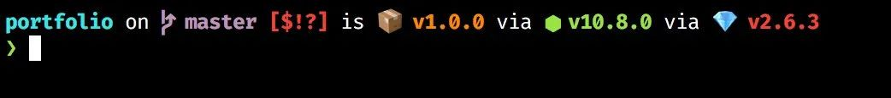
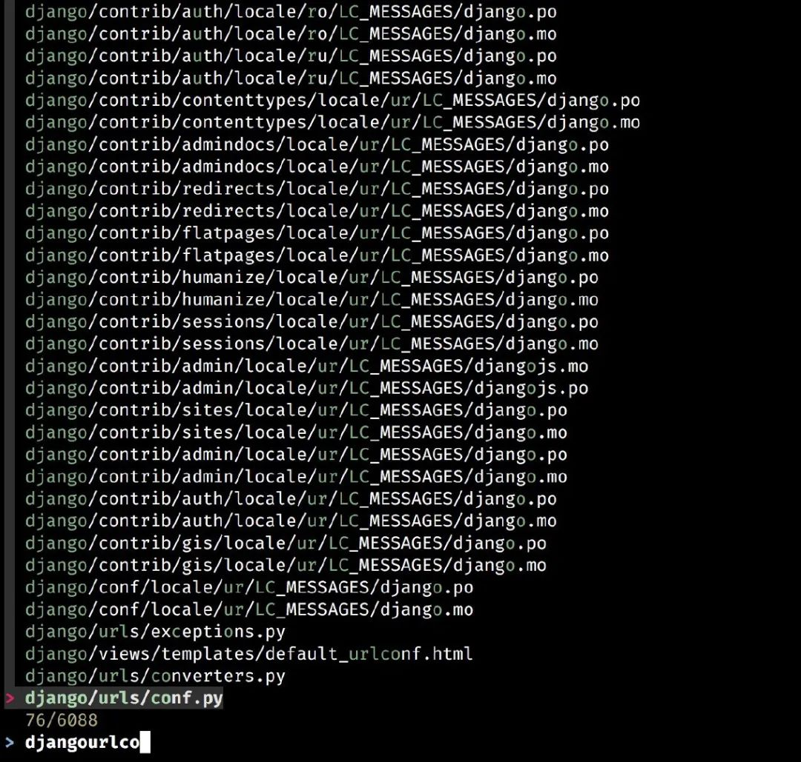
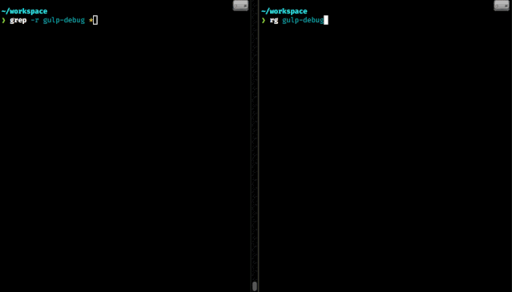
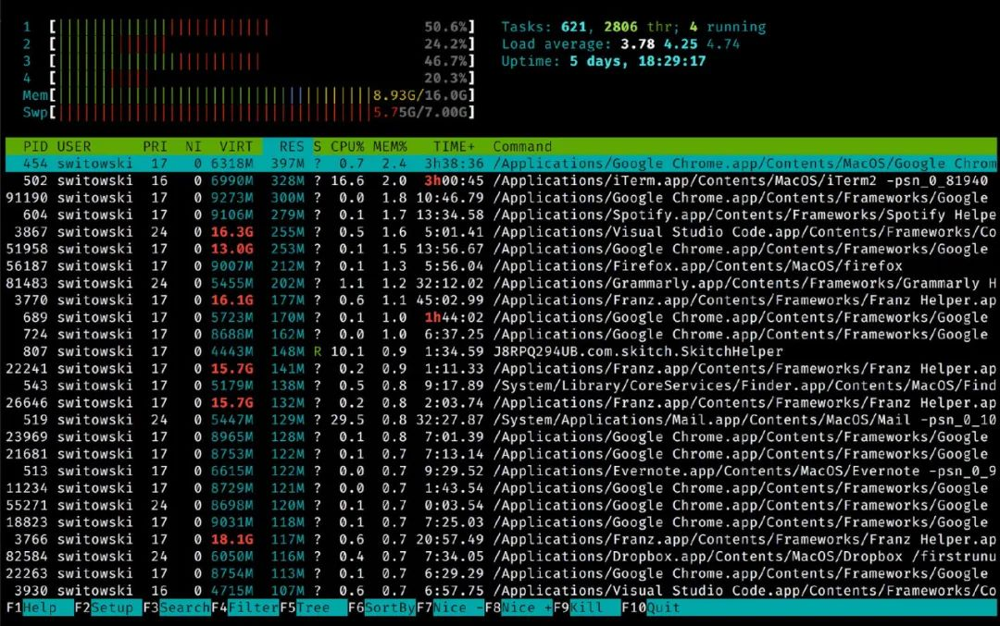
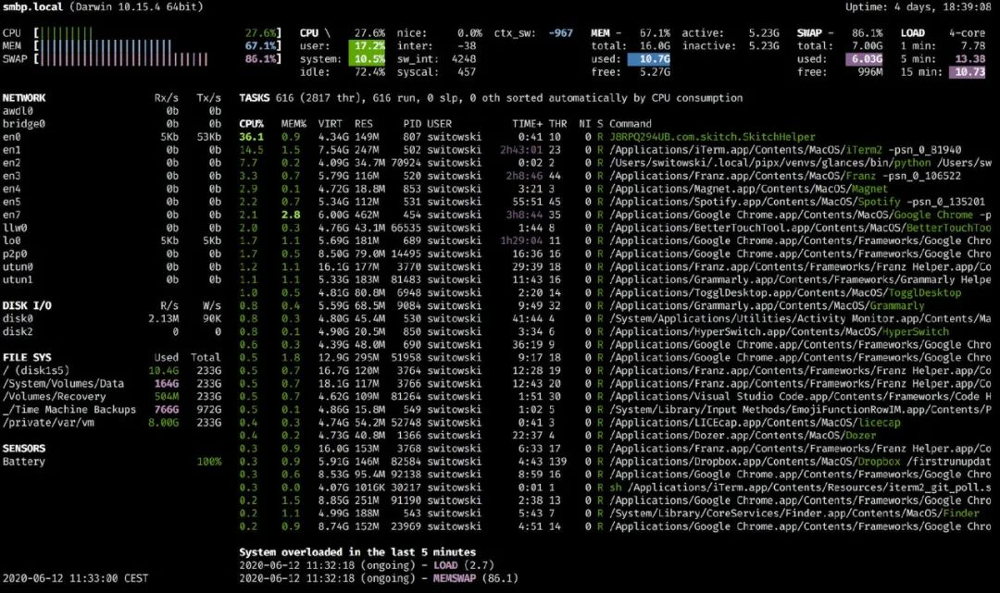
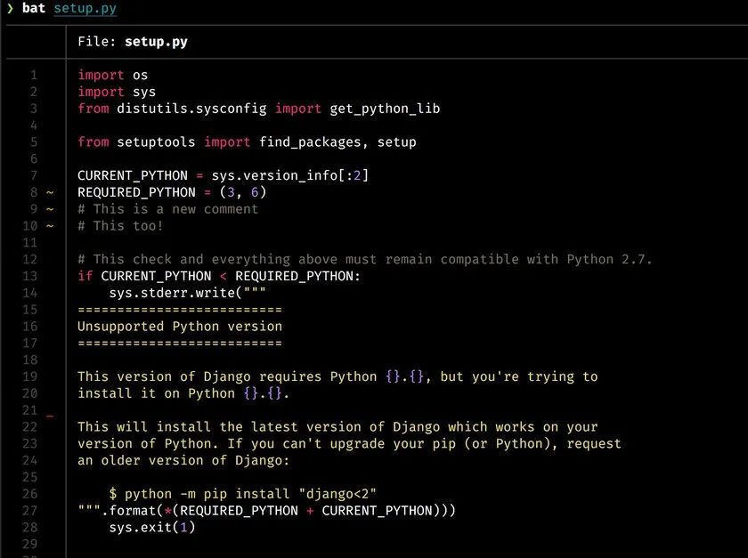
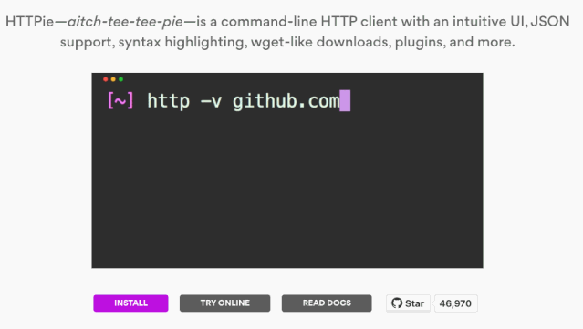
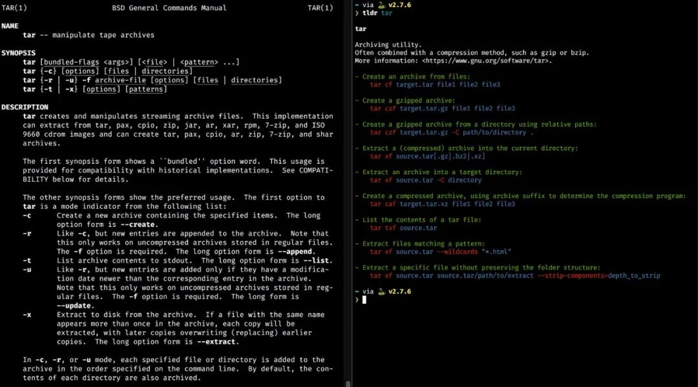
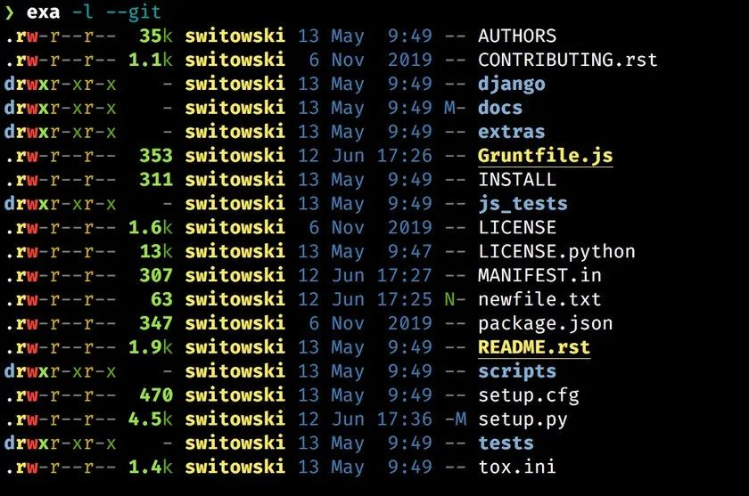
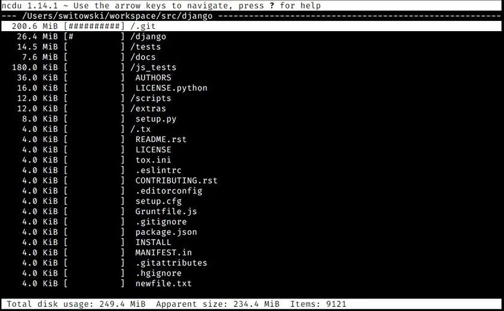

# 好用的CLI工具

## Starship

　　如果必须要从本篇文章中选择一个我最喜欢的终端工具——那非 `Starship` 莫属。`Starship` 可以适用于任何 Shell。你只需要安装它，然后在相应的配置文件`.bashrc`/`.zshrc`添加一行配置，剩下的工作交给它来完成就好了。

```bash
eval "$(starship init bash)"
```

　　它可以做到：

* 根据你是否在代码仓库中添加了新文件、是否修改了文件、是否暂存了文件等情况，用相应的符号表示 `git` 仓库的状态。
* 根据你所在的 `Python` 项目目录，展示 Python 的版本号，这也适用于 `Go`/`Node`/`Rust`/`Elm` 等其他编程语言环境。
* 展示上一个命令执行所用的时间，指令运行时间必须在毫秒级别。
* 如果上一个命令执行失败，会展示相应的错误提示符。

　　​​

　　还有不计其数的其他信息可以展示。但是，它能以更加友好的形式智能地给你呈现!

```bash
# startship 个性化配置
[character]      # 正在配置的组件名称是“character”
symbol = ">"  # 提示符中在输入文本之前显示的符号
error_symbol = "✗" # 如果上一条命令失败，提示符中在输入文本之前显示的符号
use_symbol_for_status = true # 指示是否改变显示符号来指出错误状态
style_success = "bold green"	# 上次命令成功时使用的样式
style_failure = "bold red"	# 上次命令失败时使用的样式

# 当 starship 扫描当前目录下的文件和文件夹时，最多使用 10 毫秒
scan_timeout = 10

[battery]
full_symbol = "🔋" # 电量满标志
charging_symbol = "⚡️" # 充电标志
discharging_symbol = "💀" # 放电标志

[[battery.display]]  # 当电量在 0% 到 30% 时以 "bold red" 样式显示
threshold = 30
style = "bold red"

[[battery.display]]  # 当电量在 30% 到 100% 时以 "bold yellow" 样式显示
threshold = 100
style = "bold yellow"


[cmd_duration]
min_time = 100 # 显示此组件所需的最短执行时长
prefix = "underwent " # 直接在执行时长前显示的前缀
style = "bold yellow" # 此组件的样式

[directory] # 显示当前目录的路径
truncation_length = 8 # 当前目录路径被截断后最多保留的父目录数量。
truncate_to_repo = true # 是否只截断到您当前处于的 git 仓库根目录下。
prefix = "in" # 直接在显示路径前显示的前缀。
style = "bold cyan" # 此组件的样式。

[time]
disabled = false # 启用时间组件
use_12hr = false # 禁用12小时制
format = "🕙[ %T ]" # 时间格式
time_range = "-" # 显示时间的范围，必须是24小时制
```

　　官网地址：[https://starship.rs/](https://starship.rs/)

## fzf

　　fzf— fuzzy finder，即模糊查找器。它是一种通用工具，可让你使用模糊搜索来查找文件、历史命令、进程、git 提交等。你键入一些字母，它会尝试匹配结果列表中任何位置的字母。输入的字母越多，结果也就越准确。你可能在其他的代码编辑器中有过这种类型的搜索使用体验——当你想打开某个文件时，只键入文件名的一部分而不用输入完整路径就能进行查找——这就是模糊搜索。

　　​​

　　我通过 fish fzf 插件插件使用它，因此我可以搜索命令历史记录或快速打开文件。这是可以每天为我节省不少时间的一个非常棒的工具。

　　fzf默认会以“extened-search"模式启动， 这种模式下你可以输入多个以空格分隔的搜索关键词， 如`^music .mp3$`, `sbtrkt !fire`.

|Token|Match type|Description|
| ------| --------------------------| ------------|
|sbtrkt|fuzzy-match|匹配sbtrkt|
|^music|prefix-exact-match|以music开头|
|.mp3^|suffix-exact-match|以.mp3结尾|
|'wild|exact-match(quoted)|精确包含wild|
|!fire|inverse-exact-match|不包含fire|
|!.mp3$|inverse-suffix-exact-match|不以.mp3结尾|

　　如果你不想用fuzzy match， 可以用`fzf -e`做精确匹配
符号"|"可以做or匹配， 比如

```bash
^core go$|rb$|py$
```

　　表示以core开头，以go或rb或py结尾的

　　下载地址：https://github.com/junegunn/fzf

## fd

　　类似于系统自带的 `find` 命令，但使用起来更简单，查找速度更快，并且具有良好的默认设置。

### 简单搜索

　　*fd*设计用于查找文件系统中的条目. 你可以执行的最基本的搜索就是运行一个参数:搜索模式的*fd*. 例如,假设您想查找您的旧脚本 (包括`netflix`) :

```zsh
> fd netfl
Software/python/imdb-ratings/netflix-details.py
```

　　如果只调用一个这样的参数,*fd*递归检索当前目录中, *包含*模式`netfl`的任何条目.

### 正则表达式搜索

　　搜索模式被视为正则表达式. 这里,我们搜索开始`x`并以`rc`结束的条目. :

```zsh
> cd /etc
> fd '^x.*rc$'
X11/xinit/xinitrc
X11/xinit/xserverrc
```

### 指定根目录

　　如果我们想搜索一个特定的目录,它可以作为第二个参数*fd*:

```
> fd passwd /etc
/etc/default/passwd
/etc/pam.d/passwd
/etc/passwd
```

### 仅运行*fd*

　　*fd*可以不带参数调用. 这是非常有用的,以便快速地查看当前目录中的所有条目,递归地 (类似于`ls -R`) :

```zsh
> cd fd/tests
> fd
testenv
testenv/mod.rs
tests.rs
```

### 搜索特定的文件扩展名

　　通常,我们对特定类型的所有文件感兴趣. 这可以用`-e` (或) `--extension`选择权. 在这里,我们搜索FD仓库中的所有md文件:

```zsh
> cd fd
> fd -e md
CONTRIBUTING.md
README.md
```

　　这个`-e`选项可以与搜索模式结合使用:

```zsh
> fd -e rs mod
src/fshelper/mod.rs
src/lscolors/mod.rs
tests/testenv/mod.rs
```

　　下载地址：https://github.com/sharkdp/fd

## ripgrep

　　​​

　　上图为 grep（左）与 rg（右）命令执行时的对比。

　　与上述`fd`指令类似，`ripgrep`是`grep`命令的替代方法， 不过`ripgrep`的执行速度更快，而且具有健全的默认配置以及丰富的彩色输出。

　　它同样会跳过被`.gitignore`忽略以及隐藏的文件，因此如果有特殊需要，我们可以设置指令别名：`rga ='rg -uuu'`。它会禁用所有智能筛选，并使`ripgrep`的表现与标准的 grep 指令一致。

### 简单搜索

```bash
ls | rg App
```

### 正则表达式搜索

```bash
ls | rg ^App.*$
```

### 指定文件搜索

```bash
rg  ^def.*$ 01_two-sum.py
```

　　下载地址：https://github.com/BurntSushi/ripgrep

## htop 和 glances

　　在 Linux 或 Mac 上显示进程运行状态信息最常用工具是我们熟悉的`top`​，它是每位系统管理员的好帮手。而且，即使是像我一样主要从事网络开发，查看计算机的运行状况也很有用。你知道，只是看一下当前到底是 Docker 进程还是 Chrome 进程吃掉了你所有的 RAM，应该如何做吗？

　　​​

　　`htop`工具是`top`工具的绝佳替代品。

　　​`top`​工具是非常基础的监控工具，提供的功能有限，因此很多人转去使用 htop。`htop`​比起`top`​，优势很明显——除了功能更加完善以外，它的色彩搭配也很丰富，整体上使用起来更加友好。

　　​​

　　借助 glances，还可以让你一目了然地快速了解系统当前状态。

　　glances 是`htop`的补充工具。除了列出所有进程及其 CPU 和内存使用情况之外，它还可以显示有关系统的其他信息，比如：

* 网络及磁盘使用情况
* 文件系统已使用的空间和总空间
* 来自不同传感器（例如电池）的数据
* 以及最近消耗过多资源的进程列表

　　我选择使用`htop`来筛选和终止进程，因为对我来讲，效率提高了不少，我也使用 `glances`可以快速浏览一下计算机的运行状况。它提供 API 接口、Web UI 以及支持各种导出格式，因此你可以将系统监视提高到一个新 Level。因此我在这里强烈推荐一波！

　　htop 下载地址：https://hisham.hm/htop/

　　glances 下载地址：https://nicolargo.github.io/glances/

## virtualenv

　　Virtualenv 是用于在 Python 中创建虚拟环境的工具（比起内置的`venv`​模块，我更喜欢 Virtualenv）。

　　​​

　　virtualenvwrapper 是 virtualenv 的虚拟环境管理器。它提供了许多命令来执行快速创建、列出或删除虚拟环境等操作。

　　virtualenv 下载地址：

　　https://pypi.org/project/virtualenv/

## Homebrew

　　​​

　　如果你使用的是 Mac，那我就无需再介绍 Homebrew 了。它是 macOS 上被业界普遍认可的软件包管理器。

　　下载地址：https://brew.sh/

　　在Mac下面安装Mysql、Redis、Node之类软件的时候，比较方便的方式是使用Homebrew（号称是The missing package manager for OS X）。不过Homebrew是命令行方式，用起来不是那么的友好，所以就有了Cakebrew。

　　网站：https://www.cakebrew.com/

　　非常友好的图形界面，使用起来简单快捷。

　　而LaunchRocket呢，则是一个帮助管理Homebrew安装的服务的软件，比如你使用Homebrew安装的Mysql、Redis、MongoDB，是让它自启动呢，还是手动启动，传统方式需要使用命令行的命令，而使用LaunchRocket则可以在图形界面中进行管理了！

　　网站：https://github.com/jimbojsb/launchrocket

## tree

　　你可以通过`brew install tree`安装该工具。如果要查看给定目录的内容，那么 tree 是执行此操作的必备工具。它能以漂亮的树状结构显示所有子目录及文件：

```
$ tree .
.
├── recovery.md
├── README.md
├── archive
├── automator
│   ├── Open\\ Iterm2.workflow
│   │   └── Contents
│   │       ├── Info.plist
│   │       ├── QuickLook
│   │       │   └── Thumbnail.png
│   │       └── document.wflow
│   └── Start\\ Screen\\ Saver.workflow
├── brew-cask.sh
```

## bat

　　​​

　　类似于在终端中常用的用于显示文件内容的`cat`命令，但是`bat`效果更佳。

　　它增加了语法高亮显示，git gutter 标记（如果适用），自动分页（如果文件很大）等功能，并且使得输出的内容阅读起来更加友好。

　　bat 下载地址：https://github.com/sharkdp/bat

## httpie

　　​​

　　如果你需要发送一些 HTTP 请求，但发现使用`curl`不够直观，那么请尝试一下`httpie`。这是一款非常好用的`curl`替代工具。合理的默认配置以及简洁的语法使它更易于使用，命令返回也是彩色输出，甚至支持为不同类型的身份验证安装相应的插件。

　　httpie 下载地址：https://httpie.org/

## tldr

　　简化版的命令帮助手册。“man pages” 包含了 Linux 软件的手册，这些手册解释了如何使用给定的命令。你可以尝试运行`man cat`或`man grep`来查看相关命令的帮助手册。它们描述的非常详细，有时可能难以掌握。因此，`tldr`社区的目的，就是将每个命令的帮助手册进行简化，方便用户查阅。

　　`tldr`适用于几乎所有的受欢迎的软件。正如我提到的，这是社区的努力和功劳，虽然不太可能包含所有的软件的简化帮助手册。但是当某个帮助手册被纳入管理并起作用时，它提供的信息通常就是你要查找的内容。

　　比如，如果你要创建一些文件的 gzip 压缩存档，`man tar`​可以为你提供可能的参数选择。而`tldr tar`​会列出一些我们常见的示例——如图所示，第二个示例正是你要执行的操作：

　　​​

　　“man pages” 展示的信息太全面了，但是很多时候使用`tldr`可以更快地帮你找到特定信息，这才是用户真正想要的。

　　tldr 下载地址：https://tldr.sh/

## exa

　　​​

　　`exa`是`ls`命令的一个可替代方案。

　　它色彩艳丽，还可以显示 git 状态等其他信息，自动将文件大小转换为方便人们阅读的单位，并且所有这些都保持与`ls`几乎相同的执行速度。虽然我很喜欢这个工具并推荐给你们，但由于某种原因，我仍然坚持使用 ls。

　　exa 下载地址：https://the.exa.website/

## litecli 和 mycli

　　​​

　　这是我首选的 SQLite 和 mysql的解决方案。借助自动提示和语法突出显示，它们比默认的`sqlite3`和`mysql`工具要好用很多。

　　litecli 下载地址：https://litecli.com/

　　mycli 下载地址：https://www.mycli.net/

## ncdu

　　​​

　　这是在终端进行磁盘分析时使用的工具，它使用起来简单快捷。当我需要释放一些硬盘空间时，会默认使用这款工具。

　　ncdu 下载地址：https://dev.yorhel.nl/ncdu
