# 索引优化分析

## SQL性能下降

　　表现：执行时间长、等待时间长

- **查询语句写的烂**
- **关联查询太多join（设计缺陷或不得已的需求）**
- **索引失效(单值、复合)**
- 服务器调优及各个参数设置（缓冲、线程数等）

## SQL的JOIN查询

### SQL执行顺序

#### 人写

```mysql
SELECT DISTINCT
    < select_list >
FROM
    < left_table > < join_type >
JOIN < right_table > ON < join_condition >
WHERE
    < where_condition >
GROUP BY
    < group_by_list >
HAVING
    < having_condition >
ORDER BY
    < order_by_condition >
LIMIT < limit_number >
```

#### 机读

```mysql
FROM < left_table >
ON < join_condition >
< join_type > JOIN < right_table >
WHERE < where_condition >
GROUP BY < group_by_list >
HAVING < having_condition >
SELECT
DISTINCT < select_list >
ORDER BY < order_by_condition >
LIMIT < limit_number >
```

#### 总结

　　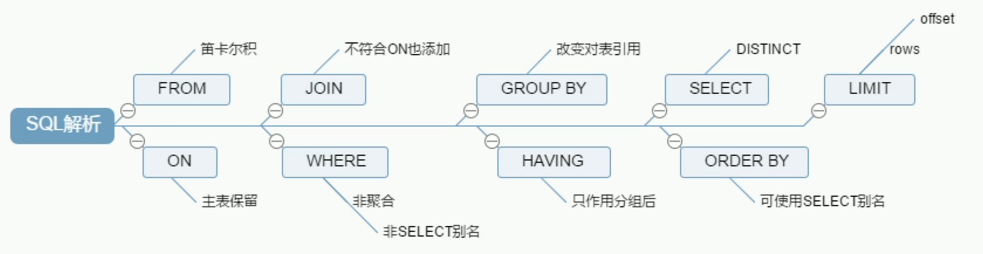

### Join图

　　

### 案例

#### 建表SQL

```mysql
CREATE TABLE tbl_dept (
    id INT(11) NOT NULL PRIMARY KEY AUTO_INCREMENT,
    deptName VARCHAR(30) DEFAULT NULL,
    locAdd VARCHAR(40) DEFAULT NULL
)ENGINE=INNODB AUTO_INCREMENT=1 DEFAULT CHARSET=utf8;

CREATE TABLE tbl_emp (
    id INT UNSIGNED PRIMARY KEY AUTO_INCREMENT,
    name VARCHAR(20) DEFAULT NULL,
    deptld INT UNSIGNED DEFAULT NULL
) ENGINE=INNODB AUTO_INCREMENT=1 DEFAULT CHARSET=utf8;
```

#### 7种JOIN

```mysql
select from tbl_emp a inner join tbl_dept b on a.deptId = b.id;

select * from tbl_emp a left join tbl_dept b on a.deptId = b.id;

select from tbl_emp a right join tbl_dept b on a.deptId = b.id;

select * from tbl_emp a left join tbl_dept b on a.deptId = b.id where b.id is nu11;

select * from tbl_emp a right join tbl_dept b on a.deptId = b.id where a.deptId is nul1:

select * from tbl_emp a left join tbl_dept b on a.deptId = b.id union select * from tbl_emp a right join tbl_dept b on a.deptId = b.id;

select * from tbl_emp a left join tbl_dept b on a.deptld = b.id where b.id is nul1 union select * from tbl_emp a right join tbl_dept b on a.deptId = b.id where a.deptId is nul1;
```

## 索引简介

### 是什么

　　MySQL官方对索引的定义为：**索引（Index）是帮助MySQL高效获取数据的数据结构。**可以得到索引的本质：**索引是数据结构。**

> 可以简单理解为"**排好序的快速查找数据结构**"。

　　**在数据之外，数据库系统还维护着满足特定查找算法的数据结构，这些数据结构以某种方式引用（指向）数据，这样就可以在这些数据结构上实现高级查找算法。这种数据结构，就是索引。**

　　下图就是一种可能的索引方式示例：

　　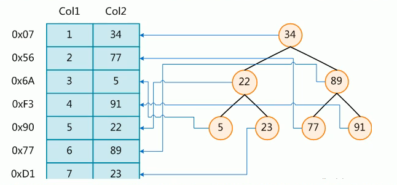

　　左边是数据表，一共有两列七条记录，最左边的是数据记录的物理地址。
为了加快Col2的查找，可以维护一个右边所示的二叉查找树，每个节点分别包含索引键值和一个指向对应数据记录物理地
址的指针，这样就可以运用二叉查找在一定的复杂度内获取到相应数据，从而快速的检索出符合条件的记录。

　　一般来说索引本身也很大，不可能全部存储在内存中，因此索引往往以索引文件的形式存储的磁盘上。

　　**我们平常所说的索引，如果没有特别指明，都是指B树(多路搜索树，并不一定是二叉的)结构组织的索引**。其中聚集索引，次要索引，覆盖索引，复合索引，前缀索引，唯一索引默认都是使用**B+树**索引，统称索引。当然，除了B+树这种类型的索引之外，还有哈希索引(hash index)等。

### 优势

- 类似大学图书馆建书目索引，提高数据检索的效率，降低数据库的IO成本
- 通过索引列对数据进行排序，降低数据排序的成本，降低了CPU的消耗

### 劣势

- 实际上索引也是一张表，该表保存了主键与索引字段，并指向实体表的记录，所以索引列也是要占用空间的
- 虽然索引大大提高了查询速度，同时却会降低更新表的速度，如对表进行INSERT、UPDATE和DELETE。

  因为更新表时， MySQL不仅要保存数据，还要保存一下索引文件每次更新添加了索引列的字段，都会调整因为更新所带来的键值变化后的索引信息
- 索引只是提高效率的一个因素，如果你的MySQL有大数据量的表，就需要花时间研究建立最优秀的索引，或优化查询

### 索引分类

- 单值索引，即一个索引只包含单个列，一个表可以有多个单列索引
- 唯一索引，索引列的值必须唯一，但允许有空值
- 复合索引，即一个索引包含多个列

### 基本语法

> 在表中添加索引的通用命令

```sql
CREATE [UNIQUE] INDEX indexName ON tableName(columnName(length));
ALTER tableName ADD [UNIQUE] INDEX [indexName] ON (columnName(length));
```

> 使用ALTER命令有四种方式来添加数据表的索引：

```sql
ALTER TABLE tableName ADD PRIMARY KEY (column_list);
```

　　该语句添加一个主键，这意味着索引值必须是唯一的，且不能为NULL。

```sql
ALTER TABLE tableName ADD UNIQUE indexName (column_list);
```

　　这条语句创建索引的值必须是唯一的（除了NULL外，NULL可能会出现多次）。

```sql
ALTER TABLE tableName ADD INDEX indexName (column_list);
```

　　添加普通索引，索引值可出现多次。

```sql
ALTER TABLE tableName ADD FULLTEXT indexName (column_list);
```

　　该语句指定了索引为 FULLTEXT，用于全文索引。

> 在表中删除特定索引

```sql
DROP INDEX [indexName] ON tableName;
```

> 查看表中的所有索引

```sql
SHOW INDEX FROM tableName;
```

### 索引结构

　　B-Tree索引

　　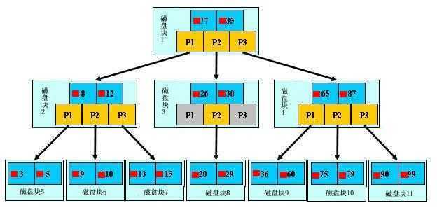

　　【初始化介绍】

　　一颗b+树，浅蓝色的块我们称之为一个磁盘块，可以看到每个磁盘块包含几个数据项(深蓝色所示)和指针(黄色所示)，如磁盘块1包含数据项17和35，包含指针P1、P2、P3，P1表示小于17的磁盘块，P2表示在17和35之间的磁盘块，P3表示大于35的磁盘块。

　　真实的数据存在于叶子节点即3、5、9、10、13、15、28、29、36、60、75、79、90、99。

　　非叶子节点不存储真实的数据，只存储指引搜索方向的数据项，如17、35并不真实存在于数据表中。

　　【查找过程】

　　如果要查找数据项29，那么首先会把磁盘块1由磁盘加载到内存，此时发生一次IO，在内存中用二分查找确定29在17和35之间，锁定磁盘块1的P2指针，内存时间因为非常短（相比磁盘的IO）可以忽略不计，通过磁盘块1的P2指针的磁盘地址把磁盘块3由磁盘加载到内存，发生第二次IO，29在26和30之间，锁定磁盘块3的P2指针，通过指针加载磁盘块8到内存，发生第三次IO，同时内存中做二分查找找到29，结束查询，总计三次IO。

　　真实的情况是，3层的b+树可以表示上百万的数据，如果上百万的数据查找只需要三次IO，性能提高将是巨大的，如果没有索引，每个数据项都要发生一次IO，那么总共需要百万次的IO，显然成本非常非常高。

### 适合建立索引

1. 主键自动建立唯一索引
2. 频繁作为查询的字段应该建立索引
3. 查询中与其他表关联的字段，外键关系建立索引
4. 单键/组合索引的选择问题，who？(在高并发下倾向于创建组合索引)
5. 查询中排序的字段，排序字段若通过索引去访问将大大提高排序速度
6. 查询中统计或者分组字段

### 不适合建立索引

1. 表记录太少(300万以上)
2. 经常增删改的表，频繁更新的字段不适合创建索引(每次更新不单单是更新记录，还要更新索引)
3. where条件里用不到的字段不创建索引
4. 数据重复且分布平均的表字段，因此应该只为最经常查询和最经常排序的数据列建立索引。

   注意，如果某个数据列包含许多重复的内容，为它建立索引就没有太大的实际效果。

   > 假如一个表有10万行记录，有一个字段A只有T和F两种值，且每个值的分布概率大约为50%，那么对这种表A字段建索引一般不会提高数据库的查询速度。
   >
   > 索引的选择性是指索引列中不同值的数目与表中记录数的比。如果一个表中有2000条记录，表索引列有1980个不同的值，那么这个索引的选择性就是1980/2000=0.99。
   >
   > 一个索引的选择性越接近于1，这个索引的效率就越高。
   >

## 性能分析

### MySql Query Optimizer

1. Mysql中有专门负责优化SELECT语句的优化器模块，主要功能：通过计算分析系统中收集到的统计信息，为客户端请求的Query提供Mysql认为最优的执行计划（Mysql认为最优的数据检索方式，但不见得是DBA认为是最优的，这部分最耗费时间）
2. 当客户端向MySQL请求一条Query，命令解析器模块完成请求分类，区别出是SELECT并转发给MySQL Query Optimizer时，MySQL Query Optimizer首先会对整条Query进行优化，处理掉一些常量表达式的预算，直接换算成常量值。并对Query中的查询条件进行简化和转换，如去掉一些无用或显而易见的条件、结构调整等。然后分析Query中的Hint信息（如果有），看显示Hint信息是否可以完全确定该Query的执行计划。如果没有Hint或Hint信息还不足以完全确定执行计划，则会读取所涉及对象的统计信息，根据Query进行写相应的计算分析，然后再得出最后的执行计划。

### MySQL常见瓶颈

- CPU：CPU在饱和的时候一般发生在数据装入内存或从磁盘上读取数据时候
- IO：磁盘I/O瓶颈发生在装入数据远大于内存容量的时候
- 服务器硬件的性能瓶颈： top，free， iostat和vmstat来查看系统的性能状态

### Explain简介

#### 是什么（查看执行计划）

　　使用EXPLAIN关键字可以模拟优化器执行SQL查询语句，从而知道MySQL是如何处理你的SQL语句的。分析你的查询语句或是表结构的性能瓶颈

#### 能干嘛

- 表的读取顺序
- 数据读取操作的操作类型
- 哪些索引可以使用
- 哪些索引被实际使用
- 表之间的引用
- 每张表有多少行被优化器查询

#### 怎么玩

　　Explain + SQL语句

　　执行计划包含的信息

|id|select_type|table|type|possible_keys|key|key_len|ref|rows|Extra|
| --| -----------| -----| ----| -------------| ---| -------| ---| ----| -----|

### Explain各字段解释

#### id

> select查询的序列号，包含一组数字，表示查询中执行select子句或操作表的顺序

##### id相同

　　id相同，执行顺序由上至下

　　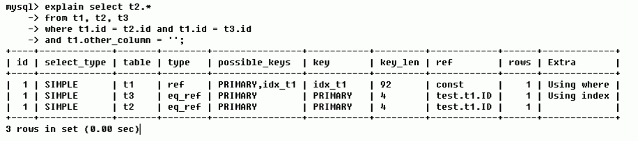

##### id不同

　　id不同，如果是子查询，id的序号会递增，id值越大优先级越高，越先被执行

　　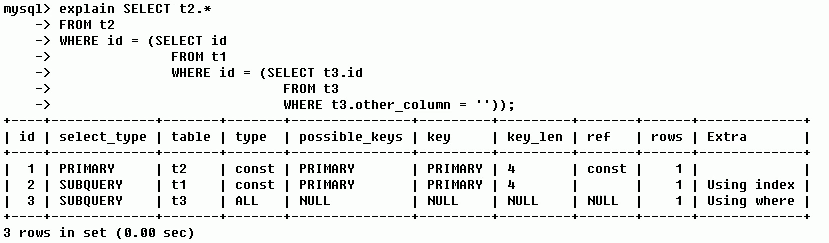

##### id相同不同、同时存在

　　id如果相同，可以认为是一组，从上往下顺序执行；在所有组中，id值越大，优先级越高，越先执行

　　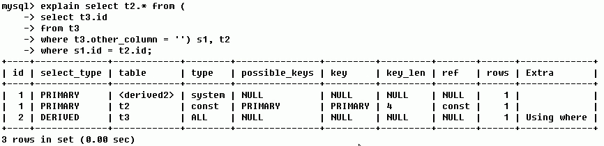

#### select_type

> 查询的类型，主要是用于区别普通查询、联合查询、子查询等的复杂查询

　　SIMPLE：简单的select查询，查询中不包含子查询或者UNION

　　PRIMARY：查询中若包含任何复杂的子部分，最外层查询则被标记为PRIMARY

　　SUBQUERY：在SELECT或WHERE列表中包含了子查询

　　DERIUED：在FROM列表中包含的子查询被标记为DERIVED（衍生），MySQL会递归执行这些子查询，把结果放在临时表里。

　　UNION：若第二个SELECT出现在UNION之后，则被标记为UNION；若UNION包含在FROM子句的子查询中，外层SELECT将被标记为：DERIVED

　　UNION RESULT：从UNION表获取结果的SELECT

#### table

　　显示这一行的数据是关于哪张表的

#### type

　　type显示的是访问类型，即显示查询使用了何种类型，是较为重要的一个指标，结果值从**最好到最坏依次是**：
`system > const > eq_ref > ref > fulltext > ref_or_null > index_merge > unique_subquery > index_subquery > range > index >ALL`

　　常见的: `system>const>eq_ref>ref>range>index>ALL`

　　`system`：表只有一行记录（等于系统表），这是const类型的特列，平时不会出现，这个也可以忽略不计

　　`const`：表示通过索引一次就找到了，const用于比较**primary key**或者**unique索引**。因为只匹配一行数据，所以很快如将主键置于where列表中，MySQL就能将该查询转换为一个常量。

　　

　　`eq_ref`：唯一性索引扫描，对于每个索引键，表中只有一条记录与之匹配。常见于主键或唯一索引扫描

　　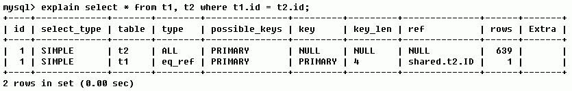

　　`ref`：非唯一性索引扫描，返回匹配某个单独值的所有行。本质上也是一种索引访问，它返回所有匹配某个单独值的行，然而，它可能会找到多个符合条件的行，所以他应该属于查找和扫描的混合体

　　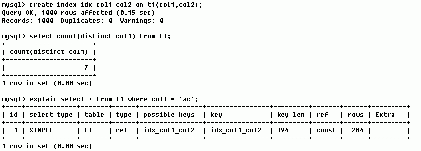

　　`range`：只检索给定范围的行，使用一个索引来选择行。key列显示使用了哪个索引。一般就是在你的where语句中出现了`between`、`<`、`>`、`in`等的查询，这种范围扫描的索引扫描比全表扫描要好，因为它只需要开始于索引的某一点，而结束语另一点，不用扫描全部索引。

　　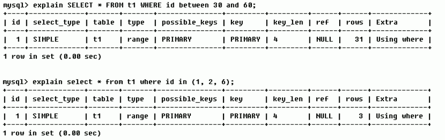

　　`index`：Full Index Scan，index与ALL区别为index类型只遍历索引树。这通常比ALL快，因为索引文件通常比数据文件小。（也就是说虽然all和Index都是读全表，但index是从索引中读取的，而all是从硬盘中读的）

　　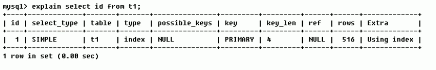

　　`all`：Full Table Scan，将遍历全表以找到匹配的行

　　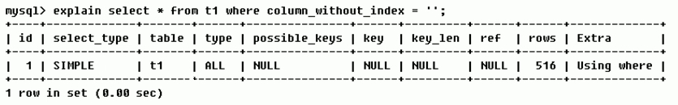

> 备注：**一般来说，得保证查询至少达到range级别，最好能达到ref.**

#### possible_keys

　　显示可能应用在这张表中的索引，一个或多个。
查询涉及到的字段上若存在索引，则该索引将被列出，**但不一定被查询实际使用**

#### key

　　实际使用的索引。如果为NULL，则没有使用索引

> 查询中若使用了覆盖索引，则该索引仅出现在key列表中

　　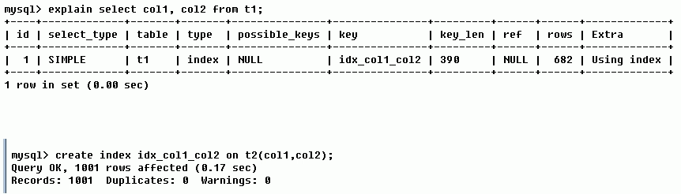

　　查询的字段个数、顺序和创建好的复合索引字段、顺序一致，则在实际查询中会使用索引查询，而不是全表扫描

#### key_len

　　表示索引中使用的字节数，可通过该列计算查询中使用的索引的长度。在不损失精确性的情况下，长度越短越好

　　key_len显示的值为索引字段的最大可能长度，**并非实际使用长度**，即key_len是根据表定义计算而得，不是通过表内检索出的

　　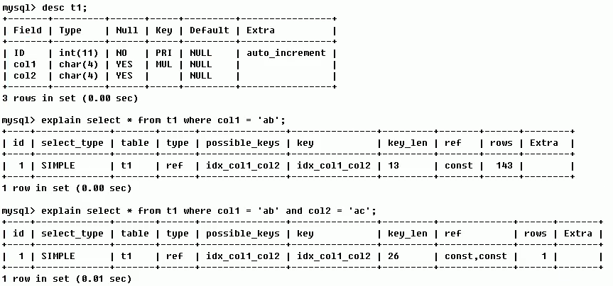

#### ref

　　显示索引的哪一列被使用了，如果可能的话，是一个常数。哪些列或常量被用于查找索引列上的值

　　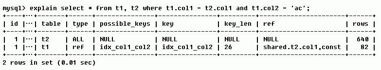

　　由key_len可知t1表的idx_col1_col2被充分使用，col1匹配t2表的col1，col2匹配了一个常量，即'ac'

#### rows

　　根据表统计信息及索引选用情况，大致估算出找到所需的记录所需要读取的行数

　　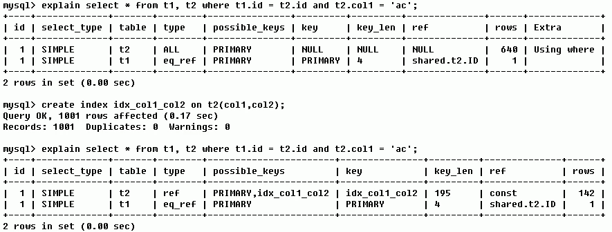

#### Extra

　　包含不适合在其他列中显示但十分重要的额外信息

##### Using filesort

　　说明mysql会对数据使用一个外部的索引排序，而不是按照表内的索引顺序进行读取。
MySQL中无法利用索引完成的排序操作称为"文件排序"

　　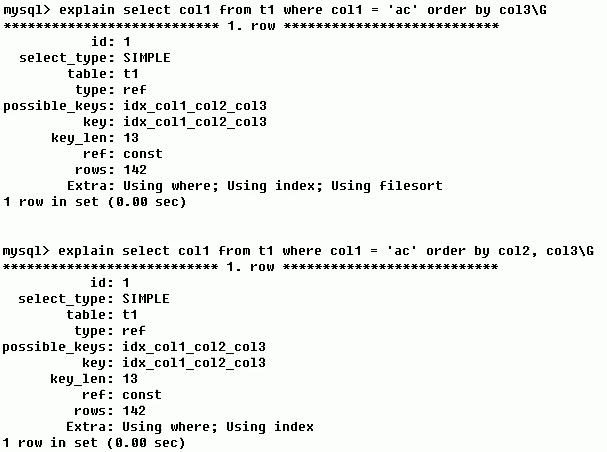

##### Using temporary

　　使了用临时表保存中间结果，MySQL在对查询结果排序时使用临时表。常见于排序order by和分组查询group by。

　　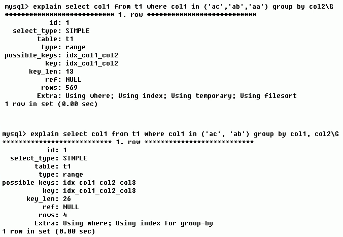

##### Using index

　　表示相应的select操作中使用了覆盖索引（Covering Index），避免访问了表的数据行，效率不错！

　　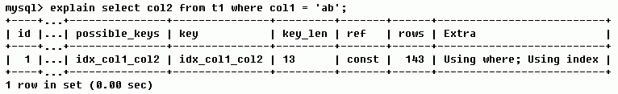

　　如果同时出现using where，表明索引被用来执行索引键值的查找；

　　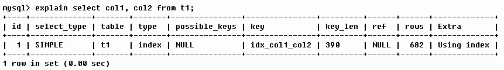

　　如果没有同时出现using where，表明索引用来读取数据而非执行查找动作。

> 覆盖索引（Covering Index） ，一说为索引覆盖。

　　**理解方式一：**就是select的数据列只用从索引中就能够取得，不必读取数据行， MySQL可以利用索引返回select列表中的字段，而不必根据索引再次读取数据文件，换句话说查询列要被所建的索引覆盖。

　　**理解方式二：**索引是高效找到行的一个方法，但是一般数据库也能使用索引找到一个列的数据，因此它不必读取整个行。毕竟索引叶子节点存储了它们索引的数据；当能通过读取索引就可以得到想要的数据，那就不需要读取行了。一个索引包含了（或覆盖了）满足查询结果的数据就叫做覆盖索引。

　　**注意：**
如果要使用覆盖索引，一定要注意select列表中只取出需要的列，不可`select *`，因为如果将所有字段一起做索引会导致索引文件过大，查询性能下降。

##### Using where

　　表明使用了where过滤

> Using where,Using index 和 Using index condition区别

```mysql
mysql> explain select name, age from staffs where name="alice" and age>32;
+----+-------------+--------+------------+-------+-----------------------+-----------------------+---------+------+------+----------+--------------------------+
| id | select_type | table  | partitions | type  | possible_keys         | key                   | key_len | ref  | rows | filtered | Extra                    |
+----+-------------+--------+------------+-------+-----------------------+-----------------------+---------+------+------+----------+--------------------------+
|  1 | SIMPLE      | staffs | NULL       | range | idx_staffs_nameAgePos | idx_staffs_nameAgePos | 78      | NULL |    1 |   100.00 | Using where; Using index |
+----+-------------+--------+------------+-------+-----------------------+-----------------------+---------+------+------+----------+--------------------------+
1 row in set (0.01 sec)

mysql> explain select * from staffs where name="alice" and age>32;
+----+-------------+--------+------------+-------+-----------------------+-----------------------+---------+------+------+----------+-----------------------+
| id | select_type | table  | partitions | type  | possible_keys         | key                   | key_len | ref  | rows | filtered | Extra                 |
+----+-------------+--------+------------+-------+-----------------------+-----------------------+---------+------+------+----------+-----------------------+
|  1 | SIMPLE      | staffs | NULL       | range | idx_staffs_nameAgePos | idx_staffs_nameAgePos | 78      | NULL |    1 |   100.00 | Using index condition |
+----+-------------+--------+------------+-------+-----------------------+-----------------------+---------+------+------+----------+-----------------------+
1 row in set (0.01 sec)
```

　　Using index：代表查询的数据通过索引即可得到

　　Using where,Using index：代表查询的数据需要在索引的值中进行过滤得到

　　Using index condition：代表查询的数据包含索引中没有的值，需要回表查询

##### using join buffer

　　使用了连接缓存

##### impossible where

　　where子句的值总是false，不能用来获取任何元组

　　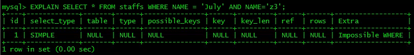

##### select tables optimized away

　　在没有GROUPBY子句的情况下，基于索引优化MIN/MAX操作或者对于MyISAM存储引擎优化COUNT(*)操作，不必等到执行阶段再进行计算，查询执行计划生成的阶段即完成优化。

##### distinct

　　优化distinct操作，在找到第一匹配的元组后即停止找同样值的动作

### 热身Case

　　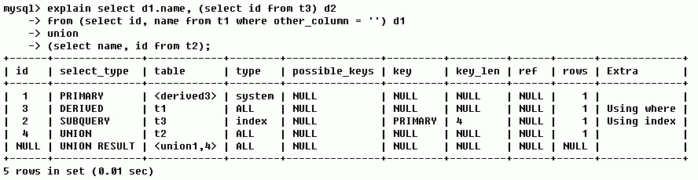

　　第一行（执行顺序4）：id列为1，表示是union里的第一个select， select_type列的primary表示该查询为外层查询，table列被标记为`<derived3>`，表示查询结果来自一个衍生表，其中derived3中3代表该查询衍生自第三个select查询，即id为3的select。【select d1.name.....】

　　第二行（执行顺序2）：id为3，是整个查询中第三个select的一部分。因查询包含在from中，所以为derived。【select id,name from t1 where other_column=''】

　　第三行（执行顺序3）：select列表中的子查询select_type为subquery，为整个查询中的第二个select。【select id from t3】
第四行（执行顺序1）：select_type为union，说明第四个select是union里的第二个select，最先执行。【select name,id from t2】

　　第五行（执行顺序5）：代表从union的临时表中读取行的阶段，table列的`<union1,4>`表示用第一个和第四个select的结果进行union操作。【两个结果union操作】

## 索引优化

### 索引分析

#### 单表

```mysql
CREATE TABLE IF NOT EXISTS article(
    id INT(10) UNSIGNED NOT NULL PRIMARY KEY AUTO_INCREMENT,
    author_id INT(10) UNSIGNED NOT NULL,
    category_id INT(10) UNSIGNED NOT NULL,
    views INT(10) UNSIGNED NOT NULL, comments INT(10) UNSIGNED NOT NULL,
    title VARBINARY(255) NOT NULL, 
    content TEXT NOT NULL
);

INSERT INTO article(author_id, category_id, views, comments, title, content) VALUES (1, 1, 1, 1, '1', '1'),(2, 2, 2, 2, '2', '2'),(1, 1, 3, 3, '3', '3');
```

> 查询category_id 为1且comments大于1的情况下,views最多的article_id

```mysql
mysql> explain select id, author_id from article where category_id=1 and comments > 1 order by views desc limit 1;
+----+-------------+---------+------------+------+---------------+------+---------+------+------+----------+-----------------------------+
| id | select_type | table   | partitions | type | possible_keys | key  | key_len | ref  | rows | filtered | Extra                       |
+----+-------------+---------+------------+------+---------------+------+---------+------+------+----------+-----------------------------+
|  1 | SIMPLE      | article | NULL       | ALL  | NULL          | NULL | NULL    | NULL |    3 |    33.33 | Using where; Using filesort |
+----+-------------+---------+------------+------+---------------+------+---------+------+------+----------+-----------------------------+
1 row in set, 1 warning (0.00 sec)
```

　　**结论**

　　很显然，type是ALL，即最坏的情况。Extra里还出现了Using filesort，也是最坏的情况。优化是必须的。

　　**开始优化**

```mysql
# 新建索引
mysql> create index Idx_article_ccv on article(category_id,comments,views);
Query OK, 0 rows affected (0.36 sec)
Records: 0  Duplicates: 0  Warnings: 0

# 范围查询打断索引，产生文件内排序
mysql> explain select id, author_id from article where category_id=1 and comments > 1 order by views desc limit 1;
+----+-------------+---------+------------+-------+-----------------+-----------------+---------+------+------+----------+---------------------------------------+
| id | select_type | table   | partitions | type  | possible_keys   | key             | key_len | ref  | rows | filtered | Extra                                 |
+----+-------------+---------+------------+-------+-----------------+-----------------+---------+------+------+----------+---------------------------------------+
|  1 | SIMPLE      | article | NULL       | range | Idx_article_ccv | Idx_article_ccv | 8       | NULL |    1 |   100.00 | Using index condition; Using filesort |
+----+-------------+---------+------------+-------+-----------------+-----------------+---------+------+------+----------+---------------------------------------+
1 row in set, 1 warning (0.00 sec)

mysql> explain select id, author_id from article where category_id=1 and comments=1 order by views desc limit 1;
+----+-------------+---------+------------+------+-----------------+-----------------+---------+-------------+------+----------+---------------------+
| id | select_type | table   | partitions | type | possible_keys   | key             | key_len | ref         | rows | filtered | Extra               |
+----+-------------+---------+------------+------+-----------------+-----------------+---------+-------------+------+----------+---------------------+
|  1 | SIMPLE      | article | NULL       | ref  | Idx_article_ccv | Idx_article_ccv | 8       | const,const |    1 |   100.00 | Backward index scan |
+----+-------------+---------+------------+------+-----------------+-----------------+---------+-------------+------+----------+---------------------+
1 row in set, 1 warning (0.00 sec)

# 删除索引
mysql> drop index Idx_article_ccv on article;
Query OK, 0 rows affected (0.20 sec)
Records: 0  Duplicates: 0  Warnings: 0
```

　　**结论**
type变成了range，这是可以忍受的。但是extra里使用Using filesort仍是无法接受的。

　　但是我们已经建立了索引，为啥没用呢？

　　这是因为按照BTree索引的工作原理，先排序 category_id，如果遇到相同的category_id则再排序comments，如果遇到相同的comments则再排序views。

　　当comments字段在联合索引里处于中间位置时，因comments> 1条件是一个范围值（所谓range），MySQL无法利用索引再对后面的views部分进行检索，即range类型查询字段后面的索引无效。

```mysql
mysql> create index Idx_article_cv on article(category_id,views);
Query OK, 0 rows affected (0.34 sec)
Records: 0  Duplicates: 0  Warnings: 0

mysql> explain select id, author_id from article where category_id=1 and comments > 1 order by views desc limit 1;
+----+-------------+---------+------------+------+----------------+----------------+---------+-------+------+----------+----------------------------------+
| id | select_type | table   | partitions | type | possible_keys  | key            | key_len | ref   | rows | filtered | Extra                            |
+----+-------------+---------+------------+------+----------------+----------------+---------+-------+------+----------+----------------------------------+
|  1 | SIMPLE      | article | NULL       | ref  | Idx_article_cv | Idx_article_cv | 4       | const |    2 |    33.33 | Using where; Backward index scan |
+----+-------------+---------+------------+------+----------------+----------------+---------+-------+------+----------+----------------------------------+
1 row in set, 1 warning (0.00 sec)
```

　　**结论**

　　可以看到，type变了ref，Extra中的Using filesort也消失了，结果非常理想。

#### 两表

```mysql
CREATE TABLE IF NOT EXISTS class(
    id INT(10) UNSIGNED NOT NULL AUTO_INCREMENT,
    card INT(10) UNSIGNED NOT NULL,
    PRIMARY KEY (id)
);
CREATE TABLE IF NOT EXISTS book (
    bookid INT(10) UNSIGNED NOT NULL AUTO_INCREMENT,
    card INT(10) UNSIGNED NOT NULL,
    PRIMARY KEY (bookid)
);
INSERT INTO class(card) VALUES(FLOOR(1 + (RAND() * 10)));
INSERT INTO class(card) VALUES(FLOOR(1 + (RAND() * 10)));
INSERT INTO class(card) VALUES(FLOOR(1 + (RAND() * 10)));
INSERT INTO class(card) VALUES(FLOOR(1 + (RAND() * 10)));
INSERT INTO class(card) VALUES(FLOOR(1 + (RAND() * 10)));
INSERT INTO class(card) VALUES(FLOOR(1 + (RAND() * 10)));
INSERT INTO class(card) VALUES(FLOOR(1 + (RAND() * 10)));
INSERT INTO class(card) VALUES(FLOOR(1 + (RAND() * 10)));
INSERT INTO class(card) VALUES(FLOOR(1 + (RAND() * 10)));
INSERT INTO class(card) VALUES(FLOOR(1 + (RAND() * 10)));

INSERT INTO book(card) VALUES(FLOOR(1 + (RAND() * 10)));
INSERT INTO book(card) VALUES(FLOOR(1 + (RAND() * 10)));
INSERT INTO book(card) VALUES(FLOOR(1 + (RAND() * 10)));
INSERT INTO book(card) VALUES(FLOOR(1 + (RAND() * 10)));
INSERT INTO book(card) VALUES(FLOOR(1 + (RAND() * 10)));
INSERT INTO book(card) VALUES(FLOOR(1 + (RAND() * 10)));
INSERT INTO book(card) VALUES(FLOOR(1 + (RAND() * 10)));
INSERT INTO book(card) VALUES(FLOOR(1 + (RAND() * 10)));
INSERT INTO book(card) VALUES(FLOOR(1 + (RAND() * 10)));
INSERT INTO book(card) VALUES(FLOOR(1 + (RAND() * 10)));
```

> 下面开始explain分析

```mysql
mysql> explain select * from class left join book on class.card=book.card;
+----+-------------+-------+------------+------+---------------+------+---------+------+------+----------+--------------------------------------------+
| id | select_type | table | partitions | type | possible_keys | key  | key_len | ref  | rows | filtered | Extra                                      |
+----+-------------+-------+------------+------+---------------+------+---------+------+------+----------+--------------------------------------------+
|  1 | SIMPLE      | class | NULL       | ALL  | NULL          | NULL | NULL    | NULL |   10 |   100.00 | NULL                                       |
|  1 | SIMPLE      | book  | NULL       | ALL  | NULL          | NULL | NULL    | NULL |   10 |   100.00 | Using where; Using join buffer (hash join) |
+----+-------------+-------+------------+------+---------------+------+---------+------+------+----------+--------------------------------------------+
2 rows in set, 1 warning (0.00 sec)
```

　　在class表上添加索引

```mysql
mysql> ALTER TABLE class ADD INDEX Y(card);
Query OK, 0 rows affected (0.40 sec)
Records: 0  Duplicates: 0  Warnings: 0

mysql> explain select * from class left join book on class.card=book.card;
+----+-------------+-------+------------+-------+---------------+------+---------+------+------+----------+--------------------------------------------+
| id | select_type | table | partitions | type  | possible_keys | key  | key_len | ref  | rows | filtered | Extra                                      |
+----+-------------+-------+------------+-------+---------------+------+---------+------+------+----------+--------------------------------------------+
|  1 | SIMPLE      | class | NULL       | index | NULL          | Y    | 4       | NULL |   10 |   100.00 | Using index                                |
|  1 | SIMPLE      | book  | NULL       | ALL   | NULL          | NULL | NULL    | NULL |   10 |   100.00 | Using where; Using join buffer (hash join) |
+----+-------------+-------+------------+-------+---------------+------+---------+------+------+----------+--------------------------------------------+
2 rows in set, 1 warning (0.00 sec)

mysql> drop index Y on class;
Query OK, 0 rows affected (0.37 sec)
Records: 0  Duplicates: 0  Warnings: 0
```

　　在book表上添加索引

```mysql
mysql> ALTER TABLE book ADD INDEX Y(card);
Query OK, 0 rows affected (0.61 sec)
Records: 0  Duplicates: 0  Warnings: 0

mysql> explain select * from class left join book on class.card=book.card;
+----+-------------+-------+------------+------+---------------+------+---------+-------------------+------+----------+-------------+
| id | select_type | table | partitions | type | possible_keys | key  | key_len | ref               | rows | filtered | Extra       |
+----+-------------+-------+------------+------+---------------+------+---------+-------------------+------+----------+-------------+
|  1 | SIMPLE      | class | NULL       | ALL  | NULL          | NULL | NULL    | NULL              |   10 |   100.00 | NULL        |
|  1 | SIMPLE      | book  | NULL       | ref  | Y             | Y    | 4       | test01.class.card |    1 |   100.00 | Using index |
+----+-------------+-------+------------+------+---------------+------+---------+-------------------+------+----------+-------------+
2 rows in set, 1 warning (0.00 sec)

mysql> drop index Y on book;
Query OK, 0 rows affected (0.19 sec)
Records: 0  Duplicates: 0  Warnings: 0
```

　　可以看到第二行的type变为了ref，rows也变成了优化比较明显。

　　这是由左连接特性决定的。LEFT JOIN条件用于确定如何从右表搜索行，左边一定都有，所以右边是我们的关键点，一定需要建立索引。

#### 三表

```mysql
CREATE TABLE IF NOT EXISTS phone(
    phoneid INT(10) UNSIGNED NOT NULL AUTO_INCREMENT,
    card INT(10) UNSIGNED NOT NULL,
    PRIMARY KEY (phoneid)
) ENGINE = INNODB;

INSERT INTO phone(card) VALUES(FLOOR(1 + (RAND() * 10)));
INSERT INTO phone(card) VALUES(FLOOR(1 + (RAND() * 10)));
INSERT INTO phone(card) VALUES(FLOOR(1 + (RAND() * 10)));
INSERT INTO phone(card) VALUES(FLOOR(1 + (RAND() * 10)));
INSERT INTO phone(card) VALUES(FLOOR(1 + (RAND() * 10)));
INSERT INTO phone(card) VALUES(FLOOR(1 + (RAND() * 10)));
INSERT INTO phone(card) VALUES(FLOOR(1 + (RAND() * 10)));
INSERT INTO phone(card) VALUES(FLOOR(1 + (RAND() * 10)));
INSERT INTO phone(card) VALUES(FLOOR(1 + (RAND() * 10)));
INSERT INTO phone(card) VALUES(FLOOR(1 + (RAND() * 10)));
```

　　索引优化

```mysql
mysql> explain select * from class left join book on class.card=book.card left join phone on book.card=phone.card;
+----+-------------+-------+------------+------+---------------+------+---------+------+------+----------+--------------------------------------------+
| id | select_type | table | partitions | type | possible_keys | key  | key_len | ref  | rows | filtered | Extra                                      |
+----+-------------+-------+------------+------+---------------+------+---------+------+------+----------+--------------------------------------------+
|  1 | SIMPLE      | class | NULL       | ALL  | NULL          | NULL | NULL    | NULL |   10 |   100.00 | NULL                                       |
|  1 | SIMPLE      | book  | NULL       | ALL  | NULL          | NULL | NULL    | NULL |   10 |   100.00 | Using where; Using join buffer (hash join) |
|  1 | SIMPLE      | phone | NULL       | ALL  | NULL          | NULL | NULL    | NULL |   10 |   100.00 | Using where; Using join buffer (hash join) |
+----+-------------+-------+------------+------+---------------+------+---------+------+------+----------+--------------------------------------------+
3 rows in set, 1 warning (0.00 sec)

mysql> create index Y on book(card);
Query OK, 0 rows affected (0.29 sec)
Records: 0  Duplicates: 0  Warnings: 0

mysql> create index Z on phone(card);
Query OK, 0 rows affected (0.31 sec)
Records: 0  Duplicates: 0  Warnings: 0

mysql> explain select * from class left join book on class.card=book.card left join phone on book.card=phone.card;
+----+-------------+-------+------------+------+---------------+------+---------+-------------------+------+----------+-------------+
| id | select_type | table | partitions | type | possible_keys | key  | key_len | ref               | rows | filtered | Extra       |
+----+-------------+-------+------------+------+---------------+------+---------+-------------------+------+----------+-------------+
|  1 | SIMPLE      | class | NULL       | ALL  | NULL          | NULL | NULL    | NULL              |   10 |   100.00 | NULL        |
|  1 | SIMPLE      | book  | NULL       | ref  | Y             | Y    | 4       | test01.class.card |    1 |   100.00 | Using index |
|  1 | SIMPLE      | phone | NULL       | ref  | Z             | Z    | 4       | test01.book.card  |    1 |   100.00 | Using index |
+----+-------------+-------+------------+------+---------------+------+---------+-------------------+------+----------+-------------+
```

　　后2行的type都是ref且总rows优化很好，效果不错。因此索引最好设置在需要经常查询的字段中。

　　【结论】
Join语句的优化：尽可能减少Join语句中的NestedLoop的循环总次数；“永远用小结果集驱动大的结果集”。

　　优先优化NestedLoop的内层循环；

　　保证Join语句中被驱动表上Join条件字段已经被索引；

　　当无法保证被驱动表的Join条件字段被索引且内存资源充足的前提下，不要太吝惜JoinBuffer的设置；

### 索引失效

#### 原则

1. 全值匹配我最爱
2. 如果索引了多列，要遵守**最左前缀法则**。指的是查询从索引的最左前列开始并且**不跳过索引中的列**。
3. 不在索引列上做任何操作（计算、函数、（自动or手动）类型转换） ，会导致索引失效而转向全表扫描
4. 存储引擎不能使用索引中范围条件右边的列
5. 尽量使用覆盖索引（只访问索引的查询（索引列和查询列一致）），减少select *
6. mysql在使用不等于（!=或者<>）的时候无法使用索引会导致全表扫描
7. is null ，is not null 也无法使用索引
8. like以通配符开头（'%abc...'）mysql索引失效会变成全表扫描的操作
9. 字符串不加单引号索引失效。
10. 少用or，用它来连接时会索引失效

> 问题：解决like'%字符串%时索引不被使用的方法？？

　　使用 覆盖索引解决问题， 如表中存在 id、name、age、email字段，且存在 (name,age) 的复合索引，此时非要查询`%aa%`，如果直接 `select *'`,则索引失效，但是 不写`*`，而是和索引字段个数、顺序匹配，则使用了覆盖索引

```mysql
# 覆盖索引
EXPLAIN SELECT id FROM tbl user WHERE NAME LIKE '%aa%';
EXPLAIN SELECT NAME FROM tbl_user WHERE NAME LIKE '%aa%';
EXPLAIN SELECT age FROM tbl_user WHERE NAME LIKE '%aa%';
EXPLAIN SELECT id, NAME FROM tbl user WHERE NAME LIKE '%aa%';
EXPLAIN SELECT id, NAME,age FROM tbl_user WHERE NAME LIKE '%aa%';
EXPLAIN SELECT NAME,age FROM tbl_user WHERE NAME LIKE '%aa%';

# 索引失效
EXPLAIN SELECT * FROM tbl_user WHERE NAME LIKE '%aa%';
EXPLAIN SELECT id,NAME,age,email FROM tbl_user WHERE NAME LIKE '%aa%';
```

> 如果是 varchar类型，查询时条件必须是字符串类型，为什么？

```mysql
EXPLAIN SELECT NAME FROM tbl_user WHERE NAME="2000"; 
#使用索引，提高效率

EXPLAIN SELECT NAME FROM tbl_user WHERE NAME=2000; 
# 传入的值是int，而name是varchar，会自动进行类型转换，而在索引列上进行函数操作，会导致索引失效
```

> 范围查询会中断索引，也就是该字段之后的字段不能使用索引，但是该字段本身可以使用索引
>
> 在`mysql8.x`版本中, 当使用 in 进行范围查询时，如果 只是小范围的in，还是可以使用索引的，但是 范围内的值过多，就无法使用索引，**初步判断范围内值大于 4个时，无法使用索引，待验证**。
>
> 在 `mysql5.6`版本中,当使用 in 进行范围查询时，在主键上只是小范围的in，还是可以使用索引的，但是 范围内的值过多，就无法使用索引，**初步判断范围内值大于3个时，无法使用索引，待验证**。其他字段都不能使用索引。

```mysql
# mysql8.x版本
mysql> explain select * from staffs where name='July' and age=23;
+----+-------------+--------+------------+------+-----------------------+-----------------------+---------+-------------+------+----------+-------+
| id | select_type | table  | partitions | type | possible_keys         | key                   | key_len | ref         | rows | filtered | Extra |
+----+-------------+--------+------------+------+-----------------------+-----------------------+---------+-------------+------+----------+-------+
|  1 | SIMPLE      | staffs | NULL       | ref  | idx_staffs_nameAgePos | idx_staffs_nameAgePos | 78      | const,const |    1 |   100.00 | NULL  |
+----+-------------+--------+------------+------+-----------------------+-----------------------+---------+-------------+------+----------+-------+
1 row in set, 1 warning (0.00 sec)

mysql> explain select * from staffs where name='July' and age>23;
+----+-------------+--------+------------+-------+-----------------------+-----------------------+---------+------+------+----------+-----------------------+
| id | select_type | table  | partitions | type  | possible_keys         | key                   | key_len | ref  | rows | filtered | Extra                 |
+----+-------------+--------+------------+-------+-----------------------+-----------------------+---------+------+------+----------+-----------------------+
|  1 | SIMPLE      | staffs | NULL       | range | idx_staffs_nameAgePos | idx_staffs_nameAgePos | 78      | NULL |    1 |   100.00 | Using index condition |
+----+-------------+--------+------------+-------+-----------------------+-----------------------+---------+------+------+----------+-----------------------+
1 row in set, 1 warning (0.00 sec)

mysql> explain select * from staffs where name='July' and age in (25, 34, 1, 2);
+----+-------------+--------+------------+-------+-----------------------+-----------------------+---------+------+------+----------+-----------------------+
| id | select_type | table  | partitions | type  | possible_keys         | key                   | key_len | ref  | rows | filtered | Extra                 |
+----+-------------+--------+------------+-------+-----------------------+-----------------------+---------+------+------+----------+-----------------------+
|  1 | SIMPLE      | staffs | NULL       | range | idx_staffs_nameAgePos | idx_staffs_nameAgePos | 78      | NULL |    4 |   100.00 | Using index condition |
+----+-------------+--------+------------+-------+-----------------------+-----------------------+---------+------+------+----------+-----------------------+
1 row in set, 1 warning (0.00 sec)

mysql> explain select * from staffs where name='July' and age in (25, 34, 1, 2, 3, 4, 5, 6, 7, 8, 9, 10);
+----+-------------+--------+------------+------+-----------------------+------+---------+------+------+----------+-------------+
| id | select_type | table  | partitions | type | possible_keys         | key  | key_len | ref  | rows | filtered | Extra       |
+----+-------------+--------+------------+------+-----------------------+------+---------+------+------+----------+-------------+
|  1 | SIMPLE      | staffs | NULL       | ALL  | idx_staffs_nameAgePos | NULL | NULL    | NULL |    3 |   100.00 | Using where |
+----+-------------+--------+------------+------+-----------------------+------+---------+------+------+----------+-------------+
1 row in set, 1 warning (0.00 sec)
```

#### 例题分析

```mysql
create index idx_test03_c1234 on test03(c1,c2,c3,c4);
# 创建四个字段的复合索引

select * from test03 where cl='al' and c2='a2' and c3='a3' and c4='a4'; 
# 使用4个索引
select * from test03 where cl='al' and c2='a2' and c4='a4' and c3='a3'; 
# 使用4个索引，mysql优化器会自动优化sql语句，使用索引
select * from test03 where cl='al' and c2=' a2' and c3>'a3' and c4='a4'; 
# 使用3个索引，范围之后全失效，但是范围查询还是能使用一部分索引
select from test03 where cl='al' and c2='a2' and c4>'a4' and c3='a3'; 
# 使用4个索引，mysql优化器会自动优化sql语句，而范围是第四个字段，不影响索引使用

select * from test03 where cl='al' and c2 like 'a%' and c3='a3';
# c2 是范围查询，但是凡是a开头的，c3也可以使用索引，最后使用 3个索引
select * from test03 where cl='al' and c2 like '%2' and c3='a3';
# c2 是范围查询，但是c2本身也不能使用索引，最后使用1个索引
select * from test03 where cl='al' and c2 like '%2%' and c3='a3';
# c2 是范围查询，但是c2本身也不能使用索引，最后使用1个索引
select * from test03 where cl='al' and c2 like 'a%2%' and c3='a3';
# c2 是范围查询，但是c2本身可以使用索引，最后使用3个索引
# 因此，只要 like的 开头%都不能使用索引，只有常量开头可以使用索引

select * from test03 where cl='al' and c2='a2' and c4='a4' order by c3;
# 实际使用3个索引, 前2个索引查询，c3 实际体现在排序方面，因为索引作用有两个：查找和排序
select from test03 where cl='al' and c2='a2' order by c3;

explain select * from test03 where cl='al' and c2='a2' order by c4;
# 实际使用2个索引, 前2个索引查询，c4 索引中断，排序会使用filesort，而不能使用索引

select * from test03 where cl='al' and c5='a5' order by c2,c3;
# 只用c1一个字段索引，但是c2、c3用于排序，无filesort

select from test03 where cl='al' and c5='a5' order by c3,c2;
# 出现了filesort，我们建的索引是1234，它没有按照顺序来，32颠倒了

select * from test03 where cl='al' and c2='a2' order by c2,c3;
# 查找和排序都是按照索引顺序，无问题
select * from test03 where c1='a1' and c2='a2' and c5='a5' order by c2，c3；
# 用c1、c2两个字段索引，但是c2、c3用于排序，无filesort

select * from test03 where cl='al' and c2='a2' and c5='a5' order by c3,c2;
# 应该32会导致filesort，但是c2是常量，也就是只有一个值，排序就不会产生，实际只会排序c3

select from test03 where cl='al' and c4='a4' group by c2,c3;
# 没有问题，可以正常使用索引
select from test03 where cl='al' and c4='a4' group by c3,c2;
# c1可以使用索引， 而c3,c2 会导致 temporary，filesort
# group by基本上都需要进行排序，会有临时表产生
```

### 一般建议

　　对于单键索引，尽量选择针对当前query过滤性更好的索引

　　在选择组合索引的时候，当前Query中过滤性最好的字段在索引字段顺序中，位置越靠前越好。

　　在选择组合索引的时候，尽量选择可以能够包含当前query中的where字句中更多字段的索引

　　尽可能通过分析统计信息和调整query的写法来达到选择合适索引的目的

　　【优化总结口诀】

　　全值匹配我最爱，最左前缀要遵守；

　　带头大哥不能死，中间兄弟不能断；

　　索引列上少计算，范围之后全失效；

　　LIKE百分写最右，覆盖索引不写星；

　　不等空值还有or，索引失效要少用；

　　VAR引号不可丢，SQL高级也不难！

## 查询优化

### 小表驱动大表

　　优化原则：小表驱动大表，即小的数据集驱动大的数据集。

```mysql
select * from A where id in (select id from B);
```

　　当B表的数据集必须小于A表的数据集时，用in优于exists

```mysql
select * from A where exists (select 1 from B where A.id=B.id);
```

　　当A表的数据集小于B表的数据集时，用exists优于in。
注意：A表与B表的ID字段应建立素引。

```mysql
EXISTS SELECT .. FROM table WHERE EXISTS (subquery);
```

　　该语法可以理解为：将主查询的数据，放到子查询中做条件验证，根据验证结果（TRUE或FALSE）来决定主查询的数据结果是否得以保留。

　　**提示**

1. EXISTS（subquery）只返回TRUE 或FALSE，因此子查询中的SELECT*也可以是SELECT 1或其他常量(如'X')，官方说法是实际执行时会忽略SELECT清单，因此没有区别
2. EXISTS 子查询的实际执行过程可能经过了优化而不是我们理解上的逐条对比，如果担优效率问题，可进行实际检验以确定是否有效率问题。
3. EXISTS子查询往往也可以用条件表达式、其他子查询或者JOIN来替代，何种最优需要具体问题具体分析

### order by关键字优化

> ORDER BY子句，尽量使用Index方式排序，避免使用FileSort方式排序

#### Case

　　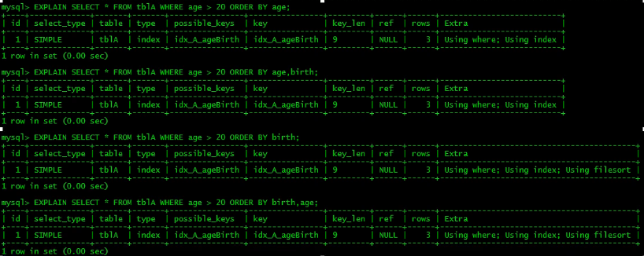

　　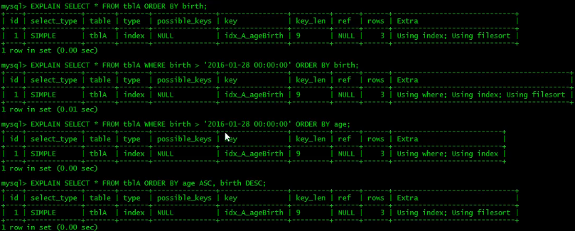

　　MySQL支持二种方式的排序，FileSort和Index。

　　Index效率高，它指MySQL扫描索引本身完成排序。FileSort方式效率较低。

　　ORDER BY满足两情况，会使用Index方式排序：

- ORDER BY 语句使用索引最左前列
- 使用Where子句与Order BY子句条件列组合满足索引最左前列

　　尽可能在索引列上完成排序操作，遵照索引建的最佳左前缀。

　　如果不在索引列上，filesort有两种算法：mysql就要启动双路排序和单路排序

#### 双路排序

　　MySQL 4.1之前是使用双路排序，字面意思就是两次扫描磁盘，最终得到数据，读取行指针和orderby列，对他们进行排序，然后扫描已经排序好的列表，按照列表中的值重新从列表中读取对应的数据输出。

　　总结：从磁盘取排序字段，在buffer进行排序，再从磁盘取其他字段。

　　取一批数据，要对磁盘进行了两次扫描，众所周知，INO是很耗时的，所以在mysql4.1之后，出现了第二种改进的算法，就是单路排序。

#### 单路排序

　　从磁盘读取查询需要的所有列，按照order by列在buffer对它们进行排序，然后扫描排序后的列表进行输出，它的效率更快一些，避免了第二次读取数据。并且把随机IO变成了顺序IO，但是它会使用更多的空间，因为它把每一行都保存在内存中了。

> 由于单路是后出的，总体而言好过双路，但是用单路有问题

　　在sort_buffer中，方法B比方法A要多占用很多空间，因为方法B是把所有字段都取出，所以有可能取出的数据的总大小超出了sort_buffer的容量，导致每次只能取sort_buffer容量大小的数据，进行排序（创建tmp文件，多路合并），排完再取取sort_buffer容量大小，再排 从而多次I/O。
本来想省一次I/O操作，反而导致了大量的I/O操作，反而得不偿失。

#### 调优措施

- 增大sort_buffer_size参数的设置
- 增大max_length_for_sort_data参数的设置

> 为什么需要设置数据库参数？

　　提高Order By的速度

1. Order by时，`select *`是一个大忌，只Query需要的字段，这点非常重要。在这里的影响是：
   - 当Query的字段大小总和小于max_length_for_sort_data，而且排序字段不是`TEXT|BLOB`类型时，会用改进后的算法一单路排序，否则用老算法一多路排序。
   - 两种算法的数据都有可能超出sort_buffer的容量，超出之后，会创建tmp文件进行合并排序，导致多次I/O，但是用单路排序算法的风险会更大一些，所以要提高sort_buffer_size。
2. 尝试提高 sort_buffer_size不管用哪种算法，提高这个参数都会提高效率，当然，要根据系统的能力去提高，因为这个参数是针对每个进程的
3. 尝试提高max_length_for_sort_data提高这个参数，会增加用改进算法的概率。但是如果设的太高，数据总容量超出sort_buffer_size的概率就增大，明显症状是高的磁盘I/O活动和低的处理器使用率。

#### 总结

　　为排序使用索引
MySql两种排序方式：**文件排序**或**扫描有序索引排序**

　　MySql能为排序与查询使用相同的索引

```shell
# KEY a_b_c (a,b,c)

# order by 能使用索引最左前缀
ORDER BY a
ORDER BY a,b
ORDER BY a，b，c
ORDER BY a DESC, b DESC, c DESC

# 如果WHERE使用索引的最左前缀定义为常量，则order by能使用索引
WHERE a = const ORDER BY b, c
WHERE a = const AND b = const ORDER BY c
WHERE a = const AND b > const ORDER BY b, c

# 不能使用索引进行排序
ORDER BY a ASC, b DESC, c DESC # 排序不一致
WHERE g = const ORDER BY b,c # 丢失a索引
WHERE a = const ORDER BY c # 丢失b索引
WHERE a = const ORDER BY a,d # d不是索引的一部分
WHERE a in（..）ORDER BY b，c # 对于排序来说，多个相等条件也是范围查询

```

### group by关键字优化

　　group by实质是先排序后进行分组，遵照索引建的最佳左前缀。

　　当无法使用索引列，增大max_length_for_sort_data参数的设置+增大sort_buffer_size参数的设置。

　　where高于having，能写在where限定的条件就不要去having限定了。
