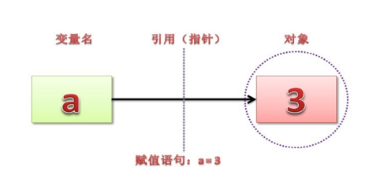

> Python中不但变量名无需事先声明，而且也无需类型声明。在Python语言中，对象的类型和内存占用都是运行时确定的。在赋值时解释器会根据语法和右侧的操作数来决定新对象的类型。在对象创建后，一个该对象的引用会被赋值给左侧的变量。

　　​

## 值和引用

　　在讲is和==这两种运算符区别之前，首先要知道Python中对象包含的三个基本要素，分别是：`id`(身份标识)、`type`(数据类型)和`value`(值)。

　　`id()`可以用来查看对象的内存地址

　　`is`也被叫做同一性运算符，这个运算符比较判断的是对象间的唯一身份标识，也就是`id`是否相同。

　　`==`是python标准操作符中的比较操作符，用来比较判断两个对象的`value`(值)是否相等

```python
In [58]: a = 1

In [59]: b = 1

In [60]: id(a)
Out[60]: 4553015712

In [61]: id(b)
Out[61]: 4553015712

In [62]: a == b
Out[62]: True

In [63]: a is b
Out[63]: True

In [64]: alist = [1, 2, 3]

In [65]: blist = [1, 2, 3]

In [66]: id(alist)
Out[66]: 4615610448

In [67]: id(blist)
Out[67]: 4608370160

In [70]: alist == blist
Out[70]: True

In [71]: alist is blist
Out[71]: False
```

## 可变与不可变

1. `list`、`dict`、`set`属于可变类型
2. `number`、`str`、`tuple`、`bool`属于不可变类型

　　不可变数据类型在第一次声明赋值声明的时候, 会在内存中开辟一块空间, 用来存放这个变量被赋的值, 而这个变量实际上存储的, 并不是被赋予的这个值, 而是存放这个值所在空间的内存地址, 通过这个地址, 变量就可以在内存中取出数据了. 所谓不可变就是说, 我们不能改变这个数据在内存中的值, 所以当我们改变这个变量的赋值时, 只是在内存中重新开辟了一块空间, 将这一条新的数据存放在这一个新的内存地址里, 而原来的那个变量就不在引用原数据的内存地址而转为引用新数据的内存地址了。

　　结合不可变数据类型，可变数据类型就很好理解来，可变数据类型是指变量所指向的内存地址处的值是可以被改变的。

　　**从另外一个角度来看：**

　　可变类型：当该数据类型的对应变量的值发生了改变，那么它对应的内存地址也会发生改变，对于这种数据类型，就称不可变数据类型。

　　可变数据类型：当该数据类型的对应变量的值发生了改变，那么它对应的内存地址不发生改变，对于这种数据类型，就称可变数据类型。

## 内存优化

　　Python采用基于值的内存管理模式，相同的值在内存中只有一份。这是很多Python教程上都会提到的一句话，但实际情况要复杂的多。什么才是值？什么样的值才会在内存中只保存一份？这是个非常复杂的问题。

### 在python交互环境中

　　首先明确一点，整数、实数、字符串是真正意义上的值，而上面那句话中的“值”主要指**不可变类型**中的整数和字符串。对于列表、元组、字典、集合以及range对象、map对象等容器类对象，它们不是普通的“值”，即使看起来是一样的，在内存中也不会只保存一份。

> 整数

```python
In [51]: a = 12

In [52]: b = 12

In [53]: a is b
Out[53]: True
```

　　python中对于小的整数存在一个缓存池。为了避免因创建相同的值而重复申请内存空间所带来的效率问题， Python解释器会在启动时创建出小整数池，范围是`[-5,256]`，该范围内的小整数对象是全局解释器范围内被重复使用，永远不会被垃圾回收机制回收。

> 实数

```python
In [8]: a = 12.5

In [9]: b = 12.5

In [10]: a is b
Out[10]: False
```

　　对于实数，由于计算机存储实数会有精度问题，很难精确存储，所以不进行缓存，也就是说，即使看起来是一样的实数，在内存中也不是一份。

> 字符串

```python
In [63]: a = "abc123_"

In [64]: b = "abc123_"

In [65]: a is b
Out[65]: True

In [66]: a = "12 3"

In [67]: b = "12 3"

In [68]: a is b
Out[68]: False
```

　　由于变量的存储机制，python增加了字符串的`intern`机制。也就是说，值同样的字符串对象（**整数也使用**）仅仅会保存一份，是共用的，这也决定了字符串必须是不可变对象。

```python
In [70]: c = "a" + "b"  # 在 compile-time（编译时）已经求完值，被替换成了'ab', 

In [71]: id(c)
Out[71]: 4489029232

In [72]: d = "ab"  # 此时，内存中已经有 'ab', 因此直接引用即可

In [73]: id(d)
Out[73]: 4489029232

  
In [74]: id(a + "b")  # 在run-time（运行时）拼接的，导致没有被主动intern
Out[74]: 4519083312

 
In [75]: a = 'hello world'
In [76]: b = 'hello world'

In [77]: a is b  # intern机制仅仅对那些看起来像是Python标识符的字符串对象才会触发
Out[77]: False
```

> **intern机制**

　　　　**优点**：在创建新的字符对象时，如果内存中已经存在，则直接引用，避免频繁的创建和销毁内存，提升效率。

　　　　**缺点**：在拼接字符串时，或者在改动字符串时会极大的影响性能。原因是字符串在Python当中是不可变对象，所以对字符串的改动不是inplace（原地）操作，需要新开辟内存地址，新建对象。这也是为什么拼接字符串的时候不建议用`+`而是用`join()`。`join()`是先计算出全部字符串的长度，然后再一一拷贝，仅仅创建一次对象。

　　**总结**

1. 单词，即**Python标识符**，不可修改，默认开启intern机制，共用对象，引用计数为0时自动被回收。
2. 字符串（包含了除Python标识符以外的字符），不可修改，默认没有开启intern机制，引用计数为0时自动被回收。
3. 特殊情况下（动态拼接），不会被主动intern。

> 元组

```python
In [4]: a = (1, 2)

In [5]: b = (1, 2)

In [6]: a is b
Out[6]: False
```

　　对于元组等容器类对象，它们不是普通的“值”，即使看起来是一样的，在内存中也不会只保存一份。

### 在Python代码中

　　在同一模块文件中，不可变类型的数字、字符串、元组， 在值相同时，只会保存一份;而不同模块中的不同值，才会重新生成。

　　**模块 ​**​**`bbb.py`**

```python
c1 = 1000
c2 = "hello world % "
c3 = (1, 2)
c4 = 12.3

```

　　**模块 ​**​**`aaa.py`**

```python
from bbb import *

a = 1000
b = 1000
print(a is b)  # True
print(a is c1)  # False

a = "hello world % "
b = "hello world % "
print(a is b)  # True
print(a is c2)  # False

a = (1, 2)
b = (1, 2)
print(a is b)  # True
print(a is c3)  # False

a = 12.3
b = 12.3
print(a is b)  # True
print(a is c4)  # False
```
