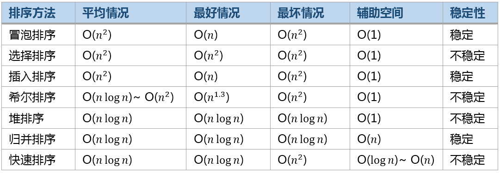

---

title: 经典排序算法
category: [Python]
tag: []
abbrlink: a48fc9
date: 2021-03-08 22:38:26
article: false
order: -1

---

经典排序算法在面试中占有很大的比重，也是基础，为了未雨绸缪，整理并用Python实现了七大经典排序算法，包括冒泡排序，插入排序，选择排序，希尔排序，归并排序，快速排序，堆排序。之所以用Python实现，主要是因为它更接近伪代码，能用更少的代码实现算法，更利于理解。

本篇博客所有排序实现均默认从小到大。

## 冒泡排序 `BubbleSort`

### 介绍

冒泡排序的原理非常简单，它重复地走访过要排序的数列，一次比较两个元素，如果他们的顺序逆序就把他们交换过来。

### 步骤

1. 比较相邻的元素。如果第一个比第二个大，就交换他们两个。
2. 对第0个到第n-1个数据做同样的工作。这时，最大的数就“浮”到了数组最后的位置上。
3. 针对所有的元素重复以上的步骤，除了最后一个。
4. 持续每次对越来越少的元素重复上面的步骤，直到没有任何一对数字需要比较。

不过针对上述实现过程还有两种优化方案。

- 优化1：某一趟遍历如果没有数据交换，则说明已经排好序了，因此不用再进行迭代了。用一个标记记录这个状态即可。
- 优化2：记录某次遍历时最后发生数据交换的位置，这个位置之后的数据显然已经有序，不用再排序了。因此通过记录最后发生数据交换的位置就可以确定下次循环的范围了。

### 源代码

```python
def bubble_sort(ary):
    n = len(ary)                   #获得数组的长度
    for i in range(n):
        for j in range(1,n-i):
            if  ary[j-1] > ary[j] :       #如果前者比后者大
                ary[j-1],ary[j] = ary[j],ary[j-1]       #则交换两者
    return ary


#优化1：某一趟遍历如果没有数据交换，则说明已经排好序了，因此不用再进行迭代了。
#用一个标记记录这个状态即可。
def bubble_sort2(ary):
    n = len(ary)
    for i in range(n):
        flag = 1                    #标记
        for j in range(1,n-i):
            if  ary[j-1] > ary[j] :
                ary[j-1],ary[j] = ary[j],ary[j-1]
                flag = 0
        if flag :                   #全排好序了，直接跳出
            break
    return ary

#优化2：记录某次遍历时最后发生数据交换的位置，这个位置之后的数据显然已经有序了。
# 因此通过记录最后发生数据交换的位置就可以确定下次循环的范围了。
def bubble_sort3(ary):
    n = len(ary)
    k = n                           #k为循环的范围，初始值n
    for i in range(n):
        flag = 1
        for j in range(1,k):        #只遍历到最后交换的位置即可
            if  ary[j-1] > ary[j] :
                ary[j-1],ary[j] = ary[j],ary[j-1]
                k = j               #记录最后交换的位置
                flag = 0
        if flag :
            break
    return ary
```

## 选择排序 `SelectionSort`

### 介绍

选择排序无疑是最简单直观的排序。它的工作原理如下。

### 步骤

1. 在未排序序列中找到最小（大）元素，存放到排序序列的起始位置。
2. 再从剩余未排序元素中继续寻找最小（大）元素，然后放到已排序序列的末尾。
3. 以此类推，直到所有元素均排序完毕。

### 源代码

```python
def select_sort(ary):
    n = len(ary)
    for i in range(0,n):
        min = i                             #最小元素下标标记
        for j in range(i+1,n):
            if ary[j] < ary[min] :
                min = j                     #找到最小值的下标
        ary[min],ary[i] = ary[i],ary[min]   #交换两者
    return ary
```

## 插入排序 `InsertionSort`

### 介绍

插入排序的工作原理是，对于每个未排序数据，在已排序序列中从后向前扫描，找到相应位置并插入。

### 步骤

1. 从第一个元素开始，该元素可以认为已经被排序
2. 取出下一个元素，在已经排序的元素序列中从后向前扫描
3. 如果被扫描的元素（已排序）大于新元素，将该元素后移一位
4. 重复步骤3，直到找到已排序的元素小于或者等于新元素的位置
5. 将新元素插入到该位置后
6. 重复步骤2~5

### 排序演示


### 源代码

```python
def insert_sort(ary):
    n = len(ary)
    for i in range(1,n):
        if ary[i] < ary[i-1]:
            temp = ary[i]
            index = i           #待插入的下标
            for j in range(i-1,-1,-1):  #从i-1 循环到 0 (包括0)
                if ary[j] > temp :
                    ary[j+1] = ary[j]
                    index = j   #记录待插入下标
                else :
                    break
            ary[index] = temp
    return ary
```

## 希尔排序 `ShellSort`

### 介绍：

希尔排序，也称递减增量排序算法，实质是分组插入排序。由 Donald Shell 于1959年提出。希尔排序是非稳定排序算法。

### 步骤：

希尔排序的基本思想是：将数组列在一个表中并对列分别进行插入排序，重复这过程，不过每次用更长的列（步长更长了，列数更少了）来进行。最后整个表就只有一列了。将数组转换至表是为了更好地理解这算法，算法本身还是使用数组进行排序。

1. 例如，假设有这样一组数`[ 13 14 94 33 82 25 59 94 65 23 45 27 73 25 39 10 ]`，如果我们以步长为5开始进行排序，我们可以通过将这列表放在有5列的表中来更好地描述算法，这样他们就应该看起来是这样：
   ```
   13 14 94 33 82
   25 59 94 65 23
   45 27 73 25 39
   10
   ```
2. 然后我们对每列进行排序：
   ```
   10 14 73 25 23
   13 27 94 33 39
   25 59 94 65 82
   45
   ```
3. 将上述四行数字，依序接在一起时我们得到：`[ 10 14 73 25 23 13 27 94 33 39 25 59 94 65 82 45 ]`。这时10已经移至正确位置了，然后再以3为步长进行排序：
   ```
   10 14 73
   25 23 13
   27 94 33
   39 25 59
   94 65 82
   45
   ```

   排序之后变为：
   ```
   10 14 13
   25 23 33
   27 25 59
   39 65 73
   45 94 82
   94
   ```
4. 最后以1步长进行排序（此时就是简单的插入排序了）。

### 源代码

```python
def shell_sort(ary):
    n = len(ary)
    gap = round(n/2)       #初始步长 , 用round四舍五入取整
    while gap > 0 :
        for i in range(gap,n):        #每一列进行插入排序 , 从gap 到 n-1
            temp = ary[i]
            j = i
            while ( j >= gap and ary[j-gap] > temp ):    #插入排序
                ary[j] = ary[j-gap]
                j = j - gap
            ary[j] = temp
        gap = round(gap/2)                     #重新设置步长
    return ary
```

## 归并排序 `MergeSort`

### 介绍

归并排序是采用分治法的一个非常典型的应用。归并排序的思想就是先递归分解数组，再合并数组。

先考虑合并两个有序数组，基本思路是比较两个数组的最前面的数，谁小就先取谁，取了后相应的指针就往后移一位。然后再比较，直至一个数组为空，最后把另一个数组的剩余部分复制过来即可。

再考虑递归分解，基本思路是将数组分解成left和right，如果这两个数组内部数据是有序的，那么就可以用上面合并数组的方法将这两个数组合并排序。如何让这两个数组内部是有序的？可以再二分，直至分解出的小组只含有一个元素时为止，此时认为该小组内部已有序。然后合并排序相邻二个小组即可。

### 排序演示


### 源代码

```python
def merge_sort(ary):
    if len(ary) <= 1 : return ary
    num = int(len(ary)/2)       #二分分解
    left = merge_sort(ary[:num])
    right = merge_sort(ary[num:])
    return merge(left,right)    #合并数组

def merge(left,right):
    '''合并操作，
    将两个有序数组left[]和right[]合并成一个大的有序数组'''
    l,r = 0,0           #left与right数组的下标指针
    result = []
    while l<len(left) and r<len(right) :
        if left[l] < right[r]:
            result.append(left[l])
            l += 1
        else:
            result.append(right[r])
            r += 1
    result += left[l:]
    result += right[r:]
    return result
```

## 快速排序 `QuickSort`

### 介绍

快速排序通常明显比同为`Ο(n log n)`的其他算法更快，因此常被采用，而且快排采用了分治法的思想，所以在很多笔试面试中能经常看到快排的影子。可见掌握快排的重要性。

### 步骤

1. 从数列中挑出一个元素作为基准数。
2. 分区过程，将比基准数大的放到右边，小于或等于它的数都放到左边。
3. 再对左右区间递归执行第二步，直至各区间只有一个数。

### 排序演示


### 源代码

```python
def quick_sort(ary):
    return qsort(ary,0,len(ary)-1)

def qsort(ary,left,right):
    #快排函数，ary为待排序数组，left为待排序的左边界，right为右边界
    if left >= right : return ary
    key = ary[left]     #取最左边的为基准数
    lp = left           #左指针
    rp = right          #右指针
    while lp < rp :
        while ary[rp] >= key and lp < rp :
            rp -= 1
        while ary[lp] <= key and lp < rp :
            lp += 1
        ary[lp],ary[rp] = ary[rp],ary[lp]
    ary[left],ary[lp] = ary[lp],ary[left]
    qsort(ary,left,lp-1)
    qsort(ary,rp+1,right)
    return ary

```

## 堆排序 `HeapSort`

### 介绍：

堆排序在 `top K` 问题中使用比较频繁。堆排序是采用二叉堆的数据结构来实现的，虽然实质上还是一维数组。二叉堆是一个近似完全二叉树 。

> 二叉堆具有以下性质：

父节点的键值总是大于或等于（小于或等于）任何一个子节点的键值。
每个节点的左右子树都是一个二叉堆（都是最大堆或最小堆）。

### 步骤

1. 构造最大堆（`Build_Max_Heap`）：若数组下标范围为`0~n`，考虑到单独一个元素是大根堆，则从下标n/2开始的元素均为大根堆。于是只要从`n/2-1`开始，向前依次构造大根堆，这样就能保证，构造到某个节点时，它的左右子树都已经是大根堆。
2. 堆排序（`HeapSort`）：由于堆是用数组模拟的。得到一个大根堆后，数组内部并不是有序的。因此需要将堆化数组有序化。思想是移除根节点，并做最大堆调整的递归运算。第一次将`heap[0]`与`heap[n-1]`交换，再对`heap[0...n-2]`做最大堆调整。第二次将`heap[0]`与`heap[n-2]`交换，再对`heap[0...n-3]`做最大堆调整。重复该操作直至`heap[0]`和`heap[1]`交换。由于每次都是将最大的数并入到后面的有序区间，故操作完后整个数组就是有序的了。
3. 最大堆调整（`Max_Heapify`）：该方法是提供给上述两个过程调用的。目的是将堆的末端子节点作调整，使得子节点永远小于父节点 。

### 排序演示


### 源代码

```python
def heap_sort(ary) :
    n = len(ary)
    first = int(n/2-1)       #最后一个非叶子节点
    for start in range(first,-1,-1) :     #构造大根堆
        max_heapify(ary,start,n-1)
    for end in range(n-1,0,-1):           #堆排，将大根堆转换成有序数组
        ary[end],ary[0] = ary[0],ary[end]
        max_heapify(ary,0,end-1)
    return ary


#最大堆调整：将堆的末端子节点作调整，使得子节点永远小于父节点
#start为当前需要调整最大堆的位置，end为调整边界
def max_heapify(ary,start,end):
    root = start
    while True :
        child = root*2 +1               #调整节点的子节点
        if child > end : break
        if child+1 <= end and ary[child] < ary[child+1] :
            child = child+1             #取较大的子节点
        if ary[root] < ary[child] :     #较大的子节点成为父节点
            ary[root],ary[child] = ary[child],ary[root]     #交换
            root = child
        else :
            break

```

## 总结

下面为七种经典排序算法指标对比情况：

