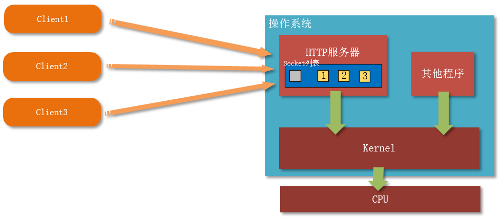
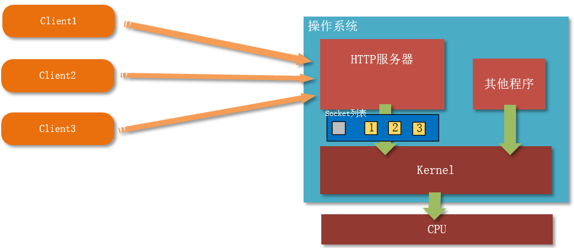

下面我们使用 `Python` 来实现并发的 `Web Server`，其中采用了多进程、多线程、协程、单进程单线程非阻塞、`select`、`epoll`的方式。

多进程

---

```python
import socket
import re
import multiprocessing

#  注意： 不同的实现方式，但是对请求的处理方式相同，只是主函数中对客户端请求的接收方式不同 
def handle_request(new_socket):
    while True:
        # 接收请求
        recv_msg = new_socket.recv(1024).decode("utf-8")
        if recv_msg == "":
            print("recv null")
            new_socket.close()
            return

        # 从请求中解析出URI
        recv_lines = recv_msg.splitlines()
        print(recv_lines)
        # 使用正则表达式提取出URI
        ret = re.match(r"[^/]+(/[^ ]*)", recv_lines[0])
        if ret:
            # 获取URI字符串
            file_name = ret.group(1)
            # 如果URI是/，则默认返回index.html的内容
            if file_name == "/":
                file_name = "/index.html"

        try:
            # 根据请求的URI，读取相应的文件
            fp = open("." + file_name, "rb")
        except:
            # 找不到文件，响应404
            response_msg = "HTTP/1.1 404 NOT FOUND\r\n"
            response_msg += "\r\n"
            response_msg += "<h1>----file not found----</h1>"
            new_socket.send(response_msg.encode("utf-8"))
        else:
            html_content = fp.read()
            fp.close()
            response_body = html_content

            # 响应正确 200 OK
            response_header = "HTTP/1.1 200 OK\r\n"
            response_header += "Content-Length:%d\r\n" % len(response_body)
            response_header += "\r\n"

            response = response_header.encode("utf-8") + response_body

            # 返回响应数据
            new_socket.send(response)


def main():
    # 创建TCP SOCKET实例
    tcp_server_socket = socket.socket(socket.AF_INET, socket.SOCK_STREAM)
    # # 设置重用地址
    # tcp_server_socket.setsockopt(socket.SOL_SOCKET, socket.SO_REUSEADDR, 1)
    # 绑定地址（默认本机IP）和端口
    tcp_server_socket.bind(("", 7890))
    # 监听
    tcp_server_socket.listen(128)
    # 循环接收客户端连接
    while True:
        new_socket, client_addr = tcp_server_socket.accept()
        # 启动一个子进程来处理客户端的请求
        sub_p = multiprocessing.Process(target=handle_request, args=(new_socket,))
        sub_p.start()
        # 这里要关闭父进程中的new_socket，因为创建子进程会复制一份new_socket给子进程
        new_socket.close()

    # 关闭整个SOCKET
    tcp_server_socket.close()


if __name__ == "__main__":
    main()
```

我们使用进程来实现并发的 Web Server，也就是将 `accept` 到 `new_socket` 传递给子进程去处理，处理函数还是 `handle_request`。

但是这里注意，子进程会从父进程中将所有的变量**进行拷贝**，也就是说父进程和子进程中**各有一份 new_socket**，而在 `Linux` 下，`socket` 对应的也是一个文件描述符，而这两个 `new_socket` 实际上是指向同一个 `fd` 的。所以我们将 `new_socket` 交给子进程后，父进程就可以马上关闭自己的 `new_socket` 了，当子进程服务完毕后，关闭子进程中的 `new_socket`，这样**对应的 **​**​`FD`​**​ ** 才会正真关闭，此时才会触发四次挥手。所以父进程代码中的 **​**​`new_socket.close()`​**​ ** 非常重要。**

多线程

---

在第一节中，我们使用进程来实现并发，但是进程对资源消耗很大，一般不推荐使用。所以这里我们使用线程来实现并发，很简单，我们将 `multiprocessing.Process` 替换为 `threaing.Thread` 就可以了：

```python
import socket
import re
import threading
from web_server import handle_request

def main():
    # 创建TCP SOCKET实例
    tcp_server_socket = socket.socket(socket.AF_INET, socket.SOCK_STREAM)
    # 设置重用地址
    tcp_server_socket.setsockopt(socket.SOL_SOCKET, socket.SO_REUSEADDR, 1)
    # 绑定地址（默认本机IP）和端口
    tcp_server_socket.bind(("", 7890))
    # 监听
    tcp_server_socket.listen(128)
    # 循环接收客户端连接
    while True:
        new_socket, client_addr = tcp_server_socket.accept()
        # 启动一个线程来处理客户端的请求
        t = threading.Thread(target=handle_request, args=(new_socket,))
        t.start()

    # 关闭整个SOCKET
    tcp_server_socket.close()


if __name__ == "__main__":
    main()
```

我们发现，除了将子进程的创建过程替换成了线程的创建过程，后面的 `new_socket.close(`) 也被删除了，这是因为线程是公用进程资源的，`new_socket` 不会被复制，所以 `socket` 对应的 FD，只有一个 new_socket 指向他。

如果此时我们仍然在这里关闭 `new_socket`，那么在线程再使用 `new_socket` 就会报错。如下信息：

```python
Exception in thread Thread-1:
Traceback (most recent call last):
  File "/Library/Frameworks/Python.framework/Versions/3.7/lib/python3.7/threading.py", line 926, in _bootstrap_inner
    self.run()
  File "/Library/Frameworks/Python.framework/Versions/3.7/lib/python3.7/threading.py", line 870, in run
    self._target(*self._args, **self._kwargs)
  File "/Users/mac/PycharmProjects/Month2/web_server.py", line 9, in handle_request
    recv_msg = new_socket.recv(1024).decode("utf-8")
OSError: [Errno 9] Bad file descriptor
```

协程并发

---

使用进程和线程来实现的并发 Web Server，当并发访问量很大时，资源消耗都很高。所以这里使用协程来实现并发服务器。

```python
import socket
import re
import gevent
from gevent import monkey
monkey.patch_all()
from web_server import handle_request


def main():
    # 创建TCP SOCKET实例
    tcp_server_socket = socket.socket(socket.AF_INET, socket.SOCK_STREAM)
    # # 设置重用地址
    # tcp_server_socket.setsockopt(socket.SOL_SOCKET, socket.SO_REUSEADDR, 1)
    # 绑定地址（默认本机IP）和端口
    tcp_server_socket.bind(("", 7890))
    # 监听
    tcp_server_socket.listen(128)
    # 循环接收客户端连接
    while True:
        new_socket, client_addr = tcp_server_socket.accept()
        # 启动一个协程来处理客户端的请求
        gevent.spawn(handle_request, new_socket)

    # 关闭整个SOCKET
    tcp_server_socket.close()


if __name__ == "__main__":
    main()
```

使用 gevent 来实现协程，并发处理请求。

单线程非阻塞

---

前面我们使用的多进程和多线程来处理并发，是因为 `socket.recv()` 是阻塞的，每次 `accept` 一个连接，就需要交给一个新的进程或线程去处理，从而不影响下一个 `socket` 连接。

但是我们可以通过单进程单线程和非阻塞的方式来完成并发 `socket` 的处理：

```python
import socket
import time
import re


def handle_request(new_socket, recv_msg):
    # 从请求中解析出URI
    recv_lines = recv_msg.splitlines()

    # 使用正则表达式提取出URI
    ret = re.match(r"[^/]+(/[^ ]*)", recv_lines[0])

    if ret:
        # 获取URI字符串
        file_name = ret.group(1)
        # 如果URI是/，则默认返回index.html的内容
        if file_name == "/":
            file_name = "/index.html"

    try:
        # 根据请求的URI，读取相应的文件
        fp = open("." + file_name, "rb")
    except:
        # 找不到文件，响应404
        response_msg = "HTTP/1.1 404 NOT FOUND\r\n"
        response_msg += "\r\n"
        response_msg += "<h1>----file not found----</h1>"
        new_socket.send(response_msg.encode("utf-8"))
    else:
        html_content = fp.read()
        fp.close()

        response_body = html_content

        # 响应正确 200 OK
        response_header = "HTTP/1.1 200 OK\r\n"
        response_header += "Content-Length:%d\r\n" % len(response_body)
        response_header += "\r\n"

        response = response_header.encode("utf-8") + response_body

        # 返回响应数据
        new_socket.send(response)


def main():
    # 创建TCP SOCKET实例
    tcp_server_socket = socket.socket(socket.AF_INET, socket.SOCK_STREAM)
    # 设置重用地址
    tcp_server_socket.setsockopt(socket.SOL_SOCKET, socket.SO_REUSEADDR, 1)
    # 绑定地址（默认本机IP）和端口
    tcp_server_socket.bind(("", 7890))
    # 监听
    tcp_server_socket.listen(128)

    # 将accept设置为非阻塞,这里设置一次，后面不管调多少次accept都是非阻塞的
    tcp_server_socket.setblocking(False)
    # 定义一个列表，将每次连接的socket加入该列表
    client_socket_list = list()
    fd_to_addr = {}

    # 循环接收客户端连接
    while True:
        time.sleep(0.5)

        try:
            new_socket, client_addr = tcp_server_socket.accept()
        except Exception as ret:
            # 当没有客户端链接的时候，抛出异常
            pass
        else:
            print("客户端{} OnLine。。。。".format(client_addr))
            # 当有客户端链接的时候
            # 将new_socket.recv()设置为非阻塞的
            new_socket.setblocking(False)
            # 将new_socket加入列表
            client_socket_list.append(new_socket)

            # 将 conn 和 addr 信息分别保存起来
            fd_to_addr[new_socket.fileno()] = client_addr

        # 遍历socket列表，检查每一个socket是否有数据到达，或者客户端是否断开
        for client_socket in client_socket_list:
            try:
                recv_content = client_socket.recv(1024).decode("utf-8")
            except Exception as ret:
                # 异常，表示该客户端没有发数据过来
                pass
            else:
                # 正常，表示客户端发了数据，或者客户端断开连接（断开连接会导致recv正常返回）
                if recv_content:
                    # 有数据，调用请求处理代码
                    handle_request(client_socket, recv_content)
                else:
                    print("客户端{}OffLine。。。。".format(fd_to_addr[client_socket.fileno()]))
                    # recv正常返回，且数据为空，表示客户端断开了链接
                    # 将该socket踢出列表
                    client_socket_list.remove(client_socket)
                    # 服务器也关闭连接
                    client_socket.close()

    # 关闭整个SOCKET
    tcp_server_socket.close()


if __name__ == "__main__":
    main()

```

上面代码主要是说明在单进程单线程情况下，如何将 `accept` 和 `recv` 分开，并且都用非阻塞的方式来处理，这样每次查看是否有客户端链接进来的时候，都会去检查所有已链接的 `socket` 是否有数据发送过来。

在这种方式中，我们使用单进程单线程模拟了并发处理 `socket` 连接的功能，但这些 `socket` 连接的处理不是并行的。当一个 `socket` 处理数据时间比较长时，也会**造成整个程序的等待。**

特别注意的是，在请求处理函数 `handle_request` 中，我们将请求内容作为参数一并传递进去。然后在返回 `200 OK` 的时候，在响应头中添加了 `Content-Length` 字段，这个字段用于告诉客户端，此次发送的响应体有多大。当客户端收完指定大小的数据，就认为这次服务器发送的数据已经发送完毕。他就可以继续发送下一个新的请求。

在 `handle_request` 中可以看到，`new_socket.close()` 已经被删除，也就是说服务器不会自动关闭连接，而直到客户端断开连接之前，服务器都保持`长连接`。断开连接由客户端来发起。

## select高并发

在编写了单进程非阻塞式服务器之后，还有另外种写服务器的方法，便是利用`select`。
`select`是对底层操作系统的一个访问操作，因而效率较高，比单进程非阻塞中的`for`循环遍历效率要高，可以利用`select`进行选择，选择出来可以读取信息的套接字、可以发送信息的套接字、以及产生的异常（分别是三个返回值）。

```python
readable, writable, exceptionable = select([], [], [])
```

以上即为`select`的使用方法，程序执行到该语句后进行阻塞等待，接收到新的套接字之后便解阻塞。
程序思路便是利用`select`检测、选择出能读取的套接字（包括服务器套接字、客户端套接字），将接收到消息的客户端套接字存入列表（列表中本来只有服务器套接字），之后进行`for`循环遍历，读取套接字中的信息或者进行与客户端的连接。

```python
from socket import *
from select import select
from web_server import handle_request


def main():
    # 创建套接字
    server_socket = socket(AF_INET, SOCK_STREAM)

    # 设置可以重复使用绑定的信息
    server_socket.setsockopt(SOL_SOCKET, SO_REUSEADDR, 1)

    # 绑定本机信息
    server_socket.bind(("", 8080))

    # 主动监听
    server_socket.listen(128)
    
    # 将accept设置为非阻塞
    server_socket.setblocking(False)

    inputs = [server_socket]
    fd_to_addr = {}

    while True:
        readable, writable, exceptionable = select(inputs, [], [])
        for sock in readable:

            if sock == server_socket:
                clientSocket, clientAddr = server_socket.accept()
                # 当有客户端链接的时候
                # 将new_socket.recv()设置为非阻塞的
                clientSocket.setblocking(False)

                inputs.append(clientSocket)
                # 将 addr 信息保存起来
                fd_to_addr[clientSocket.fileno()] = clientAddr
                print("客户端{} OnLine。。。。".format(clientAddr))

            else:
                message = sock.recv(1024)
                if message:
                    # print('message from [%s] is %s' % (str(sock), message.decode('utf-8')))
                    handle_request(sock, message.decode("utf8"))
                else:
                    print('[%s] OffLine。。。。' % (fd_to_addr[sock.fileno()]))
                    inputs.remove(sock)
                    sock.close()


if __name__ == '__main__':
    main()

```

`select`版服务器有一定的缺点，便是只能处理1024个并发客户端，因而其效率还是有一定的局限性。

## epoll高并发

我们在最后使用单进程+单线程+非阻塞+长连接实现了一个可并发处理客户端连接的服务器。他的原理可以用以下的图来描述：



**解释：**

1. HTTP服务器是我们使用 单进程+单线程+非阻塞+长连接实现 的`web`服务器。
2. 在实现的时候，我们创建了一个存放已接受`Socket`连接的列表，该列表是在应用程序的内存空间中的。如图中深蓝色部分
3. 当有3个客户端接入的时候，列表中一共存在3个对应的`socket`句柄，分别对应三个小黄框。
4. 灰色小框代表服务器接收请求的`socket`。
5. 我们在进行无限循环的时候，首先是检查是否有新的客户端接入，相当于检查灰色小框是否有数据到达。然后轮询3个小黄框对应`socket`是否有数据到达。轮询的效率是很低的。
6. 服务器在使用`accept`和`recv`时，实际上是委托操作系统帮他检查是否有数据到达，由于这个列表的`socket`都处于用户内存空间，所以需要将其复制到内核空间。操作系统检查完毕后，如果有数据就返回数据给应用程序，如果没有数据就以异常的方式通知应用程序。而且不光这样，操作系统可能还同时在运行其他的应用程序，这样效率会非常低。

**我们再来看epoll的图**:



**解释**

1.我们可以看到，在结构上，最大的区别在于，存放`socket`的列表不处于应用程序内部。在`epoll`中，这个存放`socket`的列表处于一个**特殊的内存空间，这个内存空间是应用程序与内核共享的空间**。也就是说，当应用程序委托操作系统检查是否有数据到达时，无需将复制数据给内核空间，操作系统可以直接进行检查。

2.操作系统检查到某个`socket`有数据到达，使用**事件通知**的形式，直接告诉应用程序，而不是以轮询的方式。打个比方，一个厨师挨个问50个人饿了没，如果饿了就给他东西吃，这是轮询。而50个人中，谁饿了谁举手，厨师就给吃的，这叫事件通知。很明显，事件通知的效率会特别高。

```python
from socket import *
import select
from web_server import handle_request


def main():
    # 创建套接字
    server_socket = socket(AF_INET, SOCK_STREAM)

    # 设置可以重复使用绑定的信息
    server_socket.setsockopt(SOL_SOCKET, SO_REUSEADDR, 1)

    # 绑定本机信息
    server_socket.bind(("", 8080))

    # 主动监听
    server_socket.listen(128)
    # 将accept设置为非阻塞
    server_socket.setblocking(False)
    # 创建epoll对象
    epoll = select.epoll()

    # 注册事件到epoll中
    # epoll.register(fd[, eventmask])
    # 注意，如果fd已经注册过，则会发生异常
    # 将创建的套接字添加到epoll的事件监听中

    # 注册tcp套接字
    epoll.register(server_socket.fileno(), select.EPOLLIN)

    '''因为epoll返回的触发事件对应的是套接字文件描述符，所以需要在字典中加入对应关系'''

    # 定义一个字典，用于存放fd和套接字的对应关系，因为操作系统在事件通知的时候，使用的是fd，而不是套接字，我们需要使用fd来找到对应
    # 的套接字，从而可以调用accept和recv
    fd_to_socket = {}
    fd_to_addr = {}

    # 循环接收客户端连接
    while True:
        # 使用一个列表来接受操作系统的事件通知，poll()是阻塞的，当有数据到达时，poll才会解开阻塞
        epoll_list = epoll.poll()

        for fd, event in epoll_list:
            # 首先判断事件通知中的fd是否对应监听套接字（监听套接字调用accept）
            if fd == server_socket.fileno():

                conn, addr = server_socket.accept()
                # 监听到一个新的客户端连接，将conn也注册到epoll中
                epoll.register(conn.fileno(), select.EPOLLIN)

                print('有新的客户端到来%s' % str(addr))

                # 将 conn 和 addr 信息分别保存起来
                fd_to_socket[conn.fileno()] = conn
                fd_to_addr[conn.fileno()] = addr

            else:  # 如果不是监听套接字，那么都是客户端对应的套接字
                # 接收数据
                recvData = fd_to_socket[fd].recv(1024).decode('utf8')

                if recvData:
                    handle_request(fd_to_socket[fd], recvData)

                # 如果没有数据，则表示客户端断开连接
                else:
                    # 从 epoll 中移除该 连接 fd
                    epoll.unregister(fd)

                    #  关闭fd对应的socket
                    fd_to_socket[fd].close()

                    print("%s---offline---" % str(fd_to_addr[fd]))


if __name__ == '__main__':
    main()

```
