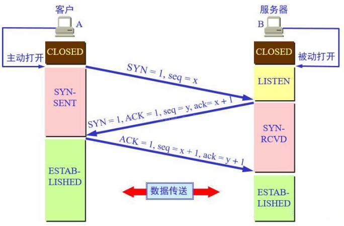
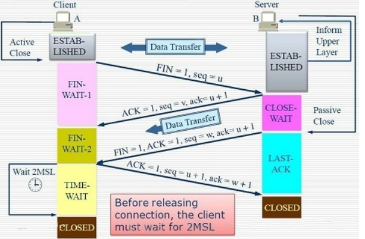

本篇文章介绍如何实现一个简单 的Web Server 以及对应的问题解决方案。

## 实现固定页面的Web Server

1. 使用socket创建一个TCP Server
2. 接受来自浏览器的TCP链接，并接收HTTP请求
3. 返回固定响应数据给浏览器

```python
import socket, time


def handle_request(new_socket):
    # 接收请求
    recv_msg = new_socket.recv(1024)
    print(recv_msg)
    # 响应数据
    response_msg = "HTTP/1.1 200 OK\r\n"
    response_msg += "\r\n"
    response_msg += "<h1>Hello</h1>"
    # 返回响应数据（二进制数据）
    time.sleep(1)
    new_socket.send(response_msg.encode("utf-8"))
    # 关闭该次socket连接
    new_socket.close()


def main():
    # 创建TCP SOCKET实例
    tcp_server_socket = socket.socket(socket.AF_INET, socket.SOCK_STREAM)
    # 绑定地址（默认本机IP）和端口
    tcp_server_socket.bind(("", 8890))
    # 监听
    tcp_server_socket.listen(128)
    # 循环接收客户端连接
    while True:
        new_socket, client_addr = tcp_server_socket.accept()
        # 处理每个客户端的请求
        handle_request(new_socket)

    # 关闭整个SOCKET
    tcp_server_socket.close()


if __name__ == '__main__':
    main()
```

> ==缺陷==

这种简单的web server是阻塞的，同时只能处理一个请求。

## 解决服务器端口占用问题

问题描述：当浏览器访问服务器时，服务器收到请求，马上返回响应数据，并且调用了`new_socket.close()`。此时，马上重启服务器的话，可能会提示端口被占用。

这是因为TCP的四次挥手过程中，谁先发送`FIN`包，则谁会在发送最后一个`ACK`包后进入`TIME_WAIT`状态，此状态会等待`2MSL`的时间（大概2-4分钟）。在这个阶段，服务器绑定的端口资源是被占用的。等这个阶段过了，端口会进入`CLOSED`状态，则可以被再次利用。

如何解决服务器重启端口被占用的问题：

```python
def main():
    # 创建TCP SOCKET实例
    tcp_server_socket = socket.socket(socket.AF_INET, socket.SOCK_STREAM)
    # 设置重用地址
    tcp_server_socket.setsockopt(socket.SOL_SOCKET, socket.SO_REUSEADDR, 1)
    # 绑定地址（默认本机IP）和端口
    tcp_server_socket.bind(("", 7890))
    # 监听
    tcp_server_socket.listen(128)
    # 循环接收客户端连接
    while True:
        new_socket, client_addr = tcp_server_socket.accept()
        # 处理每个客户端的请求
        handle_request(new_socket)

    # 关闭整个SOCKET
    tcp_server_socket.close()
```

> 在创建`socket`实例之后，设置可以重用地址，就可以解决报错问题。

## TCP协议3次握手、4次挥手

### 三次握手



**三次握手流程和目的都相对简单：**

1. 客户端向服务器发送`SYN flag`的包，并携带`seq`为`x`。
2. 服务器收到`SYN`包后，开始准备对应的资源，准备好后，发送`SYN+ACK`包，这实际上是服务器回应客户端的`ACK`包，合并了服务器让客户端准备资源的`SYN`包。所以携带了对应`SYN`的`seq y`，以及`ACK=x+1`。
3. 客户端收到服务器发来的`SYN`包，则回复`ACK`包，`ack=y+1`。

这样3次握手就建立好了，客户端和服务器都进入`ESTABLISHED`状态，表示资源都准备完毕。所以TCP的三次握手实际上是客户端与服务器之间互相要求准备资源以及回复资源已准备好的过程。

理论上应该是4次握手，但为了增加性能减小时间开销，中间的两次数据传输（服务器发送的`SYN`和`ACK`）合并在一起了。所以变成了3次握手。

### 四次挥手



**四次挥手相对比较复杂：**

1. 假设客户端在完成数据传输后，首先开始发送`FIN`包（也就是我们的客户端程序调用`socket.close()`的时候，系统底层会自动发送`FIN`包），则表示客户端已经没有需要发送给服务器的数据。由于`SOCKET`是全双工的，所以客户端发送`FIN`只是表示客户端以后都不在发送数据，但此时还可以接收数据。
2. 客户端发送出`FIN`包后，就会进入`FIN WAIT-1`状态，该状态一般很难观测到，因为该状态只维持到服务器响应`ACK`包，一般情况下都是瞬间就返回了（注意这里和3次握手不同，这里的`ACK`包不能与服务器发送的FIN包合并，因为服务器可能还有数据要继续发送给客户端，所以服务器可能要等到数据传输完毕才会向客户端发送`FIN`包，这就是为什么是四次挥手）
3. 服务器收到客户端发来的`FIN`包，则马上发送回应的ACK包，此包没有意外的话，会瞬间到达客户端。
4. 客户端收到`ACK`包后，结束`FIN WAIT-1`状态，进入`FIN WAIT-2`状态，该状态的目的是等待服务器发送`FIN`包。
5. 服务器完成了最后的数据发送，则向客户端发送`FIN`包（也就是服务器程序调用`socket.close()`的时候，系统底层会自动发送`FIN`包），表示服务器以后也没有数据要发送了，开始断开服务器的发送通道。
6. 服务器在发送出`FIN`后，会进入`LAST-ACK`状态（例如等待4s）。这个状态是为了等待客户端恢复确认的`ACK`包，因为服务器发送出去的`FIN`包，他无法确认客户端是否收到，如果超出`waittime`还未收到`ACK`包，则重新发送FIN包。
7. 客户端如果正确收到了服务器发送的`FIN`包，理论上应该释放资源，并发送`ACK`包。但是如果客户端发出的`ACK`包由于某些原因，服务器并未收到，那么服务器在几秒后会重新发送`FIN`包，但客户端已经把资源释放掉了，则就会出现问题。怎么解决这个问题呢？解决方案是，客户端收到服务器发送的`FIN`包，并不马上释放资源（例如绑定的端口等），而是先回复`ACK`包，并进入`TIME-WAIT`状态，这个状态要持续`2MSL`（2-3分钟）。如果在`2MSL`时间段中，服务器都没有重新发送FIN包，则表示服务器已经收到了自己发出的`ACK`包，这是客户端才放心的释放资源。
8. 最终客户端在等待`2MSL`后，进入`CLOSED`状态。服务器在确认收到最后一个`ACK`包后直接进入`CLOSED`状态。

**资源占用的解释：**

我们知道，客户端是使用随机端口来发起`TCP`连接的，所以客户端首先发送`FIN`包的话，最后的`2MSL`是由客户端来等待，即使2-3分钟资源未被释放，也不会影响客户端另外发起新的请求（因为可用的随机端口很多，不会出现冲突）。

但是如果由服务器来首先发起`FIN`，则最后的`2MSL`要由服务器来等待，则在2-3分钟内，服务器绑定的端口并未被释放，所以如果此时重启服务器，则会出现资源未释放、端口被占用的情况。

**结论：尽量让客户端来发起断开连接的请求。如果要使服务器断开请求还不会出现占用端口的情况，则可以参考前面第二节的方法，为服务器SOCKET设置资源重用的属性。**

## 改善Web Server

前面我们实现的简单Web Server不管客户端请求的`URI`是什么，我们都只能返回固定的`"Hello`"字符串。我们对其进行改善，让其根据接收到的请求，来返回不同的页面数据。

```python
import socket
import re


def handle_request(new_socket):
    # 接收请求
    recv_msg = ""
    recv_msg = new_socket.recv(1024).decode("utf-8")
    if recv_msg == "":
        print("recv null")
        new_socket.close()
        return

    # 从请求中解析出URI
    recv_lines = recv_msg.splitlines()
    print(recv_lines)
    # 使用正则表达式提取出URI
    ret = re.match(r"[^/]+(/[^ ]*)", recv_lines[0])
    if ret:
        # 获取URI字符串
        file_name = ret.group(1)
        # 如果URI是/，则默认返回index.html的内容
        if file_name == "/":
            file_name = "/index.html"

    try:
        # 根据请求的URI，读取相应的文件
        fp = open("." + file_name, "rb")
    except:
        # 找不到文件，响应404
        response_msg = "HTTP/1.1 404 NOT FOUND\r\n"
        response_msg += "\r\n"
        response_msg += "<h1>----file not found----</h1>"
        new_socket.send(response_msg.encode("utf-8"))
    else:
        html_content = fp.read()
        fp.close()
        # 响应正确 200 OK
        response_msg = "HTTP/1.1 200 OK\r\n"
        response_msg += "\r\n"

        # 返回响应头
        new_socket.send(response_msg.encode("utf-8"))
        # 返回响应体
        new_socket.send(html_content)

    # 关闭该次socket连接
    new_socket.close()


def main():
    # 创建TCP SOCKET实例
    tcp_server_socket = socket.socket(socket.AF_INET, socket.SOCK_STREAM)
    # # 设置重用地址
    tcp_server_socket.setsockopt(socket.SOL_SOCKET, socket.SO_REUSEADDR, 1)
    # 绑定地址（默认本机IP）和端口
    tcp_server_socket.bind(("", 7890))
    # 监听
    tcp_server_socket.listen(128)
    # 循环接收客户端连接
    while True:
        new_socket, client_addr = tcp_server_socket.accept()
        # 处理每个客户端的请求
        handle_request(new_socket)

    # 关闭整个SOCKET
    tcp_server_socket.close()


if __name__ == "__main__":
    main()

```

以上代码重点在于解析出`GET /index.html HTTP/1.1`中的`/index.html`部分，知道服务器要请求什么内容，然后按需找到对应的文件，已二进制方式读取文件内容并返回给客户端即可。

如果客户端没有指定访问的内容，则默认返回`index.html`页面。

注意异常的处理。
