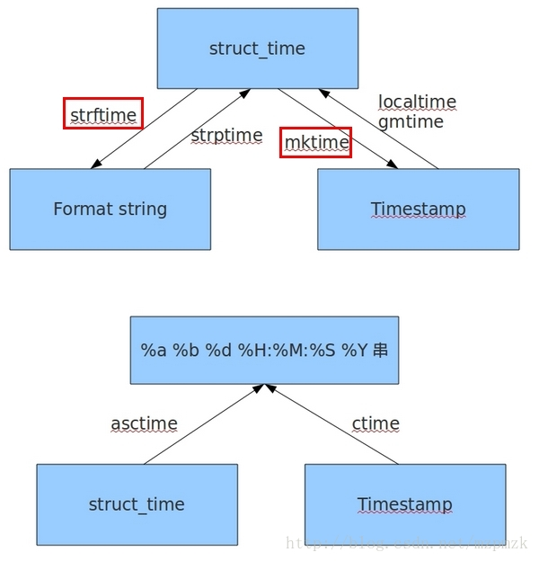

本文主要针对python中的时间对象进行介绍。

### 时间表现形式

- timestamp：时间戳，时间戳表示的是从1970年1月1日00:00:00开始按秒计算的偏移量
- struct_time： 时间元组，共有九个元素组
- format time： 格式化时间，已格式化的结构使时间更具可读性。包括自定义格式和固定格式

### 时间格式转换图



### 常用方法

1. 获取当前时间戳

   ```python
   In [26]: time.time()
   Out[26]: 1556888776.3707364

   In [25]: time.mktime(time.localtime()) # 元组->时间戳
   Out[25]: 1556888742.0
   ```
2. 当前时间的 struct_time 形式

   ```python
   In [1]: import time                                                                                      

   In [2]: time.localtime()                 
   Out[2]: time.struct_time(tm_year=2019, tm_mon=5, tm_mday=3, tm_hour=20, tm_min=48, tm_sec=32, tm_wday=4, tm_yday=123, tm_isdst=0) 

   In [29]: time.localtime(time.time()) # 时间戳->元组     
   Out[29]: time.struct_time(tm_year=2019, tm_mon=5, tm_mday=3, tm_hour=21, tm_min=12, tm_sec=6, tm_wday=4, tm_yday=123, tm_isdst=0)  

   In [22]: time.gmtime()     
   Out[22]: time.struct_time(tm_year=2019, tm_mon=5, tm_mday=3, tm_hour=13, tm_min=3, tm_sec=21, tm_wday=4, tm_yday=123, tm_isdst=0)   

   In [30]: time.gmtime(time.time()) # 时间戳->元组     
   Out[30]: time.struct_time(tm_year=2019, tm_mon=5, tm_mday=3, tm_hour=13, tm_min=12, tm_sec=21, tm_wday=4, tm_yday=123, tm_isdst=0)

   In [34]: time.strptime(a, "%a %b %d %H:%M:%S %Y") # 字符串->元组
   Out[34]: time.struct_time(tm_year=2019, tm_mon=5, tm_mday=3, tm_hour=21, tm_min=9, tm_sec=25, tm_wday=4, tm_yday=123, tm_isdst=-1)
   ```
3. 当前时间的字符串形式

   ```python
   In [3]: time.ctime()
   Out[3]: 'Fri May  3 20:49:30 2019'

   In [27]: time.ctime(time.time()) # 时间戳->字符串
   Out[27]: 'Fri May  3 21:08:20 2019'

   In [4]: time.asctime()
   Out[4]: 'Fri May  3 20:49:45 2019'

   In [28]: time.asctime(time.localtime()) # 元组->默认字符串
   Out[28]: 'Fri May  3 21:09:25 2019'

   In [7]: time.strftime('%Y-%m-%d %H:%M"%S', time.localtime()) # 元组->格式化字符串
   Out[7]: '2019-05-03 20:52"47'

   In [31]: time.strftime("%a %b %d %H:%M:%S %Y", time.localtime())
   Out[31]: 'Fri May 03 21:15:50 2019'
   ```

### 耗时统计

- `time.perf_counter()`

  调用一次 `perf_counter()`，从计算机系统里随机选一个时间点A，计算其距离当前时间点B1有多少秒

  当第二次调用该函数时，默认从第一次调用的时间点A算起，距离当前时间点B2有多少秒

  两个函数取差，即实现从时间点B1到B2的计时功能
- `time.process_time()`

  返回当前进程执行 CPU 的时间总和，不包含睡眠时间。由于返回值的基准点是未定义的，只有连续调用的结果之间的差才是有效的
- `time.time()`

  连续两次生成的时间戳之差即为耗时

  ```python
  import time

  def test():
      time.sleep(2)

  start1 = time.perf_counter()
  start2 = time.time()
  start3 = time.process_time()
  test()
  finish1 = time.perf_counter()
  finish2 = time.time()
  finish3 = time.process_time()
  t1 = finish1 - start1
  t2 = finish2 - start2
  t3 = finish3 - start3

  print(t1)
  print(t2)
  print(t3)
  ```
  结果为：

  ```shell
  1.9998265000000002 # perf_counter
  2.000767946243286  # time
  0.0                # process_time
  ```
