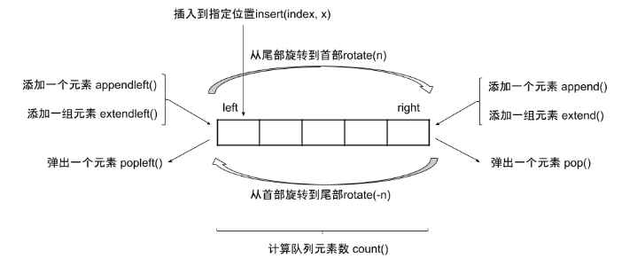

Python 3有许多内置的数据结构，包括元组、字典和列表。数据结构为我们提供了一种组织和存储数据的方法。collections模块能够帮助我们高效地填充和操作数据结构。

在本教程中，我们将通过collections模块中的三个类来帮助你处理元组、字典和列表。我们将使用namedtuples来创建带有命名字段的元组，使用defaultdict来在字典中精确地分组信息，以及使用deque来高效地向一个类列表对象的每一边添加元素。

## namedtuple

namedtuple允许为元组的每一个元素指定一个名称；同样在访问元组元素时，既可以通过下标访问，也可以通过指定的名称访问。

```python
In [1]: from collections import namedtuple

In [2]: Stu = namedtuple('Stu',['id','name','age','gender'])  # 创建一个类，为每个元素指定名称

In [3]: Stu._make([1, "Lucy", 21, "male"])  # 通过list创建对象
Out[3]: Stu(id=1, name='Lucy', age=21, gender='male')

In [4]: Stu._fields # 查看类的所有字段
Out[4]: ('id', 'name', 'age', 'gender')

In [5]: stu2 = Stu(2, "李雷", 23, "男")  # 指定字段和值创建对象

In [6]: stu2.name
Out[6]: '李雷'

In [7]: stu2[1]
Out[7]: '李雷'

In [8]: stu2._asdict()
Out[8]: OrderedDict([('id', 2), ('name', '李雷'), ('age', 23), ('gender', '男')])

In [9]: stu2._replace(age=22)
Out[9]: Stu(id=2, name='李雷', age=22, gender='男')
```

## defaultdict

defaultdicti可以快速将信息集合到字典中，且键不存在时，不会抛出KeyError,而是按照指定的类型设置默认值。

```python
In [1]: from collections import defaultdict

In [2]: stus = [
   ...:     (1, "李雷", 23, "男"),
   ...:     (2, "韩梅梅", 20, "女"),
   ...:     (3, "Luly", 22, "男")
   ...: ]

In [3]: gender_group=defaultdict(list) # 创建一个字典，键不存在时，会给键指定一个空列表作为默认值
    
In [4]: for *_, gender in stus:
   ...:     gender_group[gender].append(_) # 将值存到键对应的列表中
   ...:

In [5]: gender_group
Out[65
defaultdict(list, {'男': [[1, '李雷', 23], [3, 'Luly', 22]], '女': [[2, '韩梅梅', 20]]})
```

```python
In [1]: from collections import defaultdict

In [2]: string = "asdcxwsssaxqsdxsdaqazx"

In [3]: char_count=defaultdict(int) # 创建一个字典，键不存在时，会给键指定作为默认值

In [4]: for char in string:
    ...:     char_count[char] += 1 # 对元素的个数累加1
    ...:

In [5]: char_count
Out[5]:
defaultdict(int, {'a': 4, 's': 6, 'd': 3, 'c': 1, 'x': 4, 'w': 1, 'q': 2, 'z': 1})

```

## deque

deque是在python内置的快速构建双端队列的工具类。所谓的双端队列即是可以在两端添加、删除元素的队列，此时的时间复杂度皆为$O(1)$。

​​

deque 支持 in 操作符

```python
In [1]: from collections import deque

In [2]: q = deque([1, 2, 3, 4])

In [3]: 5 in q
Out[3]: False

In [4]: 4 in q
Out[4]: True
```

还可以顺逆时针旋转

```python
# 顺时针
In [5]: q.rotate()

In [6]: q
Out[6]: deque([4, 1, 2, 3])

In [7]: q.rotate()

In [8]: q
Out[8]: deque([3, 4, 1, 2])

# 逆时针
In [9]: q.rotate(-1)

In [10]: q
Out[10]: deque([4, 1, 2, 3])

In [11]: q.rotate(-1)

In [12]: q
Out[12]: deque([1, 2, 3, 4])
```

还可以复制一个新队列：

```python
In [14]: q1 = q.copy()

In [15]: q1
Out[15]: deque([1, 2, 3, 4, 5])

In [16]: q
Out[16]: deque([1, 2, 3, 4, 5])

In [17]: q1 is q
Out[17]: False
```

**值得注意的是 deque 里边的形式是列表形式**

所以 试试 extend 呢？

```python
In [18]: q
Out[18]: deque([1, 2, 3, 4, 5])

In [19]: q.extend('abc')

In [20]: q
Out[20]: deque([1, 2, 3, 4, 5, 'a', 'b', 'c'])

In [21]: q.extendleft('cba')

In [22]: q
Out[22]: deque(['a', 'b', 'c', 1, 2, 3, 4, 5, 'a', 'b', 'c'])
```

还有 index：查找索引位置

```python
In [22]: q
Out[22]: deque(['a', 'b', 'c', 1, 2, 3, 4, 5, 'a', 'b', 'c'])

In [23]: q.index('a', 0, -1)  # 指定查找的区间
Out[23]: 0

In [24]: q.index('a', 2, 5)
---------------------------------------------------------------------------
ValueError                                Traceback (most recent call last)
<ipython-input-24-4e56f0b273a5> in <module>
----> 1 q.index('a', 2, 5)

ValueError: 'a' is not in deque

In [25]: q.index('a')
Out[25]: 0    
```

其他的一些基本操作 还有

```python
In [26]: q.clear()  # 清空队列元素

In [27]: q
Out[27]: deque([])
    
In [28]: q.append('a')  # 队尾追加元素, O(1)

In [29]: q.append('b')

In [30]: q
Out[30]: deque(['a', 'b'])

In [31]: q.appendleft('a')  # 队头添加元素, O(1)

In [32]: q.appendleft('b')

In [33]: q
Out[33]: deque(['b', 'a', 'a', 'b'])    

In [34]: q.pop()  # 队尾删除元素, O(1)
Out[34]: 'b'

In [35]: q
Out[35]: deque(['b', 'a', 'a'])

In [36]: q.popleft()  # 队头删除元素, O(1)
Out[36]: 'b'

In [37]: q
Out[37]: deque(['a', 'a'])  
    
In [38]: q.insert(0, 'c')  # 在指定位置插入元素

In [39]: q
Out[39]: deque(['c', 'a', 'a'])

In [40]: q.remove('a')  # 从队头开始，移除第一个对应值的元素,不存在，抛出异常

In [41]: q
Out[41]: deque(['c', 'a'])

In [42]: q.extend('ba')

In [43]: q
Out[43]: deque(['c', 'a', 'b', 'a'])

In [44]: q.remove('a')

In [45]: q
Out[45]: deque(['c', 'b', 'a'])

In [46]: q.reverse()  # 将队列元素位置翻转

In [47]: q
Out[47]: deque(['a', 'b', 'c'])    
```

接下来我们做一道面试题：

请定义一个队列并实现函数 `max_value` 得到队列里的最大值，要求函数`max_value`、`push_back` 和 `pop_front` 的**均摊**时间复杂度都是O(1)。

若队列为空，`pop_front` 和 `max_value` 需要返回 -1

**示例 1：**

```
输入: 
["MaxQueue","push_back","push_back","max_value","pop_front","max_value"]
[[],[1],[2],[],[],[]]
输出: [null,null,null,2,1,2]
```

**示例 2：**

```
输入: 
["MaxQueue","pop_front","max_value"]
[[],[],[]]
输出: [null,-1,-1]
```

**限制：**

- `1 <= push_back,pop_front,max_value的总操作数 <= 10000`
- `1 <= value <= 10^5`

```python
import queue


class MaxQueue:

    def __init__(self):
        self.deque = queue.deque()
        self.queue = queue.Queue()

    def max_value(self) -> int:
        return self.deque[0] if self.deque else -1


    def push_back(self, value: int) -> None:
        while self.deque and self.deque[-1] < value:
            self.deque.pop()
        self.deque.append(value)
        self.queue.put(value)

    def pop_front(self) -> int:
        if not self.deque:
            return -1
        ans = self.queue.get()
        if ans == self.deque[0]:
            self.deque.popleft()
        return ans
```
