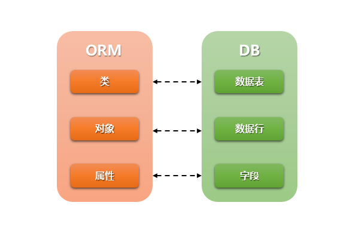

**​`ORM`​** 全拼`Object-Relation Mapping`，中文意为 **​`对象-关系映射`​**。在`MVC`/`MVT`设计模式中的`Model`模块中都包括`ORM`。

## ORM介绍

### ORM 优势

（1）只需要面向对象编程, 不需要面向数据库编写代码.

- 对数据库的操作都转化成对类属性和方法的操作.
- 不用编写各种数据库的 sql 语句.

（2）实现了数据模型与数据库的解耦, 屏蔽了不同数据库操作上的差异.

- 不在关注用的是`mysql`、`oracle`... 等.
- 通过简单的配置就可以轻松更换数据库, 而不需要修改代码.

### ORM 劣势

- 相比较直接使用 SQL 语句操作数据库, 有性能损失.
- 根据对象的操作转换成 SQL 语句, 根据查询的结果转化成对象, 在映射过程中有性能损失.

### ORM 和数据库关系：

在 Django 中 model 是你数据的单一、明确的信息来源。它包含了你存储的数据的重要字段和行为。通常，一个模型（model）映射到一个数据库表.

基本情况：

每个模型都是一个 Python 类，它是 django.db.models.Model 的子类。

模型的每个属性都代表一个数据库字段。

综上所述，Django 为您提供了一个自动生成的数据库访问 API。

​​

## Django配置使用mysql数据库

### `settings.py`配置`DATABASES`

默认:`{}`(空字典)

一个字典，包含Django使用的所有数据库的设置。它是一个嵌套的字典，其内容将数据库别名映射到包含单个数据库选项的字典。

数据库设置必须配置一个默认数据库;还可以指定任意数量的其他数据库。

最简单的设置文件是针对使用SQLite的单数据库设置的。这可以配置使用以下:

```python
DATABASES = {
    'default': {
        'ENGINE': 'django.db.backends.sqlite3',
        'NAME': os.path.join(BASE_DIR, 'db.sqlite3'),
    }
}
```

当连接到其他数据库后端(如`MySQL`、`Oracle`或`PostgreSQL`)时，需要额外的连接参数。有关如何指定其他数据库类型，请参阅下面的引擎设置。这个例子是为`MySQL`:

```python
DATABASES = {
    'default': {
        'ENGINE': 'django.db.backends.mysql',
        'NAME': 'django_test',
        'USER': 'root',
        'PASSWORD': 'mysqlroot',
        'HOST': '127.0.0.1',
        'PORT': 3306
    }
}
```

### `MySQL`连接工具

1. 需要安装`pymysql`模块

   ```bash
   pip install pymysql
   ```
2. 在项目的`__init__.py`初始化文件,添加如下信息:

   ```python
   import pymysql
   pymysql.install_as_MySQLdb()
   ```
3. 在django最新版本中，提示"Django需要mysqlclient 1.3.13或更高版本"。要么在报错时，将抛出版本异常的代码注释掉,仍然使用`pymysql`；要么直接使用`mysqlclient`,不建议直接`pip`命令安装，可以使用`conda`创建虚拟环境，使用`conda`安装`mysqlclient`。

## 字段属性和选项

### 模型类属性命名限制

- 不能是python的保留关键字。
- **不允许使用连续的下划线，这是由django的查询方式决定的。**
- 定义属性时需要指定字段类型，通过字段类型的参数指定选项，语法如下：

  ```python
    属性名=models.字段类型(选项)
  ```

### 字段类型

#### 整数

##### `AutoField`

根据可用id自动递增的一个32位(`4 byte`)的整数(`Integer`)字段,它的适用范围为:`1`到`2147483647`之间。

你通常不需要直接使用它;如果不进行其他指定，主键字段将自动添加到模型中。

默认情况下， Django 会给每一个模型添加下面的字段：

```python
id = models.AutoField(primary_key=True)
```

这是一个自增的主键。

如果你想自己指定主键， 在你想要设置为主键的字段上设置参数 `primary_key=True`。如果 Django 看到你显式地设置了 `Field.primary_key`，将不会自动在表（模型）中添加 `id` 列。

每个模型都需要拥有一个设置了 `primary_key=True` 的字段（无论是显式的设置还是 Django 自动设置）

##### `BigAutoField`

一个64位(`8 byte`)的整数，类似于`AutoField`，除了它的适用范围为:`1`到`9223372036854775807`之间。

##### `IntegerField`

一个32位(`4 byte`)的整数。在Django支持的所有数据库中，`-2147483648`到`2147483647`之间的值都是安全的。

##### `BigIntegerField`

一个64位(`8 byte`)的整数，类似于`IntegerField`，除了它保证适合从`-9223372036854775808`到`9223372036854775807`的数字。

##### `SmallIntegerField`

一个8位(`2 byte`)的整数，类似于`IntegerField`,在Django支持的所有数据库中，`-32768`到`32767`之间的值都是安全的。

##### `PositiveIntegerField`

一个32位(`4 byte`)的整数，类似于`IntegerField`，但必须是正数或零(0)。在Django支持的所有数据库中，`0`到`2147483647`之间的值都是安全的。由于向后兼容的原因，接受值`0`。

##### `PositiveSmallIntegerField`

一个8位(`2 byte`)的整数，类似于`PositiveIntegerField`，在Django支持的所有数据库中，`0`到`32767`之间的值都是安全的

#### 小数

##### `FloatField`

在Python中由 `float` 实例表示的浮点数。

##### `DecimalField`

一种固定精度的十进制数，在Python中用` Decimal`实例表示。它使用`DecimalValidator`验证输入。

有两个必要的参数:

###### `DecimalField.max_digits`

数字中允许的最大位数。注意，这个数字必须大于或等于`decimal_places`。

###### `DecimalField.decimal_places`

要与该数字一起存储的小数位数。

例如，要存储分辨率为两位小数的999以内的数字，需要使用

```python
models.DecimalField(..., max_digits=5, decimal_places=2)
```

> `FloatField` **vs.**  `DecimalField`
>
> `FloatField`类有时会与`DecimalField`类混在一起。虽然它们都表示实数，但它们表示的是不同的数。`FloatField`在内部使用Python的`float`类型，而`DecimalField`使用Python的`Decimal`类型。有关两者之间差异的信息，请参阅Python的 [`decimal`](https://docs.python.org/3/library/decimal.html#module-decimal) 模块文档。

#### 布尔

##### `BooleanField`

一个`true`/`false`字段。

当`Field.default`未定义时，`BooleanField`的默认值为`None`

> Django 2.1:
> 在旧版本中，这个字段不允许`null=True`，因此必须使用`NullBooleanField`。现在不建议使用后者，因为在Django的未来版本中可能会弃用它。
>
> 在较早的版本中，该字段隐式地具有`blank=True`。您可以通过设置blank=True来恢复前面的行为。

##### `NullBooleanField`

类似`BooleanField`的`null=True`。使用`BooleanField`这个字段而不是`NullBooleanField`这个字段，因为在Django的未来版本中`NullBooleanField`可能会被弃用

#### 字符

##### `CharField`

字符串字段，用于小型到大型字符串。`CharField`有一个额外的必要参数:

###### `CharField.max_length`

字段的最大长度(以字符为单位)。`max_length`在数据库标准和Django的验证中使用`MaxLengthValidator`执行。

对于大量文本，使用`TextField`。

##### `TextField`

一个大的文本字段。这个字段的默认表单小部件是一个`Textarea`。

如果指定max_length属性，它将反映在自动生成表单字段的`Textarea`小部件中。然而，它并没有在模型或数据库级别强制执行。

##### `URLField`

一个有关`URL`的`CharField`，由`URLValidator`验证该值是否为有效的`URL`地址。

与所有`CharField`子类一样，`URLField`接受可选的`max_length`参数。如果不指定`max_length`，则使用默认值200。

##### `EmailField`

一个有关`Email`的`CharField`,由`EmailValidator`验证该值是否为有效的电子邮件地址。

与所有`CharField`子类一样，`EmailField`接受可选的`max_length`参数。如果不指定`max_length`，则使用默认值254。

##### `UUIDField`

用于存储通用唯一标识符的字段。使用Python的`UUID`类。当在`PostgreSQL`上使用时，它以`uuid`数据类型存储，否则以`char(32)`存储。

全局惟一标识符是`primary_key`的`AutoField`的一个很好的替代方案。数据库不会为你生成**UUID**，建议使用默认:

```python
import uuid
from django.db import models

class MyUUIDModel(models.Model):
    id = models.UUIDField(primary_key=True, default=uuid.uuid4, editable=False)
    # other fields
```

> 注意，一个回调函数(省略括号)被传递到`default`，而不是**UUID**的一个实例。

#### 文件

##### `FileField`

一个文件上传字段。有两个可选参数:

###### `FileField.upload_to`

这个属性提供了一种设置上传目录和文件名的方法，可以通过两种方式进行设置。在这两种情况下，值都被传递到`Storage.save()`方法。

如果您指定一个字符串值，它可能包含`strftime()`格式，它将被文件上传的日期/时间所取代(这样上传的文件就不会填满给定的目录)。例如:

```python
class MyModel(models.Model):
    # 文件将被上传至 MEDIA_ROOT/uploads
    upload = models.FileField(upload_to='uploads/')
    # or...
    # 文件将被上传至 MEDIA_ROOT/uploads/2015/01/30
    upload = models.FileField(upload_to='uploads/%Y/%m/%d/')
```

如果使用默认的`FileSystemStorage`，字符串值将追加到`MEDIA_ROOT`路径，以形成本地文件系统上的位置，上传的文件将存储在此位置。如果使用不同的存储，请检查该存储的文档，以了解它如何处理`upload_to`。

`upload_to`也可以是一个可调用的函数。这个函数将被调用以获得上传路径，包括文件名。这个可调用函数必须接受两个参数，并返回一个`unix`风格的路径(带有斜杠)，以便传递给存储系统。这两个参数是:

|参数|描述|
| ----| -------------------------------------------------------------------------------------------------------------------------------------------------------------------------|
|`instance`|定义FileField的模型的一个实例。更具体地说，这是附加当前文件的特定实例。<br />在大多数情况下，这个对象还没有保存到数据库中，所以如果它使用默认的`AutoField`，那么它的主键字段可能还没有值。|
|`filename`|原给定给该文件的文件名。在确定最终目的地路径时，可能会考虑这一点，也可能不考虑这一点。|

例子:

```python
def user_directory_path(instance, filename):
    # file will be uploaded to MEDIA_ROOT/user_<id>/<filename>
    return 'user_{0}/{1}'.format(instance.user.id, filename)

class MyModel(models.Model):
    upload = models.FileField(upload_to=user_directory_path)
```

###### `FileField.storage`

一个存储对象，它处理文件的存储和检索。有关如何提供此对象的详细信息，请参见 [管理文件](https://docs.djangoproject.com/en/2.2/topics/files/) 。

在模型中使用`FileField`或`ImageField`需要几个步骤:

1. 在设置文件中，需要将`MEDIA_ROOT`定义为一个目录的完整路径，您希望`Django`在这个目录中存储上传的文件。(为了提高性能，这些文件不存储在数据库中。)将`MEDIA_URL`定义为该目录的基本公共`URL`。确保此目录可由`Web`服务器的用户帐户写入。
2. 将`FileField`或`ImageField`添加到模型中，定义`upload_to`选项，以指定`MEDIA_ROOT`的子目录，用于上传文件。
3. 所有将存储在数据库中的内容都是文件的路径(相对于`MEDIA_ROOT`)。您很可能希望使用Django提供的便利url属性。例如，如果 `ImageField`被称为 `mug_shot` ，可以获取模板中图像的绝对路径 `{{ object.mug_shot.url }}`

例如，假设`MEDIA_ROOT`设置为`'/home/media'`， `upload_to`设置为`'photos/%Y/%m/%d'`。`upload_to`的`'%Y/%m/%d'`部分是`strftime()`格式;`'%Y'`是四位数的年份，`'%m'是`两位数的月份，`'%d'`是两位数的日期。如果你在2007年1月15日上传了一个文件，它将被保存在`/home/media/photos/2007/01/15`目录下。

如果要检索上传文件的磁盘上文件名或文件大小，可以分别使用[`名称`](https://docs.djangoproject.com/en/2.2/ref/files/file/#django.core.files.File.name) 和[`大小`](https://docs.djangoproject.com/en/2.2/ref/files/file/#django.core.files.File.size) 属性;有关可用属性和方法的更多信息，请参见 [`文件`](https://docs.djangoproject.com/en/2.2/ref/files/file/#django.core.files.File)类引用和 [管理文件](https://docs.djangoproject.com/en/2.2/topics/files/)主题指南。

> 文件作为模型保存在数据库中的一部分保存，因此在保存模型之前，不能依赖于磁盘上使用的实际文件名。

请注意，无论何时处理上传的文件，都应该密切注意上传文件的位置和文件类型，以避免安全漏洞。验证所有上传的文件，以确保这些文件是您所认为的。例如，如果您盲目地让某人在未经验证的情况下将文件上传到Web服务器的文档根目录中，那么某人就可以上传一个**CGI**或**PHP**脚本，并通过访问该脚本在您的站点上的**URL**来执行该脚本。不要允许这样的操作。

还要注意，即使是上传的**HTML**文件，由于它可以由浏览器执行(但不能由服务器执行)，也会造成相当于**XSS**或请注意，无论何时处理上传的文件，都应该密切注意上传文件的位置和文件类型，以避免安全漏洞。验证所有上传的文件，以确保这些文件是您所认为的。例如，如果您盲目地让某人在未经验证的情况下将文件上传到Web服务器的文档根目录中，那么某人就可以上传到**CGI**或**PHP**脚本，并通过访问该脚本在您的站点上的URL来执行该脚本。不要允许这样的操作。

还要注意，即使是上传的HTML文件，由于它可以由浏览器执行(但不能由服务器执行)，也会造成相当于**XSS**或**CSRF**攻击的安全威胁。攻击的安全威胁。

> `FileField`实例在数据库中创建为`varchar`列，默认最大长度为100个字符。与其他字段一样，可以使用`max_length`参数更改最大长度。

##### `ImageField`

从`FileField`继承所有属性和方法，但也验证上传的对象是有效的图像。

除了可用于`FileField`的特殊属性之外，`ImageField`还具有高度和宽度属性。

为了方便查询这些属性，`ImageField`有两个额外的可选参数:

###### `ImageField.height_field`

一个模型字段的名称，该字段将在每次保存模型实例时自动填充映像的高度。

###### `ImageField.width_field`

一个模型字段的名称，该字段将在每次保存模型实例时自动填充图像的宽度。

需要 [Pillow](https://pillow.readthedocs.io/en/latest/) 库。

> `ImageField`实例在数据库中创建为`varchar`列，默认最大长度为100个字符。与其他字段一样，可以使用`max_length`参数更改最大长度。

##### `FilePathField`

一个`CharField`，它的选择仅限于文件系统上某个目录中的文件名。有三个特殊的参数，其中第一个是必需的:

###### `FilePathField.path`

必需的。这个`FilePathField`应该从中获得其选择的目录的绝对文件系统路径。例如:`"/ home /images"`。

###### `FilePathField.match`

可选的。一个正则表达式，作为一个字符串，`FilePathField`将使用它来过滤文件名。注意，正则表达式将应用于基本文件名，而不是完整路径。示例:**​`foo.*\.txt$`​** 。它将匹配一个名为`foo23.txt`的文件，但不匹配`bar.txt`或`foo23.png`。

###### `FilePathField.recursive`

可选的。非真即假。默认是假的。指定是否应该包括`path`的所有子目录

###### `FilePathField.allow_files`

可选的。非真即假。默认是正确的。指定是否应包括位于指定位置的文件。这个或`allow_folders`必须为真。

###### `FilePathField.allow_folders`

可选的。非真即假。默认是假的。指定是否应包括指定位置的文件夹。这个或allow_files必须为真。

当然，这些参数可以一起使用。

一个潜在的问题是，match应用于基本文件名，而不是完整路径。所以,这个例子:

```python
FilePathField(path="/home/images", match="foo.*", recursive=True)
```

将匹配`/home/images/foo.png`，但不匹配`/home/images/foo/bar.png`，因为匹配应用于基本文件名(`foo.png`和`bar.png`)。

> `FilePathField`实例在数据库中创建为`varchar`列，默认最大长度为100个字符。与其他字段一样，可以使用`max_length`参数更改最大长度。

##### `BinaryField`

存储原始二进制数据的字段。可以为它分配字节、字节数组或内存视图。

默认情况下，`BinaryField`将`editable`设置为`False`，在这种情况下，它不能包含在ModelForm中。

`BinaryField`有一个额外的可选参数:

###### `BinaryField.max_length`

字段的最大长度(以字符为单位)。最大长度在Django的验证中使用MaxLengthValidator实现。

> Django 2.1:
> 旧版本不允许将editable设置为True。

#### 时间

##### `DateField`

日期，在Python中用`datetime.date`实例表示。有一些额外的，可选的参数:

###### `DateField.auto_now`

每次保存对象时自动将字段值设置为当前时间，用于“最后修改”时间戳。

该字段只在调用`Model.save()`时自动更新。当以其他方式(如`QuerySet.update()`)更新其他字段时，该字段不会更新，不过可以在这样的更新中为该字段指定自定义值。

###### `DateField.auto_now_add`

在第一次创建对象时自动将字段设置为当前时间。用于创建时间戳。

即使在创建对象时为这个字段设置了值，它也会被忽略。如果您希望能够修改该字段，请将`auto_now_add=True`设置为以下内容:

- For `DateField`: `default=date.today` - from `datetime.date.today()`
- For `DateTimeField`: `default=timezone.now` - from `django.utils.timezone.now()`

`auto_now_add`、`auto_now`和`default`选项是互斥的。这些选项的任何组合都将导致错误。

##### `DateTimeField`

日期和时间，在Python中用`datetime.datetime`实例表示。接受与`DateField`相同的额外参数。

##### `TimeField`

时间，在Python中用`datetime.time`实例表示。接受与`DateField`相同的额外参数。

### 字段选项

> 以下参数对所有字段类型均有效，且是可选的。

#### `null`

如果设置为 `True`， 当该字段为空时，Django 会将数据库中该字段设置为 `NULL`，默认为 `False`。

避免在基于字符串的字段（例如 `CharField`和 `TextField`）上使用 `null`。如果字符串字段的 `null=True`，那意味着对于“无数据”有两个可能的值：`NULL` 和空字符串。在大多数情况下，对于“无数据”声明两个值是赘余的，Django 的惯例是使用空字符串而不是 `NULL`。 一个例外是当 `CharField`同时具有 `unique=True` 和 `blank=True` 时。 在这种情况下，需要设置 `null=True`，以便在使用空白值保存多个对象时避免唯一的约束违规。

对于基于字符串和非基于字符串的字段，如果希望在表单中允许空值，还需要设置`blank=True`，因为`null`参数只影响数据库存储(参见`blank`)。

#### `blank`

如果设置为 `True` ，该字段允许为空。默认为 `False` 。

注意，这与`null`不同。`null`纯粹是与数据库相关的，而`blank`则是与验证相关的。如果字段为`blank=True`，表单验证将允许输入空值。

> blank和null的用法区别

- null纯粹是与数据库相关的，而blank则是与表单验证相关的。
- 避免在基于字符串的字段（例如 `CharField`和 `TextField`）上使用 `null`。如果字符串字段的 `null=True`，那意味着对于“无数据”有两个可能的值：`NULL` 和`空字符串`。在大多数情况下，对于“无数据”声明两个值是赘余的，Django 的惯例是使用空字符串而不是 `NULL`。 一个例外是当 `CharField`同时具有 `unique=True` 和 `blank=True` 时。 在这种情况下，需要设置 `null=True`，以便在使用空白值保存多个对象时避免唯一的约束违规。
- 当存在两个参数时，总共会有四种设定组合

  - `blank=True`、`null=True`。统一的表明了该字段（列）是可以为空的。
  - `blank=False`、`null=False`。统一的表面了该字段（列）不可以为空。
  - `blank=True`、`null=False`。这个设定的意义在于，某些字段并不希望用户在表单中创建，而是通过在`save`方法中根据其他字段生成。
  - `blank=False`、`null=True`。这个设定不允许表单中该字段为空，但是允许在更新时或者通过shell等非表单方式插入数据该字段为空。

> 只设定了`blank=True`而没有设定`null=True`的时候，通过`Admin`站点表单创建模型实例并且表单在该字段上没有值时数据库不报错呢？？？

- 当没有设定`null=True`时，该列在数据库中就存在`NOT NULL`的约束，如果插入数据时这一列没有值，按理说数据库应该会报错才对
- 出现这种情况的原因在于，`django`在处理某些在数据库中实际的存储值为字符串的`Field`时（如`CharField`, `TextField`, `ImageField`（图片文件的路径）），永远不会向数据库中填入空值。如果表单中某个`CharField`或者`TextField`字段为空，那么`django`会在数据库中填入`""`，而不是`null`.

#### `choices`

一个序列，它由两个元素(例如[(A, B)， (A, B)…])的迭代组成，作为这个字段的选择。如果提供了选择，则通过模型验证强制执行，默认的表单小部件将是一个包含这些选择的选择框，而不是标准的文本字段。

每个元组中的第一个元素是要在模型上设置的实际值，第二个元素是人类可读的名称。例如:

```python
YEAR_IN_SCHOOL_CHOICES = [
    ('FR', 'Freshman'),
    ('SO', 'Sophomore'),
    ('JR', 'Junior'),
    ('SR', 'Senior'),
]
```

通常，最好在模型类中定义选项，并为每个值定义一个适当命名的常量:

```python
from django.db import models

class Student(models.Model):
    FRESHMAN = 'FR'
    SOPHOMORE = 'SO'
    JUNIOR = 'JR'
    SENIOR = 'SR'
    YEAR_IN_SCHOOL_CHOICES = [
        (FRESHMAN, 'Freshman'),
        (SOPHOMORE, 'Sophomore'),
        (JUNIOR, 'Junior'),
        (SENIOR, 'Senior'),
    ]
    year_in_school = models.CharField(
        max_length=2,
        choices=YEAR_IN_SCHOOL_CHOICES,
        default=FRESHMAN,
    )

    def is_upperclass(self):
        return self.year_in_school in (self.JUNIOR, self.SENIOR)
```

虽然您可以在模型类的外部定义一个选择列表，然后引用它，但是在模型类内部定义每个选择的选择和名称，可以将所有信息与使用它的类一起保存，并使选择易于引用(例如：**Student.SOPHOMORE** 可以在导入**Student**模型类的任何地方使用)。

您还可以将可用的选项收集到指定的组中，这些组可用于组织目的:

```python
from django.db import models


class Media(models.Model):
    MEDIA_CHOICES = [
        ('Audio', (
            ('vinyl', 'Vinyl'),
            ('cd', 'CD'),
        )
         ),
        ('Video', (
            ('vhs', 'VHS Tape'),
            ('dvd', 'DVD'),
        )
         ),
        ('unknown', 'Unknown'),
    ]

    media = models.CharField(
        max_length=10,
        choices=MEDIA_CHOICES,
        default='cd'
    )
```

每个元组中的第一个元素是应用于组的名称。第二个元素是二元组的迭代，每个二元组包含一个值和一个可读的选项名。分组选项可以与单个列表中的未分组选项组合在一起(例如本例中的未知选项)。

注意，选择可以是任何序列对象--不一定是列表或元组。这允许您动态地构造选择。但是，如果您发现自己的选择是动态的，那么最好使用一个带有 `ForeignKey`的数据库表。但是静态数据不会有太大的变化。

对于每个设置了选项的字段，对象都有一个`get_FOO_display()`方法，其中`FOO`是字段的名称。该方法返回字段的"人易读"值。

例子:

```python
from django.db import models

class Person(models.Model):
    SHIRT_SIZES = (
        ('S', 'Small'),
        ('M', 'Medium'),
        ('L', 'Large'),
    )
    name = models.CharField(max_length=60)
    shirt_size = models.CharField(max_length=2, choices=SHIRT_SIZES)
```

```bash
>>> p = Person(name="Fred Flintstone", shirt_size="L")
>>> p.save()
>>> p.shirt_size
'L'
>>> p.get_shirt_size_display()
'Large'
```

#### `db_column`

要用于此字段的数据库列的名称。如果没有给出，Django将使用字段的名称。

#### `db_index`

如果为真，将为此字段创建一个数据库索引。

#### `default`

该字段的默认值。可以是一个值或者是个可调用的对象，如果是个可调用对象，每次实例化模型时都会调用该对象。

默认值不能是一个可变的对象(模型实例、列表、集合等)，因为对该对象的同一个实例的引用将被用作所有模型实例的默认值。反而，可以在回调函数中打包处理所需的默认值。例如，如果要为`JSONField`指定默认`dict`，可以使用一个函数:

```python
def contact_default():
    return {"email": "to1@example.com"}

contact_info = JSONField("ContactInfo", default=contact_default)
```

**lambda**表达式不能用于像**default**这样的字段选项，因为它们不能被迁移序列化。

对于像映射模型实例的`ForeignKey`这样的字段，默认值应该是它们引用的字段的值(`pk`，除非设置`to_field`)，而不是模型实例。

当创建新的模型实例并且没有为字段提供值时，将使用默认值。当字段是主键时，当字段设置为`None`时也会使用默认值。

#### `help_text`

额外的“帮助”文本，随表单控件一同显示。即便你的字段未用于表单，它对于生成文档也是很有用的。

注意，这个值不会在自动生成的表单中进行`html`转义的。如果您愿意，可以在`help_text`中包含**HTML**。例如:

```python
help_text="Please use the following format: <em>YYYY-MM-DD</em>."
```

或者，您可以使用纯文本和`django.utils.html.escape()`来转义任何**HTML**特殊字符。确保转义任何来自不可信用户的帮助文本，以避免跨站点脚本攻击。

#### `primary_key`

如果设置为 `True` ，将该字段设置为该模型的主键。

如果您没有为模型中的任何字段指定`primary_key=True`, **Django**将自动添加一个`AutoField`来保存主键，所以您不需要在任何字段上设置`primary_key=True`，除非您想覆盖默认的主键行为。

`primary_key=True`意味着`null=False`和`unique=True`。对象上只允许有一个主键。

主键字段是只读的。如果更改现有对象上的主键值并保存它，则将在旧对象旁边创建一个新对象。

#### `unique`

如果设置为 `True`，这个字段必须在整个表中保持值唯一。

这是在数据库级和通过模型验证实现的。如果试图在惟一字段中保存具有重复值的模型，则模型的`save()`方法会产生一个`django.db.IntegrityError`。

这个选项对除了`ManyToManyField`和`OneToOneField`以外的所有字段类型都有效。

注意，当`unique`为真时，不需要指定`db_index`，因为`unique`意味着创建索引。

#### `verbose_name`

字段的可读名称。如果没有给出详细的名称，Django将使用字段的属性名自动创建它，将下划线转换为空格。

除了 `ForeignKey`， `ManyToManyField` 和 `OneToOneField`，任何字段类型都接收一个可选位置的参数 `verbose_name`，如果未指定该参数值， Django 会自动使用字段的属性名作为该参数值，并且把下划线转换为空格。

在该例中：备注名为 `"person's first name"`:

```python
first_name = models.CharField("person's first name", max_length=30)
```

在该例中：备注名为 `"first name"`:

```python
first_name = models.CharField(max_length=30)
```

`ForeignKey`， `ManyToManyField` 和 `OneToOneField`接收的第一个参数为模型的类名，后面可以添加一个 `verbose_name`参数：

```python
poll = models.ForeignKey(
    Poll,
    on_delete=models.CASCADE,
    verbose_name="the related poll",
)
sites = models.ManyToManyField(Site, verbose_name="list of sites")
place = models.OneToOneField(
    Place,
    on_delete=models.CASCADE,
    verbose_name="related place",
)
```

惯例是不将`verbose_name` 的首字母大写，必要时 **Djanog** 会自动把首字母转换为大写。

#### `validators`

要为此字段运行的验证器列表。

##### 编写验证器

`validator`是一个可调用的函数，它接受一个值，如果它不满足某些条件，就会引发`ValidationError`。验证器对于在不同类型的字段之间重用验证逻辑非常有用。

例如，这里有一个验证器，它只允许偶数:

```python
from django.core.exceptions import ValidationError
from django.utils.translation import gettext_lazy as _

def validate_even(value):
    if value % 2 != 0:
        raise ValidationError(
            _('%(value)s is not an even number'),
            params={'value': value},
        )
```

您可以通过字段的`validators`参数将其添加到模型字段:

```python
from django.db import models

class MyModel(models.Model):
    even_field = models.IntegerField(validators=[validate_even])
```

因为值在运行验证器之前就转换成了Python，你甚至可以对表单使用相同的验证器:

```python
from django import forms

class MyForm(forms.Form):
    even_field = forms.IntegerField(validators=[validate_even])
```

对于更复杂或可配置的验证器，您还可以使用带有`__call__()`方法的类。例如， `RegexValidator`这类验证器。如果在`validators` `model`字段选项中使用基于类的验证器,应该添加`deconstruct()`装饰器和 `__eq__()` 方法让它可以被迁移框架序列化。

[`django.core.validators`](https://docs.djangoproject.com/zh-hans/2.2/ref/validators/#built-in-validators)模块包含一组可调用的验证器，用于模型和表单字段，可以在内部使用它们。

### `Meta` 选项

使用内部 `Meta类` 来给模型赋予元数据，就像：

```python
from django.db import models

class Ox(models.Model):
    horn_length = models.IntegerField()

    class Meta:
        ordering = ["horn_length"]
        verbose_name_plural = "oxen"
```

#### `abstract`

抽象基类在你要将公共信息放入很多模型时会很有用。编写你的基类，并在 **Meta** 类中填入 `abstract=True`。该模型将不会创建任何数据表。当其用作其它模型类的基类时，它的字段会自动添加至子类。

一个例子:

```python
from django.db import models

class CommonInfo(models.Model):
    name = models.CharField(max_length=100)
    age = models.PositiveIntegerField()

    class Meta:
        abstract = True

class Student(CommonInfo):
    home_group = models.CharField(max_length=5)
```

`Student` 模型拥有3个字段： `name`， `age` 和 `home_group`。 `CommonInfo` 模型不能用作普通的 Django 模型，因为它是一个抽象基类。它不会生成数据表，也没有管理器，也不能被实例化和保存。

从抽象基类继承来的字段可被其它字段或值重写，或用 `None` 删除。

对很多用户来说，这种继承可能就是你想要的。它提供了一种在 Python 级抽出公共信息的方法，但仍会在子类模型中创建数据表。

#### `app_label`

如果一个模型是在`INSTALLED_APPS`中注册的**APP**外部定义的，它必须声明它属于哪个应用程序:

```python
app_label = 'myapp'
```

#### `db_table`

要用于模型的数据库表的名称:

```python
db_table = 'music_album'
```

为了节省时间，Django自动从模型类和包含它的应用程序的名称派生数据库表的名称。模型的数据库表名是通过将模型的**"app label"**(您在`manage.py startapp`中使用的名称)与模型的类名连接在一起，并在它们之间加一个下划线来构造的。

例如，如果您有一个应用**bookstore**(由 `manage.py startapp bookstore`创建)，定义为**Book**的模型类将有一个名为`bookstore_book`的数据库表。

要覆盖数据库表名，请使用类元中的db_table参数。

> 强烈建议在通过db_table覆盖表名时使用小写的表名，特别是在使用MySQL后端时。

#### `ordering`

对象的默认顺序，用于获取对象列表:

```python
ordering = ['-order_date']
```

这是一个 包含由字符串和/或构成的查询表达式的元组或列表。每个字符串都是一个带有可选`"-"`前缀的字段名，表示按降序排列。没有前缀`"-"`的字段将按升序排列。使用字符串`"?"`随机排序。

例如，要按`pub_date`字段升序排序，可以使用以下命令:

```python
ordering = ['pub_date']
```

要按pub_date降序排列，请使用以下命令:

```python
ordering = ['-pub_date']
```

按pub_date降序排列，然后按author升序排列，使用以下命令:

```python
ordering = ['-pub_date', 'author']
```

您还可以使用查询表达式。要按作者升序排序并使空值排序持续，请使用以下命令:

```python
from django.db.models import F

ordering = [F('author').asc(nulls_last=True)]
```

#### `permissions`

创建此对象时进入权限表的额外权限。为每个模型自动创建添加、更改、删除和视图权限。这个例子指定了一个额外的权限`can_deliver_pizzas`:

```python
permissions = [('can_deliver_pizzas', 'Can deliver pizzas')]
```

这是一个格式为**(permission_code,** **human_readable_permission_name)**的二元列表或元组。

#### `indexes`

要在模型上定义的索引列表:

```python
from django.db import models

class Customer(models.Model):
    first_name = models.CharField(max_length=100)
    last_name = models.CharField(max_length=100)

    class Meta:
        indexes = [
            models.Index(fields=['last_name', 'first_name']),
            models.Index(fields=['first_name'], name='first_name_idx'),
        ]
```

#### `verbose_name`

模型对象的人类可读的单数名称:

```python
verbose_name = "pizza"
```

如果没有给出这个值，Django将使用类名的一个简化版本:`CamelCase`变成`camel case`。

#### `verbose_name_plural`

对象的复数名称:

```python
verbose_name_plural = "stories"
```

如果没有给出，Django将使用 `verbose_name`+ `"s"`

### 关联关系

显然，关系型数据库的强大之处在于各表之间的关联关系。 Django 提供了定义三种最常见的数据库关联关系的方法：多对一，多对多，一对一。

#### ForeignKey(多对一)

定义一个多对一的关联关系，使用 `django.db.models.ForeignKey` 类。就和其它 `Field`字段类型一样，只需要在你模型中添加一个值为该类的属性。

`ForeignKey` 类需要添加一个位置参数，即你想要关联的模型类名。

```python
# 关键字ForeignKey
publish = models.ForeignKey(to='Publish')  # to用来指代跟哪张表有关系 默认关联的就是表的主键字段
# 外键字段名在创建时会自动加上_id后缀
```

##### 字段参数

1. `to`:设置要关联的表
2. `to_field`:设置要关联的表的字段(一般不设置，默认使用主键id关联)
3. `related_name`:反向操作时，使用的字段名，用于代替原反向查询时的`'表名_set'`
4. `related_query_name`:反向查询操作时，使用的连接前缀，用于替换表名
5. `db_constraint`:是否在数据库中创建外键约束，默认为True。
6. `on_delete`:当删除关联表中的数据时，当前表与其关联的行的行为。

   1. `models.CASCADE`:删除关联数据，与之关联的数据也删联(`on_delete=models.CASCADE`)
   2. 抛出异常(错误)

      1. `models.DO_NOTHING`:删除关联数据，引发错误`IntegrityError`
      2. `models.PROTECT`
         删除关联数据，引发错误`ProtectedError `
   3. `models.SET_NULL`:删除关联数据，与之关联的值设置为`null`（前提FK字段需要设置为可空）
   4. `models.SET_DEFAULT`:删除关联数据，与之关联的值设置为默认值（前提FK字段需要设置默认值）
   5. `models.SET`:删除关联数据

      1. 与之关联的值设置为指定值，设置：`models.SET(值)`
      2. 与之关联的值设置为可执行对象的返回值，设置：`models.SET(可执行对象)`

#### OneToOneField(一对一)

> 外键字段创建在任意一张表都可以，建议外键添加在查询频率较高的一方

```python
# 关键字OneToOneField
author_detail = models.OneToOneField(to='Author_detail')  # 外键本质fk + unique
```

##### 字段参数

1. `to` :设置要关联的表。
2. `to_field`:设置要关联的字段。
3. `on_delete`:同ForeignKey字段。

#### ManyToManyField(多对多)

> 用于表示多对多的关联关系。在数据库中通过第三张表来建立关联关系。

```python
# 关键字ManyToManyField
author = models.ManyToManyField(to='Author')  
# django orm会自动帮你创建第三张关系表，表名为两个关联的表名用_连接
```

##### 字段参数

1. `to`:设置要关联的表
2. `related_name`:同`ForeignKey`字段(反向操作时，使用的字段名，用于代替原反向查询时的`'表名_set'`)
3. `related_query_name`:同`ForeignKey`字段(反向查询操作时，使用的连接前缀，用于替换表名)
4. `symmetric`:仅用于多对多自关联时，指定内部是否创建反向操作的字段。默认为`True`。

   ```python
    class Person(models.Model):
        name = models.CharField(max_length=16)
        friends = models.ManyToManyField("self")
        # 此时，person对象就没有person_set属性。

    class Person(models.Model):
        name = models.CharField(max_length=16)
        friends = models.ManyToManyField("self",symmetrical=False)
        # 此时，person对象现在就可以使用person_set属性进行反向查询。
   ```
5. `through`:在使用`ManyToManyField`字段时，`Django`将自动生成一张表        来管理多对多的关联关系。但我们也可以手动创建第三张表来管理多对多关系，此时就需要通过`through`来指定第三张表的表名。
6. `through_fields`:设置关联的字段。
7. `db_table`:默认创建第三张表时，数据库中表的名称。

##### 多对多的三种创建方式

1. 自己建立第三张关系表，外键分别关联两个表

   * 优点:可以扩充第三张关系标的字段
   * 缺点:自己做连表查询
   * 建表例子

     ```python
     class Book(models.Model):
         title = models.CharField(max_length=12)

      class Author(models.Model):
          name = models.CharField(max_length=12)

      # 1. 多对多第一种创建方式：自己创建第三张关系表
      class Author2Book(models.Model):
          id = models.AutoField(primary_key=True)
          author_id = models.ForeignKey(to='Author')
          book_id = models.ForeignKey(to='Book')
          price = models.IntegerField()  # 可以自己扩充需要的字段
     ```
2. 通过ORM内置的ManyToManyField，自动创建第三张关系表

   * 优点:提供了很多连表操作的快捷方法,`all()`, `add()`, `set()`, `clear()`, `remove()`
   * 缺点:无法扩展第三张关系表
   * 建表例子

     ```python
     class Book(models.Model):
         title = models.CharField(max_length=12)

      class Author(models.Model):
          name = models.CharField(max_length=12)
          books = models.ManyToManyField(to='Book')  # 字段就这些，无法扩充其他字段

     ```
3. 自己创建第三张关系表，通过ManyToManyField关联

   * 优点：

     * 既能够使用多对多查询的快捷方法all()(只能用all，不能使用add,set等)
     * 还能够自己扩展第三张关系表的字段
   * 建表例子

     ```python
     class Book(models.Model):
         title = models.CharField(max_length=12)

     class Author(models.Model):
          name = models.CharField(max_length=12)
          # 告诉ManyToManyField通过(through)Author2Book这张表进行关联，不使用ORM自动创建的第三张表，而是使用我自己创建的表
          # through_fields告诉ORM通过哪几个字段进行多对多关联
          books = models.ManyToManyField(to='Book', through='Author2Book', through_fields=('author', 'book'))

      # 1. 多对多第三种创建方式：自己创建第三张关系表，此时外键不需要添加_id了，因为ORM会默认帮你在外键后面加_id
      class Author2Book(models.Model):
          id = models.AutoField(primary_key=True)
          author = models.ForeignKey(to='Author')
          book = models.ForeignKey(to='Book')
          price = models.IntegerField(null=True)

          # author_id和book_id要联合唯一
          class Meta:
              unique_together = (('author', 'book'),)
     ```
   * 操作例子

     ```python
     # 多对多的第三张方式也支持all查询
     author_obj = Author.objects.first()
     # 第一个作者的所有书籍
     ret = author_obj.books.all()

     # 给第一个作者添加一本书
     # author_obj.books.add(4) # 报错
     Author2Book.objects.create(author_id=1, book_id=4)
     ```
