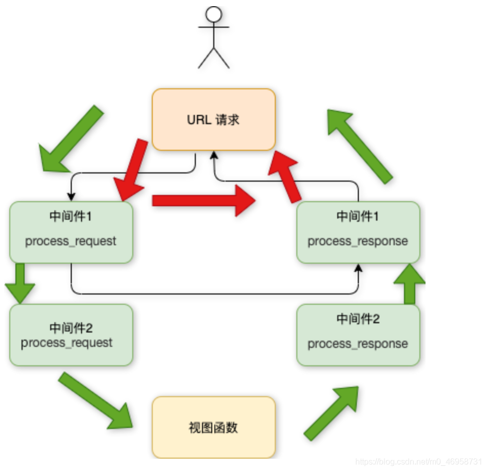

# 中间件

Django中的中间件是一个轻量级、底层的插件系统，可以介入Django的请求和响应处理过程，修改Django的输入或输出。

中间件的设计为开发者提供了一种无侵入式的开发方式，增强了Django框架的健壮性。

我们可以使用中间件，在Django处理视图的不同阶段对输入或输出进行干预。

> 因为改变的是全局，所以需要谨慎实用，用不好会影响到性能

## 中间件作用

如果你想修改请求，例如被传送到*view*中的**`HttpRequest`​**对象。 或者你想修改**​***view***​**返回的**​`HttpResponse`**对象，这些都可以通过中间件来实现。

可能你还想在*view*执行之前做一些操作，这种情况就可以用 `middleware`来实现。

***Django***​**默认的中间件**：（在*django*项目的*settings*模块中，有一个 `MIDDLEWARE_CLASSES`​ 变量，其中每一个元素就是一个中间件）

```python
MIDDLEWARE = [
    'django.middleware.security.SecurityMiddleware',
    # 为request/response提供了几种xss脚本过滤的安全改进，无它不安全
    'django.contrib.sessions.middleware.SessionMiddleware',
    # 开启session会话支持，无它无session
    'django.middleware.common.CommonMiddleware',
    # 基于APPEND_SLASH和PREPEND_WWW的设置来重写URL，
    # 如果APPEND_SLASH设为True，并且初始URL 没有以斜线结尾以及在URLconf 中没找到对应定义，这时形成一个斜线结尾的新URL；
    # 如果PREPEND_WWW设为True，前面缺少 www.的url将会被重定向到相同但是以一个www.开头的ur
    'django.middleware.csrf.CsrfViewMiddleware',
    # 添加跨站点请求伪造的保护，通过向POST表单添加一个隐藏的表单字段，并检查请求中是否有正确的值，无它无csrf保护
    'django.contrib.auth.middleware.AuthenticationMiddleware',
    # 在视图函数执行前向每个接收到的user对象添加HttpRequest属性，表示当前登录的用户，无它用不了request.user
    'django.contrib.messages.middleware.MessageMiddleware',
    # 开启基于Cookie和会话的消息支持，无它无message
    'django.middleware.clickjacking.XFrameOptionsMiddleware',
    # 对点击劫持的保护
]

```

​​

## 自定义中间件

### 创建中间件

创建中间件有两种方式：

#### 闭包函数构建

- 定义一个中间件闭包函数，然后返回一个可以被调用的中间件。
- 中间件闭包函数需要接收一个可以调用的`get_response`对象。
- 返回的中间件也是一个可以被调用的对象，并且像视图一样需要接收一个`request`对象参数，返回一个`response`对象。

```python
def my_middleware(get_response):
    print('init 被调用')

    def middleware(request):
        print('before request 被调用')
        response = get_response(request)
        print('after response 被调用')
        return response

    return middleware

```

#### 类构建

需要继承 `django.utils.deprecation.MiddlewareMixin`这个类

可以重写的5个方法:

```python
process_request(self,request)

process_view(self, request, callback, callback_args, callback_kwargs)

process_template_response(self,request,response)

process_exception(self, request, exception)

process_response(self, request, response)
```

以上方法的返回值可以是`None`或一个`HttpResponse`对象，如果是`None`，则继续按照*django*定义的规则向后继续执行，如果是`HttpResponse`对象，则直接将该对象返回给用户。

```python
class SimMiddleware(MiddlewareMixin):
    def __init__(self, get_response):
        print('init=====')
        self.get_response = get_response

    def process_request(self, request):
        """
        处理请求前: 在每个请求上，request对象产生之后，url匹配之前调用,返回None或HttpResponse对象
        """
        print('before request=====', request)

    def process_view(self, request, view_func, *view_args, **view_kwargs):
        """
        :param view_func: Django即将使用的视图函数,它是实际的函数对象，而不是函数的名称作为字符串
        :param view_args: 将传递给视图的位置参数的列表
        :param view_kwargs: 将传递给视图的关键字参数的字典;
                            view_args和view_kwargs都不包含第一个视图参数（request）
        """
        # 处理视图前：在每个请求上，url匹配之后，视图函数调用之前调用，返回None或HttpResponse对象
        print('before view=======')

    def process_template_response(self, request, response):
        # 在视图函数执行完后立即执行的, 执行 该 函数有一个前提条件，那就是视图函数返回的对象是一个 TemplateResponse 对象或等价方法, 直接返回render函数无效）
        print("render template=======")
        return response

    def process_exception(self, request, exception):
        # 这个方法只有在视图函数中出现异常了才执行，它返回的值可以是一个None也可以是一个HttpResponse对象
        print("raise exception=======")
        return HttpResponse(exception)

    def process_response(self, request, response):
        # 处理响应后：视图函数调用之后，所有响应返回浏览器之前被调用，在每个请求上调用，返回HttpResponse对象
        print('after response=======', response)
        return response
```

### 注册中间件

在*django*项目的*settings*模块中，在 `MIDDLEWARE_CLASSES` 变量中添加自定义中间件

```python
MIDDLEWARE = [
  	...
		'book.middleware.my_middleware',  # book为应用名,middleware为文件名
    'book.middleware.SimMiddleware'
]
```

### 中间件效果

> 首先是 项目启动时，中间件的初始化

```
init=====
init 被调用
```

#### 正常视图

```python
class Index(View):

    def get(self, request):
        print("Index============")
        return HttpResponse("hello Django")
```

> 当用户发起请求的时候会依次经过所有的的中间件，这个时候的请求会依次穿过所有中间件的`process_request`方法,最后到达`views`的函数中，`views`函数处理后，在依次穿过所有中间件的`process_response`方法,最后返回给请求者。

```python
before request 被调用
before request===== <WSGIRequest: GET '/'>
before view=======
Index============
after response======= <HttpResponse status_code=200, "text/html; charset=utf-8">
after response 被调用
[21/Sep/2020 14:29:59] "GET / HTTP/1.1" 200 12
```

#### 错误视图

```python
class Index(View):

    def get(self, request):
        print("Index============")
        3/0
        return HttpResponse("hello Django")
```

> 此时，视图发生异常， 会执行中间件的 `process_exception`方法，而在该方法中，将异常信息作为响应返回，因此，页面显示`"division by zero"`

```python
before request 被调用
before request===== <WSGIRequest: GET '/'>
before view=======
Index============
raise exception=======
after response======= <HttpResponse status_code=200, "text/html; charset=utf-8">
after response 被调用
[21/Sep/2020 14:34:15] "GET / HTTP/1.1" 200 16
```

#### 模板视图

```python
class Index(View):

    def get(self, request):
        print("Index============")
        return TemplateResponse(request, 'index.html')
```

> 注意: 只有返回的对象是`TemplateResponse` 对象或等价方法时，才执行中间件的 `process_template_response`方法，直接调用`render`方法无效。

```python
before request 被调用
before request===== <WSGIRequest: GET '/'>
before view=======
Index============
render template=======
after response======= <TemplateResponse status_code=200, "text/html; charset=utf-8">
after response 被调用
[21/Sep/2020 14:49:05] "GET / HTTP/1.1" 200 149
```

> `TemplateResponse` **VS** `render`
>
> `TemplateResponse`将模板的渲染延迟到视图完成之后。这允许任何模板响应中间件在响应上运行，并有可能在呈现模板之前更改模板或上下文数据。模板响应中间件运行后，将渲染模板，并在将响应返回给客户端之前对渲染的内容运行常规响应中间件。
>
> `render()`立即呈现模板，并返回`HttpResponse`。
