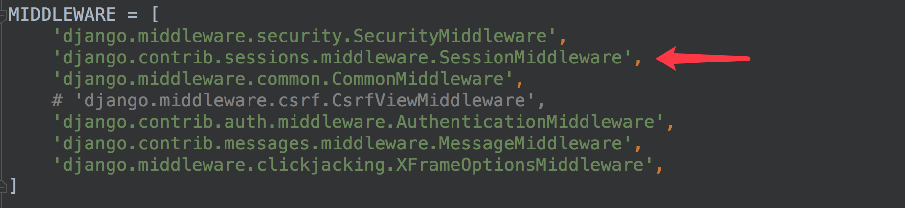

# 用户状态保持

## cookie

### `cookie` 操作

#### 设置`Cookie`

　　可以通过`HttpResponse`对象中的`set_cookie`方法来设置`cookie`。

```python
HttpResponse.set_cookie(cookie名, value=cookie值, max_age=cookie有效期)
```

- `max_age` 单位为秒，默认为`None`。如果是临时`cookie`，可将`max_age`设置为`None`。

#### 读取`Cookie`

　　可以通过`HttpRequest`对象的`COOKIES`属性来读取本次请求携带的`cookie`值。`request.COOKIES`为字典类型。

### `cookie`模拟用户登录

#### 设置登录标识

```python
from django.views import View
from django.http.response import JsonResponse

class Login(View):
    def post(self, request):
        query_dict = request.POST  # 获取form-data参数，得到django的查询字典

        userName = query_dict.get('userName', None)
        password = query_dict.get('password', None)

        if userName == "mac" and password == '123321':  # 登录成功，设置cookie标识，过期时间为2小时
            hp = JsonResponse({"code": 200, "msg": "OK"})
            hp.set_cookie('userName', userName, max_age=2 * 60 * 60)

            return hp
        else:  # 登录失败，返回错误信息
            return JsonResponse({'code': 200, 'msg': "FAIL"})

```

#### 登录校验

```python
from django.views import View
from django.http.response import JsonResponse

class UserInfo(View):
    def get(self, request):
        cookie_dict = request.COOKIES
        userName = cookie_dict.get('userName', None)

        if userName is not None:
            return JsonResponse(
                {"code": 200, "msg": "OK",
                 "userInfo": {"userName": userName, "gender": "男", "email": "mac321@163.com"}})
        else:
            return JsonResponse({"code": 200, "msg": "FAIL"})

`````

## session

### Session配置

　　**Django项目默认启用**​**`Session`**​**。**

　　可以在`settings.py`文件中查看，如图所示

　　

　　如需禁用`session`，将上图中的`session`中间件注释掉即可。

### 存储方式

　　在`settings.py`文件中，可以设置`session`数据的存储方式，可以保存在数据库、本地缓存等。

#### 数据库

　　存储在数据库中，如下设置可以写，也可以不写，**这是默认存储方式**。

```python
SESSION_ENGINE='django.contrib.sessions.backends.db'
```

　　如果存储在数据库中，需要在项`INSTALLED_APPS`中安装`Session`应用。

　　

　　数据库中的表如图所示

　　

　　表结构如下

　　

　　由表结构可知，操作`Session`包括三个数据：**键**，**值**，**过期时间**。

#### 本地缓存

　　存储在本机内存中，如果丢失则不能找回，比数据库的方式读写更快。

```python
SESSION_ENGINE='django.contrib.sessions.backends.cache'
```

#### 混合存储

　　优先从本机内存中存取，如果没有则从数据库中存取。

```python
SESSION_ENGINE='django.contrib.sessions.backends.cached_db'
```

#### Redis

　　在redis中保存session，需要引入第三方扩展，我们可以使用**`django-redis`**来解决。

　　安装扩展

```shell
pip install django-redis
```

　　在settings.py文件中做如下设置

```python
CACHES = {
    "default": {
        "BACKEND": "django_redis.cache.RedisCache",
        "LOCATION": "redis://127.0.0.1:6379/1",
        "OPTIONS": {
            "CLIENT_CLASS": "django_redis.client.DefaultClient",
        }
    }
}
SESSION_ENGINE = "django.contrib.sessions.backends.cache"
SESSION_CACHE_ALIAS = "default"
```

### Session操作

　　通过`HttpRequest`对象的`session`属性进行会话的读写操作。

　　1） 以键值对的格式写session。

```python
request.session['键']=值
```

　　2）根据键读取值。

```python
request.session.get('键',默认值)
```

　　3）清除所有session，在存储中删除值部分。

```python
request.session.clear()
```

　　4）清除session数据，在存储中删除session的整条数据。

```python
request.session.flush()
```

　　5）删除session中的指定键及值，在存储中只删除某个键及对应的值。

```python
del request.session['键']
```

　　6）设置session的有效期

```python
request.session.set_expiry(value)
```

- 如果`value`是一个整数，`session`将在`value`秒没有活动后过期。
- 如果`value`为0，那么用户`session`的`Cookie`将在用户的浏览器关闭时过期。
- 如果`value`为`None`，那么`session`有效期将采用系统默认值，**默认为两周**，可以通过在`settings.py`中设置**`SESSION_COOKIE_AGE`**来设置全局默认值。

### `session`模拟用户登录

#### 登录及设置登录标识

```python
from django.views import View
from django.http.response import JsonResponse


class Login(View):
    @staticmethod
    def post(request):
        query_dict = request.POST  # 获取表单参数        
        userName = query_dict.get('userName', None)
        password = query_dict.get('password', None)
        if userName == "mac" and password == '123321':  # 校验用户是否登录成功            
            request.session['userName'] = userName  # 登录成功，设置session            
            return JsonResponse({"code": 200, "msg": "OK"})
        else:
            return JsonResponse({'code': 200, 'msg': "FAIL"})
```

#### 登录校验

　　视图实现

```python
from django.http import JsonResponse
from django.views import View


class UserInfo(View):
    @staticmethod
    def get(request):
        userName = request.session.get('userName', None)  # 获取session，判断用户是否已经登录        
        if userName is not None:
            return JsonResponse({
                "code": 200,
                "msg": "OK",
                "userInfo": {
                    "userName": userName,
                    "gender": "男",
                    "email": "mac321@163.com"
                }
            })
        else:
            return JsonResponse({
                "code": 200,
                "msg": "FAIL"
            })
```
