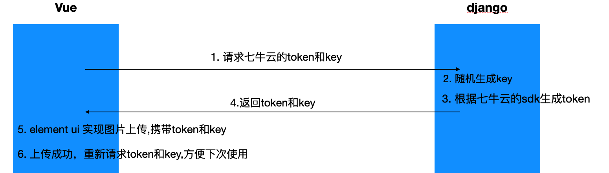

在前后端分离开发中，当上传图片时，一般不会直接把图片等文件资源，直接传到django服务器, 而是使用云服务，此处以七牛云为例，简单演示图片上传的流程。



- 在Vue上传图片到七牛云时，需要验证身份，因此需要token，而token不建议在前端生成，因此，需要从django中请求token，可以参考七牛云官方文档： [生成上传token](https://developer.qiniu.com/kodo/1242/python)
- Vue获取到token之后，就可以使用post请求，发送图片文件到七牛云服务器
- 上传成功之后，返回的响应，包含 该文件的key，将 服务器的域名和key拼接，即可得到图片的真正地址

## django

django中，需要实现两个任务：

- 生成token，方便Vue上传图片
- 接收Vue上传成功后的图片地址，保存到数据库

### 模型类

```python
from django.db import models


class Brand(models.Model):
    name = models.CharField(max_length=10, verbose_name='品牌名')
    logo = models.URLField(verbose_name='logo')

    class Meta:
        db_table = 'tb_brand'
        verbose_name = '品牌'
        verbose_name_plural = verbose_name

    def __str__(self):
        return self.name
```

### 序列化器

```python
from rest_framework.serializers import ModelSerializer


class BrandSerializer(ModelSerializer):
    class Meta:
        model = Brand
        fields = '__all__'
```

### 视图

> 定义方法：
>
> - 生成一个随机字符串key，代表图片文件名
> - 根据key和其余参数，生成token

```python
from qiniu import Auth
import random
import datetime

# 需要填写你的 Access Key 和 Secret Key
access_key = ''
secret_key = ''
# 要上传的空间
bucket_name = ''
# 构建鉴权对象
q = Auth(access_key, secret_key)


def generate_token():
    # 上传后保存的文件名
    key = '%08d' % random.randint(0, 99999999) + datetime.datetime.now().strftime('%Y%m%d%H%M%S')

    # 生成上传 Token，可以指定过期时间等
    # 3600为token过期时间，秒为单位。3600等于一小时
    token = q.upload_token(bucket_name, key, 3600)
    return key, token

```

> 每次请求，返回key和token

```python
from rest_framework.views import APIView
from rest_framework.response import Response
from utils.qiniuyun import generate_token

class QiniuTokenAPIView(APIView):
    def get(self, request):
        key, token = generate_token()

        return Response({
            'token': token,
            'key': key
        })
```

> 图片上传成功，实现数据入库

```python
from rest_framework.generics import ListCreateAPIView
from .serializers import *

class BrandListCreateAPIView(ListCreateAPIView):
    queryset = Brand.objects.all()
    serializer_class = BrandSerializer
```

### 路由

```python
from django.urls import path
from .views import *

urlpatterns = [
    path('qiniu/token/', QiniuTokenAPIView.as_view()),
    path('brand/', BrandListCreateAPIView.as_view()),
]

```

## Vue

### 请求token

```html
<script>
    export default {
        data() {
            return {
                // 定义变量，接收token和key
                postData: {
                    token: "",
                    key: ""
                }
            }
        },
        methods: {
            // 1. 定义方法，从django中请求token
            get_qiniu_token() {
                this.$axios.get('qiniu/token/')
                    .then(resp => {
                    this.postData = resp.data
                })
            }
        },
        // 2. 挂载执行
        created() {
            this.get_qiniu_token();
        }
    }
</script>
```

### 上传图片

|参数|作用|
| ------------| ------------------------------------------|
|action|七牛云服务器地址，参考  [存储区域_产品简介_对象存储 - 七牛开发者中心 (qiniu.com)](https://developer.qiniu.com/kodo/1671/region-endpoint-fq)|
|data|需要验证的参数，有两个：`token`、`key`|
|limit|最多上传个数|
|file-list|上传成功展示的图片列表|
|http-request|覆盖默认的上传行为，可以自定义上传的实现, `function(params)`|
|on-success|文件上传成功时的钩子, `function(response, file, fileList)`|

#### 默认方式

> 使用`element-ui`默认的图片上传方式

```html
<template>
	<div>
    	<el-upload
               action="http://upload-z1.qiniup.com"
               list-type="picture-card"    
               :data="postData"
               :limit="1"
               :on-success="handleAvatarSuccess"
               :file-list="img">
        	<i class="el-icon-plus"></i>
    	</el-upload>

    </div>
</template>
<script>
export default {
    data() {
        return {
            img: [], // 上传成功之后，展示的图片列表
            // 上传图片的验证参数
            postData: {
                token: "",
                key: ""
            },
            // 需要添加的数据
            brand: {
                id: '',
                name: '',
                logo: ''
            }
        }
    },
    methods: {
		...
        handleAvatarSuccess(response, file, fileList) {
            this.img = fileList
            this.brand.logo = 'http://qruzvm22h.hb-bkt.clouddn.com/' + response.key
            this.get_qiniu_token();
        },
        ...
    }

}
</script>

```

#### 自定义提交方式

> 覆盖`element-ui`默认的上传方式，自定义方法实现

```html
<template>
	<div>
    	<el-upload
               action="http://upload-z1.qiniup.com"
               list-type="picture-card"    
               :data="postData"
               :limit="1"
               :http-request="imgUpload"
               :file-list="img">
        	<i class="el-icon-plus"></i>
    	</el-upload>

    </div>
</template>
<script>
import axios from 'axios'    
export default {
    data() {
        return {
            img: [], // 上传成功之后，展示的图片列表
            // 上传图片的验证参数
            postData: {
                token: "",
                key: ""
            },
            // 需要添加的数据
            brand: {
                id: '',
                name: '',
                logo: ''
            }
        }
    },
    methods: {
		...
        imgUpload(params) {
            // 第一步.将图片上传到服务器.
            var formdata = new FormData();
            formdata.append('file', params.file);
            formdata.append('key', this.postData.key);
            formdata.append('token', this.postData.token);
            axios({
                url: 'http://upload-z1.qiniup.com',
                method: 'post',
                data: formdata,
                headers: {'Content-Type': 'multipart/form-data'},
            }).then((file) => {
                // 第二步.将返回的响应中的key拼接为图片网址
                var url = 'http://qruzvm22h.hb-bkt.clouddn.com/' + file.data.key
                this.img = [{"url": url}]
                this.brand.logo = url
                this.get_qiniu_token();
            })
                .catch(err => {
                    console.log(err)
                })
        },
        ...
    }

}
</script>
```

- 自定义方法，使用axios提交表单数据
- 提交成功，将返回的key拼接为网址

### 添加品牌

```html
<template>
<div >
    <el-form>
        <el-form-item label="品牌名称：" :label-width="formLabelWidth">
            <el-input autocomplete="off" style="width: 220px" v-model="brand.name"></el-input>
    	</el-form-item>
        <el-form-item label="品牌logo：" :label-width="formLabelWidth">
            <el-upload
                       action="http://upload-z1.qiniup.com"
                       list-type="picture-card"
                       :http-request="imgUpload"
                       :data="postData"
                       :limit="1"

                       :file-list="img">
                <i class="el-icon-plus"></i>
    		</el-upload>
    	</el-form-item>
    </el-form>
  
    <el-button @click="restAddBrand">取 消</el-button>
    <el-button type="primary" @click="addBrand">确 定</el-button>

</template>


<script>
export default {
    data() {
        return {
            brand: {
                id: '',
                name: '',
                logo: ''
            },
            img: [],
            postData: {
                token: "",
                key: ""
            }
        }
    },
    methods: {
        // 重置表单数据
        restAddBrand() {
            this.brand.name = ''
            this.brand.id = ''
            this.brand.logo = ''
            this.img = []
        },
		// 提交表单数据
        addBrand() {
            console.log(this.brand.logo)
            this.$axios.post('brand/', this.brand)
                .then(resp => {
                    console.log(resp.data)
                    this.get_brand_list();
                })
                .catch(err => {
                    console.log(err.response.data)
                })
			// 添加成功，同样重置表单
            this.restAddBrand();
        },
    },

}
</script>

```

```

```
