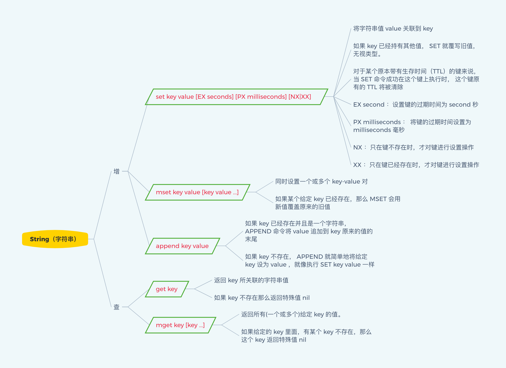
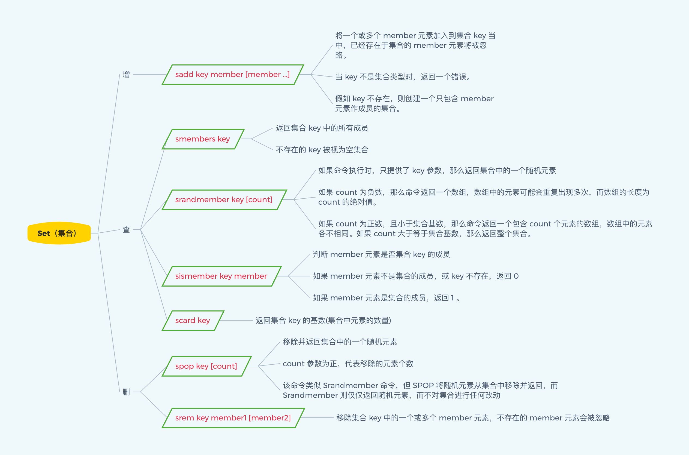
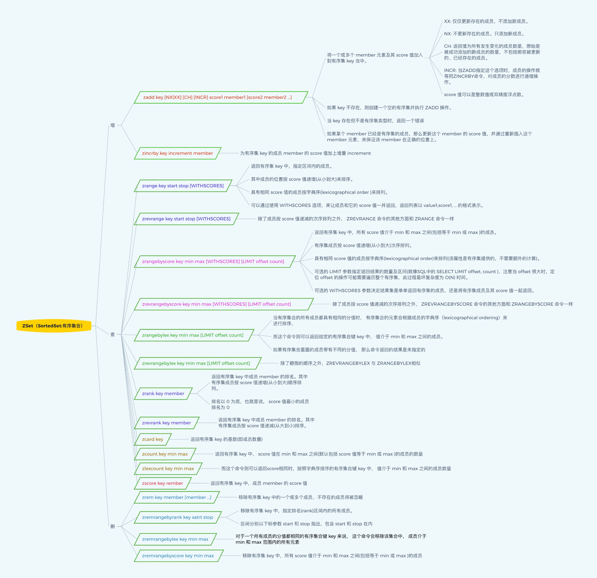

## 什么是Redis​？​

***Redis***是一个使用C语言编写的开源、高性能的**非关系型的键值对数据库**

***Redis***可以存储键和五种不同类型值之间的映射，键的类型只能为字符串

值支持**五种数据类型**：**字符串**、**列表**、**集合**、**散列表**、**有序集合**

与传统数据库不同的是***Redis***的数据是存在内存中的，所以读写速度非常快

因此***Redis***被广泛**应用于缓存方向**

***Redis***每秒可以处理**超过10万次**读写操作，是已知性能最快的**关系型的键值对数据库**

***Redis***也经常用来做**分布式锁**，完成一些秒杀等有关的业务，提高服务的**整体并发抗压能力**

***Redis***也支持**事务**、**持久化**、多种集群方案，也同样支持类似**MySQL数据库**的**主从备份**

> BSD是"Berkeley Software Distribution"的缩写，意思是“伯克利软件发型版本”。  
> BSD开源协议是一个给予使用者很大自由的协议。可以自由的使用，修改源代码，也可以将修改后的代码作为开源或者专有软件在发布。  
> BSD代码鼓励代码共享，但需要尊重代码作者的著作权。  
> BSD由于允许使用者修改和重新发布代码，也允许使用或在BSD代码上开发商业软件发布和销售，一次是对商业集成很友好的协议。

## **简述Redis的优点？**

* 读写**性能优异**：***Redis***读的速度是**110000次/s**，写的速度是**81000次/s**
* 支持**数据持久化**：支持***AOF***和***RDB***两种持久化方式，有效保证数据不丢失
* 支持**事务**：***Redis***的所有操作都是**原子性**，同时***Redis***还支持对几个**操作合并**后的**原子性**
* 数据**类型丰富**：五大数据类型任您选择，**string**、**list**、**set**、**zset**、**hash**
* 支持**主从复制**：主机会自动将数据同步到从机，还可以进行读写分离
* 丰富**特性**：***Redis***还支持**发布者订阅者模式**，**键空间事件**，**过期键消息通知**等功能

## **简述Redis的缺点？**

* 作为**缓存**时，经常存在与**数据库数据**不一致的问题
* 缓存的**雪崩问题**
* 缓存也能出现**击穿问题**
* 缓存的**并发竞争**问题

## Redis介绍相关知识

Redis是单线程+多路IO复用技术

多路复用是指使用一个线程来检查多个文件描述符（Socket）的就绪状态，比如调用select和poll函数，传入多个文件描述符，如果有一个文件描述符就绪，则返回，否则阻塞直到超时。得到就绪状态后进行真正的操作可以在同一个线程里执行，也可以启动线程执行（比如使用线程池）

串行  vs  多线程+锁（memcached） vs  单线程+多路IO复用(Redis)

（与Memcache三点不同: 支持多数据类型，支持持久化，单线程+多路IO复用）

​​

## 单线程的Redis为什么这么快？

> 单进程

Redis使用了单线程架构和I/O多路复用模型来实现高性能的内存数据库服务。

> 单线程还能这么快

第一，纯内存访问，Redis将所有数据放在内存中，内存的响应时长大约为100纳秒，这是Redis达到每秒万级别访问的重要基础。

第二，非阻塞I/O，Redis使用epoll作为I/O多路复用技术的实现，再加上Redis自身的事件处理模型将epoll中的连接、读写、关闭都转换为事件，不在网络I/O上浪费过多的时间。

第三，单线程避免了线程切换和竞态产生的消耗。

但是单线程会有一个问题：对于每个命令的执行时间是有要求的。如果 某个命令执行过长，会造成其他命令的阻塞，对于Redis这种高性能的服务 来说是致命的，所以Redis是面向快速执行场景的数据库。

## **Redis有哪些适合的场景？**

### **热点数据的缓存**

由于***Redis***访问速度块、**支持的数据类型丰富**，所以***Redis***很适合用来存储**热点数据**

另外结合***expire***，我们可以设置过期时间然后再进行缓存更新操作

这个功能最为常见，我们几乎所有的项目都有所运用

### **限时业务的运用**

***Redis***中可以使用***expire***命令设置一个键的生存时间，到时间后***Redis***会删除它

利用这一特性可以运用在**限时**的**优惠活动信息**、**手机验证码**等业务场景

还可以结合**键空间事件**捕捉**过期事件**，做一些更为人性化的功能，比如**过期自动提醒**

### **计数器相关问题**

***Redis***由于***incrby***命令可以实现**原子性的递增**，所以可以运用于**高并发**的**秒杀活动**、**分布式序列号**的生成等**大规模访问**的功能中

具体业务还体现在比如限制**一个手机号发多少条短信**

一个接口一分钟限制多少请求，一个接口一天限制调用多少次等等

### **排行榜相关问题**

使用***Redis***的***zset***直接进行有序数据的内存维护，不光可以维护排行榜的先后顺序

还可以提高访问速度

### **分布式锁**

这个主要利用***Redis***的***setnx***命令进行，并**搭配一个过期时间**防止某一个客户端宕机导致**死锁**

分布式锁也常用在秒杀过程中的购买流程

支付环节**首先加锁**，之后**判断库存**数量是否满足购买条件，**购买成功**，**减去库存**，释放锁，交给另外一个客户端进行持锁购买

### **延时操作**

该功能主要通过**键空间事件**来搞定

比如某些情况用户**购买过程未支付**，但是却会占据一个**实际的库存个数**，那么可以通过使用**键空间事件**，存储当前**购买订单id**，设置一个**过期时间**，监听到这个***key***的**过期键空间**，通过**键空间事件**的触发来进行用户购买的提示，或者**直接删除**正在支付的过期订单，将库存量还原

### **消息队列**

***Redis***也可以实现消息队列的功能，比如结合一些类似***celery***的**异步框架**完成异步任务的处理

## Redis操作

简单对redis 命令进行总结、归纳。

### 键

### String

### List

### Hash

### Set

### Zset

更多命令参考[Redis中文教程](https://redis.com.cn/documentation.html)

‍
